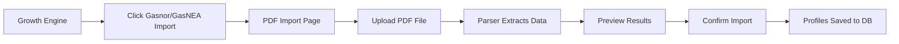

---
tags:
  - page
  - admin
  - growth
  - platform
status: 🟢 Functional
type: Platform Admin Tool
path: apps/web/app/dashboard/admin/growth-engine/page.tsx
---

# 🚀 Growth Engine

> [!WARNING] **Platform Admin Only**
> The Growth Engine is a CampoTech platform administration tool. It is NOT accessible to regular business owners. Only platform administrators can access this section.

---

## 📸 Preview
![[growth-engine-preview.png]]

---

## 🎯 Purpose

The Growth Engine is CampoTech's **professional acquisition system**. It:

1. **Imports** professional contact data from public registries (ERSEP, CACAAV, Gasnor, etc.)
2. **Stores** this data as "Unclaimed Profiles"
3. **Allows** professionals to "claim" their profile by verifying their identity
4. **Converts** claimed profiles into registered CampoTech users
5. **Tracks** conversion rates and outreach campaign effectiveness

> [!INFO] **No Messages Are Sent**
> The Launch Gate blocks ALL outbound messaging until explicitly approved. The scrapers only import data for viewing.

---

## 🔐 Access Control

### Who Can Access?

| Role | Access | Notes |
|:---|:---:|:---|
| Platform Admin | ✅ | `test-org-001` or `isPlatformAdmin: true` |
| Business Owner | ❌ | Sees "Acceso Restringido" message |
| Admin (Dispatcher) | ❌ | Sees "Acceso Restringido" message |
| Technician | ❌ | Cannot access `/admin` routes |

### How Access Is Checked

```typescript
// Platform admin organization IDs
const PLATFORM_ADMIN_ORGS = ['test-org-001'];

// Check via organization settings
const settings = org?.settings as Record<string, unknown>;
return settings?.isPlatformAdmin === true;
```

### Creating a Platform Admin

**Option 1: Use the test organization**
```javascript
// Browser console at localhost:3000
fetch('/api/dev/seed-admin', { method: 'POST' })
  .then(r => r.json())
  .then(console.log)
```

Credentials created:
- **Phone:** `+5491112345678`
- **Password:** `admin123`

**Option 2: Add organization to admin list**
```typescript
// In apps/web/app/dashboard/admin/growth-engine/page.tsx
const PLATFORM_ADMIN_ORGS = ['test-org-001', 'your-org-id'];
```

**Option 3: Set flag in database**
```sql
UPDATE organizations 
SET settings = settings || '{"isPlatformAdmin": true}'::jsonb 
WHERE id = 'your-org-id';
```

---

## 📍 Navigation Path

```
🔒 Login → 📊 Dashboard → 🛡️ Admin → 🚀 Growth Engine
```

### Routes

| Page | Route | Purpose |
|:---|:---|:---|
| **Dashboard** | `/dashboard/admin/growth-engine` | Main stats & overview |
| **Profiles** | `/dashboard/admin/growth-engine/profiles` | Browse all imported profiles |
| **Scrapers** | `/dashboard/admin/growth-engine/scrapers` | Run import scrapers |
| **PDF Import** | `/dashboard/admin/growth-engine/import` | Upload Gasnor/GasNEA PDFs |
| **Campaigns** | `/dashboard/admin/growth-engine/campaigns` | Manage outreach campaigns |
| **Launch Gate** | `/dashboard/admin/growth-engine/launch` | Unlock messaging (future) |

---

## 🧩 Page Sections

### 1. Header Section

| Element | Description |
|:---|:---|
| Title | "Growth Engine" |
| Subtitle | "Gestión de perfiles no reclamados y campañas de outreach" |
| **Scrapers** | Orange button → `/scrapers` |
| **Ver Perfiles** | Dark button → `/profiles` |
| **Campañas** | Green button → `/campaigns` |

---

### 2. Launch Gate Warning Banner

> [!CAUTION] Always visible until launch gate is unlocked

| Element | Description |
|:---|:---|
| Icon | `⚠️ AlertTriangle` (amber) |
| Title | "Outbound Messaging Pausado" |
| Message | Blocks all email/SMS/WhatsApp sending |
| Action | Link to Launch Checklist |

This ensures **no accidental messaging** of scraped contacts.

---

### 3. Stats Cards Row (5 cards)

| Card | Icon | Color | Value |
|:---|:---:|:---:|:---|
| Total Perfiles | 👥 | Gray | Count of all unclaimed profiles |
| Con Teléfono | 📞 | Emerald | Profiles with phone number |
| Con Email | ✉️ | Blue | Profiles with email |
| Reclamados | ✓ | Purple | Profiles that have been claimed |
| Conversión | 📈 | Gray | `claimed / total` percentage |

---

### 4. Profiles by Source Table

Shows breakdown of imported profiles by data source:

| Column | Description |
|:---|:---|
| Fuente | Data source name (ERSEP, CACAAV, etc.) |
| Total | Number of profiles from this source |
| Con Tel. | Profiles with phone number |
| Con Email | Profiles with email address |
| Reclamados | Number claimed |
| Conv. % | Conversion rate |

---

### 5. Recent Campaigns Table

Shows last 5 outreach campaigns:

| Column | Description |
|:---|:---|
| Campaña | Campaign name + source filter |
| Estado | Status badge (draft, ready, launched) |
| Canal | Channel (whatsapp, sms, email) |
| Objetivo | Target count |
| Enviados | Messages sent |
| Reclamados | Resulting claims |

---

### 6. Conversion Metrics Visualization

Visual progress bars showing:
- Claimed percentage per source
- Phone coverage percentage
- Email coverage percentage

---

### 7. PDF Import Section

Two cards for manual PDF import:

| Source | Region | Action |
|:---|:---|:---|
| **Gasnor** | Salta, Jujuy, Tucumán | Upload PDF |
| **GasNEA** | Corrientes, Chaco, Formosa | Upload PDF |

---

## 🖱️ All Clickable Elements

| Element | Action | Result |
|:---|:---|:---|
| **Scrapers** button | `Click` | Navigate → Scrapers page |
| **Ver Perfiles** button | `Click` | Navigate → Profiles browser |
| **Campañas** button | `Click` | Navigate → Campaigns list |
| Launch Gate link | `Click` | Navigate → Launch checklist |
| Source row | `Hover` | Highlight effect |
| Campaign row | `Click` | Navigate → Campaign detail |
| Ver todas → | `Click` | Navigate → All campaigns |
| Importar PDF buttons | `Click` | Navigate → PDF import page |

---

## 📊 Data Sources

### Web Scrapers

| Source | Website | Data Extracted |
|:---|:---|:---|
| **ERSEP** | `volta.net.ar` | Electricians (Córdoba) |
| **CACAAV** | `cacaav.com.ar` | HVAC technicians (National) |

### PDF Parsers

| Source | Format | Data Extracted |
|:---|:---|:---|
| **Gasnor** | PDF list | Gas technicians (Norte) |
| **GasNEA** | PDF list | Gas technicians (NEA) |

---

## 🔄 User Flows

### Flow 1: View Imported Profiles

```mermaid
graph LR
    A[Growth Engine Dashboard] --> B[Click "Ver Perfiles"]
    B --> C[Profiles Browser]
    C --> D{Apply Filters}
    D --> E[Filter by Source]
    D --> F[Filter by Province]
    D --> G[Search by Name]
    E --> H[View Results]
    F --> H
    G --> H
```

### Flow 2: Run a Web Scraper

```mermaid
graph LR
    A[Growth Engine] --> B[Click "Scrapers"]
    B --> C[Scrapers Page]
    C --> D[Click "Ejecutar" on ERSEP/CACAAV]
    D --> E[Scraper Runs]
    E --> F[Shows Progress]
    F --> G[Results: Imported/Updated/Errors]
    G --> H[View in Profiles Browser]
```

### Flow 3: Import from PDF



### Flow 4: Professional Claims Profile

```mermaid
graph LR
    A[Professional visits /claim] --> B[Search by Name/Matrícula]
    B --> C[Find Their Profile]
    C --> D[Click "Reclamar"]
    D --> E[Enter Contact Info]
    E --> F[Receive OTP via SMS]
    F --> G[Enter OTP Code]
    G --> H[Profile Linked to Account]
    H --> I[Full Platform Access]
```

---

## 🗄️ Database Schema

### UnclaimedProfile Model

```prisma
model UnclaimedProfile {
  id            String   @id @default(cuid())
  source        UnclaimedSource  // ERSEP, CACAAV, GASNOR, etc.
  sourceUrl     String?
  matricula     String?
  fullName      String
  firstName     String?
  lastName      String?
  profession    String?
  category      String?
  email         String?
  phone         String?
  province      String?
  city          String?
  address       String?
  scrapedAt     DateTime
  createdAt     DateTime @default(now())
  updatedAt     DateTime @updatedAt
  claimedAt     DateTime?
  claimedByUserId String?
  
  @@unique([source, matricula])
}
```

---

## 🛡️ Security Considerations

| Risk | Mitigation |
|:---|:---|
| Unauthorized access | Platform admin check on every page |
| Accidental messaging | Launch Gate blocks all outbound |
| Rate limiting sources | 1.5s delay between scraper requests |
| Data integrity | Upsert on matricula prevents duplicates |
| PII handling | Only public registry data is scraped |

---

## 🛠️ Technical Implementation

### File Structure

```
apps/web/
├── app/
│   ├── dashboard/admin/growth-engine/
│   │   ├── page.tsx              # Main dashboard
│   │   ├── profiles/page.tsx     # Profiles browser
│   │   ├── scrapers/page.tsx     # Scraper management
│   │   ├── import/page.tsx       # PDF import
│   │   └── campaigns/page.tsx    # Campaign management
│   └── api/admin/growth-engine/
│       ├── seed-test/route.ts    # Test data seeding
│       ├── scrape/
│       │   ├── ersep/route.ts    # ERSEP scraper API
│       │   └── cacaav/route.ts   # CACAAV scraper API
│       └── import/pdf/route.ts   # PDF import API
├── lib/
│   ├── scrapers/
│   │   ├── ersep-scraper.ts      # ERSEP web scraper
│   │   ├── cacaav-scraper.ts     # CACAAV web scraper
│   │   └── gas-pdf-parser.ts     # Gasnor/GasNEA parser
│   └── services/
│       └── unclaimed-profile.service.ts
└── (public)/
    └── claim/
        ├── page.tsx              # Public claim landing
        └── [id]/page.tsx         # Claim verification flow
```

---

## 🔗 Connections

- **Parent:** [[Dashboard Home]] (via admin menu)
- **Children Pages:**
  - [[Growth Profiles Browser]]
  - [[Growth Scrapers]]
  - [[Growth PDF Import]]
  - [[Growth Campaigns]]
- **Public Pages:**
  - [[Profile Claim Page]]
  - [[Profile Verification Flow]]
- **Related:**
  - [[Sidebar Navigation]] (admin section)
  - [[Settings Page]] (organization settings)

---

## 📝 Notes & TODOs

- [x] ERSEP scraper implemented
- [x] CACAAV scraper implemented
- [x] Gasnor/GasNEA PDF parser implemented
- [x] Platform admin access control
- [x] Light theme color scheme
- [ ] TODO: Implement campaign creation flow
- [ ] TODO: Launch Gate checklist page
- [ ] TODO: OTP sending integration (currently simulated)
- [ ] TODO: Outbound messaging queue
- [ ] TODO: Analytics and reporting

---

*The Growth Engine is CampoTech's key to acquiring professionals at scale.*
