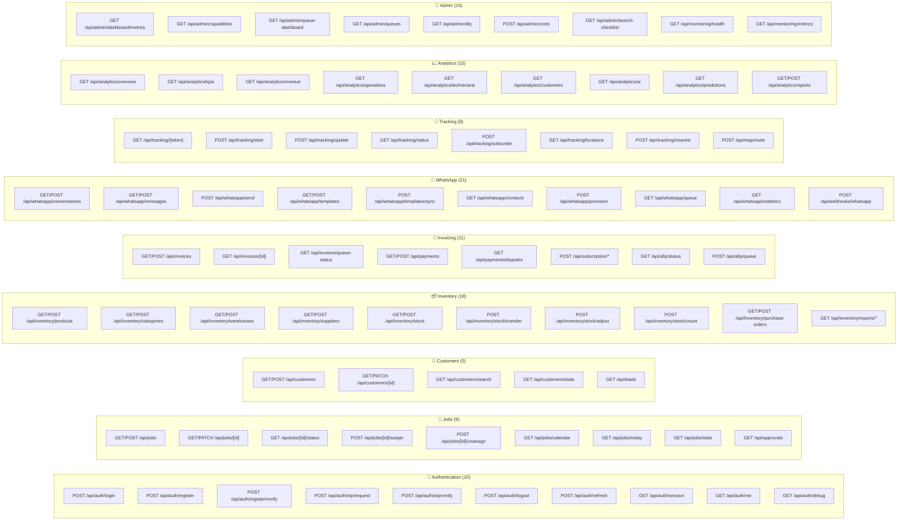
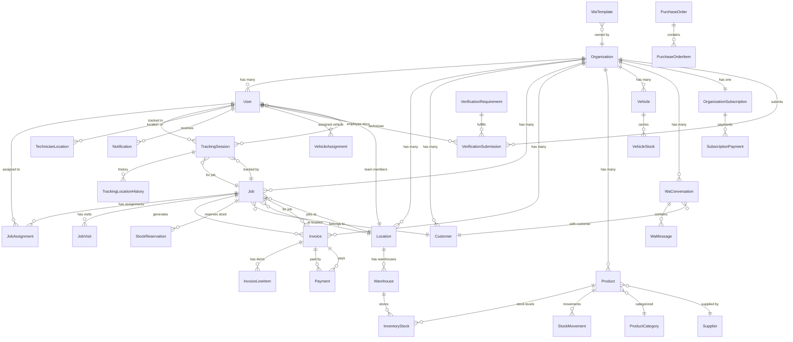
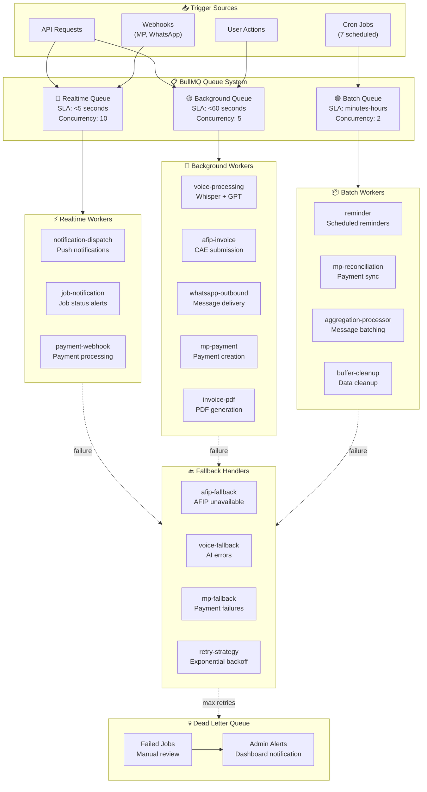
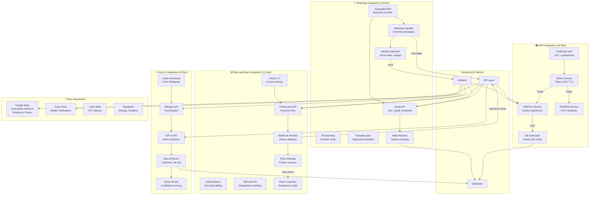
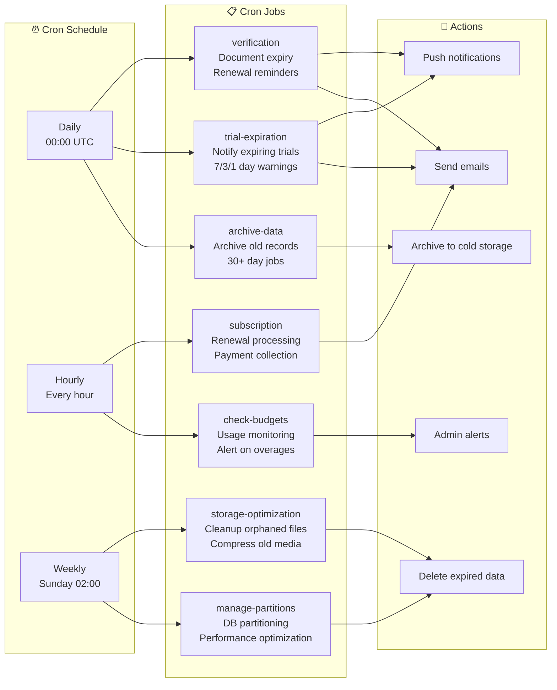
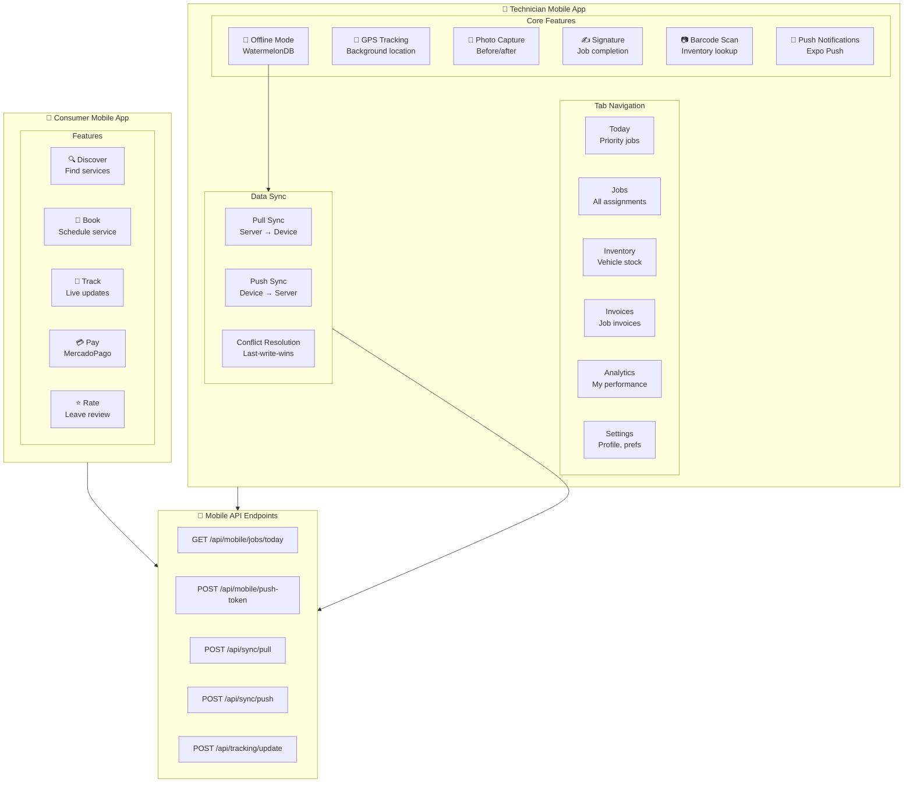

# CampoTech: Unified Architecture Specification
## Version 1.0 | Production-Ready | 18-Week MVP

---

# TABLE OF CONTENTS

1. Overview & System Goals
2. Core Principles & Non-Functional Requirements
3. System Architecture (High Level)
4. Domain Model & System of Record
5. Database Schema
6. State Machines
7. API Architecture
8. External Integrations
9. Queue + Worker Architecture
10. Security Architecture
11. Offline Mode Architecture
12. Mobile Technician App Architecture
13. Admin/Owner Portal Architecture
14. 12 Core Workflows
15. Fallback Systems
16. Monitoring & Observability
17. Deployment Architecture
18. Implementation Snippets
19. Glossary

**Related Documents:**
- **[capabilities.md](./capabilities.md)** - Master Kill-Switch Architecture (Capability Map)

---

# 1. OVERVIEW & SYSTEM GOALS

## Product Definition
- **Name:** CampoTech
- **Type:** Field Service Management (FSM) platform
- **Target Market:** Argentine tradespeople (plumbers, electricians, HVAC, gas)
- **Addressable Market:** 165K+ PyMEs in Buenos Aires metro area

## Primary Goals
- Enable job creation from WhatsApp voice messages
- Generate AFIP-compliant electronic invoices (Factura Electrónica)
- Process payments via Mercado Pago with cuotas (installments)
- Provide mobile app for technicians with offline support
- Achieve < 2 minute signup-to-first-job time

## Competitive Moat
- WhatsApp-native job creation (no competitors offer this)
- Full AFIP integration (foreign tools cannot compete)
- Mercado Pago cuotas with TEA/CFT compliance
- Voice AI for Argentine Spanish (lunfardo, accents)
- Offline-first mobile for poor connectivity areas

## Success Metrics

| Metric | Launch Target | Month 3 Target |
|--------|---------------|----------------|
| Signup to first job | < 2 minutes | < 90 seconds |
| Voice AI accuracy | ≥ 70% | > 80% |
| Cold start (Samsung A10) | < 4 seconds | < 3 seconds |
| Duplicate invoices | 0 | 0 |
| Monthly churn | - | < 10% |

## Module Classification & Core Feature Set

### Core Modules (Production Ready)

| Module | Status | Criticality | Notes |
|--------|--------|-------------|-------|
| **Auth & Onboarding** | ✅ Live | **Critical** | OTP-based entry, role assignment (Owner/Dispatch/Tech). |
| **CRM (Customers)** | ✅ Live | **Critical** | Customer database, search, and history. |
| **Jobs & Scheduling** | ✅ Live | **Critical** | Create, assign, track, and complete jobs. Includes new **Employee Scheduling**. |
| **AFIP Invoicing** | ✅ Live | **Critical** | Electronic billing integration (WSFEV1). |
| **Mercado Pago** | ✅ Live | **Critical** | Payment processing (Links, QR, Subscriptions). |
| **Mobile App** | ✅ Live | **Critical** | Role-based app (Expo) with Offline Sync (WatermelonDB). |
| **Consumer Marketplace** | 🚀 Live | **Mandatory** | All businesses enabled. Mobile-only consumer experience. |

### Advanced Capabilities (Tier-Gated)

| Module | Status | Tiers | Notes |
|--------|--------|-------|-------|
| **WhatsApp AI** | ✅ Beta | Pro / Enterprise | Automated intent extraction and replies. |
| **Voice Reports** | ✅ Live | Pro / Enterprise | Whisper-powered voice notes for technicians. |
| **Inventory** | ✅ Live | Pro / Enterprise | Stock tracking, warehouses, and material usage. |
| **Analytics** | ✅ Live | Pro / Enterprise | Business intelligence dashboard. |

### Feature Flags

> **Note:** We use a centralized `CapabilityService` for runtime feature toggling. See `capabilities.md` for details.

```typescript
// Runtime check example
if (await CapabilityService.isEnabled("ai_copilot", orgId)) {
  // Use AI features
}
```


---

# 2. CORE PRINCIPLES & NON-FUNCTIONAL REQUIREMENTS

## Design Principles

### Principle 1: One-Shot Culture
- First task completion < 2 minutes
- Zero visible errors in first session
- All failures handled invisibly with fallbacks

### Principle 2: Aggressive Minimal Onboarding
- **Maximum 2 required fields:** CUIT + Company Name
- Everything else deferred to first use (just-in-time)
- No blocking wizards, ever

### Principle 3: Reliability Over Sophistication
- Every external API has a fallback
- Every background job is monitored
- Panic modes auto-activate on failure
- Silent failures are bugs

### Principle 4: Simple by Default
- Simple mode is default (never ask)
- Advanced features hidden until requested
- Maximum 3 choices per screen

## Non-Functional Requirements

### Performance
- API response time: < 200ms (p95)
- Mobile cold start: < 4s on Samsung A10
- Memory usage: < 150MB on 2GB RAM devices
- Offline sync: Queue up to 50 operations

### Reliability
- System uptime: 99.5%
- Zero duplicate invoices (enforced at DB level)
- Automatic retry with exponential backoff
- Graceful degradation on external service failure

### Security
- Encryption at rest: AES-256-GCM
- Encryption in transit: TLS 1.3
- AFIP certificates encrypted with key rotation
- 10-year invoice retention (AFIP compliance)

### Scalability
- Support 10K concurrent users at launch
- Horizontal scaling for queue workers
- Database read replicas for reporting

---

## Performance & Reliability SLIs/SLOs

> **Note:** These are concrete, measurable targets that define system health. Queue workers and monitoring dashboards MUST track these metrics and alert on violations.

### Mobile App Performance (Target Devices: Samsung A10, Moto G7, Xiaomi Redmi 8)

| Metric | SLI Definition | SLO Target | Alert Threshold |
|--------|----------------|------------|-----------------|
| Cold Start | Time from app icon tap to interactive job list | < 5s (p95) | > 7s triggers investigation |
| Job List Load | Time to render 200 jobs with scroll ready | < 1.5s (p95) | > 3s |
| Photo Capture to Queue | Time from shutter to "queued for upload" | < 500ms (p95) | > 1s |
| Memory Usage | Peak RAM during normal operation | < 150MB | > 200MB crashes on 2GB devices |
| Bundle Size | Initial JS + assets download | < 5MB compressed | > 8MB |
| Offline Queue Capacity | Max operations before warning | 50 ops / 20MB | > 100 ops shows "sync required" |

### API Performance

| Metric | SLI Definition | SLO Target | Alert Threshold |
|--------|----------------|------------|-----------------|
| Response Time | Time from request received to response sent | < 200ms (p95) | > 500ms (p99) |
| Availability | Successful responses / Total requests | 99.5% monthly | < 99% in 1 hour |
| Error Rate | 5xx responses / Total requests | < 0.5% | > 2% in 5 minutes |
| Throughput | Requests handled per second | 500 req/s sustained | < 100 req/s |

### Queue & Background Job Performance

| Queue | SLI Definition | SLO Target | Alert Threshold |
|-------|----------------|------------|-----------------|
| **AFIP Invoice (afip:invoice)** | Time from enqueue to CAE received | < 30s (p95) | > 2 min |
| **Payment Webhook (payment:webhook)** | Time from MP callback to DB updated | < 5s (p95) | > 30s |
| **WhatsApp Outbound (whatsapp:outbound)** | Time from enqueue to delivered | < 10s (p95) | > 60s |
| **Voice Transcription (voice:transcription)** | Time from audio received to text | < 15s (p95) | > 45s |
| **Offline Sync (sync:offline)** | Time from device online to sync complete | < 30s (p95) | > 2 min |
| **All Queues** | Jobs in DLQ per hour | < 5 | > 20 triggers panic mode |

### External Service Latency Budgets

| Service | Expected Latency | Timeout | Retry Strategy |
|---------|------------------|---------|----------------|
| AFIP WSFE | 2-10s typical | 30s | 5 retries, AFIP backoff (30s, 2m, 5m, 15m, 30m) |
| Mercado Pago API | 200-500ms | 10s | 3 retries, exponential (1s, 2s, 4s) |
| WhatsApp Cloud API | 100-300ms | 15s | 3 retries, WA backoff (5s, 15s, 60s) |
| OpenAI Whisper | 3-8s (30s audio) | 60s | 2 retries, exponential |
| Supabase | 10-50ms | 5s | 3 retries, exponential |

### Offline Mode Constraints

| Constraint | Limit | Rationale |
|------------|-------|-----------|
| Max queued operations | 50 | Prevents unbounded memory growth |
| Max queued photos | 20 (10MB total) | Storage constraints on low-end devices |
| Max offline duration | 72 hours | After this, force sync on next connection |
| Sync batch size | 10 operations | Prevents timeout on slow connections |
| Conflict warning threshold | 5 conflicts | More than 5 prompts "contact support" |

### Alerting & Escalation

```
SEVERITY LEVELS:

P1 (Critical) - Page on-call immediately:
  - AFIP queue depth > 100 OR latency > 5 min
  - Payment webhook processing stopped
  - API error rate > 5%
  - Database connection failures

P2 (High) - Slack alert, respond within 1 hour:
  - Any queue DLQ > 20 items
  - Mobile cold start > 7s (p95)
  - WhatsApp delivery rate < 90%

P3 (Medium) - Slack alert, respond within 4 hours:
  - Voice AI accuracy < 65%
  - Offline sync failures > 10%
  - Memory usage approaching limits

P4 (Low) - Daily digest:
  - Performance degradation trends
  - Error rate increases within SLO
  - Capacity planning warnings
```

### Panic Mode Thresholds

| Service | Trigger Condition | Panic Behavior | Recovery |
|---------|-------------------|----------------|----------|
| AFIP | > 50% failures in 5 min OR > 100 queued | Stop new requests, queue all | Auto-recover when < 10% failures for 5 min |
| Mercado Pago | > 30% webhook failures | Fall back to polling | Auto-recover on 3 consecutive successes |
| WhatsApp | > 20% delivery failures | Fall back to SMS | Manual recovery (template issues) |
| Voice AI | > 40% confidence < 0.5 | Route to human review | Auto-recover when accuracy > 70% |

### Circuit Breaker Configuration

| Service | Failure Threshold | Open Duration | Half-Open Probes | Panic Threshold |
|---------|-------------------|---------------|------------------|-----------------|
| AFIP | 5 consecutive | 5 min | 1 every 30 sec | 15 min open → Panic |
| WhatsApp | 10 consecutive | 1 min | 1 every 15 sec | 10 min open → Panic |
| Mercado Pago | 5 consecutive | 2 min | 1 every 30 sec | 10 min open → Panic |
| OpenAI (Voice) | 3 consecutive | 30 sec | 1 every 10 sec | 5 min open → Panic |

**Circuit Breaker States:**
```
CLOSED → (failures >= threshold) → OPEN → (timeout) → HALF_OPEN → (probe success) → CLOSED
                                                    → (probe fails) → OPEN
                                                    → (open too long) → PANIC
```

---

# 3. SYSTEM ARCHITECTURE (HIGH LEVEL)

## Module Overview

```
┌─────────────────────────────────────────────────────────────────────────┐
│                           CAMPOTECH PLATFORM                             │
├─────────────────────────────────────────────────────────────────────────┤
│  ┌───────────┐  ┌───────────┐  ┌───────────┐  ┌───────────┐            │
│  │  MODULE 1 │  │  MODULE 2 │  │  MODULE 3 │  │  MODULE 4 │            │
│  │   AUTH &  │  │    CRM    │  │   JOBS &  │  │   AFIP    │            │
│  │ ONBOARDING│  │ CUSTOMERS │  │ SCHEDULING│  │ INVOICING │            │
│  └─────┬─────┘  └─────┬─────┘  └─────┬─────┘  └─────┬─────┘            │
│        │              │              │              │                   │
│  ┌─────┴──────────────┴──────────────┴──────────────┴─────┐            │
│  │                  SHARED SERVICES LAYER                  │            │
│  │    (Event Bus, Queue, Storage, Notifications, Cache)   │            │
│  └─────┬──────────────┬──────────────┬──────────────┬─────┘            │
│        │              │              │              │                   │
│  ┌─────┴─────┐  ┌─────┴─────┐  ┌─────┴─────┐  ┌─────┴─────┐            │
│  │  MODULE 5 │  │  MODULE 6 │  │  MODULE 7 │  │  MODULE 8 │            │
│  │  MERCADO  │  │ WHATSAPP  │  │  VOICE AI │  │  MOBILE   │            │
│  │   PAGO    │  │   COMMS   │  │ PROCESSING│  │TECHNICIAN │            │
│  └───────────┘  └───────────┘  └───────────┘  └───────────┘            │
│                                                                         │
│  ┌───────────┐  ┌───────────┐  ┌───────────┐  ┌───────────┐            │
│  │  MODULE 9 │  │ MODULE 10 │  │ MODULE 11 │  │ MODULE 12 │            │
│  │  EMPLOYEE │  │  CALENDAR │  │   FLEET   │  │ INVENTORY │            │
│  │  TRACKING │  │   VIEW    │  │ MANAGEMENT│  │ MANAGEMENT│            │
│  └───────────┘  └───────────┘  └───────────┘  └───────────┘            │
├─────────────────────────────────────────────────────────────────────────┤
│                       INFRASTRUCTURE LAYER                               │
│  • Panic Mode Controller    • Idempotency Service    • Encryption       │
│  • Queue System (BullMQ)    • Distributed Locks      • Rate Limiting    │
│  • Event Bus                • Observability          • Feature Flags    │
│  • WebSocket Server         • Google Maps APIs       • Real-time Events │
├─────────────────────────────────────────────────────────────────────────┤
│                        GOVERNANCE LAYER                                  │
│  • Event Ownership Matrix   • User Roles & Permissions  • Audit Logs    │
│  • Data Retention          • Document Versioning        • Abuse Prevention│
└─────────────────────────────────────────────────────────────────────────┘
```

### Extended Architecture Diagram (Phases 8-10)

```
┌─────────────────────────────────────────────────────────────────────────┐
│                         CampoTech Platform                              │
├─────────────────────────────────────────────────────────────────────────┤
│                                                                         │
│  ┌─────────────┐  ┌─────────────┐  ┌─────────────┐  ┌─────────────┐   │
│  │   Mobile    │  │  Dashboard  │  │   Fleet     │  │  Inventory  │   │
│  │    App      │  │    Web      │  │  Dashboard  │  │  Dashboard  │   │
│  └──────┬──────┘  └──────┬──────┘  └──────┬──────┘  └──────┬──────┘   │
│         │                │                │                │          │
│         └────────────────┼────────────────┼────────────────┘          │
│                          │                │                            │
│                          ▼                ▼                            │
│  ┌───────────────────────────────────────────────────────────────┐    │
│  │                        API Layer                               │    │
│  │  /tracking/*  /vehicles/*  /inventory/*  /dashboard/alerts    │    │
│  └───────────────────────────────────────────────────────────────┘    │
│                          │                                             │
│         ┌────────────────┼────────────────┐                           │
│         ▼                ▼                ▼                           │
│  ┌─────────────┐  ┌─────────────┐  ┌─────────────┐                   │
│  │  WebSocket  │  │   Queue     │  │  External   │                   │
│  │   Server    │  │  Workers    │  │    APIs     │                   │
│  │ (Real-time) │  │ (BullMQ)    │  │ (Google)    │                   │
│  └─────────────┘  └─────────────┘  └─────────────┘                   │
│                          │                                             │
│                          ▼                                             │
│  ┌───────────────────────────────────────────────────────────────┐    │
│  │                      PostgreSQL                                │    │
│  │  technician_locations | vehicles | inventory_* | tracking_*   │    │
│  └───────────────────────────────────────────────────────────────┘    │
│                                                                         │
└─────────────────────────────────────────────────────────────────────────┘
```

### Comprehensive System Interaction Map

This section provides an exhaustive view of all system interactions across the CampoTech platform, including **237+ API endpoints**, **167 database models**, **27 background workers**, **8 external integrations**, and **110+ frontend pages**.

---

#### Master System Architecture Diagram

The following diagram shows the complete web of interactions between all user types, interfaces, APIs, external systems, and background processes.

```mermaid
flowchart TB
    %% ═══════════════════════════════════════════════════════════════════════
    %% USER ACTORS
    %% ═══════════════════════════════════════════════════════════════════════
    subgraph USERS["👥 USER ACTORS"]
        direction TB
        OWNER["🏢 OWNER<br/>(Dueño)<br/>Full Access"]
        DISPATCH["📋 DISPATCHER<br/>(Despachador)<br/>Ops Management"]
        TECH["🔧 TECHNICIAN<br/>(Técnico)<br/>Field Work"]
        CONSUMER["🛒 CONSUMER<br/>(Marketplace)<br/>Booking & Reviews"]
    end


    %% ═══════════════════════════════════════════════════════════════════════
    %% FRONTEND INTERFACES - WEB DASHBOARD
    %% ═══════════════════════════════════════════════════════════════════════
    subgraph FRONTENDS["🖥️ FRONTEND INTERFACES"]
        direction TB
        subgraph WEB_DASHBOARD["Web Dashboard (Next.js) - 80+ Pages"]
            direction LR
            subgraph DASH_CORE["Core Modules"]
                DASH_HOME["📊 Dashboard<br/>KPIs, alerts, activity"]
                DASH_JOBS["📝 Jobs (9 views)<br/>List, detail, calendar"]
                DASH_CUSTOMERS["👥 Customers<br/>CRM, leads, history"]
                DASH_DISPATCH["🚀 Dispatch<br/>AI recommendations"]
            end
            subgraph DASH_OPS["Operations"]
                DASH_INVOICES["🧾 Invoicing<br/>Create, queue, AFIP"]
                DASH_PAYMENTS["💳 Payments<br/>History, disputes"]
                DASH_FLEET["🚗 Fleet (4 views)<br/>Vehicles, docs, VTV"]
                DASH_INVENTORY["📦 Inventory (11)<br/>Products, stock, PO"]
            end
            subgraph DASH_ANALYTICS["Analytics & Admin"]
                DASH_REPORTS["📈 Analytics (8)<br/>Revenue, ops, AI"]
                DASH_TEAM["👔 Team<br/>Users, locations"]
                DASH_SETTINGS["⚙️ Settings (12)<br/>Integrations config"]
                DASH_ADMIN["🔧 Admin (8)<br/>Queues, health, DLQ"]
            end
            subgraph DASH_COMMS["Communications"]
                DASH_WHATSAPP["💬 WhatsApp (4)<br/>Conversations, templates"]
                DASH_MAP["🗺️ Live Map<br/>Real-time tracking"]
                DASH_CALENDAR["📅 Calendar<br/>Drag-drop scheduling"]
                DASH_COPILOT["🤖 AI Copilot<br/>Chat, actions"]
            end
        end

        subgraph MOBILE_APP["Mobile App (React Native/Expo) - Role-Based"]
            direction LR
            MOB_TODAY["📱 Today's Jobs<br/>(All Roles)"]
            MOB_JOBS["📋 Jobs List<br/>(Owner/Dispatch)"]
            MOB_CALENDAR["📅 Calendar<br/>(Owner/Dispatch)"]
            MOB_INVENTORY["📦 Inventory<br/>(All - View Only for Tech)"]
            MOB_INVOICES["🧾 Invoicing<br/>(Owner/Dispatch)"]
            MOB_TEAM["👔 Team<br/>(Owner Only)"]
            MOB_ANALYTICS["📊 Reports<br/>(Owner Only)"]
            MOB_PROFILE["👤 Profile<br/>(All Roles)"]
        end

        subgraph CONSUMER_MOBILE["Consumer Mobile App (Marketplace)"]
            direction LR
            CMOB_HOME["🏠 Home/Discovery<br/>((tabs)/index)"]
            CMOB_SEARCH["🔍 Search<br/>((tabs)/search)"]
            CMOB_BOOKING["📅 Booking Flow<br/>((booking)/*)"]
            CMOB_PROVIDER["👤 Provider Profile<br/>(provider/[id])"]
            CMOB_CATEGORY["📂 Category List<br/>(category/[id])"]
        end


        subgraph PUBLIC_PAGES["Public Pages"]
            PUB_LANDING["🏠 Landing<br/>Marketing site"]
            PUB_PROFILE["👤 Business Profile<br/>/p/[slug]"]
            PUB_TRACK["📍 Track Job<br/>/track/[token]"]
            PUB_RATE["⭐ Rate Job<br/>/rate/[token]"]
            PUB_LEGAL["📜 Legal<br/>Terms, privacy"]
        end
    end

    %% ═══════════════════════════════════════════════════════════════════════
    %% API LAYER - COMPREHENSIVE
    %% ═══════════════════════════════════════════════════════════════════════
    subgraph API_LAYER["🔌 API LAYER (Next.js API Routes) - 237+ Endpoints"]
        direction TB
        subgraph API_AUTH_GROUP["Authentication (10)"]
            API_AUTH["🔐 /api/auth/*<br/>login, register, OTP<br/>refresh, logout, session"]
        end
        subgraph API_CORE["Core Business (30+)"]
            API_JOBS["📝 /api/jobs/* (9)<br/>CRUD, assign, calendar<br/>status, today, stats"]
            API_CUSTOMERS["👥 /api/customers/* (5)<br/>CRUD, search, stats"]
            API_LOCATIONS["📍 /api/locations/* (10)<br/>branches, zones, team<br/>capacity, settings"]
        end
        subgraph API_FINANCE["Finance (11)"]
            API_INVOICES["🧾 /api/invoices/*<br/>CRUD, queue-status<br/>AFIP submission"]
            API_PAYMENTS["💳 /api/payments/*<br/>create, list, disputes"]
            API_SUBSCRIPTION["💰 /api/subscription/*<br/>checkout, change, cancel"]
        end
        subgraph API_INVENTORY_GROUP["Inventory (18)"]
            API_INVENTORY["📦 /api/inventory/*<br/>products, categories<br/>warehouses, suppliers<br/>stock, transfers, PO<br/>movements, reports"]
        end
        subgraph API_WHATSAPP_GROUP["WhatsApp (21)"]
            API_WHATSAPP["💬 /api/whatsapp/*<br/>conversations, messages<br/>templates, send, media<br/>provision, queue, stats"]
        end
        subgraph API_TRACKING_GROUP["Tracking (8)"]
            API_TRACKING["📍 /api/tracking/*<br/>start, update, status<br/>subscribe, nearest, route"]
        end
        subgraph API_ANALYTICS_GROUP["Analytics (15)"]
            API_ANALYTICS["📈 /api/analytics/*<br/>overview, KPIs, revenue<br/>operations, technicians<br/>customers, AI, reports"]
        end
        subgraph API_ADMIN_GROUP["Admin (15)"]
            API_ADMIN["🔧 /api/admin/*<br/>dashboard, queues, DLQ<br/>capabilities, costs<br/>launch-checklist"]
        end
        subgraph API_OTHER["Other APIs (100+)"]
            API_VEHICLES["🚗 /api/vehicles/*<br/>fleet, documents"]
            API_TEAM["👔 /api/team/*<br/>users, invites"]
            API_VERIFICATION["✓ /api/verification/*<br/>documents, CUIT"]
            API_NOTIFICATIONS["🔔 /api/notifications/*<br/>preferences, push"]
            API_SETTINGS["⚙️ /api/settings/*<br/>service-types, pricebook"]
            API_COPILOT["🤖 /api/copilot/*<br/>chat, execute-action"]
            API_DISPATCH["🚀 /api/dispatch/*<br/>availability, recommend"]
            API_WEBHOOKS["🔗 /api/webhooks/*<br/>MP, WhatsApp, Dialog360"]
            API_CRON["⏰ /api/cron/*<br/>7 scheduled tasks"]
            API_V1["📡 /api/v1/*<br/>Public REST API"]
        end
    end

    %% ═══════════════════════════════════════════════════════════════════════
    %% REAL-TIME LAYER
    %% ═══════════════════════════════════════════════════════════════════════
    subgraph REALTIME["⚡ REAL-TIME LAYER"]
        direction TB
        subgraph WS_EVENTS["WebSocket Events"]
            WS_LOCATIONS["📍 location_update<br/>15s GPS broadcast"]
            WS_JOB_STATUS["📋 job_status<br/>Status transitions"]
            WS_NOTIFICATIONS["🔔 notification<br/>Push to dashboard"]
            WS_CHAT["💬 chat_message<br/>Conversations"]
            WS_WHATSAPP["💬 whatsapp_update<br/>Message delivery"]
        end
        subgraph RT_FEATURES["Adaptive Features"]
            RT_ADAPTIVE["🔄 Adaptive Client<br/>Bandwidth optimization"]
            RT_COMPRESSION["📦 Compression<br/>Data reduction"]
            RT_FALLBACK["🔙 Fallback<br/>SSE if WS fails"]
        end
    end

    %% ═══════════════════════════════════════════════════════════════════════
    %% BACKGROUND WORKERS - COMPREHENSIVE
    %% ═══════════════════════════════════════════════════════════════════════
    subgraph WORKERS["⚙️ BACKGROUND WORKERS (BullMQ) - 27 Workers"]
        direction TB
        subgraph W_TIER_RT["Realtime Tier (<5s SLA)"]
            W_NOTIFICATION["🔔 Notification<br/>dispatch.worker"]
            W_JOB_NOTIFY["📋 Job Notify<br/>job-notification.worker"]
            W_WEBHOOK["🔗 Webhook<br/>payment-webhook.worker"]
        end
        subgraph W_TIER_BG["Background Tier (<60s SLA)"]
            W_VOICE["🎤 Voice AI<br/>voice-processing.worker<br/>Whisper + GPT"]
            W_AFIP["🏛️ AFIP Invoice<br/>afip-invoice.worker<br/>CAE submission"]
            W_WHATSAPP["💬 WhatsApp<br/>whatsapp-outbound.worker"]
            W_MP_PAYMENT["💳 MP Payment<br/>mp-payment.worker"]
            W_PDF["📄 Invoice PDF<br/>invoice-pdf.worker"]
        end
        subgraph W_TIER_BATCH["Batch Tier (minutes-hours)"]
            W_REMINDER["⏰ Reminders<br/>reminder.worker"]
            W_RECONCILIATION["💰 Reconciliation<br/>mp-reconciliation.service"]
            W_AGGREGATION["📱 Aggregation<br/>aggregation-processor.worker"]
            W_CLEANUP["🧹 Cleanup<br/>buffer-cleanup.worker"]
        end
        subgraph W_FALLBACK["Fallback & Retry"]
            W_AFIP_FB["🏛️ AFIP Fallback<br/>afip-fallback.handler"]
            W_VOICE_FB["🎤 Voice Fallback<br/>voice-fallback.handler"]
            W_MP_FB["💳 MP Fallback<br/>mp-fallback.handler"]
            W_RETRY["🔄 Retry Strategy<br/>Exponential backoff"]
        end
    end

    %% ═══════════════════════════════════════════════════════════════════════
    %% CRON JOBS
    %% ═══════════════════════════════════════════════════════════════════════
    subgraph CRON["⏰ SCHEDULED JOBS (7 Cron Tasks)"]
        CRON_ARCHIVE["📦 Archive Data<br/>Old records cleanup"]
        CRON_BUDGET["💰 Check Budgets<br/>Alert on overages"]
        CRON_TRIAL["⏳ Trial Expiry<br/>Notify expiring trials"]
        CRON_SUBSCRIPTION["💳 Subscription<br/>Renewal processing"]
        CRON_VERIFICATION["✓ Verification<br/>Document expiry alerts"]
        CRON_PARTITIONS["🗄️ Partitions<br/>DB partition management"]
        CRON_STORAGE["📁 Storage<br/>Optimize & cleanup"]
    end

    %% ═══════════════════════════════════════════════════════════════════════
    %% EXTERNAL INTEGRATIONS - DETAILED
    %% ═══════════════════════════════════════════════════════════════════════
    subgraph EXTERNAL["🌐 EXTERNAL SYSTEMS (8 Integrations)"]
        direction TB
        subgraph EXT_AFIP_GROUP["🏛️ AFIP Argentina"]
            EXT_AFIP_WSAA["WSAA<br/>Auth tokens (12hr)"]
            EXT_AFIP_WSFE["WSFEv1<br/>Invoice CAE"]
            EXT_AFIP_PADRON["PADRON<br/>CUIT validation"]
        end
        subgraph EXT_MP_GROUP["💳 Mercado Pago"]
            EXT_MP_OAUTH["OAuth 2.0<br/>Account connect"]
            EXT_MP_PREF["Preferences<br/>Payment links"]
            EXT_MP_WEBHOOK["Webhooks<br/>Status updates"]
            EXT_MP_SUB["Subscriptions<br/>Recurring billing"]
        end
        subgraph EXT_WA_GROUP["💬 WhatsApp (Dialog360)"]
            EXT_WA_SEND["Send API<br/>Text, media, templates"]
            EXT_WA_WEBHOOK["Webhooks<br/>Incoming messages"]
            EXT_WA_MEDIA["Media API<br/>Voice download"]
            EXT_WA_PROVISION["Provisioning<br/>Business setup"]
        end
        subgraph EXT_AI_GROUP["🤖 OpenAI"]
            EXT_WHISPER["Whisper<br/>Voice transcription"]
            EXT_GPT["GPT-4<br/>Intent extraction<br/>AI Copilot"]
        end
        subgraph EXT_OTHER["Other Services"]
            EXT_GOOGLE["🗺️ Google Maps<br/>Geocoding, Distance<br/>Directions, Places"]
            EXT_EXPO["📱 Expo Push<br/>Mobile notifications"]
            EXT_TWILIO["📞 Twilio<br/>SMS OTP fallback"]
            EXT_SUPABASE["☁️ Supabase<br/>Storage, Realtime"]
        end
    end

    %% ═══════════════════════════════════════════════════════════════════════
    %% DATABASE LAYER - COMPREHENSIVE
    %% ═══════════════════════════════════════════════════════════════════════
    subgraph DATABASE["🗄️ DATA STORES"]
        direction TB
        subgraph DB_POSTGRES["🐘 PostgreSQL (167 Models)"]
            DB_CORE["Core: Organization, User<br/>Customer, Job, JobVisit<br/>JobAssignment, Location"]
            DB_FINANCE["Finance: Invoice, Payment<br/>Subscription, Chargeback<br/>PurchaseOrder"]
            DB_INVENTORY_DB["Inventory: Product, Stock<br/>Warehouse, Movement<br/>Reservation, Count"]
            DB_COMMS["Comms: WaConversation<br/>WaMessage, WaTemplate<br/>Notification"]
            DB_TRACKING["Tracking: TrackingSession<br/>TechnicianLocation<br/>LocationHistory"]
            DB_VERIFICATION["Verification: Submission<br/>Requirement, Reminder<br/>ComplianceBlock"]
        end
        subgraph DB_REDIS_GROUP["🔴 Redis"]
            DB_REDIS_QUEUE["Queues<br/>BullMQ jobs"]
            DB_REDIS_CACHE["Cache<br/>Query results"]
            DB_REDIS_RATE["Rate Limiting<br/>API throttle"]
            DB_REDIS_SESSION["Sessions<br/>Auth tokens"]
        end
        subgraph DB_STORAGE_GROUP["📁 Supabase Storage"]
            DB_PHOTOS["Job Photos<br/>Before/after"]
            DB_DOCS["Documents<br/>Invoices, certs"]
            DB_VOICE["Voice<br/>Audio recordings"]
            DB_FLEET_DOCS["Fleet Docs<br/>VTV, insurance"]
        end
    end

    %% ═══════════════════════════════════════════════════════════════════════
    %% MIDDLEWARE & SERVICES
    %% ═══════════════════════════════════════════════════════════════════════
    subgraph MIDDLEWARE["🔒 MIDDLEWARE & SERVICES"]
        MW_AUTH["🔐 Auth<br/>JWT validation"]
        MW_TIER["💎 Tier Enforcement<br/>Feature gating"]
        MW_RBAC["👤 RBAC<br/>Role permissions"]
        MW_RATE["⏱️ Rate Limiting<br/>API protection"]
        MW_FIELD["🔍 Field Filter<br/>Data masking"]
    end

    %% ═══════════════════════════════════════════════════════════════════════
    %% USER -> FRONTEND CONNECTIONS
    %% ═══════════════════════════════════════════════════════════════════════
    OWNER --> WEB_DASHBOARD
    OWNER --> MOBILE_APP
    ADMIN --> WEB_DASHBOARD
    TECH --> MOBILE_APP
    CONSUMER --> MARKETPLACE
    CONSUMER --> CONSUMER_MOBILE

    %% ═══════════════════════════════════════════════════════════════════════
    %% FRONTEND -> API CONNECTIONS
    %% ═══════════════════════════════════════════════════════════════════════
    WEB_DASHBOARD --> MIDDLEWARE
    MOBILE_APP --> MIDDLEWARE

    MARKETPLACE --> MIDDLEWARE
    CONSUMER_MOBILE --> MIDDLEWARE
    PUBLIC_PAGES --> API_LAYER

    MIDDLEWARE --> API_LAYER

    %% ═══════════════════════════════════════════════════════════════════════
    %% API -> REALTIME CONNECTIONS
    %% ═══════════════════════════════════════════════════════════════════════
    API_TRACKING --> WS_LOCATIONS
    API_JOBS --> WS_JOB_STATUS
    API_ANALYTICS --> WS_NOTIFICATIONS
    API_WHATSAPP --> WS_WHATSAPP

    %% ═══════════════════════════════════════════════════════════════════════
    %% API -> DATABASE CONNECTIONS
    %% ═══════════════════════════════════════════════════════════════════════
    API_LAYER --> DB_POSTGRES
    API_LAYER --> DB_REDIS_GROUP
    API_LAYER --> DB_STORAGE_GROUP

    %% ═══════════════════════════════════════════════════════════════════════
    %% API -> EXTERNAL CONNECTIONS
    %% ═══════════════════════════════════════════════════════════════════════
    API_INVOICES --> EXT_AFIP_GROUP
    API_PAYMENTS --> EXT_MP_GROUP
    API_WHATSAPP --> EXT_WA_GROUP
    API_TRACKING --> EXT_GOOGLE
    API_AUTH_GROUP --> EXT_SUPABASE
    API_COPILOT --> EXT_GPT

    %% ═══════════════════════════════════════════════════════════════════════
    %% WORKER CONNECTIONS
    %% ═══════════════════════════════════════════════════════════════════════
    W_VOICE --> EXT_WHISPER
    W_VOICE --> EXT_GPT
    W_VOICE --> EXT_WA_MEDIA
    W_AFIP --> EXT_AFIP_GROUP
    W_WHATSAPP --> EXT_WA_SEND
    W_REMINDER --> EXT_EXPO
    W_REMINDER --> EXT_WA_SEND
    W_RECONCILIATION --> EXT_MP_GROUP
    W_MP_PAYMENT --> EXT_MP_GROUP
    W_JOB_NOTIFY --> EXT_EXPO

    WORKERS --> DB_POSTGRES
    WORKERS --> DB_REDIS_GROUP

    %% ═══════════════════════════════════════════════════════════════════════
    %% CRON -> WORKERS
    %% ═══════════════════════════════════════════════════════════════════════
    CRON --> WORKERS
    CRON --> DB_POSTGRES

    %% ═══════════════════════════════════════════════════════════════════════
    %% WEBHOOK INBOUND
    %% ═══════════════════════════════════════════════════════════════════════
    EXT_MP_WEBHOOK -->|"payment.approved<br/>chargeback.created"| API_WEBHOOKS
    EXT_WA_WEBHOOK -->|"message.received<br/>status.update"| API_WEBHOOKS
    API_WEBHOOKS --> W_TIER_RT
    API_WEBHOOKS --> W_VOICE

    %% ═══════════════════════════════════════════════════════════════════════
    %% REALTIME TO FRONTENDS
    %% ═══════════════════════════════════════════════════════════════════════
    REALTIME --> WEB_DASHBOARD
    REALTIME --> MOBILE_APP

    REALTIME --> CONSUMER_MOBILE
```

---

#### API Endpoints Complete Reference

The platform exposes **237+ API endpoints** organized into functional domains:



---

#### Database Schema Interaction Map

The database consists of **167 models and enums** with complex relationships:



**Key Model Categories:**

| Category | Models | Purpose |
|----------|--------|---------|
| **Core Business** | Organization, User, Customer, Job, JobVisit, JobAssignment, Location | Multi-tenant business operations |
| **Inventory** | Product, ProductCategory, Warehouse, InventoryStock, StockMovement, StockReservation, InventoryCount, PurchaseOrder, Supplier, Vehicle, VehicleStock | Complete inventory management |
| **Finance** | Invoice, InvoiceLineItem, Payment, Chargeback, OrganizationSubscription, SubscriptionPayment, SubscriptionEvent | Billing and payments |
| **Communications** | WaConversation, WaMessage, WaTemplate, WaOutboundQueue, WaWebhookLog, Notification, NotificationPreferences | Messaging systems |
| **Tracking** | TrackingSession, TechnicianLocation, TrackingLocationHistory | Real-time GPS tracking |
| **Verification** | VerificationSubmission, VerificationRequirement, VerificationReminder, ComplianceAcknowledgment, ComplianceBlock | Compliance management |
| **Analytics** | Report, ReportHistory, ScheduledReport, DashboardAlert | Reporting and insights |
| **AI** | AIConfiguration, AIConversationLog | AI assistant state |

---

#### Background Worker Flow Diagram

The system uses **27 background workers** organized into three SLA tiers:



**Worker Configuration:**

| Tier | SLA | Concurrency | Workers |
|------|-----|-------------|---------|
| **Realtime** | <5 seconds | 10 | notification-dispatch, job-notification, payment-webhook |
| **Background** | <60 seconds | 5 | voice-processing, afip-invoice, whatsapp-outbound, mp-payment, invoice-pdf |
| **Batch** | minutes-hours | 2 | reminder, mp-reconciliation, aggregation-processor, buffer-cleanup |

---

#### External Integration Flow Diagram

Detailed integration flows with **8 external systems**:



---

#### Cron Jobs & Scheduled Tasks

The platform runs **7 scheduled cron jobs** for maintenance and business operations:



---

#### Mobile App Architecture

The platform includes **2 mobile applications** built with React Native/Expo:



---

#### Complete Data Flow Summary

```
┌─────────────────────────────────────────────────────────────────────────────┐
│                           CAMPOTECH PLATFORM                                 │
├─────────────────────────────────────────────────────────────────────────────┤
│                                                                              │
│  USERS (6 types)          FRONTENDS (6 apps)         API (237+ endpoints)  │
│  ├─ Owner                 ├─ Web Dashboard (80p)     ├─ Authentication      │
│  ├─ Dispatcher            ├─ Tech Mobile App         ├─ Jobs Management     │
│  ├─ Technician            ├─ Consumer Mobile         ├─ Customers           │
│  ├─ Accountant            ├─ Customer Portal         ├─ Inventory (18)      │
│  ├─ Customer              ├─ Marketplace             ├─ WhatsApp (21)       │
│  └─ Consumer              └─ Public Pages            ├─ Tracking (8)        │
│                                                      ├─ Analytics (15)      │
│                                                      └─ Admin (15)          │
│                                                                              │
├─────────────────────────────────────────────────────────────────────────────┤
│                                                                              │
│  MIDDLEWARE               WORKERS (27)               DATABASE (167 models)  │
│  ├─ JWT Auth              ├─ Realtime (3)            ├─ PostgreSQL          │
│  ├─ Tier Enforcement      ├─ Background (5)          │   ├─ Organizations   │
│  ├─ RBAC                  ├─ Batch (4)               │   ├─ Users           │
│  ├─ Rate Limiting         ├─ Fallback (4)            │   ├─ Jobs            │
│  └─ Field Filtering       └─ + Cron (7)              │   ├─ Inventory       │
│                                                      │   ├─ Invoices        │
│                                                      │   └─ +162 more       │
│                                                      ├─ Redis               │
│                                                      │   ├─ Queues          │
│                                                      │   ├─ Cache           │
│                                                      │   └─ Sessions        │
│                                                      └─ Supabase Storage    │
│                                                                              │
├─────────────────────────────────────────────────────────────────────────────┤
│                                                                              │
│  EXTERNAL INTEGRATIONS (8)                                                   │
│  ├─ AFIP (14 files) ────────── Argentine tax authority, electronic invoicing│
│  ├─ MercadoPago (11 files) ─── Payments, subscriptions, chargebacks         │
│  ├─ WhatsApp/Dialog360 (13) ── Business messaging, templates, voice         │
│  ├─ OpenAI (8 files) ───────── Voice transcription (Whisper), AI (GPT-4)   │
│  ├─ Google Maps ────────────── Geocoding, distance, directions, places      │
│  ├─ Expo Push ──────────────── Mobile push notifications                    │
│  ├─ Twilio ─────────────────── SMS OTP delivery                             │
│  └─ Supabase ───────────────── Storage, realtime subscriptions              │
│                                                                              │
├─────────────────────────────────────────────────────────────────────────────┤
│                                                                              │
│  REAL-TIME FEATURES                                                          │
│  ├─ WebSocket Events ───────── location_update, job_status, notifications   │
│  ├─ Adaptive Client ────────── Bandwidth optimization, compression          │
│  └─ Fallback Mechanisms ────── SSE fallback when WebSocket fails            │
│                                                                              │
└─────────────────────────────────────────────────────────────────────────────┘
```

### User Journey Flow Diagram

This diagram shows the complete user journeys from signup to daily operations:

```mermaid
flowchart LR
    subgraph OWNER_JOURNEY["🏢 OWNER JOURNEY"]
        direction TB
        O1["1. Sign Up<br/>Email + CUIT"] --> O2["2. Onboarding<br/>Connect AFIP cert"]
        O2 --> O3["3. Setup WhatsApp<br/>Business number"]
        O3 --> O4["4. Connect Mercado Pago<br/>OAuth flow"]
        O4 --> O5["5. Invite Team<br/>Technicians, dispatcher"]
        O5 --> O6["6. Add Vehicles<br/>Fleet setup"]
        O6 --> O7["7. Setup Inventory<br/>Parts & materials"]
        O7 --> O8["8. Daily Operations<br/>Dashboard monitoring"]
    end

    subgraph TECH_JOURNEY["🔧 TECHNICIAN JOURNEY"]
        direction TB
        T1["1. Accept Invite<br/>Magic link email"] --> T2["2. Download App<br/>iOS/Android"]
        T2 --> T3["3. Login<br/>Phone + OTP"]
        T3 --> T4["4. View Today's Jobs<br/>Schedule list"]
        T4 --> T5["5. Start Job<br/>GPS tracking begins"]
        T5 --> T6["6. Take Photos<br/>Before work"]
        T6 --> T7["7. Complete Work<br/>Use inventory items"]
        T7 --> T8["8. Capture Signature<br/>Customer signs"]
        T8 --> T9["9. Job Complete<br/>Auto-invoice option"]
    end

    subgraph CUSTOMER_JOURNEY["👤 B2B CUSTOMER JOURNEY"]
        direction TB
        C1["1. Receive WhatsApp<br/>Job confirmation"] --> C2["2. Track Technician<br/>Portal link in msg"]
        C2 --> C3["3. View Live ETA<br/>Map with location"]
        C3 --> C4["4. Sign on Completion<br/>Digital signature"]
        C4 --> C5["5. Receive Invoice<br/>WhatsApp + email"]
        C5 --> C6["6. Pay Invoice<br/>MP link with cuotas"]
        C6 --> C7["7. View History<br/>Customer portal"]
    end

    subgraph CONSUMER_JOURNEY["🛒 MARKETPLACE CONSUMER"]
        direction TB
        M1["1. Search Service<br/>Plumber near me"] --> M2["2. View Profiles<br/>Reviews, portfolio"]
        M2 --> M3["3. Request Quote<br/>Describe problem"]
        M3 --> M4["4. Receive Quotes<br/>Multiple providers"]
        M4 --> M5["5. Book Service<br/>Select & pay"]
        M5 --> M6["6. Track Arrival<br/>Real-time ETA"]
        M6 --> M7["7. Service Complete<br/>Sign & review"]
        M7 --> M8["8. Leave Review<br/>Rate experience"]
    end

    subgraph WHATSAPP_AI_FLOW["🤖 WHATSAPP AI FLOW"]
        direction TB
        W1["1. Customer sends<br/>voice note"] --> W2["2. Webhook received<br/>WhatsApp Cloud API"]
        W2 --> W3["3. Queue voice job<br/>BullMQ"]
        W3 --> W4["4. Transcribe<br/>OpenAI Whisper"]
        W4 --> W5["5. Extract intent<br/>GPT-4 parsing"]
        W5 --> W6{Intent clear?}
        W6 -->|Yes| W7["6a. Auto-create job<br/>Draft status"]
        W6 -->|No| W8["6b. Request clarification<br/>Human handoff"]
        W7 --> W9["7. Confirm with customer<br/>WhatsApp template"]
        W8 --> W10["7. Alert dispatcher<br/>Dashboard notification"]
    end
```



### External System Integration Map

```mermaid
flowchart TB
    subgraph CAMPOTECH["CampoTech Platform"]
        API["API Layer"]
        WORKERS["Background Workers"]
    end

    subgraph AFIP_INTEGRATION["🏛️ AFIP Integration"]
        direction TB
        AFIP_CERT["Certificate Auth<br/>.p12 + passphrase"]
        AFIP_WSAA["WSAA<br/>Token service"]
        AFIP_WSFEV1["WSFEv1<br/>Invoice service"]

        AFIP_CERT --> AFIP_WSAA
        AFIP_WSAA -->|"Token (12hr)"| AFIP_WSFEV1
    end

    subgraph MP_INTEGRATION["💳 Mercado Pago"]
        direction TB
        MP_OAUTH["OAuth 2.0<br/>Connect account"]
        MP_PREFERENCE["Preferences API<br/>Create payment link"]
        MP_WEBHOOK["Webhooks<br/>Payment notifications"]
        MP_REFUND["Refunds API<br/>Process refunds"]
    end

    subgraph WA_INTEGRATION["💬 WhatsApp Cloud"]
        direction TB
        WA_SEND["Send Message API<br/>Text, templates, media"]
        WA_WEBHOOK["Webhook<br/>Incoming messages"]
        WA_MEDIA["Media API<br/>Download voice notes"]
        WA_TEMPLATES["Message Templates<br/>Approved notifications"]
    end

    subgraph GOOGLE_INTEGRATION["🗺️ Google Maps Platform"]
        direction TB
        GOOGLE_MATRIX["Distance Matrix<br/>Find nearest tech"]
        GOOGLE_DIRECTIONS["Directions API<br/>Route polylines"]
        GOOGLE_GEOCODE["Geocoding<br/>Address to coords"]
        GOOGLE_MAPS_JS["Maps JS API<br/>Live map display"]
    end

    subgraph AI_INTEGRATION["🤖 OpenAI"]
        direction TB
        OPENAI_WHISPER["Whisper API<br/>Voice transcription"]
        OPENAI_GPT["GPT-4 API<br/>Intent extraction"]
    end

    API --> AFIP_WSFEV1
    API --> MP_PREFERENCE
    API --> WA_SEND
    API --> GOOGLE_MATRIX
    API --> GOOGLE_DIRECTIONS

    WORKERS --> AFIP_WSFEV1
    WORKERS --> WA_SEND
    WORKERS --> OPENAI_WHISPER
    WORKERS --> OPENAI_GPT

    MP_WEBHOOK --> API
    WA_WEBHOOK --> API
    WA_WEBHOOK --> WORKERS
```



### Role-Based Access Control Map

```mermaid
flowchart TB
    subgraph ROLES["User Roles"]
        R_OWNER["👔 OWNER"]
        R_ADMIN["🔧 ADMIN"]
        R_DISPATCHER["📋 DISPATCHER"]
        R_TECH["🔨 TECHNICIAN"]
        R_ACCOUNTANT["💼 ACCOUNTANT"]
    end

    subgraph FEATURES["Platform Features"]
        F_DASHBOARD["📊 Dashboard"]
        F_JOBS["📝 Jobs (All)"]
        F_MY_JOBS["📱 My Jobs"]
        F_CUSTOMERS["👥 Customers"]
        F_INVOICES["🧾 Invoices"]
        F_PAYMENTS["💳 Payments"]
        F_FLEET["🚗 Fleet"]
        F_INVENTORY["📦 Inventory"]
        F_TEAM["👔 Team Mgmt"]
        F_REPORTS["📈 Reports"]
        F_SETTINGS["⚙️ Settings"]
        F_AFIP["🏛️ AFIP Config"]
        F_BILLING["💰 Billing"]
        F_MAP["🗺️ Live Map"]
        F_CALENDAR["📅 Calendar"]
    end

    R_OWNER --> F_DASHBOARD & F_JOBS & F_CUSTOMERS & F_INVOICES & F_PAYMENTS
    R_OWNER --> F_FLEET & F_INVENTORY & F_TEAM & F_REPORTS & F_SETTINGS
    R_OWNER --> F_AFIP & F_BILLING & F_MAP & F_CALENDAR

    R_ADMIN --> F_DASHBOARD & F_JOBS & F_CUSTOMERS & F_INVOICES & F_PAYMENTS
    R_ADMIN --> F_FLEET & F_INVENTORY & F_REPORTS & F_MAP & F_CALENDAR

    R_DISPATCHER --> F_DASHBOARD & F_JOBS & F_CUSTOMERS & F_MAP & F_CALENDAR

    R_TECH --> F_MY_JOBS
    R_TECH -.->|"View only"| F_INVENTORY
    R_TECH -.->|"Own schedule"| F_CALENDAR

    R_ACCOUNTANT --> F_INVOICES & F_PAYMENTS & F_REPORTS
```



> **❌ CRITICAL GAP:** "Distributed Locks" is shown in the Infrastructure Layer above but is **NOT IMPLEMENTED**.
> This creates race condition risks in multi-instance deployments for:
> - AFIP invoice number reservation
> - Payment webhook idempotency
> - Job assignment conflicts
>
> **Action Required:** Implement Redis-based distributed lock service (e.g., Redlock algorithm).

## Technology Stack

| Layer | Technology |
|-------|------------|
| Frontend Web | Next.js 14, React, TypeScript, TailwindCSS |
| Mobile | React Native, Expo, WatermelonDB |
| Backend | Node.js, TypeScript, Express/Fastify |
| Database | Supabase (PostgreSQL), Redis |
| Queue | BullMQ (Redis-backed) |
| Storage | Supabase Storage, S3 (archival) |
| External APIs | AFIP (SOAP), Mercado Pago, WhatsApp Cloud API, OpenAI, Google Maps |
| Monitoring | Sentry, Prometheus, Grafana |
| Deployment | Vercel (web), Railway/Render (workers), EAS (mobile) |

---

# 4. DOMAIN MODEL & SYSTEM OF RECORD

## Event Ownership Matrix

| Domain | System of Record | Event Authority | Conflict Rule |
|--------|------------------|-----------------|---------------|
| **Organizations** | `organizations` table | AuthService | Server wins |
| **Users** | `users` table | UserService | Server wins |
| **Customers** | `customers` table | CustomerService | Server wins, merge on sync |
| **Jobs** | `jobs` table | JobService | Mobile completion wins (unless cancelled) |
| **Invoices** | `invoices` table | InvoiceService | AFIP authoritative for CAE |
| **Payments** | `payments` table | PaymentService | MP webhook authoritative |
| **Messages** | `whatsapp_messages` | MessageService | WA delivery status authoritative |

## Conflict Resolution Rules

```
Job Conflicts:
├── Mobile status='completed' + Server status!='cancelled' → Mobile wins
├── Server status='cancelled' → Server wins (always)
├── Both have edits to notes/photos → Merge (append)
└── Timestamp conflict → Server timestamp wins

Invoice Conflicts:
├── CAE received from AFIP → AFIP data is authoritative
├── Draft with no CAE → Server version wins
└── Payment status → MP webhook is authoritative

Customer Conflicts:
├── Same phone number → Merge non-null fields
├── Different addresses → Keep server address, log conflict
└── New customer from offline → Create if no phone match
```

## Domain Events

```typescript
type DomainEvent =
  // Jobs
  | { type: 'job.created'; payload: Job }
  | { type: 'job.status_changed'; payload: { job: Job; from: string; to: string } }
  | { type: 'job.assigned'; payload: { job: Job; technician: User } }
  | { type: 'job.completed'; payload: { job: Job; invoice?: Invoice } }
  | { type: 'job.cancelled'; payload: Job }
  // Invoices
  | { type: 'invoice.created'; payload: Invoice }
  | { type: 'invoice.cae_received'; payload: { invoice: Invoice; cae: string } }
  | { type: 'invoice.cae_failed'; payload: { invoice: Invoice; error: string } }
  | { type: 'invoice.sent'; payload: Invoice }
  | { type: 'invoice.paid'; payload: Invoice }
  // Payments
  | { type: 'payment.created'; payload: Payment }
  | { type: 'payment.approved'; payload: Payment }
  | { type: 'payment.rejected'; payload: Payment }
  | { type: 'payment.refunded'; payload: Payment }
  | { type: 'payment.chargedback'; payload: Payment }
  // Messages
  | { type: 'message.received'; payload: WhatsAppMessage }
  | { type: 'message.sent'; payload: WhatsAppMessage }
  | { type: 'message.delivered'; payload: WhatsAppMessage }
  | { type: 'message.failed'; payload: WhatsAppMessage }
  // Voice
  | { type: 'voice.received'; payload: VoiceMessage }
  | { type: 'voice.transcribed'; payload: Transcription }
  | { type: 'voice.extracted'; payload: Extraction }
  | { type: 'voice.job_created'; payload: Job };
```

---

# 5. DATABASE SCHEMA

## Organizations Table
```sql
organizations (
  id: UUID PRIMARY KEY
  name: TEXT NOT NULL
  cuit: TEXT UNIQUE NOT NULL
  iva_condition: TEXT NOT NULL -- 'responsable_inscripto' | 'monotributista' | 'exento'
  -- AFIP (encrypted)
  afip_punto_venta: INTEGER
  afip_cert: JSONB -- EncryptedData
  afip_key: JSONB -- EncryptedData
  afip_cert_expiry: DATE
  afip_homologated: BOOLEAN DEFAULT false
  -- Mercado Pago (encrypted)
  mp_access_token: JSONB -- EncryptedData
  mp_refresh_token: JSONB -- EncryptedData
  mp_user_id: TEXT
  mp_connected_at: TIMESTAMPTZ
  -- WhatsApp
  whatsapp_phone_id: TEXT
  whatsapp_business_id: TEXT
  whatsapp_verified: BOOLEAN DEFAULT false
  -- Settings
  settings: JSONB DEFAULT '{
    "ui_mode": "simple",
    "auto_invoice_on_complete": true,
    "auto_send_whatsapp": true,
    "voice_auto_create_threshold": 0.7
  }'
  -- Timestamps
  created_at: TIMESTAMPTZ DEFAULT NOW()
  updated_at: TIMESTAMPTZ DEFAULT NOW()
)
```

## Users Table
```sql
users (
  id: UUID PRIMARY KEY REFERENCES auth.users(id)
  org_id: UUID REFERENCES organizations(id) NOT NULL
  role: TEXT NOT NULL DEFAULT 'technician' -- 'owner' | 'admin' | 'dispatcher' | 'technician' | 'accountant'
  full_name: TEXT NOT NULL
  phone: TEXT
  email: TEXT
  avatar_url: TEXT
  is_active: BOOLEAN DEFAULT true
  push_token: TEXT
  last_seen_at: TIMESTAMPTZ
  created_at: TIMESTAMPTZ DEFAULT NOW()
)
```

## Customers Table
```sql
customers (
  id: UUID PRIMARY KEY
  org_id: UUID REFERENCES organizations(id) NOT NULL
  -- Identity
  name: TEXT NOT NULL
  phone: TEXT NOT NULL
  email: TEXT
  -- Argentina documents (for AFIP)
  doc_type: TEXT DEFAULT 'dni' -- 'dni' | 'cuit' | 'cuil'
  doc_number: TEXT
  iva_condition: TEXT DEFAULT 'consumidor_final'
  -- Address
  address: TEXT
  address_extra: TEXT -- piso, depto
  neighborhood: TEXT -- Barrio (Palermo, Belgrano, etc.)
  city: TEXT DEFAULT 'Buenos Aires'
  province: TEXT DEFAULT 'CABA'
  postal_code: TEXT
  lat: DECIMAL(10, 8)
  lng: DECIMAL(11, 8)
  -- WhatsApp
  whatsapp_thread_id: TEXT
  last_message_at: TIMESTAMPTZ
  -- Meta
  notes: TEXT
  tags: TEXT[]
  source: TEXT -- 'manual' | 'whatsapp' | 'voice'
  -- Timestamps
  created_at: TIMESTAMPTZ DEFAULT NOW()
  updated_at: TIMESTAMPTZ DEFAULT NOW()
  
  UNIQUE(org_id, phone)
)
```

## Jobs Table
```sql
jobs (
  id: UUID PRIMARY KEY
  org_id: UUID REFERENCES organizations(id) NOT NULL
  customer_id: UUID REFERENCES customers(id)
  assigned_to: UUID REFERENCES users(id)
  -- Job info
  title: TEXT NOT NULL
  description: TEXT
  job_type: TEXT -- 'plomeria' | 'electricidad' | 'aire_acondicionado' | 'gas' | 'general'
  priority: TEXT DEFAULT 'normal' -- 'low' | 'normal' | 'high' | 'urgent'
  -- Status
  status: TEXT DEFAULT 'pending'
  status_changed_at: TIMESTAMPTZ DEFAULT NOW()
  -- Scheduling
  scheduled_date: DATE
  scheduled_time_start: TIME
  scheduled_time_end: TIME
  estimated_duration: INTEGER -- minutes
  -- Actual times
  actual_start: TIMESTAMPTZ
  actual_end: TIMESTAMPTZ
  -- Location
  address: TEXT
  address_extra: TEXT
  lat: DECIMAL(10, 8)
  lng: DECIMAL(11, 8)
  -- Completion
  photos: TEXT[] -- URLs
  notes: TEXT
  internal_notes: TEXT
  signature_url: TEXT
  -- Billing
  invoice_id: UUID REFERENCES invoices(id)
  -- Source tracking
  source: TEXT DEFAULT 'manual' -- 'manual' | 'whatsapp' | 'voice'
  source_message_id: TEXT
  -- Offline support
  local_id: TEXT -- Mobile-generated ID for offline
  sync_status: TEXT DEFAULT 'synced' -- 'synced' | 'pending' | 'conflict'
  -- Timestamps
  created_at: TIMESTAMPTZ DEFAULT NOW()
  updated_at: TIMESTAMPTZ DEFAULT NOW()
)

INDEXES:
  idx_jobs_org_status ON jobs(org_id, status)
  idx_jobs_org_date ON jobs(org_id, scheduled_date)
  idx_jobs_assigned ON jobs(assigned_to, scheduled_date)
  idx_jobs_customer ON jobs(customer_id)
```

## Invoices Table
```sql
invoices (
  id: UUID PRIMARY KEY
  org_id: UUID REFERENCES organizations(id) NOT NULL
  customer_id: UUID REFERENCES customers(id) NOT NULL
  job_id: UUID REFERENCES jobs(id)
  -- AFIP identification
  invoice_number: INTEGER
  invoice_type: TEXT NOT NULL -- 'A' | 'B' | 'C'
  punto_venta: INTEGER NOT NULL
  -- AFIP authorization
  cae: TEXT
  cae_expiry: DATE
  qr_data: TEXT
  -- Amounts
  subtotal: DECIMAL(12, 2) NOT NULL
  tax_amount: DECIMAL(12, 2) NOT NULL
  total: DECIMAL(12, 2) NOT NULL
  currency: TEXT DEFAULT 'ARS'
  -- Line items
  line_items: JSONB NOT NULL DEFAULT '[]'
  -- Status
  status: TEXT DEFAULT 'draft' -- 'draft' | 'pending_cae' | 'issued' | 'sent' | 'paid' | 'overdue' | 'cancelled' | 'refunded'
  afip_error: TEXT
  afip_attempts: INTEGER DEFAULT 0
  last_afip_attempt: TIMESTAMPTZ
  -- PDF
  pdf_url: TEXT
  pdf_hash: TEXT -- SHA-256 for immutability
  -- Idempotency
  idempotency_key: TEXT UNIQUE
  -- Timestamps
  issued_at: TIMESTAMPTZ
  due_date: DATE
  paid_at: TIMESTAMPTZ
  created_at: TIMESTAMPTZ DEFAULT NOW()
  updated_at: TIMESTAMPTZ DEFAULT NOW()
  
  UNIQUE(org_id, punto_venta, invoice_number) -- Prevents duplicates
)
```

## Payments Table
```sql
payments (
  id: UUID PRIMARY KEY
  org_id: UUID REFERENCES organizations(id) NOT NULL
  invoice_id: UUID REFERENCES invoices(id) NOT NULL
  -- Mercado Pago
  mp_payment_id: TEXT UNIQUE
  mp_preference_id: TEXT
  mp_external_reference: TEXT
  -- Amounts
  amount: DECIMAL(12, 2) NOT NULL
  refunded_amount: DECIMAL(12, 2) DEFAULT 0
  currency: TEXT DEFAULT 'ARS'
  -- Cuotas
  installments: INTEGER DEFAULT 1
  installment_amount: DECIMAL(12, 2)
  -- Status
  status: TEXT DEFAULT 'pending' -- 'pending' | 'processing' | 'approved' | 'rejected' | 'refunded' | 'in_dispute' | 'chargedback'
  status_detail: TEXT
  -- Payment method
  payment_method: TEXT -- 'credit_card' | 'debit_card' | 'account_money' | 'cash' | 'transfer'
  payment_type: TEXT
  -- Dispute handling
  dispute_id: TEXT
  dispute_status: TEXT
  dispute_deadline: DATE
  -- Idempotency
  webhook_idempotency_key: TEXT UNIQUE
  -- Timestamps
  approved_at: TIMESTAMPTZ
  created_at: TIMESTAMPTZ DEFAULT NOW()
  updated_at: TIMESTAMPTZ DEFAULT NOW()
)
```

## WhatsApp Messages Table
```sql
whatsapp_messages (
  id: UUID PRIMARY KEY
  org_id: UUID REFERENCES organizations(id) NOT NULL
  customer_id: UUID REFERENCES customers(id)
  job_id: UUID REFERENCES jobs(id)
  -- WhatsApp IDs
  wa_message_id: TEXT UNIQUE
  wa_conversation_id: TEXT
  -- Content
  direction: TEXT NOT NULL -- 'inbound' | 'outbound'
  message_type: TEXT NOT NULL -- 'text' | 'voice' | 'image' | 'template'
  content: TEXT
  media_url: TEXT
  template_name: TEXT
  -- Voice processing
  voice_duration: INTEGER -- seconds
  transcription: TEXT
  extraction_data: JSONB
  extraction_confidence: DECIMAL(3, 2)
  -- Status
  status: TEXT DEFAULT 'pending' -- 'queued' | 'sent' | 'delivered' | 'read' | 'failed' | 'fallback_sms'
  error_code: TEXT
  -- Idempotency
  idempotency_key: TEXT UNIQUE
  -- Timestamps
  wa_timestamp: TIMESTAMPTZ
  created_at: TIMESTAMPTZ DEFAULT NOW()
)
```

## Price Book Table
```sql
price_book (
  id: UUID PRIMARY KEY
  org_id: UUID REFERENCES organizations(id) NOT NULL
  name: TEXT NOT NULL
  description: TEXT
  category: TEXT NOT NULL -- 'mano_de_obra' | 'materiales' | 'consumibles' | 'viatico'
  service_type: TEXT -- 'plomeria' | 'electricidad' | 'aire' | 'gas'
  -- Pricing
  base_price: DECIMAL(12, 2) NOT NULL
  tax_rate: DECIMAL(5, 2) DEFAULT 21.00
  includes_tax: BOOLEAN DEFAULT false
  -- Regional pricing
  region_prices: JSONB DEFAULT '{}' -- {"CABA": 15000, "GBA": 12000}
  complexity_multipliers: JSONB DEFAULT '{}' -- {"simple": 0.8, "normal": 1.0, "complex": 1.5}
  -- AFIP
  afip_product_code: TEXT
  afip_unit_code: TEXT DEFAULT '7' -- unidad
  -- Meta
  is_active: BOOLEAN DEFAULT true
  sort_order: INTEGER DEFAULT 0
  created_at: TIMESTAMPTZ DEFAULT NOW()
)
```

## Audit Logs Table
```sql
audit_logs (
  id: UUID PRIMARY KEY
  org_id: UUID REFERENCES organizations(id)
  user_id: UUID REFERENCES users(id)
  -- Event
  action: TEXT NOT NULL -- see audit actions list
  entity_type: TEXT NOT NULL
  entity_id: UUID
  -- Data
  old_data: JSONB
  new_data: JSONB
  metadata: JSONB
  -- Integrity chain
  previous_hash: TEXT
  entry_hash: TEXT NOT NULL
  -- Timestamp
  created_at: TIMESTAMPTZ DEFAULT NOW()
  
  INDEX idx_audit_entity ON audit_logs(entity_type, entity_id)
  INDEX idx_audit_org_time ON audit_logs(org_id, created_at DESC)
)
```

---

# 5.5 NAMING & STATUS CONVENTIONS

> **Single Source of Truth:** This section defines ALL naming conventions and status values. DB enums, API schemas, and mobile constants MUST be generated from these definitions.

## Naming Conventions

### Database (PostgreSQL)

| Element | Convention | Example |
|---------|------------|---------|
| Tables | `snake_case`, plural | `customers`, `job_photos` |
| Columns | `snake_case` | `org_id`, `created_at` |
| Primary Keys | `id` (UUID) | `id UUID PRIMARY KEY` |
| Foreign Keys | `{table}_id` | `customer_id`, `job_id` |
| Timestamps | `{action}_at` | `created_at`, `updated_at`, `deleted_at` |
| Enums | `snake_case` | `job_status`, `invoice_status` |
| Indexes | `idx_{table}_{columns}` | `idx_jobs_org_status` |
| Constraints | `{table}_{type}_{columns}` | `invoices_unique_cae` |

### API (REST/JSON)

| Element | Convention | Example |
|---------|------------|---------|
| Endpoints | `kebab-case`, plural | `/api/v1/customers`, `/api/v1/job-photos` |
| Request/Response fields | `camelCase` | `orgId`, `createdAt` |
| Query params | `camelCase` | `?customerId=123&pageSize=20` |
| Enum values | `snake_case` (match DB) | `"status": "pending_cae"` |

### Mobile (React Native/TypeScript)

| Element | Convention | Example |
|---------|------------|---------|
| Types/Interfaces | `PascalCase` | `Customer`, `JobStatus` |
| Variables/Functions | `camelCase` | `customerId`, `fetchJobs()` |
| Constants | `SCREAMING_SNAKE_CASE` | `MAX_OFFLINE_QUEUE` |
| Enum values | `PascalCase` | `JobStatus.EnCamino` |

### Mapping Layer

```typescript
// lib/mapping.ts - Automatic conversion between DB and API

// DB → API (snake_case → camelCase)
export function toApiFormat<T>(dbRecord: Record<string, any>): T {
  return Object.entries(dbRecord).reduce((acc, [key, value]) => {
    const camelKey = key.replace(/_([a-z])/g, (_, c) => c.toUpperCase());
    acc[camelKey] = value;
    return acc;
  }, {} as T);
}

// API → DB (camelCase → snake_case)
export function toDbFormat<T>(apiPayload: Record<string, any>): T {
  return Object.entries(apiPayload).reduce((acc, [key, value]) => {
    const snakeKey = key.replace(/[A-Z]/g, c => `_${c.toLowerCase()}`);
    acc[snakeKey] = value;
    return acc;
  }, {} as T);
}
```

## Status Values (Canonical Definitions)

> **IMPORTANT:** These are the ONLY valid status values. Any addition requires updating this section, DB enum, API schema, AND mobile constants.

### Job Status

```typescript
// CANONICAL DEFINITION
export enum JobStatus {
  PENDING = 'pending',       // Created, not scheduled
  SCHEDULED = 'scheduled',   // Has technician + date/time
  EN_CAMINO = 'en_camino',   // Technician traveling
  WORKING = 'working',       // Technician on-site
  COMPLETED = 'completed',   // Work finished
  CANCELLED = 'cancelled',   // Job cancelled
}

// DB: CREATE TYPE job_status AS ENUM ('pending', 'scheduled', 'en_camino', 'working', 'completed', 'cancelled');
// API: oneOf: ["pending", "scheduled", "en_camino", "working", "completed", "cancelled"]
```

### Invoice Status

```typescript
export enum InvoiceStatus {
  DRAFT = 'draft',                 // Editable, no CAE requested
  PENDING_CAE = 'pending_cae',     // CAE request in progress
  ISSUED = 'issued',               // CAE received, not sent
  SENT = 'sent',                   // Sent to customer
  PAID = 'paid',                   // Full payment received
  PARTIAL = 'partial',             // Partial payment received
  OVERDUE = 'overdue',             // Past due date
  CANCELLED = 'cancelled',         // Cancelled (no CAE) or voided
  REFUNDED = 'refunded',           // Full refund issued
}

// DB: CREATE TYPE invoice_status AS ENUM ('draft', 'pending_cae', 'issued', 'sent', 'paid', 'partial', 'overdue', 'cancelled', 'refunded');
```

### Payment Status

```typescript
export enum PaymentStatus {
  PENDING = 'pending',             // Awaiting payment
  PROCESSING = 'processing',       // MP processing
  APPROVED = 'approved',           // Payment successful
  REJECTED = 'rejected',           // Payment failed
  CANCELLED = 'cancelled',         // Payment cancelled
  REFUNDED = 'refunded',           // Full refund processed
  PARTIAL_REFUND = 'partial_refund', // Partial refund processed
  IN_DISPUTE = 'in_dispute',       // Chargeback/dispute initiated
  CHARGEDBACK = 'chargedback',     // Chargeback resolved (customer won)
}

// DB: CREATE TYPE payment_status AS ENUM ('pending', 'processing', 'approved', 'rejected', 'cancelled', 'refunded', 'partial_refund', 'in_dispute', 'chargedback');
```

### WhatsApp Message Status

```typescript
export enum MessageStatus {
  RECEIVED = 'received',           // Inbound message received
  QUEUED = 'queued',               // In outbound queue
  SENT = 'sent',                   // Sent to WhatsApp API
  DELIVERED = 'delivered',         // Delivered to device
  READ = 'read',                   // Read by recipient
  FAILED = 'failed',               // Delivery failed
  FALLBACK_SMS = 'fallback_sms',   // Sent via SMS instead
  UNDELIVERABLE = 'undeliverable', // Permanently failed (no retry)
}

// DB: CREATE TYPE message_status AS ENUM ('received', 'queued', 'sent', 'delivered', 'read', 'failed', 'fallback_sms', 'undeliverable');
```

### Sync Status (Offline Operations)

```typescript
export enum SyncStatus {
  PENDING = 'pending',             // Waiting to sync
  SYNCING = 'syncing',             // Currently syncing
  SYNCED = 'synced',               // Successfully synced
  CONFLICT = 'conflict',           // Conflict detected
  FAILED = 'failed',               // Sync failed
}

// DB: CREATE TYPE sync_status AS ENUM ('pending', 'syncing', 'synced', 'conflict', 'failed');
```

### Voice Message Processing Status

```typescript
export enum VoiceProcessingStatus {
  PENDING = 'pending',             // Awaiting processing
  TRANSCRIBING = 'transcribing',   // Whisper processing
  EXTRACTING = 'extracting',       // GPT extraction
  COMPLETED = 'completed',         // Job created successfully
  NEEDS_REVIEW = 'needs_review',   // Low confidence, needs human review
  REVIEWED = 'reviewed',           // Human reviewed and confirmed
  FAILED = 'failed',               // Processing failed
}

// DB: CREATE TYPE voice_status_enum AS ENUM ('pending', 'transcribing', 'extracting', 'completed', 'needs_review', 'reviewed', 'failed');
```

## Status Value Generation

```bash
# Generate all status-related code from canonical definitions
# Run: pnpm generate:statuses

# Outputs:
# - prisma/enums.prisma          (DB enum definitions)
# - src/types/statuses.ts        (TypeScript enums)
# - openapi/schemas/statuses.yaml (OpenAPI enum schemas)
# - mobile/src/constants/statuses.ts (React Native constants)
```

---

# 6. STATE MACHINES

## Job State Machine

```
States: pending | scheduled | en_camino | working | completed | cancelled

Transitions:
  pending    → scheduled   : assign_schedule(technician, date, time)
  pending    → cancelled   : cancel(reason)
  scheduled  → en_camino   : start_travel()
  scheduled  → cancelled   : cancel(reason)
  en_camino  → working     : arrive()
  en_camino  → cancelled   : cancel(reason)
  working    → completed   : complete(photos, signature, notes)
  working    → cancelled   : cancel(reason)
  completed  → (terminal)
  cancelled  → (terminal)

Side Effects:
  → scheduled : Send WhatsApp confirmation to customer
  → en_camino : Send "técnico en camino" notification
  → completed : Create invoice (if auto_invoice enabled), send completion notification
  → cancelled : Send cancellation notification
```

## Invoice State Machine

```
States: draft | pending_cae | issued | sent | paid | overdue | cancelled | refunded

Transitions:
  draft       → pending_cae : request_cae()
  draft       → cancelled   : cancel()
  pending_cae → issued      : cae_received(cae, cae_expiry)
  pending_cae → draft       : cae_failed(error) [after max retries]
  issued      → sent        : send_to_customer()
  issued      → paid        : payment_received()
  issued      → overdue     : due_date_passed()
  issued      → cancelled   : cancel() [only if no payments]
  sent        → paid        : payment_received()
  sent        → overdue     : due_date_passed()
  overdue     → paid        : payment_received()
  paid        → refunded    : refund_processed()
  cancelled   → (terminal)
  refunded    → (terminal)

Side Effects:
  → pending_cae : Queue AFIP CAE request
  → issued      : Generate PDF, store immutably
  → sent        : Send WhatsApp with PDF + payment link
  → paid        : Update payment record, send receipt
  → overdue     : Send reminder notification
```

## Payment State Machine

```
States: pending | processing | approved | rejected | refunded | in_dispute | chargedback

Transitions:
  pending     → processing   : payment_initiated()
  pending     → approved     : mp_webhook(status=approved)
  pending     → rejected     : mp_webhook(status=rejected)
  pending     → cancelled    : cancelled_by_user()
  processing  → approved     : mp_webhook(status=approved)
  processing  → rejected     : mp_webhook(status=rejected)
  approved    → refunded     : refund_requested(amount)
  approved    → in_dispute   : mp_webhook(type=chargeback)
  in_dispute  → approved     : dispute_won()
  in_dispute  → chargedback  : dispute_lost()
  chargedback → (terminal)
  refunded    → (terminal)

Side Effects:
  → approved    : Update invoice to paid, send receipt, audit log
  → rejected    : Notify business, log reason
  → in_dispute  : Notify business urgently, create dispute record
  → chargedback : Update invoice status, notify business
```

## WhatsApp Message State Machine

```
States: queued | sent | delivered | read | failed | fallback_sms | undeliverable

Transitions:
  queued        → sent          : wa_api_accepted()
  queued        → failed        : wa_api_error()
  sent          → delivered     : wa_webhook(status=delivered)
  sent          → failed        : wa_webhook(status=failed)
  delivered     → read          : wa_webhook(status=read)
  failed        → queued        : retry() [if retries < max]
  failed        → fallback_sms  : send_sms() [critical messages only]
  failed        → undeliverable : max_retries_exceeded()
  fallback_sms  → (terminal)
  undeliverable → (terminal)

Side Effects:
  → failed       : Increment retry counter, log error
  → fallback_sms : Send via SMS provider, log fallback
```

## Background Task State Machine

```
States: pending | processing | completed | failed | dead_letter

Transitions:
  pending    → processing  : worker_picked_up()
  processing → completed   : task_succeeded()
  processing → pending     : task_failed() [if retries < max, exponential backoff]
  processing → failed      : task_failed() [if retries >= max]
  failed     → dead_letter : after_review_period()
  failed     → pending     : manual_retry()

Queue Types:
  - afip-invoices     : AFIP CAE requests (2 concurrency, 10/min rate limit)
  - whatsapp-outbound : WhatsApp messages (10 concurrency, 50/min rate limit)
  - photo-upload      : Photo uploads (5 concurrency)
  - voice-processing  : Voice AI (3 concurrency)
  - payment-sync      : Payment reconciliation (3 concurrency)
```

---

# 7. API ARCHITECTURE

> **Implementation Note (2025-12-10):** The codebase has **two parallel API implementations**:
> - **Next.js App Router** (`/apps/web/app/api/*`) - Internal dashboard and web UI
> - **Express Public API** (`/src/api/public/v1/*`) - External integrations and mobile app
>
> Some endpoints are implemented in one or both systems. This creates code duplication that should be consolidated. See "Dual API Architecture" section below.

## Base URL Structure

```
Production:  https://api.campotech.com/v1
Staging:     https://api.staging.campotech.com/v1
Development: http://localhost:3000/api

Full endpoint example:
  https://api.campotech.com/v1/customers
  https://api.campotech.com/v1/jobs/123/status
```

**Note:** This document uses `/api/` prefix for readability. The actual deployed URLs use `/v1/` as shown above. The OpenAPI spec (`campotech-openapi-spec.yaml`) reflects the production URL structure.

## ⚠️ Dual API Architecture Warning

> **IMPORTANT:** CampoTech has TWO parallel API implementations that handle the same endpoints differently:

### 1. Next.js App Router API (Primary)
**Location:** `/apps/web/app/api/*`
- Route handlers using Next.js 14 App Router conventions
- Session-based authentication via `getServerSession()`
- Primary API for web application
- Contains most CRUD endpoints

### 2. Express Public API (Secondary)
**Location:** `/src/api/public/v1/*`
- Traditional Express.js REST API
- Bearer token authentication
- Intended for external/mobile integrations
- Contains consumer, portal, and webhook endpoints

### Implications
- **Code Duplication:** Similar endpoints exist in both locations with different implementations
- **Auth Inconsistency:** Different authentication mechanisms may cause confusion
- **Maintenance Burden:** Changes may need to be applied in two places
- **Consolidation Recommended:** Future work should unify these into a single API layer

## Implementation Status Legend

| Symbol | Meaning |
|--------|---------|
| ✅ | Fully implemented |
| ⚠️ | Partially implemented |
| ⏳ | Planned / Not yet implemented |
| 🔧 | Implementation differs from spec |

## Endpoint Structure

### Auth Endpoints
```
POST   /api/auth/otp/send         → Send OTP to phone                    ✅
POST   /api/auth/otp/verify       → Verify OTP, return session           ✅
POST   /api/auth/logout           → End session                          ✅
GET    /api/auth/me               → Current user info                    ✅
POST   /api/auth/refresh          → Refresh access token                 ⏳ NOT IMPLEMENTED
```
> **⚠️ Note:** Refresh token endpoint not properly implemented. Current code uses `refreshToken = accessToken` hack.

### Organization Endpoints
```
GET    /api/org                   → Get current org                        ⏳ NOT IMPLEMENTED
PATCH  /api/org                   → Update org settings                    ⏳ NOT IMPLEMENTED
POST   /api/org/afip/cert         → Upload AFIP certificate               ⏳ NOT IMPLEMENTED
GET    /api/org/afip/status       → AFIP connection status                ⏳ NOT IMPLEMENTED
POST   /api/org/mp/connect        → Start MP OAuth                        ⏳ NOT IMPLEMENTED
GET    /api/org/mp/callback       → MP OAuth callback                     ⏳ NOT IMPLEMENTED
POST   /api/org/whatsapp/verify   → Start WhatsApp verification           ⏳ NOT IMPLEMENTED
```
> **⏳ Note:** All organization management endpoints are planned but not yet implemented.

### Customer Endpoints
```
GET    /api/customers             → List customers (paginated)            ✅
GET    /api/customers/:id         → Get customer                          ✅
POST   /api/customers             → Create customer                       ✅
PATCH  /api/customers/:id         → Update customer                       ✅
DELETE /api/customers/:id         → Soft delete customer                  ✅
GET    /api/customers/search      → Search by name/phone/CUIT             ✅
POST   /api/customers/validate-cuit → Validate CUIT + fetch AFIP data     ⏳ NOT IMPLEMENTED
```

### Job Endpoints
```
GET    /api/jobs                  → List jobs (filters: status, date, technician)  ✅
GET    /api/jobs/:id              → Get job detail                         ✅
POST   /api/jobs                  → Create job                             ✅
PATCH  /api/jobs/:id              → Update job                             ✅
DELETE /api/jobs/:id              → Cancel job                             ✅
POST   /api/jobs/:id/status       → Update status                          ⏳ NOT IMPLEMENTED
POST   /api/jobs/:id/assign       → Assign technician                      ✅
POST   /api/jobs/:id/complete     → Complete job (photos, signature)       ✅
GET    /api/jobs/calendar         → Jobs for date range                    ✅
GET    /api/jobs/today            → Today's jobs for current user          ✅
```

### Invoice Endpoints
```
GET    /api/invoices              → List invoices                          ✅
GET    /api/invoices/:id          → Get invoice detail                     ✅
POST   /api/invoices              → Create invoice (draft or request CAE)  ✅
POST   /api/invoices/:id/cae      → Request CAE for draft                  ⏳ NOT IMPLEMENTED
POST   /api/invoices/:id/send     → Send to customer                       ✅
GET    /api/invoices/:id/pdf      → Download PDF                           ⏳ NOT IMPLEMENTED
POST   /api/invoices/:id/cancel   → Cancel invoice                         ✅
GET    /api/invoices/queue        → AFIP queue status                      ⏳ NOT IMPLEMENTED
```

### Payment Endpoints
```
GET    /api/payments              → List payments                          ✅
GET    /api/payments/:id          → Get payment detail                     ✅
POST   /api/payments/preference   → Create MP payment preference           ⏳ NOT IMPLEMENTED
GET    /api/payments/:id/link     → Get payment link                       ⏳ NOT IMPLEMENTED
POST   /api/payments/:id/refund   → Request refund                         ✅
POST   /api/payments/webhook      → MP webhook handler (idempotent)        ⏳ NOT IMPLEMENTED
GET    /api/payments/reconcile    → Pending reconciliation items           ⏳ NOT IMPLEMENTED
```
> **⚠️ Note:** Critical MP payment flow endpoints are not implemented. Payment link generation and webhook handling are missing.

### WhatsApp Endpoints
```
GET    /api/whatsapp/conversations → List conversations                    ✅
GET    /api/whatsapp/messages/:customerId → Messages for customer          ✅
POST   /api/whatsapp/send         → Send message                           ✅
POST   /api/whatsapp/webhook      → WA webhook handler                     ✅
GET    /api/whatsapp/templates    → Available templates                    ✅
```

### Voice AI Endpoints
```
POST   /api/voice/process         → Process voice message                  ⏳ NOT IMPLEMENTED
GET    /api/voice/queue           → Human review queue                     ⏳ NOT IMPLEMENTED
POST   /api/voice/review/:id      → Submit human review                    ⏳ NOT IMPLEMENTED
GET    /api/voice/stats           → Accuracy statistics                    ⏳ NOT IMPLEMENTED
```
> **⏳ Note:** Voice AI processing is documented but the API endpoints are not implemented. Voice processing is handled internally via WhatsApp webhook, not as a standalone API.

### Admin Endpoints
```
GET    /api/admin/health          → System health                          🔧 Exists as /api/health
GET    /api/admin/queues          → All queue statuses                     ⏳ NOT IMPLEMENTED
GET    /api/admin/dlq             → Dead letter queue items                ⏳ NOT IMPLEMENTED
POST   /api/admin/dlq/:id/retry   → Retry DLQ item                         ⏳ NOT IMPLEMENTED
GET    /api/admin/panic           → Panic mode status per service          ⏳ NOT IMPLEMENTED
POST   /api/admin/panic/:service  → Manual panic mode control              ⏳ NOT IMPLEMENTED
GET    /api/admin/metrics         → Operational metrics                    ⏳ NOT IMPLEMENTED
```
> **🔧 Note:** Health endpoint exists at `/api/health` rather than `/api/admin/health`. Other admin monitoring endpoints are not implemented.

### Inventory Endpoints (Phase 9: Inventory Management)
```
GET    /api/inventory/items              → List inventory items                ✅
POST   /api/inventory/items              → Create inventory item               ✅
GET    /api/inventory/items/:id          → Get item details                    ✅
PATCH  /api/inventory/items/:id          → Update item                         ✅
GET    /api/inventory/locations          → List storage locations (hub/vehicle)✅
POST   /api/inventory/locations          → Create storage location             ✅
GET    /api/inventory/stock              → Current stock levels by location    ✅
POST   /api/inventory/transactions       → Record stock movement               ✅
GET    /api/inventory/transactions       → List transactions                   ✅
GET    /api/inventory/alerts             → Get low stock alerts                ✅
GET    /api/inventory/vehicle-stock      → Vehicle inventory                   ✅
GET    /api/inventory/job-materials      → Materials used in jobs              ✅
```

### Vehicles/Fleet Endpoints (Phase 8: Fleet Management)
```
GET    /api/vehicles                     → List company vehicles               ✅
POST   /api/vehicles                     → Create vehicle                      ✅
GET    /api/vehicles/:id                 → Get vehicle details                 ✅
PATCH  /api/vehicles/:id                 → Update vehicle                      ✅
DELETE /api/vehicles/:id                 → Deactivate vehicle                  ✅
GET    /api/vehicles/:id/documents       → List vehicle documents              ✅
POST   /api/vehicles/:id/documents       → Upload vehicle document             ✅
DELETE /api/vehicles/:id/documents/:docId → Delete document                    ✅
POST   /api/vehicles/:id/assign          → Assign workers to vehicle           ✅
GET    /api/vehicles/:id/assignments     → Get vehicle assignments             ✅
DELETE /api/vehicles/:id/assign/:userId  → Remove worker assignment            ✅
```

### Calendar Endpoints (Phase 7: Calendar View)
```
GET    /api/jobs/calendar                → Jobs with assignee details          ✅
```
> **Note:** Calendar view uses existing `/api/jobs/calendar` endpoint with enhanced response including technician details for calendar display.

### Dashboard Endpoints (Phase 10: Dashboard Enhancements)
```
GET    /api/dashboard/alerts             → Aggregate alerts from all systems   ✅
GET    /api/dashboard/stock-alerts       → Critical stock alerts widget        ✅
GET    /api/dashboard/fleet-status       → Vehicle compliance status           ✅
GET    /api/dashboard/today-schedule     → Mini calendar with today's jobs     ✅
```

### Locations Endpoints (Implemented - Previously Undocumented)
```
GET    /api/locations                    → List service locations              ✅
GET    /api/locations/:id                → Get location details                ✅
POST   /api/locations                    → Create location                     ✅
PATCH  /api/locations/:id                → Update location                     ✅
DELETE /api/locations/:id                → Delete location                     ✅
GET    /api/locations/geocode            → Geocode address                     ✅
GET    /api/locations/nearby             → Find nearby locations               ✅
GET    /api/locations/service-areas      → Service area boundaries             ✅
```

### Analytics Endpoints (Implemented - Previously Undocumented)
```
GET    /api/analytics/technicians        → Technician performance              ✅
GET    /api/analytics/locations          → Location analytics                  ✅
GET    /api/analytics/revenue            → Revenue reports                     ✅
GET    /api/analytics/operations         → Operational metrics                 ✅
GET    /api/analytics/infrastructure     → System infrastructure stats         ✅
GET    /api/analytics/predictions        → Predictive analytics                ✅
GET    /api/analytics/kpis               → Key performance indicators          ✅
GET    /api/analytics/dashboard          → Dashboard data aggregate            ✅
GET    /api/analytics/trends             → Trend analysis                      ✅
GET    /api/analytics/comparisons        → Period comparisons                  ✅
GET    /api/analytics/export             → Export analytics data               ✅
```

### Users Endpoints (Implemented - Previously Undocumented)
```
GET    /api/users                        → List users                          ✅
GET    /api/users/:id                    → Get user details                    ✅
POST   /api/users                        → Create user                         ✅
PATCH  /api/users/:id                    → Update user                         ✅
DELETE /api/users/:id                    → Deactivate user                     ✅
GET    /api/users/pending-verifications  → Pending phone verifications         ✅
POST   /api/users/:id/verify             → Verify user phone                   ✅
POST   /api/users/:id/resend             → Resend verification                 ✅
```

### Notifications Endpoints (Implemented - Previously Undocumented)
```
GET    /api/notifications/defaults       → Default notification settings       ✅
GET    /api/notifications/history        → Notification history                ✅
GET    /api/notifications/preferences    → User notification preferences       ✅
PATCH  /api/notifications/preferences    → Update preferences                  ✅
```

### GPS Tracking Endpoints (Phases 1-6: Employee Tracking)
```
POST   /api/tracking/token               → Get tracking token                  ✅
POST   /api/tracking/start               → Start tracking session for job      ✅
POST   /api/tracking/update              → Accept location updates (15s)       ✅
GET    /api/tracking/technician/:id      → Get technician location             ✅
GET    /api/tracking/locations           → Get all active technician locations ✅
GET    /api/tracking/nearest             → Find nearest technicians to address ✅
GET    /api/tracking/subscribe           → Subscribe to real-time updates (WS) ✅
GET    /api/technicians/:id/itinerary    → Get technician's daily schedule     ✅
```

### Mobile API Endpoints (Implemented - Previously Undocumented)
```
POST   /api/mobile/push-token            → Register push notification token    ✅
GET    /api/mobile/jobs/today            → Today's jobs for mobile             ✅
POST   /api/mobile/sync                  → Sync offline operations             ✅
GET    /api/mobile/sync/status           → Check sync status                   ✅
```

### Billing Endpoints (Implemented - Previously Undocumented)
```
GET    /api/billing/routing              → Billing routing config              ✅
GET    /api/billing/charges              → List charges                        ✅
GET    /api/billing/reports              → Billing reports                     ✅
```

### Health Endpoint
```
GET    /api/health                       → System health check                 ✅
```

## Input/Output Specs

### Standard Response Format
```typescript
// Success
{ success: true, data: T }

// Error
{ success: false, error: { code: string, message: string, details?: any } }

// Paginated
{ success: true, data: T[], pagination: { page: number, limit: number, total: number, hasMore: boolean } }
```

### Error Codes
```
AUTH_001: Invalid OTP
AUTH_002: Session expired
AUTH_003: Insufficient permissions

CUSTOMER_001: Invalid CUIT format
CUSTOMER_002: Duplicate phone number
CUSTOMER_003: Customer not found

JOB_001: Invalid status transition
JOB_002: Job not found
JOB_003: Cannot modify completed job

INVOICE_001: AFIP unavailable (queued for retry)
INVOICE_002: Invalid invoice data
INVOICE_003: Duplicate invoice number
INVOICE_004: Cannot cancel paid invoice

PAYMENT_001: MP connection required
PAYMENT_002: Payment not found
PAYMENT_003: Refund exceeds payment amount

WHATSAPP_001: WhatsApp not configured
WHATSAPP_002: Template not approved
WHATSAPP_003: Rate limit exceeded

VOICE_001: Audio too short
VOICE_002: Audio processing failed
VOICE_003: Low confidence, needs review

RATE_001: Rate limit exceeded
SYSTEM_001: Internal error
```

## Idempotency Guarantees

| Endpoint | Idempotency Key | TTL |
|----------|-----------------|-----|
| POST /api/invoices | `X-Idempotency-Key` header | 24h |
| POST /api/invoices/:id/cae | `afip:cae:{org}:{invoice}` | 7d |
| POST /api/payments/preference | `mp:pref:{org}:{invoice}` | 24h |
| POST /api/payments/webhook | `mp:webhook:{webhook_id}` | 7d |
| POST /api/whatsapp/send | `wa:msg:{org}:{to}:{template}:{job}` | 1h |

---

# 8. EXTERNAL INTEGRATIONS

## Implementation Status Summary

| Integration | Status | Completion | Notes |
|-------------|--------|------------|-------|
| **AFIP** | ✅ Complete | 100% | All WSAA, WSFEv1, WS_SR_PADRON, Certificate Management, QR Code |
| **Mercado Pago** | ⚠️ Partial | 92% | Refund Processing incomplete (see section below) |
| **WhatsApp** | ⚠️ Partial | 83% | Interactive Messages missing (see section below) |
| **Voice AI** | ✅ Complete | 100% | Whisper, GPT extraction, confidence scoring, human review |

### Core Services Status

| Service | Status | Notes |
|---------|--------|-------|
| Circuit Breaker | ✅ | Per-service implementation |
| Panic Mode | ✅ | Auto-recovery support |
| Idempotency | ✅ | Redis-backed |
| Encryption | ✅ | AES-256-GCM with AAD |
| Rate Limiting | ✅ | Sliding window |
| Event Bus | ✅ | Redis pub/sub |
| **Distributed Locks** | ❌ | **NOT IMPLEMENTED - CRITICAL GAP** (race condition risk) |

---

## AFIP Integration

### Services Used
- **WSAA:** Authentication service (token generation)
- **WSFEv1:** Electronic invoicing (CAE requests)
- **WS_SR_PADRON:** Taxpayer validation (CUIT lookup)

### Authentication Flow (WSAA)
```
1. Generate TRA (Ticket de Requerimiento de Acceso)
   - XML with service, generation time, expiration time
   - Sign with organization's private key (PKCS#7)
2. Call LoginCms SOAP endpoint
3. Receive TA (Ticket de Acceso)
   - Contains token + sign
   - Valid for 12-24 hours
4. Cache TA, refresh before expiry
```

### Invoice Flow (WSFEv1)
```
1. Get last invoice number: FECompUltimoAutorizado
2. Build invoice request: FECAESolicitar
   - CbteTipo: 1 (A), 6 (B), 11 (C)
   - DocTipo: 80 (CUIT), 96 (DNI), 99 (Final Consumer)
   - Concept: 1 (Products), 2 (Services), 3 (Both)
3. Handle response:
   - Result 'A': Success, extract CAE + expiry
   - Result 'R': Rejected, extract error codes
4. Generate QR code (RG 4291 format)
```

### Error Handling
```
Transient (retry):
  - Connection timeout
  - Service unavailable
  - Token expired (re-authenticate)

Permanent (fail):
  - Invalid CUIT
  - Invalid punto de venta
  - Invalid invoice type
  - Certificate expired
```

### AFIP Invariance & Compliance Rules

> **CRITICAL:** Violating these rules creates tax/audit risk for customers. These are NON-NEGOTIABLE.

#### Invoice Numbering Rules

```
AFIP NUMBERING INVARIANT:
1. Invoice numbers are SEQUENTIAL per (org_id, punto_venta, cbte_tipo)
2. NO GAPS allowed in production sequences
3. Numbers are NEVER reused
4. Numbers are NEVER skipped (even on error)
5. Sequence is PER invoice type:
   - Factura A: 00001-00000001, 00001-00000002, ...
   - Factura B: 00001-00000001, 00001-00000002, ... (separate sequence)
   - Factura C: 00001-00000001, 00001-00000002, ... (separate sequence)
```

#### Sequence Reservation Strategy

```typescript
// CORRECT: Reserve number BEFORE calling AFIP
async function requestCAE(invoice: Invoice): Promise<CAEResult> {
  // 1. Get and lock next number in transaction
  const nextNumber = await db.$transaction(async (tx) => {
    const seq = await tx.afip_sequences.update({
      where: {
        org_id_punto_venta_cbte_tipo: {
          org_id: invoice.org_id,
          punto_venta: invoice.punto_venta,
          cbte_tipo: invoice.cbte_tipo
        }
      },
      data: { last_number: { increment: 1 } },
    });
    return seq.last_number;
  });

  // 2. Call AFIP with reserved number
  const result = await afip.FECAESolicitar(invoice, nextNumber);

  // 3. On success OR failure, the number is consumed
  //    (never decrement, never reuse)
  await db.invoices.update({
    where: { id: invoice.id },
    data: {
      invoice_number: nextNumber,
      cae: result.success ? result.cae : null,
      cae_expiry: result.success ? result.cae_expiry : null,
      afip_status: result.success ? 'approved' : 'rejected',
      afip_error: result.error || null,
    }
  });

  return result;
}
```

#### Immutable Fields After CAE

| Field | Mutable Before CAE | Mutable After CAE | Notes |
|-------|-------------------|-------------------|-------|
| `invoice_number` | Yes | **NO** | AFIP sequence locked |
| `cbte_tipo` | Yes | **NO** | Invoice type is fiscal |
| `cbte_desde` / `cbte_hasta` | Yes | **NO** | Range is fiscal |
| `punto_venta` | Yes | **NO** | Billing point is fiscal |
| `customer_cuit` | Yes | **NO** | Taxpayer ID is fiscal |
| `customer_name` | Yes | **NO** | Must match CUIT holder |
| `total_amount` | Yes | **NO** | Amount is fiscal |
| `subtotal` | Yes | **NO** | Base for IVA is fiscal |
| `iva_amount` | Yes | **NO** | Tax amount is fiscal |
| `cae` | N/A | **NO** | AFIP-issued, never changes |
| `cae_expiry` | N/A | **NO** | AFIP-issued, never changes |
| `emission_date` | Yes | **NO** | Fiscal date locked |
| `qr_data` | N/A | **NO** | Based on CAE |
| `pdf_url` | N/A | Can regenerate | PDF is a representation |
| `internal_notes` | Yes | Yes | Not fiscal data |
| `metadata` | Yes | Yes | Not fiscal data |

#### Handling Draft vs CAE Request vs Rejection

```
INVOICE LIFECYCLE:

[draft] ──> User edits freely (all fields mutable)
   │
   ▼
[cae_pending] ──> Number reserved, AFIP call in progress
   │              (fields now LOCKED, no edits allowed)
   │
   ├──(success)──> [cae_issued] ──> Invoice is FINAL
   │                               (only internal_notes mutable)
   │
   └──(failure)──> [cae_rejected] ──> Number CONSUMED but no CAE
                                      (cannot edit and retry with same number)

REJECTED INVOICE HANDLING:
1. Invoice stays rejected with consumed number
2. User must create NEW invoice (new draft, new number)
3. Original rejected invoice archived for audit trail
4. NEVER: edit rejected invoice and re-submit
```

#### AFIP Error Codes & UI Behavior

| Error Code | Description | UI Behavior | System Action |
|------------|-------------|-------------|---------------|
| `10016` | Invalid CUIT | Show: "CUIT inválido. Verificá los datos del cliente." | Block resubmit, require customer edit |
| `10048` | Duplicate invoice | Show: "Factura ya procesada" | Check existing CAE, recover if exists |
| `10013` | Invalid punto de venta | Show: "Punto de venta no autorizado" | Contact admin (config issue) |
| `10018` | Date out of range | Show: "Fecha fuera de rango permitido" | Auto-adjust to today |
| `10017` | Total mismatch | Show: "Error de cálculo. Contacta soporte." | Log for investigation |
| `502/503` | Service unavailable | Show: "AFIP no disponible. Reintentando..." | Auto-retry with backoff |
| `Token expired` | Auth expired | (invisible to user) | Re-authenticate, retry |

#### Retention & Audit Requirements

```
LEGAL RETENTION (Argentina):
- Invoices: 10 years from emission date
- Cannot be deleted, only archived
- Must preserve: CAE, amounts, customer data, dates
- PDF regeneration allowed (from immutable data)

AUDIT TRAIL REQUIREMENTS:
- Every invoice state change logged
- CAE request/response stored
- User who created/modified tracked
- Timestamp for all operations
- Error responses preserved

STORAGE STRATEGY:
- Active invoices: Primary database (hot)
- Invoices > 2 years: Archive table (warm)
- Invoices > 5 years: Cold storage (S3 Glacier)
- All tiers: Same query interface via view
```

#### Database Enforcement

```sql
-- Prevent updates to fiscal fields after CAE issued
CREATE OR REPLACE FUNCTION prevent_fiscal_field_mutation()
RETURNS TRIGGER AS $$
BEGIN
  IF OLD.cae IS NOT NULL THEN
    -- CAE exists, check for illegal mutations
    IF NEW.invoice_number != OLD.invoice_number OR
       NEW.cbte_tipo != OLD.cbte_tipo OR
       NEW.punto_venta != OLD.punto_venta OR
       NEW.customer_cuit != OLD.customer_cuit OR
       NEW.total_amount != OLD.total_amount OR
       NEW.subtotal != OLD.subtotal OR
       NEW.iva_amount != OLD.iva_amount OR
       NEW.emission_date != OLD.emission_date OR
       NEW.cae != OLD.cae OR
       NEW.cae_expiry != OLD.cae_expiry THEN
      RAISE EXCEPTION 'Cannot modify fiscal fields after CAE issued';
    END IF;
  END IF;
  RETURN NEW;
END;
$$ LANGUAGE plpgsql;

CREATE TRIGGER enforce_invoice_immutability
  BEFORE UPDATE ON invoices
  FOR EACH ROW
  EXECUTE FUNCTION prevent_fiscal_field_mutation();
```

### Homologation vs Production
```
Homologation:
  - WSAA: https://wsaahomo.afip.gov.ar/ws/services/LoginCms
  - WSFE: https://wswhomo.afip.gov.ar/wsfev1/service.asmx

Production:
  - WSAA: https://wsaa.afip.gov.ar/ws/services/LoginCms
  - WSFE: https://servicios1.afip.gov.ar/wsfev1/service.asmx
```

## Mercado Pago Integration (⚠️ 92% Complete)

> **⚠️ Implementation Gap:** Refund Processing is incomplete:
> - Status tracking: ✅ Implemented
> - Refund API endpoint: ❌ NOT IMPLEMENTED
> - Action Required: Implement `POST /api/payments/:id/refund` endpoint calling MP refund API

### OAuth Flow
```
1. Redirect to MP authorization:
   https://auth.mercadopago.com/authorization?
     client_id={APP_ID}&
     response_type=code&
     redirect_uri={CALLBACK_URL}&
     platform_id=mp
2. User authorizes, MP redirects with code
3. Exchange code for tokens:
   POST https://api.mercadopago.com/oauth/token
4. Store access_token (encrypted), refresh_token
5. Refresh before expiry (~6 hours)
```

### Payment Preference
```
POST /checkout/preferences
{
  items: [{ title, quantity, unit_price }],
  payer: { email, phone },
  back_urls: { success, failure, pending },
  notification_url: webhook_url,
  external_reference: invoice_id,
  payment_methods: {
    installments: 12,
    default_installments: 1
  }
}
→ Returns: { id, init_point, sandbox_init_point }
```

### Webhook Events
```
payment.created    → Create pending payment record
payment.approved   → Mark invoice as paid
payment.rejected   → Log rejection reason
payment.refunded   → Update refund amount
chargeback.created → Create dispute, notify urgently
```

### Cuotas (TEA/CFT)
```
GET /v1/payment_methods/installments?amount={amount}&payment_method_id={pm_id}
→ Returns installment options with:
  - installments: number of payments
  - installment_amount: per-payment amount
  - total_amount: total with interest
  - labels: ["CFT: XX%"]
  
Calculate TEA: ((total/principal)^(12/months) - 1) * 100
```

## WhatsApp Cloud API Integration (⚠️ 83% Complete)

> **⚠️ Implementation Gap:** Interactive Messages are NOT IMPLEMENTED:
> - Button messages (quick replies): ❌ NOT IMPLEMENTED
> - List messages (selection menus): ❌ NOT IMPLEMENTED
> - Currently using template messages only
> - Action Required: Add interactive message support for better UX

### Setup
```
1. Create Meta Business account
2. Create WhatsApp Business App
3. Add phone number, verify
4. Submit message templates for approval
5. Configure webhook URL
```

### Message Templates (Pre-approved)
```
job_confirmation:
  "Hola {{1}}, tu servicio de {{2}} está agendado para {{3}}. Te avisamos cuando el técnico esté en camino."

tech_en_route:
  "{{1}}, tu técnico está en camino. Llegada estimada: {{2}} minutos."

job_completed:
  "{{1}}, tu servicio fue completado. Te enviamos la factura a continuación."

invoice_with_payment:
  "Factura #{{1}} por ${{2}}. Pagá con Mercado Pago: {{3}}"

payment_received:
  "{{1}}, recibimos tu pago de ${{2}}. ¡Gracias!"
```

### Webhook Events
```
messages       → New inbound message
statuses       → Delivery status updates (sent, delivered, read, failed)
```

### Rate Limits
```
Meta Official Limits (per phone number):
  - 1000 business-initiated conversations/day
  - Template messages: 50/second (Meta API max)
  - 24-hour session window for free-form replies

CampoTech Internal Limits (conservative):
  - 50 messages/minute per organization (queue rate limit)
  - Prevents hitting Meta limits due to multi-tenant bursts
  - Critical messages (payments, job confirmations) have priority
  - Non-critical messages queue and delay if limit approached
```

### SMS Fallback
```
Trigger conditions:
  - WhatsApp delivery failed after 3 retries
  - Message is critical (payment confirmation, job completion)
  - Customer has no WhatsApp

Provider: Twilio or local (e.g., Vonage)
Rate: ~$0.05 per SMS to Argentina
```

## Google Maps API Integration (Phase 9: Employee Tracking)

### APIs Used

| API | Purpose | Rate Limit | Cost |
|-----|---------|------------|------|
| **Maps JavaScript API** | Display live map with technician markers | None | Free (maps load) |
| **Distance Matrix API** | Calculate ETAs, find nearest technician | 1000 elements/minute | $5/1000 elements |
| **Directions API** | Display route polylines on map | 2500 QPM | $5/1000 requests |
| **Geocoding API** | Convert addresses to coordinates | 3000 QPM | $5/1000 requests |

### Configuration

```typescript
// Environment variables
GOOGLE_MAPS_API_KEY=xxx          // Client-side maps
GOOGLE_MAPS_SERVER_KEY=xxx       // Server-side Distance Matrix, Directions
GOOGLE_MAPS_ALLOWED_ORIGINS=https://app.campotech.com

// API Restrictions (Security)
// - Maps JavaScript API: HTTP referrer restriction
// - Distance Matrix API: IP address restriction (server only)
// - Directions API: IP address restriction (server only)
```

### Distance Matrix Integration (Find Nearest Technician)

```typescript
// POST /api/tracking/nearest
{
  jobAddress: string,              // Job location address
  jobLat?: number,                 // Optional: pre-geocoded
  jobLng?: number,
  maxResults?: number,             // Default: 5
  maxDistanceKm?: number,          // Default: 50km
  filterAvailable?: boolean        // Only available technicians
}

// Response
{
  results: [
    {
      technician: { id, name, avatar },
      currentLocation: { lat, lng, updatedAt },
      distance: { text: "15.3 km", value: 15300 },
      duration: { text: "25 mins", value: 1500 },
      trafficDuration: { text: "32 mins", value: 1920 }
    }
  ]
}

// Internal: Google Distance Matrix API call
GET https://maps.googleapis.com/maps/api/distancematrix/json
  ?origins={tech1Lat,tech1Lng}|{tech2Lat,tech2Lng}|...
  &destinations={jobLat,jobLng}
  &mode=driving
  &departure_time=now
  &traffic_model=best_guess
  &key={GOOGLE_MAPS_SERVER_KEY}
```

### Real-time Location Updates (WebSocket)

```typescript
// WebSocket message type for live tracking
{
  type: 'technician_location_update',
  payload: {
    technicianId: string,
    lat: number,
    lng: number,
    heading: number,           // Direction (0-360 degrees)
    speed: number,             // km/h
    accuracy: number,          // meters
    timestamp: string,         // ISO 8601
    currentJobId?: string      // If en_camino or working
  }
}

// Update interval: 15 seconds from mobile app
// Broadcast to: Dashboard subscribers for that organization
```

### Map Components (Frontend)

```typescript
// /dashboard/map/page.tsx - Live technician map
// Components:
// - LiveTechnicianMap.tsx - Main map container with Google Maps
// - TechnicianMarker.tsx - Clickable marker with popup (name, status, current job)
// - TechnicianPanel.tsx - Side panel with technician details & itinerary
// - NearestTechnicians.tsx - Ranked list by ETA to selected address
// - ItineraryTimeline.tsx - Visual timeline of technician's scheduled jobs

// Google Maps JavaScript API usage:
const map = new google.maps.Map(element, {
  center: { lat: -34.6037, lng: -58.3816 }, // Buenos Aires
  zoom: 12,
  styles: customMapStyles
});

// Marker clustering for multiple technicians
const markerCluster = new markerClusterer.MarkerClusterer({ map, markers });

// Route polyline display
const directionsRenderer = new google.maps.DirectionsRenderer();
directionsRenderer.setMap(map);
```

---

# 9. QUEUE + WORKER ARCHITECTURE

## Queue Configuration

| Queue | Concurrency | Rate Limit | Max Size | Overflow | Retries | Backoff |
|-------|-------------|------------|----------|----------|---------|---------|
| afip-invoices | 2 | 10/min | 1000 | priority_only | 10 | exponential (1m base) |
| whatsapp-outbound | 10 | 50/min | 5000 | drop_oldest | 3 | exponential (30s base) |
| photo-upload | 5 | - | 10000 | reject | 5 | exponential (1m base) |
| voice-processing | 3 | - | 500 | reject | 3 | exponential (30s base) |
| payment-sync | 3 | - | 500 | reject | 5 | exponential (1m base) |

## Retry Logic

```typescript
retryStrategy = {
  maxAttempts: config.retries,
  backoff: {
    type: 'exponential',
    delay: config.baseDelay,
    maxDelay: 300000 // 5 minutes max
  },
  retryOn: (error) => isTransientError(error)
}

isTransientError(error):
  - Connection timeout
  - Service unavailable (5xx)
  - Rate limited (429)
  - NOT: validation errors, auth errors, permanent failures
```

## Dead Letter Queue (DLQ)

```
DLQ Entry:
  - Original job data
  - Error message + stack
  - Attempt count
  - Timestamps (created, last_attempt)
  - Queue name

DLQ Handling:
  1. Alert if DLQ size > 10 items
  2. Alert if item age > 1 hour
  3. Manual review required
  4. Options: retry, discard, fix data + retry
```

## Backpressure Strategies

```typescript
overflowStrategies = {
  reject: () => {
    // Return error, alert
    throw new QueueOverflowError();
  },
  drop_oldest: () => {
    // Remove oldest low-priority items
    await queue.clean(10, 'delayed', { priority: 'low' });
  },
  priority_only: (job) => {
    // Only accept priority >= 8
    if (job.priority < 8) throw new LowPriorityRejectedError();
  }
}
```

## Priority Processing

```
Priority levels: 1 (low) to 10 (high)

Processing ratio: [1, 2, 4]
  - Process 4 high-priority jobs
  - Then 2 medium-priority jobs
  - Then 1 low-priority job

Default priorities:
  - AFIP retry after failure: 8
  - New invoice: 5
  - WhatsApp notification: 5
  - Photo upload: 3
```

## Worker Scaling

```
Scaling rules:
  - Queue depth > 100: scale up workers
  - Queue depth < 10 for 5min: scale down
  - Error rate > 10%: pause scaling, alert
  - Min workers: 1 per queue
  - Max workers: 5 per queue
```
# CampoTech: Unified Architecture Specification (Part 2)
## Sections 10-19

---

# 10. SECURITY ARCHITECTURE

## Encryption Strategy

| Data Type | At Rest | In Transit | Key Rotation |
|-----------|---------|------------|--------------|
| AFIP Certificates | AES-256-GCM | TLS 1.3 | Manual (2yr cert life) |
| MP Access Tokens | AES-256-GCM | TLS 1.3 | On refresh (~6h) |
| Customer PII (CUIT, phone) | AES-256-GCM | TLS 1.3 | Yearly |
| Passwords | bcrypt (cost 12) | TLS 1.3 | N/A |
| Session Tokens | Short-lived JWT | TLS 1.3 | Per session |
| Invoices (PDF) | Storage encryption | TLS 1.3 | Yearly |
| Audit Logs | Storage encryption | TLS 1.3 | Immutable |

## Secrets & Key Management

> **CRITICAL:** This section defines where sensitive credentials are stored, rotation policies, and environment separation requirements.

### Secret Categories

| Secret Type | Storage Location | Access Pattern | Rotation |
|-------------|-----------------|----------------|----------|
| AFIP Certificates (.pfx) | AWS Secrets Manager | Worker on startup | Manual (2yr cert expiry) |
| AFIP Private Key | AWS KMS (CMK) | Never leaves KMS | Never (bound to cert) |
| Mercado Pago Access Token | AWS Secrets Manager | API on request | Auto (6hr via refresh) |
| Mercado Pago Refresh Token | AWS Secrets Manager (encrypted) | Auth service | On access token refresh |
| WhatsApp Access Token | AWS Secrets Manager | Worker on request | Manual (Meta doesn't expire) |
| OpenAI API Key | AWS Secrets Manager | Voice worker | Manual (quarterly review) |
| Database URL | Environment variable | App on startup | On credential rotation |
| Redis URL | Environment variable | App on startup | On credential rotation |
| JWT Signing Key | AWS Secrets Manager | Auth service | Yearly |
| Encryption Keys | AWS KMS (CMK) | Via envelope encryption | Yearly (auto) |

### Storage Architecture

```
SECRET STORAGE HIERARCHY
========================

AWS Secrets Manager (for rotatable secrets):
├── campotech/production/afip/{org_id}/certificate
├── campotech/production/afip/{org_id}/private_key_ref (KMS ARN)
├── campotech/production/mp/{org_id}/access_token
├── campotech/production/mp/{org_id}/refresh_token
├── campotech/production/whatsapp/access_token
├── campotech/production/openai/api_key
└── campotech/production/jwt/signing_key

AWS KMS (for encryption keys - never leave AWS):
├── campotech-production-master-key (CMK)
├── campotech-production-afip-key (for AFIP private keys)
├── campotech-production-pii-key (for customer PII)
└── campotech-production-tokens-key (for stored tokens)

Environment Variables (injected at deploy):
├── DATABASE_URL (Supabase connection string)
├── REDIS_URL (Upstash connection string)
├── AWS_REGION
├── AWS_ACCESS_KEY_ID (for Secrets Manager access)
└── AWS_SECRET_ACCESS_KEY (for Secrets Manager access)
```

### Rotation Policies

```
AUTOMATIC ROTATION
──────────────────
Mercado Pago Access Token:
  - Trigger: On 401 response OR proactively at 5hr mark
  - Action: Use refresh_token to get new access_token
  - Fallback: If refresh fails, alert + require re-authorization

JWT Signing Key:
  - Trigger: Annual (January 1st)
  - Action: Generate new key, keep old for 30 days (validation)
  - Rollout: New tokens use new key, old tokens still valid

Encryption Keys (KMS):
  - Trigger: Annual (automatic via KMS policy)
  - Action: KMS rotates, old versions kept for decryption
  - Re-encryption: Background job re-encrypts active data

MANUAL ROTATION
───────────────
AFIP Certificate:
  - Trigger: 30 days before expiry (alert)
  - Action: Owner generates new cert in AFIP portal, uploads
  - Validation: Test CAE request before switching

WhatsApp Token:
  - Trigger: Meta policy change or security incident
  - Action: Generate new token in Meta Business, update secret

OpenAI API Key:
  - Trigger: Quarterly review or security incident
  - Action: Generate new key, update secret, delete old

Database/Redis URLs:
  - Trigger: Security incident or credential exposure
  - Action: Rotate credentials in provider, update env vars, redeploy
```

### Environment Separation

```
STRICT ENVIRONMENT ISOLATION
════════════════════════════

Production:
  AWS Account: campotech-prod (123456789012)
  Secrets Manager: campotech/production/*
  KMS Keys: arn:aws:kms:us-east-1:123456789012:key/prod-*
  Database: Supabase project: campotech-prod
  Redis: Upstash cluster: campotech-prod
  Domain: app.campotech.com

Staging:
  AWS Account: campotech-staging (234567890123) [SEPARATE ACCOUNT]
  Secrets Manager: campotech/staging/*
  KMS Keys: arn:aws:kms:us-east-1:234567890123:key/staging-*
  Database: Supabase project: campotech-staging
  Redis: Upstash cluster: campotech-staging
  Domain: staging.campotech.com

Development (Local):
  Secrets: .env.local (gitignored, never committed)
  Database: Local Docker PostgreSQL
  Redis: Local Docker Redis
  AFIP: Homologation credentials only
  MP: Sandbox mode only

NEVER:
  ✗ Share credentials between environments
  ✗ Use production database in staging
  ✗ Use production AFIP cert in testing
  ✗ Commit .env files to git
  ✗ Log secrets (redaction enforced)
```

### Secret Access Patterns

```typescript
// lib/secrets/manager.ts

import { SecretsManager } from '@aws-sdk/client-secrets-manager';
import { KMS } from '@aws-sdk/client-kms';

class SecretManager {
  private cache: Map<string, { value: string; expiry: number }> = new Map();
  private readonly CACHE_TTL = 5 * 60 * 1000; // 5 minutes

  // Get secret with caching
  async getSecret(name: string): Promise<string> {
    const cached = this.cache.get(name);
    if (cached && cached.expiry > Date.now()) {
      return cached.value;
    }

    const secret = await this.fetchFromSecretsManager(name);
    this.cache.set(name, {
      value: secret,
      expiry: Date.now() + this.CACHE_TTL
    });

    return secret;
  }

  // Get AFIP cert for specific org
  async getAfipCertificate(orgId: string): Promise<AfipCredentials> {
    const certPath = `campotech/${process.env.ENV}/afip/${orgId}/certificate`;
    const cert = await this.getSecret(certPath);

    // Private key stays in KMS, return reference
    return {
      certificate: Buffer.from(cert, 'base64'),
      privateKeyArn: `${certPath}/private_key`,
    };
  }

  // Sign with AFIP key (never leaves KMS)
  async signWithAfipKey(orgId: string, data: Buffer): Promise<Buffer> {
    const keyArn = await this.getSecret(
      `campotech/${process.env.ENV}/afip/${orgId}/private_key_ref`
    );

    const kms = new KMS({});
    const result = await kms.sign({
      KeyId: keyArn,
      Message: data,
      SigningAlgorithm: 'RSASSA_PKCS1_V1_5_SHA_256',
    });

    return Buffer.from(result.Signature!);
  }
}
```

### RLS Policy Examples

```sql
-- Row Level Security for multi-tenant isolation

-- Organizations: Users can only see their org
ALTER TABLE organizations ENABLE ROW LEVEL SECURITY;

CREATE POLICY org_isolation ON organizations
  FOR ALL
  USING (id = current_setting('app.current_org_id')::uuid);

-- Customers: Isolated by org
ALTER TABLE customers ENABLE ROW LEVEL SECURITY;

CREATE POLICY customer_org_isolation ON customers
  FOR ALL
  USING (org_id = current_setting('app.current_org_id')::uuid);

-- Jobs: Isolated by org, technicians see assigned jobs
ALTER TABLE jobs ENABLE ROW LEVEL SECURITY;

CREATE POLICY job_org_isolation ON jobs
  FOR ALL
  USING (org_id = current_setting('app.current_org_id')::uuid);

CREATE POLICY job_technician_view ON jobs
  FOR SELECT
  USING (
    org_id = current_setting('app.current_org_id')::uuid
    AND (
      current_setting('app.current_user_role') IN ('owner', 'admin', 'dispatcher')
      OR technician_id = current_setting('app.current_user_id')::uuid
    )
  );

-- Invoices: Only org members with invoice permission
ALTER TABLE invoices ENABLE ROW LEVEL SECURITY;

CREATE POLICY invoice_org_isolation ON invoices
  FOR ALL
  USING (
    org_id = current_setting('app.current_org_id')::uuid
    AND current_setting('app.current_user_role') IN ('owner', 'admin', 'dispatcher')
  );

-- Set context on each request (middleware)
-- SELECT set_config('app.current_org_id', $1, true);
-- SELECT set_config('app.current_user_id', $2, true);
-- SELECT set_config('app.current_user_role', $3, true);
```

### Secret Audit Requirements

```
AUDIT LOGGING FOR SECRETS
═════════════════════════

All secret access logged to CloudTrail:
  - Who accessed (IAM principal)
  - What secret (ARN)
  - When (timestamp)
  - From where (source IP)

Alert triggers:
  - Any access from unexpected IP
  - Access outside business hours (first time)
  - Bulk secret retrieval (>10 in 1 minute)
  - Failed access attempts

Retention:
  - CloudTrail logs: 1 year
  - Secrets Manager audit: 1 year
  - KMS audit: 1 year
```

## Key Hierarchy

```
Key hierarchy:
  Master Key (AWS KMS)
    └── afip_credentials_key
    └── mp_tokens_key
    └── customer_pii_key
    └── general_encryption_key

Key versioning:
  - Each key has version ID
  - Old versions kept for decryption
  - Re-encryption scheduled during rotation
```

## Encrypted Data Format

```typescript
EncryptedData = {
  ciphertext: string   // Base64-encoded encrypted data
  iv: string           // Base64-encoded initialization vector
  authTag: string      // Base64-encoded GCM auth tag
  keyId: string        // Key version used
  algorithm: 'aes-256-gcm'
}
```

## Log Redaction

```
Sensitive patterns (auto-redacted):
  - CUIT: /\b\d{2}-\d{8}-\d{1}\b/g → 'CUIT:[REDACTED]'
  - Phone: /\b\d{10,11}\b/g → 'PHONE:[REDACTED]'
  - CBU: /\b\d{22}\b/g → 'CBU:[REDACTED]'
  - Bearer tokens: /Bearer\s+[A-Za-z0-9\-_]+/gi → 'Bearer [REDACTED]'
  - API keys: /api[_-]?key[=:]\s*["']?[A-Za-z0-9\-_]+/gi → 'api_key:[REDACTED]'

Always-redact fields:
  - password, secret, token, api_key, certificate
  - cuit, cuil, dni, cbu, card_number
```

## Abuse Detection

```
Abuse patterns checked:
  1. message_flood: >20 messages/minute from sender → rate_limit
  2. spam_content: spam score >0.8 → flag_for_review
  3. url_spam: >2 URLs in message → block
  4. new_number_flood: new sender + 5 msgs in 5min → block
  5. duplicate_messages: >3 identical messages → rate_limit
  6. off_hours_flood: 2-6am + high volume → flag_for_review
  7. known_bad_actor: on blacklist → block

Actions:
  - allow: normal processing
  - rate_limit: reduce to 5/5min
  - flag_for_review: add to review queue
  - block: add to temporary blacklist (24h)
```

## Rate Limiting

```
Per-organization limits:
  - API requests: 100/min
  - WhatsApp messages: 50/min
  - Voice messages: 50/hour
  - Job creations: 200/day

Per-sender limits (within org):
  - Messages: 10/min
  - Voice: 5/hour

Implementation: Sliding window (Redis sorted sets)
```

## Session Management

```
Session configuration:
  - Type: JWT (short-lived) + refresh token
  - Access token TTL: 15 minutes
  - Refresh token TTL: 7 days
  - Refresh rotation: Yes (new refresh on use)
  - Device tracking: Yes (user_agent, IP)
  - Concurrent sessions: Unlimited (mobile + web)

Session invalidation:
  - Logout: Revoke current session
  - Password change: Revoke all sessions
  - Suspicious activity: Revoke all + notify
```

---

# 11. OFFLINE MODE ARCHITECTURE

## Local Database (WatermelonDB)

```
Tables synced to mobile:
  - jobs (assigned to current user, last 30 days)
  - customers (associated with synced jobs)
  - price_book (full)
  - user (current user profile)

Tables NOT synced:
  - invoices (web-only creation)
  - payments
  - messages
  - audit_logs
```

## Sync Strategy

```
Sync direction: Bidirectional
Sync frequency: 
  - On app launch
  - On network reconnect
  - Every 5 minutes (when online)
  - Manual pull-to-refresh

Conflict resolution:
  - Server timestamp wins for most fields
  - Mobile completion data wins for job completion
  - Photos/signatures always merged (append)
```

## Offline Queue

```typescript
SyncQueue entry = {
  id: string
  action_type: 'job_update' | 'job_complete' | 'photo_upload' | 'signature_upload'
  entity_type: 'job' | 'photo' | 'signature'
  entity_id: string
  payload: JSON
  status: 'pending' | 'syncing' | 'synced' | 'conflict' | 'failed'
  created_at: timestamp
  retry_count: number
}

Max queue size: 50 operations
Retry on failure: 3 times with exponential backoff
```

## Offline-Capable Actions

```
✅ Fully offline:
  - View assigned jobs
  - View customer details
  - Update job status (en_camino, working)
  - Complete job (photos, signature, notes)
  - View price book

⚠️ Queued for sync:
  - Photo uploads
  - Signature uploads
  - Job completion data

❌ Online required:
  - Create new job
  - Create invoice
  - Send WhatsApp
  - Process payment
```

## Photo Handling (Offline)

```
Photo specifications:
  - Max resolution: 1200x1200
  - Compression: 70% JPEG
  - Max file size: 500KB
  - Thumbnail: 200x200 @ 60%

Local storage:
  - Location: App documents directory
  - Max cache: 200MB
  - Cleanup: Delete uploaded photos when cache > 150MB

Upload queue:
  - Priority: Low (priority 3)
  - Retry: 5 times
  - Batch: Upload max 3 concurrent
```

## Conflict Resolution Flow

```
On sync:
1. Fetch server version of entity
2. Compare timestamps:
   - If server.updated_at > local.updated_at:
     - Check for local uncommitted changes
     - If no local changes: Accept server version
     - If local changes: Apply conflict rules
3. Conflict rules:
   - Job status: Mobile 'completed' wins (unless server 'cancelled')
   - Photos: Merge (union of both sets)
   - Notes: Append with separator
   - Address: Server wins
4. If conflict cannot be auto-resolved:
   - Mark as 'conflict'
   - Show in app for manual resolution
```

## Detailed Conflict Resolution Scenarios

> **CRITICAL:** Poor conflict handling causes lost data and broken trust. These scenarios define EXACT behavior.

### Field-Level Resolution Rules

| Field | Conflict Strategy | Rationale |
|-------|-------------------|-----------|
| **status** | Special rules (see below) | Status transitions are business logic |
| **scheduled_date/time** | Server wins | Dispatcher controls schedule |
| **technician_id** | Server wins | Dispatcher controls assignment |
| **customer address** | Server wins | Customer may have corrected |
| **notes** | Append (offline + server) | Both may have added notes |
| **internal_notes** | Append (offline + server) | Both may have added |
| **photos** | Merge (union) | Never lose photos |
| **signature** | Mobile wins | Only tech can capture |
| **completion_data** | Mobile wins | Only tech knows what happened |
| **customer_name** | Server wins | Admin corrections |
| **customer_phone** | Server wins | Admin corrections |

### Status Conflict Resolution Matrix

```
When mobile has status X and server has status Y:

            SERVER STATUS
            pending | scheduled | en_camino | working | completed | cancelled
MOBILE   ───────────────────────────────────────────────────────────────────
pending  │ no-op   | server   | server    | server  | server    | server
scheduled│ mobile  | no-op    | mobile    | mobile  | server    | server
en_camino│ mobile  | mobile   | no-op     | mobile  | server    | server
working  │ mobile  | mobile   | mobile    | no-op   | server    | server
completed│ mobile  | mobile   | mobile    | mobile  | no-op     | CONFLICT
cancelled│ server  | server   | server    | server  | CONFLICT  | no-op

SPECIAL RULES:
1. completed vs cancelled → Show conflict UI, user must choose
2. Mobile 'completed' always wins UNLESS server is 'cancelled'
3. Cancelled by server = dispatcher override, must respect
```

### Scenario 1: Two Technicians Edit Same Job Offline

```
SCENARIO:
- Tech A and Tech B both assigned to job (handoff scenario)
- Tech A goes offline at 10:00, marks job 'en_camino' at 10:05
- Tech B goes offline at 10:00, marks job 'working' at 10:10
- Both come online at 10:30

RESOLUTION:
1. Server receives Tech A's sync first (10:30:01)
   - Job status: pending → en_camino (accepted)
   - Server version: en_camino, updated_at: 10:30:01

2. Server receives Tech B's sync second (10:30:02)
   - Tech B's local version was based on 'pending'
   - Server is now 'en_camino'
   - Mobile status 'working' > 'en_camino' in progression
   - Result: Accept 'working' (mobile wins, forward progress)

3. Final state: working
```

### Scenario 2: Dispatcher Cancels While Tech Working Offline

```
SCENARIO:
- Dispatcher cancels job at 10:00 (customer called to cancel)
- Tech is offline since 9:30, marked 'working' at 9:45
- Tech completes job at 10:15 with photos/signature
- Tech comes online at 10:30

RESOLUTION:
1. Server has: status=cancelled, updated_at=10:00

2. Mobile has: status=completed, completion_data={...}
   - Photos: 3
   - Signature: captured
   - Notes: "Replaced faucet, tested ok"
   - Local updated_at: 10:15

3. CONFLICT DETECTED: completed vs cancelled
   - Cannot auto-resolve (work done but job cancelled)
   - Mark sync_status='conflict'
   - Show conflict UI to technician

4. CONFLICT UI:
   ┌─────────────────────────────────────────────────┐
   │ ⚠️ Conflict Detected                            │
   ├─────────────────────────────────────────────────┤
   │ This job was cancelled by dispatch at 10:00    │
   │ while you were offline.                        │
   │                                                 │
   │ Your completion data:                          │
   │ • 3 photos captured                            │
   │ • Signature captured                           │
   │ • Notes: "Replaced faucet, tested ok"          │
   │                                                 │
   │ What do you want to do?                        │
   │                                                 │
   │ [Keep My Completion]  [Accept Cancellation]    │
   │                                                 │
   │ Note: If you keep completion, dispatch will    │
   │ be notified to review.                         │
   └─────────────────────────────────────────────────┘

5. If "Keep My Completion":
   - Update server: status=completed, keep all data
   - Send notification to dispatcher: "Tech completed cancelled job"
   - Invoice may still be created (manual review)

6. If "Accept Cancellation":
   - Discard completion_data (photos kept as orphans)
   - Accept server status: cancelled
   - Show confirmation: "Completion data discarded"
```

### Scenario 3: Notes Added by Both Sides

```
SCENARIO:
- Dispatcher adds note at 10:00: "Customer requests morning appointment"
- Tech offline, adds note at 10:15: "Arrived, customer not home"
- Tech syncs at 10:30

RESOLUTION:
1. Server notes: "Customer requests morning appointment"
2. Mobile notes: "Arrived, customer not home"

3. Strategy: APPEND (never lose information)
   Result:
   "Customer requests morning appointment
    ---
    [Offline sync - Tech at 10:15]
    Arrived, customer not home"

4. No conflict UI needed (auto-merged)
```

### Scenario 4: Address Changed While Offline

```
SCENARIO:
- Customer calls to correct address at 10:00
- Dispatcher updates: "Av. Corrientes 1234" → "Av. Corrientes 1234, Piso 3"
- Tech offline since 9:30, still has old address
- Tech syncs at 10:30

RESOLUTION:
1. Server address: "Av. Corrientes 1234, Piso 3" (updated 10:00)
2. Mobile address: "Av. Corrientes 1234" (stale)

3. Strategy: SERVER WINS (dispatcher has authoritative info)
   - Update mobile address to match server
   - Show toast: "Address updated: Piso 3 added"

4. No conflict UI needed (silent update with notification)
```

### Scenario 5: Photos Captured by Multiple Techs

```
SCENARIO:
- Tech A captures 2 photos offline
- Tech B (reassigned) captures 3 photos offline
- Both sync around same time

RESOLUTION:
1. Strategy: MERGE (union of all photos)
   - Server receives Tech A's 2 photos
   - Server receives Tech B's 3 photos
   - Final: 5 photos attached to job

2. No conflicts possible (photos are append-only)
3. Deduplication: By photo hash (SHA-256 of content)
```

### Sync Algorithm Implementation

```typescript
// lib/sync/conflict-resolver.ts

interface SyncResult {
  accepted: 'server' | 'mobile' | 'merged';
  conflicts: ConflictField[];
  requiresUI: boolean;
}

async function resolveJobConflict(
  serverJob: Job,
  mobileJob: Job,
  pendingOps: SyncOperation[]
): Promise<SyncResult> {
  const conflicts: ConflictField[] = [];
  const merged: Partial<Job> = {};

  // 1. Status resolution (most complex)
  const statusResult = resolveStatus(serverJob.status, mobileJob.status);
  if (statusResult.conflict) {
    conflicts.push({
      field: 'status',
      serverValue: serverJob.status,
      mobileValue: mobileJob.status,
      requiresUserChoice: true,
    });
  } else {
    merged.status = statusResult.winner;
  }

  // 2. Server-wins fields
  const serverWinsFields = ['scheduled_date', 'scheduled_time', 'technician_id',
                           'address', 'customer_name', 'customer_phone'];
  for (const field of serverWinsFields) {
    if (serverJob[field] !== mobileJob[field]) {
      merged[field] = serverJob[field];
    }
  }

  // 3. Mobile-wins fields
  const mobileWinsFields = ['signature', 'completion_data'];
  for (const field of mobileWinsFields) {
    if (mobileJob[field] && !serverJob[field]) {
      merged[field] = mobileJob[field];
    }
  }

  // 4. Append fields
  if (serverJob.notes !== mobileJob.notes) {
    merged.notes = mergeNotes(serverJob.notes, mobileJob.notes);
  }

  // 5. Merge photos (union)
  merged.photos = [...new Set([
    ...serverJob.photos || [],
    ...mobileJob.photos || [],
  ])];

  return {
    accepted: conflicts.length > 0 ? 'pending' : 'merged',
    conflicts,
    requiresUI: conflicts.some(c => c.requiresUserChoice),
    mergedData: merged,
  };
}

function resolveStatus(serverStatus: string, mobileStatus: string): {
  winner: string;
  conflict: boolean;
} {
  const progression = ['pending', 'scheduled', 'en_camino', 'working', 'completed'];

  // Special case: cancelled vs completed
  if (serverStatus === 'cancelled' && mobileStatus === 'completed') {
    return { winner: null, conflict: true };
  }
  if (mobileStatus === 'cancelled' && serverStatus === 'completed') {
    return { winner: null, conflict: true };
  }

  // Cancelled always wins over non-completed
  if (serverStatus === 'cancelled') {
    return { winner: 'cancelled', conflict: false };
  }

  // Forward progress: higher status wins
  const serverIdx = progression.indexOf(serverStatus);
  const mobileIdx = progression.indexOf(mobileStatus);

  return {
    winner: mobileIdx > serverIdx ? mobileStatus : serverStatus,
    conflict: false,
  };
}
```

### Append-Only Data (No Conflicts Possible)

These entities are NEVER updated, only created:

| Entity | Strategy | Notes |
|--------|----------|-------|
| Photos | Append only | New photos added, never deleted/edited |
| Signatures | Write once | Only one signature per job completion |
| Status history | Append only | Every transition logged, never modified |
| Audit logs | Append only | Immutable by design |
| Sync queue entries | Append only | Processed and archived, never edited |

### Conflict UI Component

```
CONFLICT RESOLUTION SCREEN (Mobile)
════════════════════════════════════

┌─────────────────────────────────────────────────────────────┐
│ ⚠️ Sync Conflicts (2)                           [Sync Now] │
├─────────────────────────────────────────────────────────────┤
│                                                             │
│ Job #1234 - García Residence                               │
│ ┌─────────────────────────────────────────────────────────┐│
│ │ Status Conflict                                         ││
│ │                                                         ││
│ │ Your device: ✅ Completed (10:15)                       ││
│ │ Server:      ❌ Cancelled (10:00)                       ││
│ │                                                         ││
│ │ Your completion data will be lost if you accept cancel. ││
│ │                                                         ││
│ │ [Keep Mine]              [Accept Server]                ││
│ └─────────────────────────────────────────────────────────┘│
│                                                             │
│ Job #1235 - López Office                                   │
│ ┌─────────────────────────────────────────────────────────┐│
│ │ Notes Conflict (Auto-merged)                            ││
│ │                                                         ││
│ │ Both you and dispatch added notes. They have been      ││
│ │ combined automatically.                                 ││
│ │                                                         ││
│ │ [View Merged Notes]                           [OK ✓]    ││
│ └─────────────────────────────────────────────────────────┘│
│                                                             │
└─────────────────────────────────────────────────────────────┘

BEHAVIOR:
- Conflicts block further sync until resolved
- Max 5 conflicts shown at once
- > 5 conflicts: Show "Contact support" message
- Timeout: If unresolved for 24h, auto-resolve to server version + alert admin
```

---

# 12. MOBILE TECHNICIAN APP ARCHITECTURE

## Technology Stack

```
Framework: React Native + Expo
Local DB: WatermelonDB
State: React Context + useReducer
Navigation: React Navigation (Stack + Bottom Tabs)
Camera: expo-camera + expo-image-manipulator
Signature: react-native-signature-canvas
Push: expo-notifications
```

## Screen Structure

```
Simple Mode (Default):
  BottomNav:
    - Hoy (Today's jobs)
    - Buzón (Inbox/Messages)
    - Perfil (Profile)

Advanced Mode (Opt-in):
  BottomNav:
    - Calendario (Calendar)
    - Trabajos (All jobs)
    - Buzón (Inbox)
    - Reportes (Reports)
    - Más (Settings)
```

## Performance Budgets

| Metric | Target | Measured On |
|--------|--------|-------------|
| Cold start | < 4s | Samsung A10 |
| JS bundle | < 2MB | Minified |
| Initial render | < 1.5s | Any device |
| Memory usage | < 150MB | 2GB RAM device |
| List scroll | 60 FPS | 50+ items |

## Performance Optimizations

```
1. Code splitting:
   - Lazy load screens (React.lazy)
   - Separate bundle for advanced mode

2. Image optimization:
   - FastImage for caching
   - Progressive loading
   - Aggressive compression

3. List optimization:
   - FlashList instead of FlatList
   - Windowing (10 items)
   - Memoized row components

4. Startup optimization:
   - Defer non-critical initialization
   - Preload critical data
   - Skeleton screens
```

## Offline UI Indicators

```
Network status bar:
  - 🟢 Online: Hidden
  - 🟡 Syncing: "Sincronizando..."
  - 🔴 Offline: "Sin conexión - Los cambios se guardan localmente"

Per-item indicators:
  - ☁️ Synced
  - ⏳ Pending sync
  - ⚠️ Conflict (tap to resolve)
  - ❌ Failed (tap to retry)
```

## Job Completion Flow

```
1. Tap "Completar trabajo"
2. Photo capture screen:
   - Take photos (min 1, max 10)
   - Preview thumbnails
   - Delete unwanted
3. Signature capture:
   - Customer signs on screen
   - Clear/redo option
4. Notes (optional):
   - Free text field
   - Voice-to-text option
5. Summary screen:
   - Review all data
   - "Confirmar" button
6. On confirm:
   - Save locally
   - Queue for sync
   - Show success animation
   - If online: auto-invoice triggered
```

## Push Notification Handling

```
Notification types:
  - new_job_assigned: Open job detail
  - job_status_changed: Refresh job
  - payment_received: Show toast
  - message_received: Open inbox

Deep linking:
  - campotech://job/{id}
  - campotech://inbox
  - campotech://invoice/{id}
```

---

# 13. ADMIN/OWNER PORTAL ARCHITECTURE

### User Roles & Permissions

> **Updated:** The system enforces a strict 3-role model (`OWNER`, `DISPATCHER`, `TECHNICIAN`) to separate billing/admin concerns from operational dispatch duties.

### Subscription Tiers (Corrected Pricing)
> **Note:** Marketplace visibility is MANDATORY for all tiers. All businesses are automatically listed in the consumer app.

| Feature | INICIAL ($25/mes) | PROFESIONAL ($55/mes) | EMPRESA ($120/mes) |
|---------|--------------------|-----------------------|--------------------|
| **Users** | 1 | 5 | Unlimited |
| **Jobs/Month** | 50 | 200 | Unlimited |
| **App Access** | Technician App | Technician App | Technician App |
| **Invoicing** | AFIP-Compliant | AFIP-Compliant | AFIP-Compliant |
| **Inventory** | Basic | Complete | Complete |
| **WhatsApp** | Manual | Integrated + AI (100/mo) | Integrated + AI (Unlimited) |
| **Voice Reports** | ❌ | ✅ | ✅ |
| **Analytics** | ❌ | Basic | Advanced |
| **Marketplace** | **MANDATORY** | **MANDATORY** | **MANDATORY** |

#### Role Definitions

| Role | Spanish | Description |
|------|---------|-------------|
| `OWNER` | Dueño | **Full platform access** including billing, subscription management, and team invites. |
| `DISPATCHER` | Despachador | **Operations management** (jobs, customers, team schedules) but **NO access** to billing or subscription settings. |
| `TECHNICIAN` | Técnico | **Field worker** with mobile-first access. Restricted to assigned jobs and inventory usage. |

#### Permissions Matrix

| Feature | Owner | Despachador | Técnico |
|---------|:-----:|:-----------:|:-------:|
| View all jobs | ✅ | ✅ | ❌ |
| View assigned jobs | ✅ | ✅ | ✅ |
| Create jobs | ✅ | ✅ | ❌ |
| Assign jobs | ✅ | ✅ | ❌ |
| Update job status | ✅ | ✅ | ✅ (own) |
| View customers | ✅ | ✅ | ❌ |
| Create customers | ✅ | ✅ | ❌ |
| View team | ✅ | ✅ | ❌ |
| Invite team | ✅ | ❌ | ❌ |
| **View Billing** | ✅ | ❌ | ❌ |
| **Change Subscription** | ✅ | ❌ | ❌ |
| View analytics | ✅ | ✅ | ❌ |
| WhatsApp inbox | ✅ | ✅ | ❌ |
| Inventory (view) | ✅ | ✅ | ✅ |
| Inventory (adjust) | ✅ | ✅ | ❌ |
| Log material usage | ✅ | ✅ | ✅ |
| Set own schedule | ✅ | ✅ | ✅ |
| View team schedules | ✅ | ✅ | ❌ |

## Dashboard Components

```
Owner/Admin Dashboard:
  ┌─────────────────────────────────────────────────┐
  │  Today's Summary                                │
  │  ├── Jobs: 12 pending, 5 in progress, 8 done   │
  │  ├── Revenue: $45,000 today                    │
  │  └── Outstanding: $120,000                      │
  ├─────────────────────────────────────────────────┤
  │  Quick Actions                                  │
  │  [+ Nuevo trabajo] [+ Nueva factura] [Buzón]   │
  ├─────────────────────────────────────────────────┤
  │  System Health                                  │
  │  ├── AFIP: 🟢 Online                           │
  │  ├── WhatsApp: 🟢 Online                       │
  │  ├── Mercado Pago: 🟢 Online                   │
  │  └── Queue: 3 pending, 0 failed                │
  ├─────────────────────────────────────────────────┤
  │  Recent Activity                                │
  │  └── [Activity feed with timestamps]           │
  └─────────────────────────────────────────────────┘
```

## Operational Pages

```
Jobs:
  - List view (filterable by status, date, technician)
  - Calendar view (day/week)
  - Dispatch board (drag-drop assignment)
  - Job detail (full editing)

Invoices:
  - List view (filterable by status, date range)
  - AFIP queue status
  - Draft management
  - Failed CAE retry

Payments:
  - Transaction list
  - Reconciliation page (pending MP sync)
  - Dispute management
  - Refund processing

WhatsApp:
  - Conversation list
  - Message thread view
  - Voice message review queue
  - Template management

Team:
  - User list
  - Invite new user
  - Role assignment
  - Deactivate user

Settings:
  - Organization profile
  - AFIP configuration
  - Mercado Pago connection
  - WhatsApp setup
  - Price book
  - Notification preferences

Live Map (/dashboard/map):
  - LiveTechnicianMap component with Google Maps
  - Real-time technician positions (WebSocket)
  - TechnicianMarker with popup (name, status, current job)
  - TechnicianPanel with details & itinerary
  - NearestTechnicians ranked by ETA
  - Filter by technician status (available, en_camino, working)

Calendar (/dashboard/calendar):
  - CalendarView with react-big-calendar
  - Day/Week/Month views
  - Drag-and-drop job rescheduling
  - Filter by technician
  - Color-coded jobs by status/priority/assignee
  - JobCard popup (customer, address, assigned tech, status, priority, quick actions)

Fleet Management (/dashboard/fleet):
  - VehicleCard grid with status indicators
  - Document management (insurance, VTV, registration)
  - Document expiry warnings (30/15/7 days)
  - Worker assignment interface
  - Vehicle inventory link
  - DocumentUpload for compliance docs

Inventory (/dashboard/inventory):
  - StockTable with filtering and search
  - LocationSelector (hub vs vehicle)
  - Transaction recording interface
  - Low stock alerts dashboard
  - Stock transfer between locations
  - Link inventory usage to jobs
```

## Panic Mode Dashboard

```
Service Status Panel:
  ┌─────────────────────────────────────────────────┐
  │  Service        Status    Last Check   Actions  │
  ├─────────────────────────────────────────────────┤
  │  AFIP           🟢 OK     2m ago       [Force]  │
  │  MercadoPago    🟢 OK     1m ago       [Force]  │
  │  WhatsApp       🟡 DEGRADED 30s ago    [Force]  │
  │  Voice AI       🟢 OK     5m ago       [Force]  │
  └─────────────────────────────────────────────────┘

Queue Health Panel:
  ┌─────────────────────────────────────────────────┐
  │  Queue              Pending   Failed   DLQ     │
  ├─────────────────────────────────────────────────┤
  │  afip-invoices      3         0        0       │
  │  whatsapp-outbound  12        2        0       │
  │  photo-upload       45        0        0       │
  │  voice-processing   5         0        0       │
  └─────────────────────────────────────────────────┘
```

---

# 14. 12 CORE WORKFLOWS

## Workflow 1: User Signup
```
Trigger: New user visits app
Steps:
  1. Enter phone number
  2. Receive + enter OTP
  3. Enter CUIT (auto-fetch company name from AFIP)
  4. Enter company name (pre-filled if AFIP responded)
  5. → User in app, no more setup screens
Duration: < 90 seconds
Just-in-time: AFIP cert, MP, WhatsApp, Price Book (deferred)
```

## Workflow 2: Customer Creation
```
Trigger: Manual creation or auto from WhatsApp/Voice
Steps:
  1. Enter name + phone (required)
  2. Validate CUIT if provided (auto-fetch IVA condition)
  3. Enter address with barrio (optional)
  4. Save customer
Result: Customer record linked to org
```

## Workflow 3: Job Scheduling
```
Trigger: Manual, WhatsApp, or Voice message
Steps:
  1. Select/create customer
  2. Enter job details (type, description, priority)
  3. Select date/time (or "ASAP")
  4. Assign technician (or leave unassigned)
  5. Save job
Side effects:
  - WhatsApp confirmation sent to customer (if auto-send enabled)
  - Push notification to assigned technician
```

## Workflow 4: WhatsApp Message Reception
```
Trigger: Inbound WhatsApp message
Steps:
  1. Webhook receives message
  2. Match sender to customer (create if new)
  3. Store message
  4. If voice message: queue for Voice AI processing
  5. If text: show in inbox for dispatcher
Result: Message visible in inbox, customer linked
```

## Workflow 5: AFIP Electronic Invoicing
```
Trigger: Job completion (auto) or manual invoice creation
Steps:
  1. Build invoice with line items
  2. Calculate taxes (IVA based on categories)
  3. Determine invoice type (A/B/C from IVA conditions)
  4. Request CAE from AFIP (via queue)
  5. On success: Store CAE, generate PDF with QR
  6. On failure: Retry with backoff, fallback to draft
Idempotency: Key = org:invoice_id
Fallback: Draft mode (save without CAE, retry later)
```

## Workflow 6: Mercado Pago Payment
```
Trigger: Invoice issued
Steps:
  1. Create MP payment preference (cuotas 1-12)
  2. Generate payment link
  3. Send link to customer via WhatsApp
  4. Customer pays (redirect to MP)
  5. Webhook receives payment status
  6. Update payment + invoice records
TEA/CFT: Displayed per BCRA regulations
Fallback: Cash or bank transfer option always available
```

## Workflow 7: Voice AI Processing
```
Trigger: Voice message received via WhatsApp
Steps:
  1. Download audio (OGG/OPUS)
  2. Preprocess (normalize, noise filter optional)
  3. Transcribe with Whisper (Spanish-AR)
  4. Extract entities with GPT-4o (few-shot)
  5. Calculate confidence scores
  6. Route by confidence:
     - ≥0.7: Auto-create job
     - 0.4-0.7: Create draft, notify for review
     - <0.4: Human review queue
  7. Human corrections feed back to training
Target accuracy: 70% (launch), 80% (month 3)
```

## Workflow 8: SMS Fallback
```
Trigger: WhatsApp delivery failed + message is critical
Steps:
  1. WhatsApp fails after 3 retries
  2. Check if message type is critical (payment, completion)
  3. Format message for SMS (shorter version)
  4. Send via SMS provider (Twilio)
  5. Update message status to 'fallback_sms'
Critical messages: job_confirmation, payment_received, invoice_sent
```

## Workflow 9: Payment Reconciliation
```
Trigger: Scheduled (every 15 min) + webhook gaps
Steps:
  1. Fetch recent payments from MP API
  2. Compare with local records
  3. For each discrepancy:
     - Missing local: Create payment record
     - Status mismatch: Update local status
     - Amount mismatch: Flag for review
  4. Log reconciliation results
Alert: If discrepancies > 5, alert admin
```

## Workflow 10: PDF Invoice Generation
```
Trigger: CAE received from AFIP
Steps:
  1. Load invoice data + org data + customer data
  2. Generate QR code (AFIP RG 4291 format)
  3. Render PDF template:
     - Header: Company logo, name, CUIT, address
     - Customer: Name, CUIT/DNI, address
     - Line items: Description, quantity, unit price, subtotal
     - Taxes: IVA breakdown
     - Total: Net + Tax = Total
     - Footer: CAE, expiry, QR code
  4. Store PDF (immutable, with hash)
  5. Return download URL
```

## Workflow 11: Job Completion Flow
```
Trigger: Technician marks job as working → completed
Steps:
  1. Technician arrives, sets status to 'working'
  2. After work, taps "Completar"
  3. Captures photos (min 1)
  4. Captures customer signature
  5. Adds notes (optional)
  6. Confirms completion
  7. If online + auto_invoice:
     - Create invoice
     - Request CAE (queued)
     - Send to customer with payment link
  8. If offline:
     - Save locally
     - Queue for sync
     - Invoice created when back online
```

## Workflow 12: Panic Mode Activation
```
Trigger: Service health degradation
Steps:
  1. Monitor consecutive failures or error rate
  2. At threshold (e.g., 5 failures for AFIP):
     - Set service status to 'panic'
     - Log audit entry
     - Alert admin (Slack + SMS)
  3. Activate fallback:
     - AFIP panic: All invoices go to draft
     - WhatsApp panic: Critical → SMS, others → queued
     - MP panic: Show cash/transfer options only
  4. Recovery check:
     - After N successes + minimum time
     - Auto-recover or wait for manual
  5. Recovery:
     - Process queued items
     - Alert admin of recovery
```

---

# 15. FALLBACK SYSTEMS

## AFIP Fallback

```
Normal mode:
  Invoice → Request CAE → Store → Send

Panic mode (AFIP unavailable):
  Invoice → Save as Draft → Queue for retry → User sees "Factura guardada ✓"
  
Recovery:
  Background job processes draft queue
  On CAE success: Update invoice, generate PDF, notify user
  
User experience:
  - Never sees AFIP errors
  - Invoice appears created (draft)
  - Email/WhatsApp sent when CAE ready (async)
```

## WhatsApp Fallback

```
Normal mode:
  Message → WhatsApp API → Delivered

Fallback cascade:
  1. WhatsApp fails → Retry 3x with backoff
  2. Still failing → Check if critical message
  3. If critical → Send via SMS
  4. If not critical → Queue for later

Critical messages (always SMS fallback):
  - job_confirmation
  - tech_en_route
  - payment_received
  - invoice_sent

Non-critical (no SMS fallback):
  - promotional
  - follow-up surveys
```

## Mercado Pago Fallback

```
Normal mode:
  Invoice → Create MP preference → Send payment link

Fallback (MP unavailable):
  1. Show cash payment option
  2. Show bank transfer option (with org CBU)
  3. Manual payment recording

Manual payment flow:
  1. Admin marks invoice as "paid manually"
  2. Selects payment method (cash/transfer)
  3. Enters reference (receipt number/transfer ID)
  4. Invoice updated to paid
```

## Voice AI Fallback

```
Normal mode:
  Voice → Transcribe → Extract → Create job

Fallback cascade:
  1. Whisper fails → Retry 2x
  2. Still failing → Queue for later + notify
  3. Extraction fails → Human review queue
  4. Low confidence → Human review queue

Human review queue:
  - Shows audio player
  - Shows transcription (if available)
  - Shows AI extraction (if available)
  - Dispatcher corrects/completes
  - Correction feeds training data
```

## Voice AI Guardrails & Confidence Handling

> **CRITICAL:** Voice AI that "feels magic" when working and "feels scammy" when failing will destroy trust. These guardrails ensure safe, predictable behavior.

### Confidence Thresholds & Actions

| Confidence Range | Action | User Experience |
|-----------------|--------|-----------------|
| **≥ 0.85** (High) | Auto-create job | Job created, WhatsApp confirms: "Trabajo creado: [summary]" |
| **0.70 - 0.84** (Medium-High) | Auto-create + flag | Job created, marked for review, notification to dispatcher |
| **0.50 - 0.69** (Medium) | Create draft, require confirmation | WhatsApp: "Entendí: [summary]. ¿Está bien? Responde SI o NO" |
| **0.30 - 0.49** (Low) | Human review queue | WhatsApp: "Recibimos tu mensaje de voz. Un operador lo revisará." |
| **< 0.30** (Very Low) | Log only, no action | WhatsApp: "No pudimos entender el mensaje. ¿Podés enviarlo de nuevo o llamar?" |

### Per-Field Confidence Scores

```typescript
interface ExtractionResult {
  overallConfidence: number;     // Combined score

  fields: {
    customerName: {
      value: string | null;
      confidence: number;        // 0-1
      source: 'explicit' | 'inferred' | 'matched';  // How we got it
    };
    customerPhone: {
      value: string | null;
      confidence: number;
    };
    address: {
      value: string | null;
      confidence: number;
      normalized: string | null;  // Google Maps normalized
    };
    serviceType: {
      value: string | null;
      confidence: number;
      matchedCategory: string | null;  // Matched to price book
    };
    preferredDate: {
      value: string | null;       // ISO date
      confidence: number;
      wasRelative: boolean;       // "mañana" vs "15 de enero"
    };
    preferredTime: {
      value: string | null;       // "morning" | "afternoon" | "HH:mm"
      confidence: number;
    };
    problemDescription: {
      value: string | null;
      confidence: number;
    };
    urgency: {
      value: 'normal' | 'urgent' | 'emergency';
      confidence: number;
    };
  };

  missingRequiredFields: string[];  // Fields we need but don't have
  ambiguities: string[];            // Things that need clarification
}
```

### Minimum Required Fields for Job Creation

```
REQUIRED (must have ≥0.6 confidence each):
├── customerPhone OR customerName (to identify)
├── address OR "same as before" indicator
└── serviceType OR problemDescription

OPTIONAL (nice to have):
├── preferredDate (default: "lo antes posible")
├── preferredTime (default: "cualquier hora")
└── urgency (default: normal)

BLOCKING ISSUES (prevent auto-creation):
├── No way to contact customer (no phone, unknown customer)
├── No address and no previous address on file
└── Transcription confidence < 0.4 (audio quality issue)
```

### Confirmation Flow (Medium Confidence)

```
SCENARIO: Customer sends voice message, confidence is 0.65

1. AI extracts:
   - Customer: "García" (confidence: 0.7)
   - Address: "Corrientes 1234" (confidence: 0.6)
   - Problem: "pérdida de agua" (confidence: 0.8)
   - Date: "mañana" (confidence: 0.5)

2. Overall confidence: 0.65 → REQUIRES CONFIRMATION

3. System sends WhatsApp template:
   ┌─────────────────────────────────────────────────┐
   │ 📝 Confirmá tu pedido:                          │
   │                                                  │
   │ Cliente: García                                  │
   │ Dirección: Corrientes 1234                       │
   │ Problema: Pérdida de agua                        │
   │ Fecha: Mañana (15 ene)                          │
   │                                                  │
   │ ¿Está todo bien?                                │
   │ Responde SI para confirmar                      │
   │ Responde NO para corregir                       │
   └─────────────────────────────────────────────────┘

4. Customer response handling:
   - "SI" / "Si" / "sí" / "Sí" / "👍" → Create job
   - "NO" / "No" / "no" → Route to human review
   - No response in 30 min → Send reminder
   - No response in 2 hours → Move to human review
   - Other text → Try to parse as correction
```

### V1 Limitations & Structured Prompts

```
V1 LIMITATIONS (clearly documented for users):

What works well:
✓ Clear, slow speech
✓ Standard Argentine Spanish
✓ Common service types (plomería, gas, electricidad)
✓ Simple addresses (calle + número)
✓ Explicit dates ("el lunes", "mañana", "15 de enero")

What may struggle:
△ Heavy accents or dialects
△ Fast/mumbled speech
△ Background noise (street, construction)
△ Complex addresses (intersecciones, edificios sin número)
△ Vague timing ("cuando puedas", "esta semana")

What doesn't work:
✗ Non-Spanish languages
✗ Multiple jobs in one message
✗ Cancellations or modifications (use text)
✗ Payment questions
✗ Technical questions about services

RECOMMENDED PROMPT FOR CUSTOMERS (shown in WhatsApp):
"Para crear un trabajo nuevo, enviá un audio diciendo:
- Tu nombre y dirección
- Qué problema tenés
- Cuándo te gustaría que vayamos

Ejemplo: 'Soy Juan García de Corrientes 1234, tengo una pérdida
en el baño, si puede ser mañana a la mañana'"
```

### Language & Dialect Handling

```
SUPPORTED:
- Spanish (Argentina) - primary
- Lunfardo common terms (recognized but normalized)
- Common misspellings/pronunciation

DIALECT NORMALIZATION:
- "laburo" → "trabajo"
- "plomo" → "plomero"
- "cañería" = "caño" = "tubo" → normalized to service category
- "aire" (short for "aire acondicionado") → HVAC category

CONFIDENCE PENALTIES:
- Heavy Lunfardo: -0.1 to confidence
- Mixed language: -0.2 to confidence
- Very fast speech (>200 wpm): -0.15 to confidence
- Lots of filler words ("ehh", "este"): -0.05 to confidence

WHISPER CONFIGURATION:
{
  language: 'es',
  task: 'transcribe',
  prompt: 'El siguiente audio es un mensaje de un cliente solicitando
           un servicio de plomería, gas, o electricidad en Argentina.',
  temperature: 0,  // Deterministic
}
```

### Human Review Queue UI

```
/admin/voice-review (Voice Review Queue)
════════════════════════════════════════

┌─────────────────────────────────────────────────────────────────────┐
│ Voice Messages Pending Review (12)                    [Auto-refresh]│
├─────────────────────────────────────────────────────────────────────┤
│                                                                     │
│ ┌─────────────────────────────────────────────────────────────────┐│
│ │ 📱 +54 9 11 5555-1234                    Received: 10:32        ││
│ │                                                                 ││
│ │ [▶ Play Audio] ─────────────○──── 0:45                        ││
│ │                                                                 ││
│ │ Transcription (confidence: 0.72):                              ││
│ │ "Hola soy García de Corrientes mil doscientos treinta y cuatro ││
│ │  tengo una pérdida grande en el baño si puede ser hoy..."      ││
│ │                                                                 ││
│ │ AI Extraction:                                                  ││
│ │ ┌───────────────────────────────────────────────────────────┐  ││
│ │ │ Customer: García (0.70)  ⚠️                                │  ││
│ │ │ Address: Corrientes 1234 (0.85) ✓                         │  ││
│ │ │ Problem: Pérdida en baño (0.90) ✓                         │  ││
│ │ │ Urgency: Urgent (0.75)                                     │  ││
│ │ │ Date: Hoy (0.60) ⚠️                                        │  ││
│ │ └───────────────────────────────────────────────────────────┘  ││
│ │                                                                 ││
│ │ [Create Job]  [Edit & Create]  [Can't Understand]  [Discard]   ││
│ └─────────────────────────────────────────────────────────────────┘│
│                                                                     │
└─────────────────────────────────────────────────────────────────────┘

ACTIONS:
- Create Job: Use AI extraction as-is
- Edit & Create: Open form with pre-filled values, allow correction
- Can't Understand: Mark as unprocessable, send "please resend" to customer
- Discard: Mark as spam/irrelevant, no customer notification

METRICS TRACKED:
- Time to review (target: <5 min)
- Correction rate (how often AI was wrong)
- Field-level accuracy (which fields need improvement)
```

### Voice AI Monitoring & Improvement

```
DAILY METRICS:
├── Total voice messages processed
├── Auto-created jobs (high confidence)
├── Confirmation-required (medium confidence)
├── Human review queue additions
├── Failed/unprocessable
└── Average confidence score

WEEKLY REVIEW:
├── Listen to 10% sample of low-confidence messages
├── Identify common failure patterns
├── Update extraction prompts if needed
└── Add new training examples

IMPROVEMENT TRIGGERS:
- Accuracy drops below 65%: Alert, investigate
- Same customer fails 3x: Flag for manual follow-up
- New service type mentioned often: Add to extraction
- Common address format not recognized: Update parser
```

---

# 16. MONITORING & OBSERVABILITY

## Logging

```
Log format (structured JSON):
  - timestamp: ISO 8601
  - level: debug | info | warn | error
  - service: service name
  - trace_id: request trace ID
  - user_id: if authenticated
  - org_id: if authenticated
  - message: human-readable
  - data: additional context (redacted)

Log levels by environment:
  - Production: info and above
  - Staging: debug and above
  - Development: all

Log retention:
  - Hot: 7 days (Elasticsearch)
  - Warm: 30 days (S3)
  - Cold: 1 year (S3 Glacier)
```

## Metrics

```
Application metrics:
  - api.request.duration (histogram, by endpoint)
  - api.request.count (counter, by endpoint, status)
  - api.error.count (counter, by type)
  - job.created (counter)
  - job.completed (counter)
  - invoice.created (counter)
  - invoice.cae.success (counter)
  - invoice.cae.failure (counter)
  - payment.received (counter)
  - voice.processed (counter)
  - voice.accuracy (gauge)

Queue metrics:
  - queue.size (gauge, by queue)
  - queue.processing (gauge, by queue)
  - queue.failed (counter, by queue)
  - queue.dlq.size (gauge, by queue)

External service metrics:
  - external.latency (histogram, by service)
  - external.error.rate (gauge, by service)
  - external.availability (gauge, by service)
```

## Alerts

| Alert | Condition | Severity | Channel |
|-------|-----------|----------|---------|
| API Error Spike | error_rate > 5% for 5min | High | Slack + SMS |
| AFIP Unavailable | 3 consecutive failures | High | Slack + SMS |
| Queue Backlog | size > 100 for 10min | Medium | Slack |
| DLQ Growing | dlq_size > 10 | Medium | Slack |
| Panic Mode Activated | any service | High | Slack + SMS |
| Payment Discrepancy | reconcile_errors > 5 | Medium | Slack |
| Budget Alert | projected > 80% budget | Medium | Slack |
| Certificate Expiry | < 30 days remaining | Medium | Slack |

## Health Checks

```
Endpoints:
  GET /health → Basic (always 200 if app running)
  GET /health/ready → Ready (checks DB, Redis)
  GET /health/live → Live (checks all dependencies)

Dependency checks:
  - Database: SELECT 1
  - Redis: PING
  - AFIP: HEAD to WSAA endpoint
  - Mercado Pago: GET /v1/payment_methods
  - WhatsApp: Token validation
```

---

# 17. DEPLOYMENT ARCHITECTURE

## Environments

```
Development:
  - Local Docker Compose
  - Supabase local
  - MP sandbox
  - WA test phone

Staging:
  - Vercel preview
  - Supabase staging project
  - MP sandbox
  - WA test phone
  - AFIP homologation

Production:
  - Vercel (web)
  - Railway/Render (workers)
  - Supabase production
  - MP production
  - WA production
  - AFIP production
```

## CI/CD Pipeline

```
On PR:
  1. Lint + type check
  2. Unit tests
  3. Build check
  4. Preview deploy (Vercel)

On merge to main:
  1. All PR checks
  2. Integration tests
  3. Deploy to staging
  4. Smoke tests on staging
  5. Manual approval gate
  6. Deploy to production
  7. Health check
  8. Rollback if health fails
```

## Blue-Green Deployment

```
Strategy:
  1. Deploy new version to "green" (inactive)
  2. Run health checks on green
  3. Gradually shift traffic (10% → 50% → 100%)
  4. If errors spike, rollback to "blue"
  5. Blue becomes green for next deploy

Worker deployment:
  1. Deploy new workers
  2. Drain old workers (finish current jobs)
  3. Terminate old workers
```

## Feature Flags & Capability Map

> **See [capabilities.md](./capabilities.md)** for the complete kill-switch architecture documentation.

CampoTech uses a **Capability Map** (`/core/config/capabilities.ts`) as the single source of truth for all feature toggles:

```
Capability Categories:
  - external: afip, mercadopago, whatsapp, whatsapp_voice_ai, push_notifications
  - domain: invoicing, payments, scheduling, job_assignment, offline_sync, technician_gps,
            consumer_marketplace, customer_portal, inventory_management, audit_logging
  - services: cae_queue, whatsapp_queue, whatsapp_aggregation, payment_reconciliation,
              abuse_detection, rate_limiting, analytics_pipeline, review_fraud_detection,
              notification_queue
  - ui: simple_mode, advanced_mode, pricebook, reporting_dashboard, marketplace_dashboard,
        whitelabel_portal

Runtime Control:
  - Environment variables: CAPABILITY_EXTERNAL_AFIP=false
  - Admin dashboard toggle UI
  - Instant effect (no redeploy required)
  - All changes audit logged

Fallback Behavior:
  - Every disabled capability has defined fallback
  - System never throws exceptions when feature disabled
  - Graceful degradation to maintain core functionality
```

## Rollback Mechanisms

```
Application rollback:
  - Vercel: Instant rollback to previous deploy
  - Workers: Redeploy previous image

Database rollback:
  - Migrations are versioned
  - Rollback scripts for each migration
  - Point-in-time recovery (Supabase)

Mobile rollback:
  - OTA updates via Expo
  - Version pinning: min_supported_version
  - Force update if critical
```

---

# 18. IMPLEMENTATION SNIPPETS

## Idempotency Service

```typescript
class IdempotencyService {
  async executeOnce<T>(key: string, ttlSeconds: number, operation: () => Promise<T>): Promise<T> {
    const resultKey = `idem:result:${key}`;
    const lockKey = `idem:lock:${key}`;
    
    // Check existing result
    const cached = await redis.get(resultKey);
    if (cached) return JSON.parse(cached);
    
    // Acquire lock
    const locked = await redis.set(lockKey, '1', 'NX', 'EX', 60);
    if (!locked) return this.waitForResult(resultKey);
    
    try {
      const result = await operation();
      await redis.setex(resultKey, ttlSeconds, JSON.stringify(result));
      return result;
    } finally {
      await redis.del(lockKey);
    }
  }
}
```

## Encryption Service

```typescript
class EncryptionService {
  async encrypt(data: string, purpose: KeyPurpose): Promise<EncryptedData> {
    const key = await this.getKey(purpose);
    const iv = crypto.randomBytes(16);
    const cipher = crypto.createCipheriv('aes-256-gcm', key.value, iv);
    
    let ciphertext = cipher.update(data, 'utf8', 'base64');
    ciphertext += cipher.final('base64');
    
    return {
      ciphertext,
      iv: iv.toString('base64'),
      authTag: cipher.getAuthTag().toString('base64'),
      keyId: key.id,
      algorithm: 'aes-256-gcm'
    };
  }
}
```

## Panic Mode Controller

```typescript
class PanicController {
  private state: Map<string, ServiceHealth> = new Map();
  
  async recordOutcome(service: string, success: boolean): Promise<void> {
    const health = this.state.get(service);
    
    if (success) {
      health.consecutiveFailures = 0;
      health.consecutiveSuccesses++;
    } else {
      health.consecutiveFailures++;
      health.consecutiveSuccesses = 0;
    }
    
    await this.evaluateState(service, health);
  }
  
  private async evaluateState(service: string, health: ServiceHealth): Promise<void> {
    const config = PANIC_CONFIGS[service];
    
    if (health.status !== 'panic' && health.consecutiveFailures >= config.panicThreshold) {
      await this.enterPanicMode(service);
    }
    
    if (health.status === 'panic' && 
        health.consecutiveSuccesses >= config.recoveryThreshold &&
        Date.now() - health.panicStartedAt > config.recoveryMinTime) {
      await this.recover(service);
    }
  }
}
```

## Voice AI Extraction

```typescript
async function extractJobData(transcription: string): Promise<ExtractedJobData> {
  const response = await openai.chat.completions.create({
    model: 'gpt-4o',
    messages: [
      { role: 'system', content: EXTRACTION_SYSTEM_PROMPT },
      { role: 'user', content: transcription }
    ],
    response_format: { type: 'json_object' }
  });
  
  return JSON.parse(response.choices[0].message.content);
}

const EXTRACTION_SYSTEM_PROMPT = `Extract job information from Argentine Spanish voice messages.
Return JSON with confidence scores (0-1) for each field:
{
  "customer_name": { "value": string, "confidence": number },
  "phone": { "value": string, "confidence": number },
  "address": { "value": string, "confidence": number },
  "neighborhood": { "value": string, "confidence": number },
  "problem_description": { "value": string, "confidence": number },
  "service_type": { "value": string, "confidence": number },
  "urgency": { "value": "normal"|"urgent"|"emergency", "confidence": number }
}`;
```

## Offline Sync Manager

```typescript
class SyncManager {
  async sync(): Promise<SyncResult> {
    const pending = await db.get('sync_queue')
      .query(Q.where('status', 'pending'))
      .fetch();
    
    for (const item of pending) {
      try {
        await item.update(r => r.status = 'syncing');
        await this.processItem(item);
        await item.update(r => r.status = 'synced');
      } catch (error) {
        if (isConflict(error)) {
          await item.update(r => r.status = 'conflict');
        } else if (item.retry_count < 3) {
          await item.update(r => { r.status = 'pending'; r.retry_count++; });
        } else {
          await item.update(r => r.status = 'failed');
        }
      }
    }
  }
}
```

## AFIP CAE Request

```typescript
async function requestCAE(invoice: Invoice): Promise<CAEResult> {
  const auth = await afipAuth.getToken('wsfe');
  
  const request = {
    Auth: { Token: auth.token, Sign: auth.sign, Cuit: invoice.org.cuit },
    FeCAEReq: {
      FeCabReq: { CantReg: 1, PtoVta: invoice.punto_venta, CbteTipo: getInvoiceTypeCode(invoice.invoice_type) },
      FeDetReq: {
        FECAEDetRequest: [{
          Concepto: 1,
          DocTipo: getDocTypeCode(invoice.customer.doc_type),
          DocNro: invoice.customer.doc_number,
          CbteDesde: invoice.invoice_number,
          CbteHasta: invoice.invoice_number,
          CbteFch: formatDate(new Date()),
          ImpTotal: invoice.total,
          ImpNeto: invoice.subtotal,
          ImpIVA: invoice.tax_amount,
          MonId: 'PES',
          MonCotiz: 1
        }]
      }
    }
  };
  
  const response = await wsfeClient.FECAESolicitar(request);
  // Handle response...
}
```

---

# 19. GLOSSARY

## Argentine Terms

| Term | Definition |
|------|------------|
| AFIP | Administración Federal de Ingresos Públicos (tax authority) |
| CAE | Código de Autorización Electrónico (electronic invoice authorization code) |
| CUIT | Clave Única de Identificación Tributaria (tax ID for businesses) |
| CUIL | Clave Única de Identificación Laboral (tax ID for individuals) |
| DNI | Documento Nacional de Identidad (national ID) |
| IVA | Impuesto al Valor Agregado (VAT, typically 21%) |
| Factura A | Invoice for registered IVA taxpayers |
| Factura B | Invoice for final consumers or exempt |
| Factura C | Invoice issued by monotributistas |
| Monotributista | Small business with simplified tax regime |
| Responsable Inscripto | Registered IVA taxpayer |
| Consumidor Final | End consumer (not business) |
| Punto de Venta | Point of sale number (required for AFIP) |
| WSAA | Web Service de Autenticación y Autorización |
| WSFEv1 | Web Service de Factura Electrónica |
| CBU | Clave Bancaria Uniforme (bank account number) |
| TEA | Tasa Efectiva Anual (annual effective rate) |
| CFT | Costo Financiero Total (total financial cost) |
| Cuotas | Installments |
| Lunfardo | Argentine Spanish slang |
| Barrio | Neighborhood |
| PyME | Small/medium business |

## Technical Terms

| Term | Definition |
|------|------------|
| Idempotency Key | Unique identifier to prevent duplicate operations |
| DLQ | Dead Letter Queue (failed jobs requiring manual review) |
| Panic Mode | Automatic fallback when external service fails |
| CAE Queue | Background queue for AFIP invoice authorization |
| Voice AI | System that extracts job data from voice messages |
| WatermelonDB | Local database for React Native offline support |
| Backpressure | Queue overflow handling strategy |
| Circuit Breaker | Pattern to prevent cascading failures |
| Blue-Green | Deployment strategy with zero downtime |
| Feature Flag | Toggle to enable/disable features without deploy |

## Status Values

| Entity | Statuses |
|--------|----------|
| Job | pending, scheduled, en_camino, working, completed, cancelled |
| Invoice | draft, pending_cae, issued, sent, paid, overdue, cancelled, refunded |
| Payment | pending, processing, approved, rejected, refunded, in_dispute, chargedback |
| Message | queued, sent, delivered, read, failed, fallback_sms, undeliverable |
| Sync | pending, syncing, synced, conflict, failed |

---

# DOCUMENT METADATA

```
Version: 1.1
Created: December 2025
Last Updated: 2025-12-10
Source: Merged from v1-v7 roadmaps
Timeline: 18 weeks
Target Launch: Q1 2026

Authors: Architecture Team
Review: Product, Engineering, Security

Supersedes:
  - campotech-argentina-mvp-roadmap-v1.md through v7.md
  - All previous architecture documents
```

## Changelog

### v1.3 (2025-12-12)
- **ADDED:** Comprehensive System Interaction Map (Mermaid flowchart showing all user types, interfaces, APIs, workers, external systems)
- **ADDED:** User Journey Flow Diagram (Owner, Technician, B2B Customer, Consumer, WhatsApp AI flows)
- **ADDED:** External System Integration Map (AFIP, Mercado Pago, WhatsApp, Google Maps, OpenAI details)
- **ADDED:** Role-Based Access Control Map (visual RBAC diagram)

### v1.2 (2025-12-12)
- **ADDED:** Module 9-12 to Module Overview diagram (Employee Tracking, Calendar View, Fleet Management, Inventory Management)
- **ADDED:** Extended Architecture Diagram for Phases 8-10
- **ADDED:** Google Maps API Integration documentation (Distance Matrix, Directions, Maps JavaScript API)
- **ADDED:** GPS Tracking Endpoints expansion (nearest technicians, WebSocket subscribe, itinerary)
- **ADDED:** Vehicles/Fleet Endpoints section (Phase 8)
- **ADDED:** Calendar Endpoints section (Phase 7)
- **ADDED:** Dashboard Endpoints section (Phase 10: alerts, stock, fleet status)
- **UPDATED:** Inventory Endpoints to match Phase 9 schema (items, locations, transactions, alerts)
- **UPDATED:** Role-Based Access table with Live Map, Calendar, Fleet Management, Inventory
- **ADDED:** New Operational Pages: Live Map, Calendar, Fleet Management, Inventory
- **UPDATED:** Technology Stack to include Google Maps

### v1.1 (2025-12-10)
- Added External Integrations implementation status summary (Section 8)
- Added Core Services status table including distributed locks gap
- Added Mercado Pago 92% completion note (refund API missing)
- Added WhatsApp 83% completion note (interactive messages missing)
- Added critical distributed locks warning in System Architecture (Section 3)
- Added implementation status notes to relevant sections

Addresses audit findings from ARCHITECTURE-AUDIT-REPORT.md section 6

---

*This document is the single source of truth for CampoTech architecture.*
*All implementation must align with this specification.*
