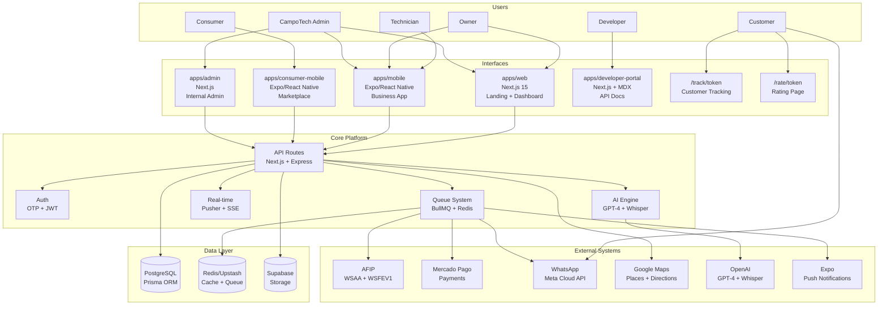
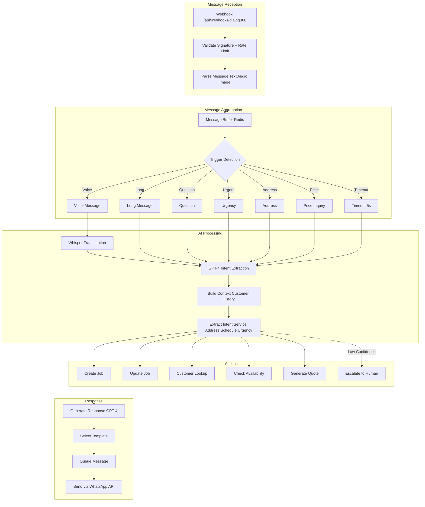
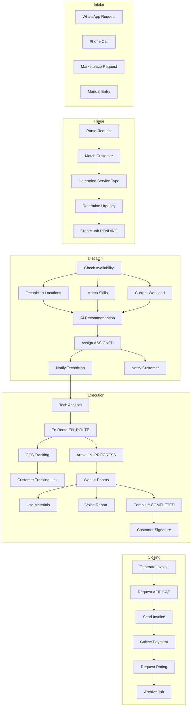
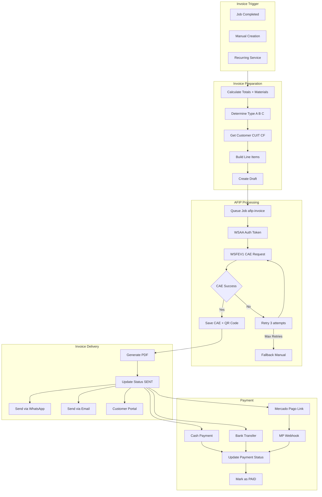
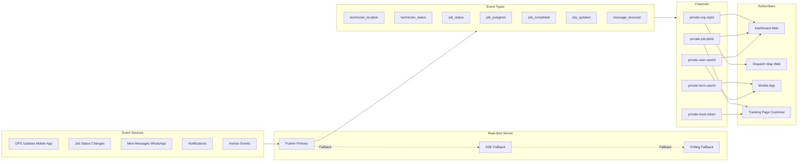
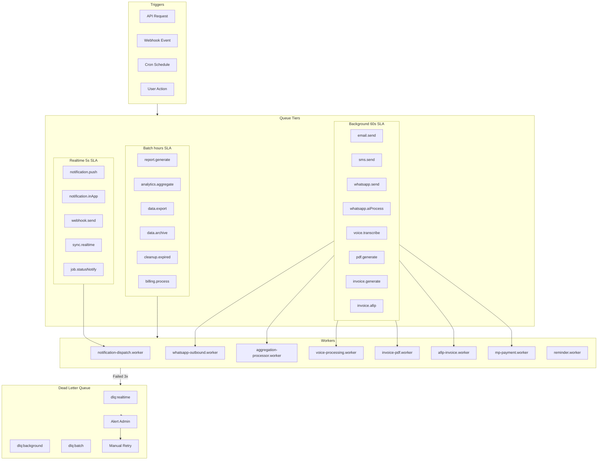
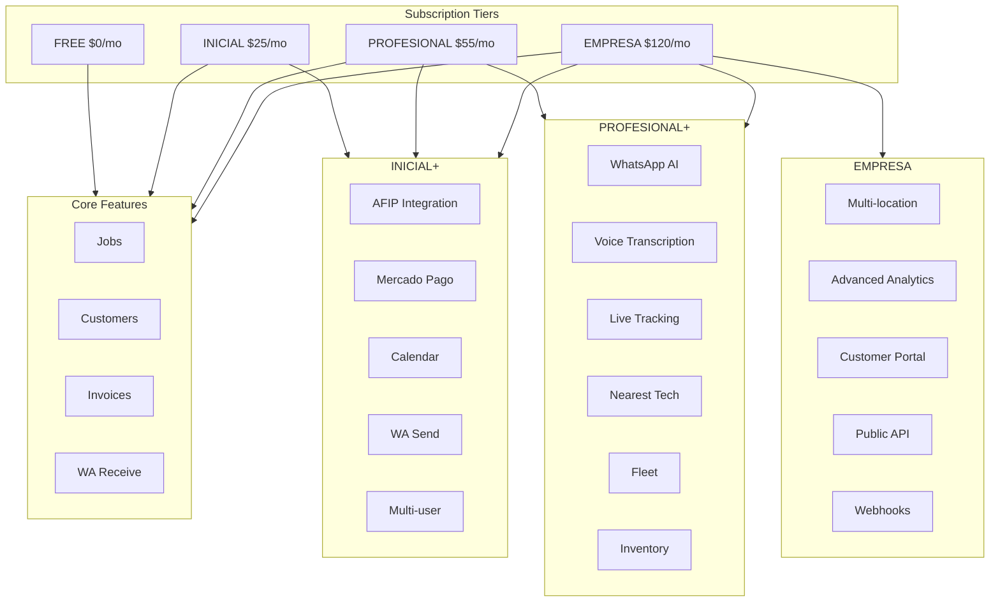

# CampoTech Complete System Architecture

> **Version:** 1.0.0
> **Date:** 2025-12-21
> **Status:** Production

---

## 1. Overview

CampoTech is an Argentine field service management (FSM) platform designed for SMBs (1-50 employees) in the trades sector (HVAC, plumbing, electrical, etc.). The platform provides end-to-end workflow management from customer intake via WhatsApp to electronic invoicing with AFIP.

### Technology Stack Summary

| Layer | Technology | Purpose |
|-------|------------|---------|
| **Frontend Web** | Next.js 15, React 19, Tailwind CSS | Landing page, Business Dashboard, Admin Portal |
| **Mobile (Business)** | Expo/React Native, WatermelonDB | Offline-first technician app |
| **Mobile (Consumer)** | Expo/React Native | Consumer marketplace app |
| **API** | Next.js API Routes, Express.js | REST APIs, Webhooks |
| **Database** | PostgreSQL, Prisma ORM | Primary data store |
| **Cache/Queue** | Upstash Redis, BullMQ | Caching, job queues |
| **Real-time** | Pusher, SSE, Polling | Live updates, GPS tracking |
| **Storage** | Supabase Storage | Photos, documents, voice messages |
| **AI** | OpenAI GPT-4, Whisper | Intent extraction, voice transcription |
| **Payments** | Mercado Pago | Invoices, subscriptions |
| **Invoicing** | AFIP WSAA/WSFEV1 | Electronic invoicing (Argentina) |
| **Messaging** | WhatsApp Cloud API / Dialog360 | Customer communication |
| **Push Notifications** | Expo Notifications, Firebase | Mobile alerts |
| **Monitoring** | Sentry | Error tracking |

### Scale Targets

- **100,000** active businesses
- **500,000** platform users
- **1,000,000** jobs processed monthly
- **5,000,000** WhatsApp messages monthly

---

## 2. High-Level System Overview



---

## 3. Application Architecture

### 3.1 apps/web (Next.js 15)

The main web application serving landing page and business dashboard.

| Route | Purpose | Access |
|-------|---------|--------|
| `/` | Landing page, pricing, features | Public |
| `/login` | OTP-based authentication | Public |
| `/register` | Business registration | Public |
| `/dashboard/*` | Business management interface | Authenticated |
| `/track/[token]` | Customer job tracking portal | Token-based |
| `/rate/[token]` | Customer rating submission | Token-based |

**Dashboard Modules:**
- `/dashboard` - Overview with KPIs
- `/dashboard/jobs` - Job management (CRUD, assignment)
- `/dashboard/customers` - Customer database
- `/dashboard/calendar` - Schedule visualization (INICIAL+)
- `/dashboard/invoices` - Invoice management
- `/dashboard/payments` - Payment tracking (INICIAL+)
- `/dashboard/fleet` - Vehicle management (PROFESIONAL+)
- `/dashboard/inventory` - Stock control (PROFESIONAL+)
- `/dashboard/dispatch` - Live map + dispatch (PROFESIONAL+)
- `/dashboard/locations` - Multi-zone management (EMPRESA)
- `/dashboard/whatsapp` - Conversation management
- `/dashboard/analytics` - Reports + KPIs (EMPRESA)
- `/dashboard/team` - User management (INICIAL+)
- `/dashboard/settings/*` - Configuration

### 3.2 apps/mobile (Expo/React Native)

Business mobile application for field operations.

**Tab Structure:**
| `Tab` | `Purpose` | `Roles` |
|-----|---------|-------|
| `today` | Today's schedule + pending jobs | All |
| `jobs` | Job list with filters | All |
| `customers` | Customer lookup | Owner, Admin |
| `calendar` | Schedule view | Owner, Admin |
| `inventory` | Stock management | Owner, Admin |
| `invoices` | Invoice creation | Owner, Admin |
| `team` | Team management | Owner |
| `analytics` | Mobile reports | Owner |
| `profile` | Settings + logout | All |

**Key Features:**
- Offline-first with WatermelonDB
- GPS tracking (expo-location)
- Voice reports (expo-av + Whisper)
- Photo capture (expo-camera)
- Customer signatures (react-native-signature-canvas)
- Push notifications (expo-notifications)

### 3.3 apps/consumer-mobile (Expo/React Native)

Consumer marketplace application.

**Structure:**
| Route Group | Purpose |
|-------------|---------|
| `(auth)` | Login/Register |
| `(tabs)` | Main navigation |
| `(booking)` | Service booking flow |
| `category/[id]` | Service category browse |
| `provider/[id]` | Business profile |
| `rate/[id]` | Post-service rating |

**Features:**
- Service discovery by category/location
- Business profiles with reviews
- Quote requests
- Job tracking
- Review submission

### 3.4 apps/admin (Next.js)

Internal CampoTech administration portal.

**Dashboard Sections:**
| Section | Purpose |
|---------|---------|
| `/dashboard` | Platform metrics, alerts |
| `/dashboard/negocios` | Business management |
| `/dashboard/subscriptions` | Subscription management |
| `/dashboard/verificaciones` | Business verification queue |
| `/dashboard/payments` | Failed payments handling |
| `/dashboard/ai` | AI usage monitoring |
| `/dashboard/costs` | Cost analysis |
| `/dashboard/map` | Platform-wide map view |

### 3.5 apps/developer-portal (Next.js + MDX)

Public API documentation and developer resources.

**Sections:**
| Route | Purpose |
|-------|---------|
| `/` | Portal landing |
| `/docs/*` | MDX documentation |
| `/reference` | API reference (Swagger UI) |
| `/console` | API testing console |
| `/playground` | Interactive examples |

---

## 4. Complete User Journey Map

```mermaid
flowchart TB
    subgraph USERS["👥 USER ACTORS"]
        direction TB
        OWNER["🏢 OWNER<br/>Business owner<br/>Full platform access<br/>Billing & settings"]
        ADMIN["📋 ADMIN<br/>Management staff<br/>Job scheduling<br/>Customer management<br/>(No billing)"]
        TECH["🔧 TECHNICIAN<br/>Field worker<br/>Mobile app focused<br/>Job completion"]
        CONSUMER["🛒 CONSUMER<br/>Marketplace user<br/>Service discovery<br/>Reviews & booking"]
    end

    %% ═══════════════════════════════════════════════════════════════════════
    %% FRONTEND INTERFACES - WEB DASHBOARD
    %% ═══════════════════════════════════════════════════════════════════════
    subgraph FRONTENDS["🖥️ FRONTEND INTERFACES"]
        direction TB
        subgraph WEB_DASHBOARD["Web Dashboard (Next.js) - 80+ Pages"]
            direction LR
            subgraph DASH_CORE["Core Modules"]
                DASH_HOME["📊 Dashboard<br/>KPIs, alerts, activity"]
                DASH_JOBS["📝 Jobs (9 views)<br/>List, detail, calendar"]
                DASH_CUSTOMERS["👥 Customers<br/>CRM, leads, history"]
                DASH_DISPATCH["🚀 Dispatch<br/>AI recommendations"]
            end
            subgraph DASH_OPS["Operations"]
                DASH_INVOICES["🧾 Invoicing<br/>Create, queue, AFIP"]
                DASH_PAYMENTS["💳 Payments<br/>History, disputes"]
                DASH_FLEET["🚗 Fleet (4 views)<br/>Vehicles, docs, VTV"]
                DASH_INVENTORY["📦 Inventory (11)<br/>Products, stock, PO"]
            end
            subgraph DASH_ANALYTICS["Analytics & Admin"]
                DASH_REPORTS["📈 Analytics (8)<br/>Revenue, ops, AI"]
                DASH_TEAM["👔 Team<br/>Users, locations"]
                DASH_SETTINGS["⚙️ Settings (12)<br/>Integrations config"]
                DASH_ADMIN["🔧 Admin (10)<br/>Queues, Health, Sync<br/>Panic Mode"]
            end
            subgraph DASH_COMMS["Communications"]
                DASH_WHATSAPP["💬 WhatsApp (4)<br/>Conversations, templates"]
                DASH_MAP["🗺️ Live Map<br/>Real-time tracking"]
                DASH_CALENDAR["📅 Calendar<br/>Drag-drop scheduling"]
                DASH_COPILOT["🤖 AI Copilot<br/>Chat, actions"]
            end
        end

        subgraph MOBILE_APP["Mobile App (React Native/Expo) - Technician"]
            direction LR
            MOB_TODAY["📱 Today's Jobs<br/>Priority schedule"]
            MOB_JOBS["📋 All Jobs<br/>List & map view"]
            MOB_DETAIL["🔍 Job Detail<br/>Photos, notes, status"]
            MOB_COMPLETE["✅ Completion<br/>Signature, materials"]
            MOB_INVENTORY["📦 Inventory<br/>Vehicle stock, scan"]
            MOB_GPS["📍 GPS Tracking<br/>Background location"]
            MOB_OFFLINE["💾 Offline Mode<br/>WatermelonDB sync"]
            MOB_ANALYTICS["📊 My Stats<br/>Performance metrics"]
            MOB_VOICE["🎤 Voice Notes<br/>Record & Upload"]
        end

        subgraph MARKETPLACE["Consumer Marketplace"]
            MKT_SEARCH["🔍 Search<br/>Category, location"]
            MKT_PROFILES["⭐ Profiles<br/>Reviews, portfolio"]
            MKT_QUOTES["💬 Request Quotes<br/>Compare providers"]
            MKT_BOOK["📅 Book & Pay<br/>Instant scheduling"]
            MKT_TRACK["📍 Track<br/>Real-time updates"]
            MKT_LOGIN["🔐 Consumer Login<br/>Portal Access"]
        end

        subgraph CONSUMER_MOBILE["Consumer Mobile App"]
            CMOB_DISCOVER["🔍 Discover<br/>Services nearby"]
            CMOB_BOOK["📅 Book<br/>Schedule service"]
            CMOB_TRACK["📍 Track<br/>Live updates"]
            CMOB_RATE["⭐ Rate<br/>Leave reviews"]
        end

        subgraph PUBLIC_PAGES["Public Pages"]
            PUB_LANDING["🏠 Landing<br/>Marketing site"]
            PUB_PROFILE["👤 Business Profile<br/>/p/[slug]"]
            PUB_TRACK["📍 Track Job<br/>/track/[token]"]
            PUB_RATE["⭐ Rate Job<br/>/rate/[token]"]
            PUB_LEGAL["📜 Legal<br/>Terms, privacy"]
            PUB_SEARCH["🔍 Public Directory<br/>/search"]
        end
    end
```



---

## 5. Data Entity Relationships


---

## 6. API Routes Summary

### Core Business
| Group | Purpose |
|-------|---------|
| `/api/customers/*` | Customer management, profiles, history |
| `/api/jobs/*` | Job CRUD, status, workflow execution |
| `/api/invoices/*` | Invoicing, AFIP generation, statuses |
| `/api/payments/*` | Payment collection, tracking, methods |
| `/api/inventory/*` | Product catalog, stock, warehouses, suppliers |
| `/api/locations/*` | Multi-location/branch management |
| `/api/vehicles/*` | Fleet management, maintenance, documents |
| `/api/users/*` | User/Staff management and profiles |
| `/api/employees/*` | Employee-specific records, schedules |
| `/api/team/*` | Team organization and hierarchy |
| `/api/service-types/*` | Configuration of service offerings |
| `/api/zones/*` | Service zone definitions and assignments |
| `/api/organization/*` | Core organization settings and metadata |

### Operations & Access
| Group | Purpose |
|-------|---------|
| `/api/auth/*` | Login, Register, Refresh, Logout, Me |
| `/api/access/*` | Role-based access control (RBAC), Permissions |
| `/api/approvals/*` | Approval workflows (e.g., job completion) |
| `/api/change-requests/*` | Regulated data modification requests |
| `/api/docs/*` | Internal or technical documentation endpoints |
| `/api/documents/*` | General document management/storage |
| `/api/verification/*` | Identity and business verification (KYC/KYB) |

### Finance & Subscriptions
| Group | Purpose |
|-------|---------|
| `/api/billing/*` | Platform billing history, invoices |
| `/api/subscription/*` | Subscription tiers, plan management |
| `/api/usage/*` | Quota tracking (e.g., WhatsApp messages) |

### Communication & Engagement
| Group | Purpose |
|-------|---------|
| `/api/whatsapp/*` | Messaging, templates, conversations |
| `/api/voice/*` | Audio processing (Upload, Transcribe) |
| `/api/notifications/*` | Notification center, preferences |
| `/api/ratings/*` | Customer feedback and reviews |
| `/api/public-profile/*` | Public-facing SEO profiles for marketplace |

### Geospatial & Tracking
| Group | Purpose |
|-------|---------|
| `/api/tracking/*` | Live technician tracking, sessions |
| `/api/dispatch/*` | Active job dispatching logic |
| `/api/map/*` | Map tiling and visualization data |
| `/api/places/*` | Address search and autocomplete |
| `/api/geocoding/*` | Address-to-coordinate conversion |

### System & Admin
| Group | Purpose |
|-------|---------|
| `/api/admin/*` | Super-admin tools (DLQ, Panic, Health) |
| `/api/audit-logs/*` | Activity trails for compliance |
| `/api/cron/*` | Scheduled background tasks |
| `/api/dashboard/*` | Aggregated metrics for dashboard views |
| `/api/health/*` | System uptime and capability checks |
| `/api/monitoring/*` | Performance and error monitoring |
| `/api/settings/*` | Global system configuration |
| `/api/sync/*` | Offline-first synchronization (WatermelonDB) |
| `/api/version/*` | API versioning info |

### Integrations
| Group | Purpose |
|-------|---------|
| `/api/afip/*` | Argentina tax authority integration |
| `/api/mercadopago/*` | Payment gateway integration |
| `/api/webhooks/*` | Incoming events (MP, Dialog360, etc.) |

### Analytics & Intelligence
| Group | Purpose |
|-------|---------|
| `/api/analytics/*` | Reporting, KPIs, predictive models |
| `/api/ai/*` | General AI services (Escalation, analysis) |
| `/api/copilot/*` | Staff AI assistant endpoints |

### Mobile & Legacy
| Group | Purpose |
|-------|---------|
| `/api/mobile/*` | Mobile-app specific optimizations |
| `/api/v1/*` | Legacy or versioned public endpoints |

---

## 7. External Service Details

| Service | Purpose | Endpoints Used |
|---------|---------|----------------|
| **AFIP WSAA** | Authentication | `wsaa.afip.gov.ar/ws/services/LoginCms` |
| **AFIP WSFEV1** | Electronic invoicing | `wsfe.afip.gov.ar/wsfev1/service.asmx` |
| **Mercado Pago** | Payment processing | Preferences, Payments, Refunds, Subscriptions |
| **WhatsApp Cloud API** | Messaging | Messages, Media, Templates |
| **Dialog360** | WhatsApp BSP | Alternative provider for WhatsApp API |
| **OpenAI GPT-4** | AI processing | Chat completions for intent extraction |
| **OpenAI Whisper** | Voice transcription | Audio transcriptions |
| **Google Maps** | Geocoding, routing | Places, Geocoding, Directions, Distance Matrix |
| **Supabase** | Storage, Realtime | File uploads (photos, docs, voice) |
| **Twilio** | SMS Fallback | OTP delivery only |
| **Upstash Redis** | Caching, rate limiting | Key-value store, queues |
| **Expo** | Push notifications | Expo Push API |

---

## 8. User Roles & Permissions

### Role Definitions

| Role | Spanish | Description |
|------|---------|-------------|
| `OWNER` | Dueño | Full platform access including billing |
| `ADMIN` | Administrador | Operations management, limited billing |
| `TECHNICIAN` | Técnico | Mobile field worker, assigned jobs only |

### Permissions Matrix

| Module | Owner | Admin | Technician |
|--------|:-----:|:----------:|:----------:|
| Dashboard | Full | Full | - |
| Jobs (all) | Full | Full | - |
| Jobs (assigned) | Full | Full | View/Update |
| Customers | Full | Full | - |
| Calendar | Full | Full | - |
| Invoices | Full | Full | - |
| Payments | Full | View | - |
| Fleet | Full | View | - |
| Inventory | Full | Full | View only |
| Dispatch Map | Full | Full | - |
| Locations | Full | View | - |
| WhatsApp | Full | Full | - |
| Analytics | Full | Limited | - |
| Team | Full | View | - |
| Settings | Full | - | - |
| Billing | Full | - | - |

---

## 9. WhatsApp AI Flow



---

## 10. Job Lifecycle



### Job Status Flow

```
PENDING -> ASSIGNED -> EN_ROUTE -> IN_PROGRESS -> COMPLETED
    |          |          |            |
    v          v          v            v
CANCELLED  CANCELLED  CANCELLED  CANCELLED
```

---

## 11. Invoicing & Payment Flow



### Invoice Types (AFIP)

| Type | Customer Type | IVA Treatment |
|------|---------------|---------------|
| **Factura A** | Responsable Inscripto | IVA discriminado |
| **Factura B** | Consumidor Final | IVA incluido |
| **Factura C** | Monotributista | Sin IVA |

---

## 12. Real-Time Systems



### Connection Modes

| Mode | Latency | Use Case |
|------|---------|----------|
| **WebSocket (Pusher)** | < 100ms | Primary, real-time updates |
| **SSE** | < 500ms | Fallback for restricted networks |
| **Polling** | 5-15s | Last resort, poor connectivity |

---

## 13. Queue & Background Jobs



### Queue Configuration

| Tier | SLA | Concurrency | Max Retries | Retry Delay |
|------|-----|-------------|-------------|-------------|
| **Realtime** | < 5s | 10 | 2 | 1s |
| **Background** | < 60s | 5 | 3 | 5s |
| **Batch** | < 1hr | 2 | 5 | 30s |

---

## 14. Subscription Tiers



### Resource Limits by Tier

| Resource | FREE | INICIAL | PROFESIONAL | EMPRESA |
|----------|------|---------|-------------|---------|
| Users | 1 | 1 | 5 | Unlimited |
| Jobs/month | 30 | 50 | 200 | Unlimited |
| Customers | 50 | 100 | 500 | Unlimited |
| Invoices/month | 15 | 50 | 200 | Unlimited |
| Vehicles | 0 | 1 | 5 | Unlimited |
| Products | 0 | 50 | 200 | Unlimited |
| Storage | 50MB | 100MB | 500MB | 5GB |
| Photos/job | 3 | 5 | 10 | 50 |
| WA AI/month | 0 | 0 | 100 | Unlimited |
| API calls/day | 0 | 0 | 0 | 10,000 |

---

## 15. Security & Authentication

### Token Specifications

| Token Type | Lifetime | Storage | Purpose |
|------------|----------|---------|---------|
| **Access Token** | 15 minutes | Memory | API authentication |
| **Refresh Token** | 7 days | Secure storage | Token renewal |
| **OTP Code** | 5 minutes | Database (hashed) | Phone verification |
| **API Key** | No expiry | Database | Public API access |
| **Tracking Token** | 48 hours | URL parameter | Customer tracking |
| **Rating Token** | 7 days | URL parameter | Customer rating |

### Security Measures

- OTP rate limiting (5 attempts/hour)
- JWT RS256 signing
- Webhook signature validation
- CORS configuration
- Helmet security headers
- API rate limiting (Upstash)
- Row-level security (Prisma)
- Input validation (Zod)
- SQL injection prevention (Prisma)
- XSS prevention (React)

---

## 16. Summary Table

| Layer | Component | Count |
|-------|-----------|-------|
| **Applications** | Next.js Web Apps | 1 (Dashboard/Marketing/Admin) |
| | React Native Mobile Apps | 2 (Technician, Consumer) |
| | Total Interfaces | 5 (Dash, Mobile Facades) |
| **API Routes** | **Total API Endpoints** | **242** (Physical Files) |
| | Core Business APIs | 80+ |
| | Admin/Ops APIs | 45+ |
| | Webhook Endpoints | 5 |
| | Cron/Scheduled Tasks | 7 |
| **Database** | Prisma Models | 167 |
| | Enums | 45+ |
| **External Integrations** | **Total Integrations** | **8** |
| | Payment | Mercado Pago |
| | Tax | AFIP (WSAA/WSFE) |
| | Messaging | WhatsApp (Dialog360) |
| | AI | OpenAI (GPT-4, Whisper) |
| | Maps | Google Maps |
| | Push | Expo |
| | Storage | Supabase |
| | SMS | Twilio (Fallback) |
| **User Types** | Business Roles | 3 (Owner, Admin, Tech) |
| | Consumer | 1 |
| | Customer | 1 |
| **Subscription Tiers** | Plans | 4 |
| | Features | 25+ |
| **Background Processing** | **Worker Types** | **28** |
| | Queue Tiers | 3 (RT, BG, Batch) |
| | Event Types | 12+ |

---

## Document Metadata

| Attribute | Value |
|-----------|-------|
| **Version** | 1.1.0 |
| **Last Updated** | 2025-12-30 |
| **Status** | Implementation Verified |
| **Total Models** | 167 |
| **Total API Routes** | 242 |
| **External Integrations** | 8 |
| **Diagram Count** | 13 |
