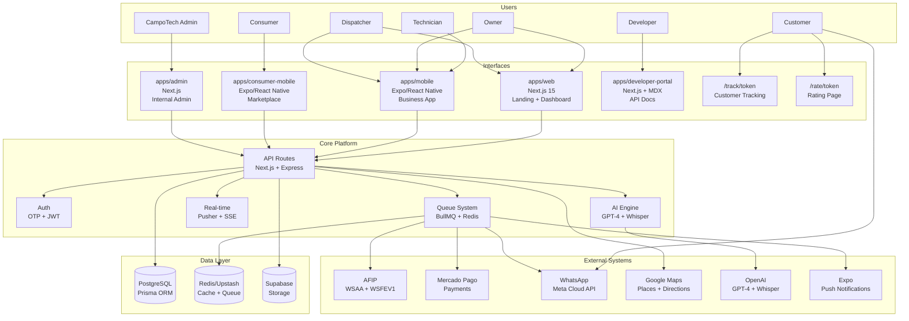
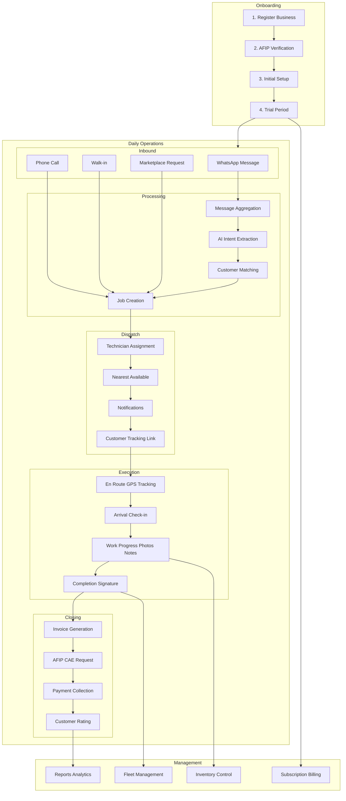
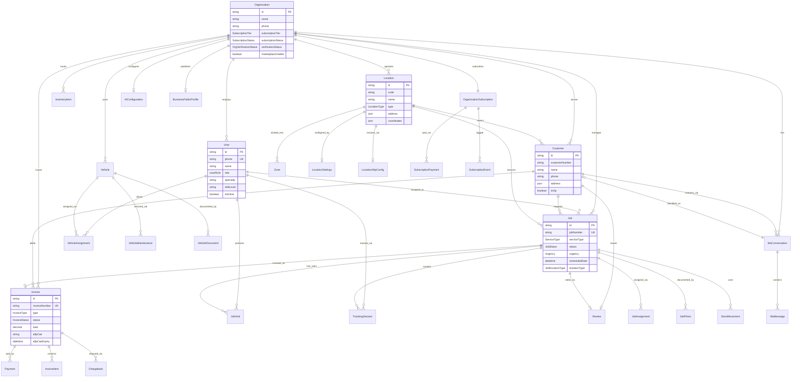
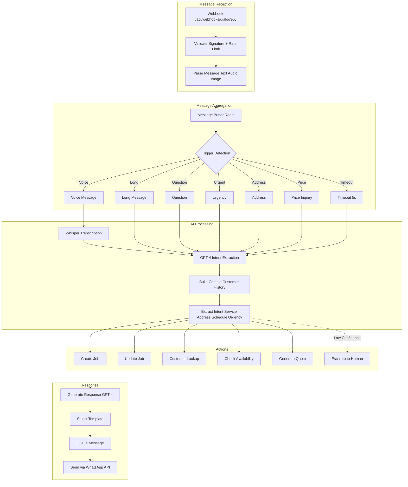
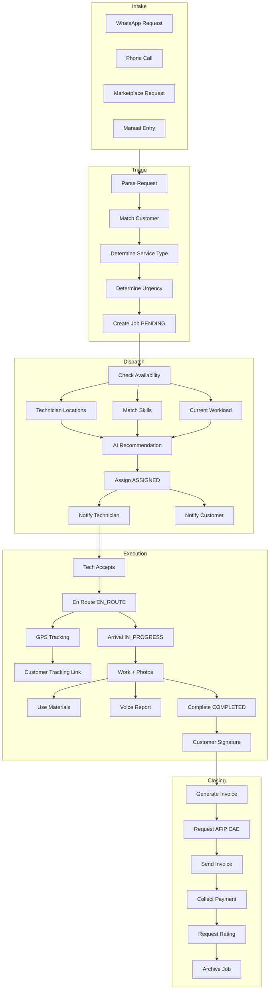
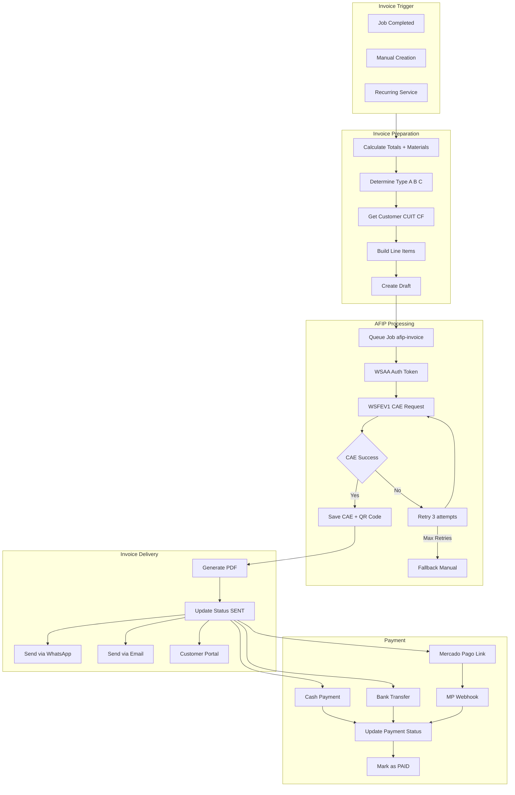
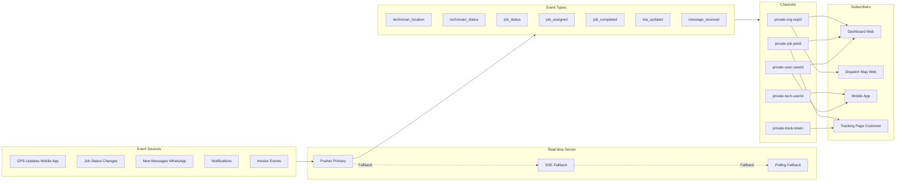
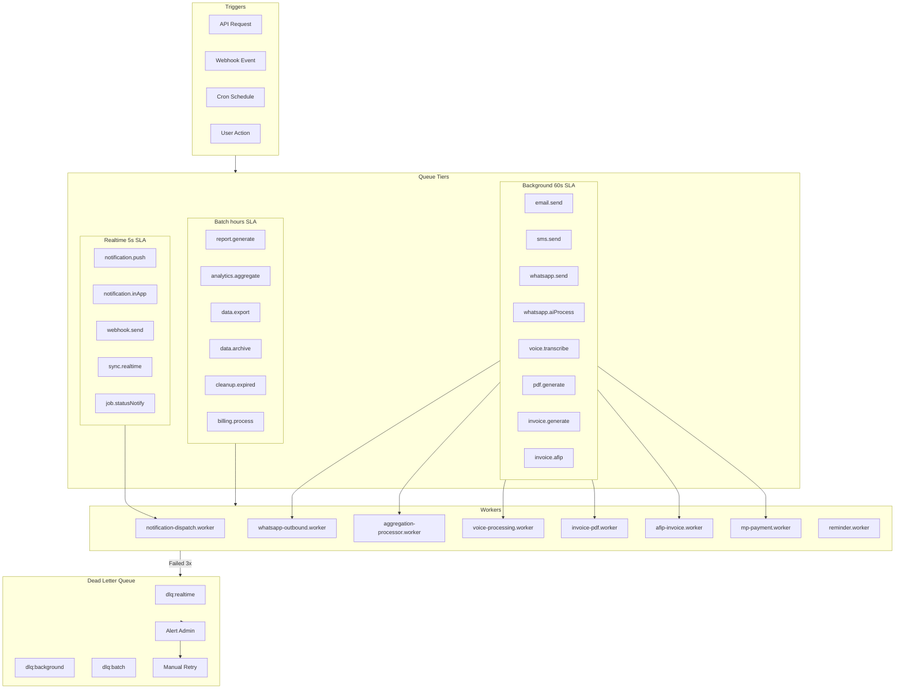
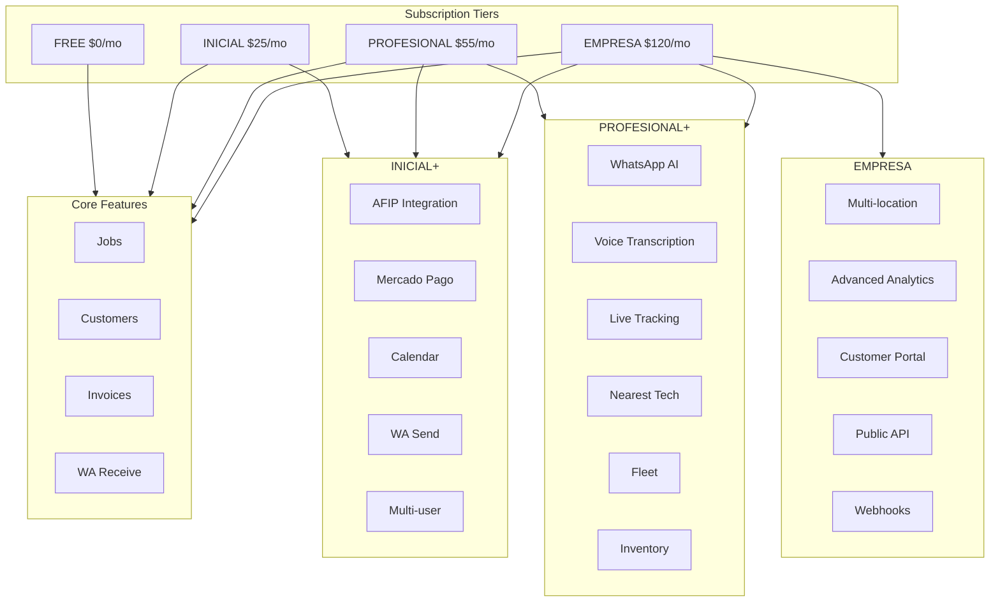

# CampoTech Complete System Architecture

> **Version:** 1.0.0
> **Date:** 2025-12-21
> **Status:** Production

---

## 1. Overview

CampoTech is an Argentine field service management (FSM) platform designed for SMBs (1-50 employees) in the trades sector (HVAC, plumbing, electrical, etc.). The platform provides end-to-end workflow management from customer intake via WhatsApp to electronic invoicing with AFIP.

### Technology Stack Summary

| Layer | Technology | Purpose |
|-------|------------|---------|
| **Frontend Web** | Next.js 15, React 19, Tailwind CSS | Landing page, Business Dashboard, Admin Portal |
| **Mobile (Business)** | Expo/React Native, WatermelonDB | Offline-first technician app |
| **Mobile (Consumer)** | Expo/React Native | Consumer marketplace app |
| **API** | Next.js API Routes, Express.js | REST APIs, Webhooks |
| **Database** | PostgreSQL, Prisma ORM | Primary data store |
| **Cache/Queue** | Upstash Redis, BullMQ | Caching, job queues |
| **Real-time** | Pusher, SSE, Polling | Live updates, GPS tracking |
| **Storage** | Supabase Storage | Photos, documents, voice messages |
| **AI** | OpenAI GPT-4, Whisper | Intent extraction, voice transcription |
| **Payments** | Mercado Pago | Invoices, subscriptions |
| **Invoicing** | AFIP WSAA/WSFEV1 | Electronic invoicing (Argentina) |
| **Messaging** | WhatsApp Cloud API / Dialog360 | Customer communication |
| **Push Notifications** | Expo Notifications, Firebase | Mobile alerts |
| **Monitoring** | Sentry | Error tracking |

### Scale Targets

- **100,000** active businesses
- **500,000** platform users
- **1,000,000** jobs processed monthly
- **5,000,000** WhatsApp messages monthly

---

## 2. High-Level System Overview



---

## 3. Application Architecture

### 3.1 apps/web (Next.js 15)

The main web application serving landing page and business dashboard.

| Route | Purpose | Access |
|-------|---------|--------|
| `/` | Landing page, pricing, features | Public |
| `/login` | OTP-based authentication | Public |
| `/register` | Business registration | Public |
| `/dashboard/*` | Business management interface | Authenticated |
| `/track/[token]` | Customer job tracking portal | Token-based |
| `/rate/[token]` | Customer rating submission | Token-based |

**Dashboard Modules:**
- `/dashboard` - Overview with KPIs
- `/dashboard/jobs` - Job management (CRUD, assignment)
- `/dashboard/customers` - Customer database
- `/dashboard/calendar` - Schedule visualization (INICIAL+)
- `/dashboard/invoices` - Invoice management
- `/dashboard/payments` - Payment tracking (INICIAL+)
- `/dashboard/fleet` - Vehicle management (PROFESIONAL+)
- `/dashboard/inventory` - Stock control (PROFESIONAL+)
- `/dashboard/dispatch` - Live map + dispatch (PROFESIONAL+)
- `/dashboard/locations` - Multi-zone management (EMPRESA)
- `/dashboard/whatsapp` - Conversation management
- `/dashboard/analytics` - Reports + KPIs (EMPRESA)
- `/dashboard/team` - User management (INICIAL+)
- `/dashboard/settings/*` - Configuration

### 3.2 apps/mobile (Expo/React Native)

Business mobile application for field operations.

**Tab Structure:**
| Tab | Purpose | Roles |
|-----|---------|-------|
| `today` | Today's schedule + pending jobs | All |
| `jobs` | Job list with filters | All |
| `customers` | Customer lookup | Owner, Dispatcher |
| `calendar` | Schedule view | Owner, Dispatcher |
| `inventory` | Stock management | Owner, Dispatcher |
| `invoices` | Invoice creation | Owner, Dispatcher |
| `team` | Team management | Owner |
| `analytics` | Mobile reports | Owner |
| `profile` | Settings + logout | All |

**Key Features:**
- Offline-first with WatermelonDB
- GPS tracking (expo-location)
- Voice reports (expo-av + Whisper)
- Photo capture (expo-camera)
- Customer signatures (react-native-signature-canvas)
- Push notifications (expo-notifications)

### 3.3 apps/consumer-mobile (Expo/React Native)

Consumer marketplace application.

**Structure:**
| Route Group | Purpose |
|-------------|---------|
| `(auth)` | Login/Register |
| `(tabs)` | Main navigation |
| `(booking)` | Service booking flow |
| `category/[id]` | Service category browse |
| `provider/[id]` | Business profile |
| `rate/[id]` | Post-service rating |

**Features:**
- Service discovery by category/location
- Business profiles with reviews
- Quote requests
- Job tracking
- Review submission

### 3.4 apps/admin (Next.js)

Internal CampoTech administration portal.

**Dashboard Sections:**
| Section | Purpose |
|---------|---------|
| `/dashboard` | Platform metrics, alerts |
| `/dashboard/negocios` | Business management |
| `/dashboard/subscriptions` | Subscription management |
| `/dashboard/verificaciones` | Business verification queue |
| `/dashboard/payments` | Failed payments handling |
| `/dashboard/ai` | AI usage monitoring |
| `/dashboard/costs` | Cost analysis |
| `/dashboard/map` | Platform-wide map view |

### 3.5 apps/developer-portal (Next.js + MDX)

Public API documentation and developer resources.

**Sections:**
| Route | Purpose |
|-------|---------|
| `/` | Portal landing |
| `/docs/*` | MDX documentation |
| `/reference` | API reference (Swagger UI) |
| `/console` | API testing console |
| `/playground` | Interactive examples |

---

## 4. Complete User Journey Map



---

## 5. Data Entity Relationships



---

## 6. API Routes Summary

### Authentication (`/api/auth/*`)
| Route | Method | Purpose |
|-------|--------|---------|
| `/auth/login` | POST | Login with phone/password |
| `/auth/register` | POST | Business registration |
| `/auth/otp/request` | POST | Request OTP code |
| `/auth/otp/verify` | POST | Verify OTP code |
| `/auth/refresh` | POST | Refresh JWT token |
| `/auth/logout` | POST | Logout |
| `/auth/me` | GET | Get current user |

### Core APIs
| Group | Routes | Purpose |
|-------|--------|---------|
| `/api/jobs/*` | 10+ | Job CRUD, assignment, status |
| `/api/customers/*` | 5+ | Customer management |
| `/api/invoices/*` | 8+ | Invoice generation, AFIP |
| `/api/payments/*` | 4+ | Payment tracking |
| `/api/users/*` | 6+ | User management |
| `/api/locations/*` | 8+ | Multi-location |
| `/api/vehicles/*` | 6+ | Fleet management |
| `/api/inventory/*` | 10+ | Stock control |

### External Integrations
| Group | Routes | Purpose |
|-------|--------|---------|
| `/api/webhooks/mercadopago` | POST | MP payment webhooks |
| `/api/webhooks/dialog360` | POST | WhatsApp webhooks |
| `/api/settings/afip` | GET/POST | AFIP configuration |
| `/api/settings/mercadopago` | GET/POST | MP configuration |
| `/api/settings/whatsapp` | GET/POST | WhatsApp configuration |

### Analytics & AI
| Group | Routes | Purpose |
|-------|--------|---------|
| `/api/analytics/*` | 12+ | Reports, KPIs, predictions |
| `/api/ai/*` | 4+ | AI status, usage, escalations |
| `/api/copilot/*` | 3+ | Staff AI assistant |

### Cron Jobs
| Route | Schedule | Purpose |
|-------|----------|---------|
| `/api/cron/subscription` | Daily | Process renewals |
| `/api/cron/trial-expiration` | Daily | Check trials |
| `/api/cron/archive-data` | Weekly | Archive old data |
| `/api/cron/check-budgets` | Daily | Budget alerts |
| `/api/cron/storage-optimization` | Daily | Cleanup files |

---

## 7. External Service Details

| Service | Purpose | Endpoints Used |
|---------|---------|----------------|
| **AFIP WSAA** | Authentication | `wsaa.afip.gov.ar/ws/services/LoginCms` |
| **AFIP WSFEV1** | Electronic invoicing | `wsfe.afip.gov.ar/wsfev1/service.asmx` |
| **Mercado Pago** | Payment processing | Preferences, Payments, Refunds, Subscriptions |
| **WhatsApp Cloud API** | Messaging | Messages, Media, Templates |
| **Dialog360** | WhatsApp BSP | Alternative provider for WhatsApp API |
| **OpenAI GPT-4** | AI processing | Chat completions for intent extraction |
| **OpenAI Whisper** | Voice transcription | Audio transcriptions |
| **Google Maps** | Geocoding, routing | Places, Geocoding, Directions, Distance Matrix |
| **Supabase** | Storage | File uploads (photos, documents, voice) |
| **Upstash Redis** | Caching, rate limiting | Key-value store, queues |
| **Expo** | Push notifications | Expo Push API |

---

## 8. User Roles & Permissions

### Role Definitions

| Role | Spanish | Description |
|------|---------|-------------|
| `OWNER` | Dueño | Full platform access including billing |
| `DISPATCHER` | Despachador | Operations management, no billing |
| `TECHNICIAN` | Técnico | Mobile field worker, assigned jobs only |

### Permissions Matrix

| Module | Owner | Dispatcher | Technician |
|--------|:-----:|:----------:|:----------:|
| Dashboard | Full | Full | - |
| Jobs (all) | Full | Full | - |
| Jobs (assigned) | Full | Full | View/Update |
| Customers | Full | Full | - |
| Calendar | Full | Full | - |
| Invoices | Full | Full | - |
| Payments | Full | - | - |
| Fleet | Full | - | - |
| Inventory | Full | Full | View only |
| Dispatch Map | Full | Full | - |
| Locations | Full | - | - |
| WhatsApp | Full | Full | - |
| Analytics | Full | Limited | - |
| Team | Full | - | - |
| Settings | Full | - | - |
| Billing | Full | - | - |

---

## 9. WhatsApp AI Flow



---

## 10. Job Lifecycle



### Job Status Flow

```
PENDING -> ASSIGNED -> EN_ROUTE -> IN_PROGRESS -> COMPLETED
    |          |          |            |
    v          v          v            v
CANCELLED  CANCELLED  CANCELLED  CANCELLED
```

---

## 11. Invoicing & Payment Flow



### Invoice Types (AFIP)

| Type | Customer Type | IVA Treatment |
|------|---------------|---------------|
| **Factura A** | Responsable Inscripto | IVA discriminado |
| **Factura B** | Consumidor Final | IVA incluido |
| **Factura C** | Monotributista | Sin IVA |

---

## 12. Real-Time Systems



### Connection Modes

| Mode | Latency | Use Case |
|------|---------|----------|
| **WebSocket (Pusher)** | < 100ms | Primary, real-time updates |
| **SSE** | < 500ms | Fallback for restricted networks |
| **Polling** | 5-15s | Last resort, poor connectivity |

---

## 13. Queue & Background Jobs



### Queue Configuration

| Tier | SLA | Concurrency | Max Retries | Retry Delay |
|------|-----|-------------|-------------|-------------|
| **Realtime** | < 5s | 10 | 2 | 1s |
| **Background** | < 60s | 5 | 3 | 5s |
| **Batch** | < 1hr | 2 | 5 | 30s |

---

## 14. Subscription Tiers



### Resource Limits by Tier

| Resource | FREE | INICIAL | PROFESIONAL | EMPRESA |
|----------|------|---------|-------------|---------|
| Users | 1 | 1 | 5 | Unlimited |
| Jobs/month | 30 | 50 | 200 | Unlimited |
| Customers | 50 | 100 | 500 | Unlimited |
| Invoices/month | 15 | 50 | 200 | Unlimited |
| Vehicles | 0 | 1 | 5 | Unlimited |
| Products | 0 | 50 | 200 | Unlimited |
| Storage | 50MB | 100MB | 500MB | 5GB |
| Photos/job | 3 | 5 | 10 | 50 |
| WA AI/month | 0 | 0 | 100 | Unlimited |
| API calls/day | 0 | 0 | 0 | 10,000 |

---

## 15. Security & Authentication

### Token Specifications

| Token Type | Lifetime | Storage | Purpose |
|------------|----------|---------|---------|
| **Access Token** | 15 minutes | Memory | API authentication |
| **Refresh Token** | 7 days | Secure storage | Token renewal |
| **OTP Code** | 5 minutes | Database (hashed) | Phone verification |
| **API Key** | No expiry | Database | Public API access |
| **Tracking Token** | 48 hours | URL parameter | Customer tracking |
| **Rating Token** | 7 days | URL parameter | Customer rating |

### Security Measures

- OTP rate limiting (5 attempts/hour)
- JWT RS256 signing
- Webhook signature validation
- CORS configuration
- Helmet security headers
- API rate limiting (Upstash)
- Row-level security (Prisma)
- Input validation (Zod)
- SQL injection prevention (Prisma)
- XSS prevention (React)

---

## 16. Summary Table

| Layer | Component | Count |
|-------|-----------|-------|
| **Applications** | Next.js Web Apps | 3 |
| | React Native Mobile Apps | 2 |
| | Total Apps | 5 |
| **API Routes** | Web API Routes | 150+ |
| | Admin API Routes | 16 |
| | Webhook Endpoints | 3 |
| | Cron Endpoints | 7 |
| **Database** | Prisma Models | 60+ |
| | Enums | 30+ |
| **External Integrations** | Payment (Mercado Pago) | 1 |
| | Tax (AFIP) | 1 |
| | Messaging (WhatsApp) | 2 providers |
| | AI (OpenAI) | 2 models |
| | Maps (Google) | 4 APIs |
| | Push (Expo) | 1 |
| **User Types** | Business Roles | 3 |
| | Consumer | 1 |
| | Customer | 1 |
| | Admin | 1 |
| **Subscription Tiers** | Plans | 4 |
| | Features | 20+ |
| **Queue Workers** | Worker Types | 8 |
| | Job Types | 30+ |
| **Real-time** | Event Types | 7 |
| | Channel Types | 5 |

---

## Document Metadata

| Attribute | Value |
|-----------|-------|
| **Version** | 1.0.0 |
| **Generated** | 2025-12-21 |
| **Author** | Claude (Architecture Analysis) |
| **Total Models** | 60+ |
| **Total API Routes** | 175+ |
| **External Integrations** | 10 |
| **Diagram Count** | 12 |
