# CampoTech Complete System Architecture

## Overview

This document provides a comprehensive visual map of the entire CampoTech Field Service Management platform, showing all user types, interfaces, APIs, external systems, and data flows.

---

## 1. High-Level System Overview

```mermaid
flowchart TB
    subgraph USERS["👥 USER TYPES"]
        OWNER["🏢 Business Owner<br/>Full platform access"]
        ADMIN["👔 Admin/Dispatcher<br/>Operations management"]
        TECH["🔧 Technician<br/>Mobile field worker"]
        CONSUMER["🏠 Consumer<br/>Marketplace user"]
        CUSTOMER["📞 Customer<br/>WhatsApp contact"]
    end

    subgraph INTERFACES["📱 INTERFACES"]
        WEB["🌐 Web Dashboard<br/>dashboard.campotech.com"]
        MOBILE["📱 Mobile App<br/>React Native/Expo"]
        PORTAL["🚪 Customer Portal<br/>Self-service"]
        MARKET["🛒 Marketplace<br/>Consumer discovery"]
        WHATSAPP["💬 WhatsApp<br/>Business API"]
    end

    subgraph CORE["⚙️ CORE PLATFORM"]
        API["🔌 API Layer<br/>Next.js API Routes"]
        WS["📡 WebSocket Server<br/>Real-time updates"]
        QUEUE["⏳ Queue Workers<br/>BullMQ + Redis"]
        AI["🤖 AI Engine<br/>GPT + Whisper"]
    end

    subgraph DATA["💾 DATA LAYER"]
        DB[(PostgreSQL<br/>Supabase)]
        STORAGE["📁 File Storage<br/>Supabase Storage"]
        CACHE["⚡ Cache<br/>Redis"]
    end

    subgraph EXTERNAL["🌍 EXTERNAL SYSTEMS"]
        AFIP["🏛️ AFIP<br/>Electronic invoicing"]
        MP["💳 Mercado Pago<br/>Payments"]
        GOOGLE["🗺️ Google APIs<br/>Maps/Distance"]
        META["📲 Meta/WhatsApp<br/>Business API"]
        OPENAI["🧠 OpenAI<br/>GPT-4 + Whisper"]
        EXPO["📲 Expo<br/>Push notifications"]
    end

    %% User to Interface connections
    OWNER --> WEB
    ADMIN --> WEB
    TECH --> MOBILE
    CONSUMER --> MARKET
    CUSTOMER --> WHATSAPP

    %% Interface to Core
    WEB --> API
    WEB --> WS
    MOBILE --> API
    MOBILE --> WS
    PORTAL --> API
    MARKET --> API
    WHATSAPP --> API

    %% Core internal
    API --> QUEUE
    API --> AI
    WS --> CACHE

    %% Core to Data
    API --> DB
    API --> STORAGE
    QUEUE --> DB
    AI --> DB

    %% Core to External
    API --> AFIP
    API --> MP
    API --> GOOGLE
    API --> META
    AI --> OPENAI
    QUEUE --> EXPO
```

---

## 2. Complete User Journey Map

```mermaid
flowchart LR
    subgraph ONBOARD["🚀 ONBOARDING"]
        REG["Register Business<br/>(Phone + OTP)"]
        SETUP["Setup Profile<br/>(CUIT, Services)"]
        PLAN["Select Plan<br/>(Free→Enterprise)"]
        INVITE["Invite Team<br/>(Techs, Admins)"]
    end

    subgraph DAILY["📅 DAILY OPERATIONS"]
        subgraph INBOUND["📥 Inbound"]
            WA_IN["WhatsApp<br/>Message"]
            CALL_IN["Phone Call<br/>(Transcribed)"]
            MKT_REQ["Marketplace<br/>Request"]
            PORTAL_REQ["Portal<br/>Request"]
        end

        subgraph PROCESS["⚙️ Processing"]
            AI_PROC["AI Analysis<br/>Intent + Entity"]
            JOB_CREATE["Job Creation"]
            DISPATCH["Dispatch/<br/>Assignment"]
        end

        subgraph EXECUTE["🔧 Execution"]
            TRACK["Live Tracking<br/>(En route)"]
            WORK["Job Execution<br/>(Photos, Notes)"]
            MATERIALS["Materials<br/>Used"]
        end

        subgraph CLOSE["✅ Closing"]
            COMPLETE["Job Complete"]
            INVOICE["AFIP Invoice<br/>(CAE)"]
            PAYMENT["Payment<br/>(MP Link)"]
            REVIEW["Customer<br/>Review"]
        end
    end

    subgraph MANAGE["📊 MANAGEMENT"]
        CALENDAR["Calendar<br/>Scheduling"]
        FLEET["Fleet<br/>Vehicles"]
        INVENTORY["Inventory<br/>Stock"]
        ANALYTICS["Analytics<br/>Reports"]
    end

    REG --> SETUP --> PLAN --> INVITE
    INVITE --> DAILY

    WA_IN --> AI_PROC
    CALL_IN --> AI_PROC
    MKT_REQ --> JOB_CREATE
    PORTAL_REQ --> JOB_CREATE
    AI_PROC --> JOB_CREATE
    JOB_CREATE --> DISPATCH
    DISPATCH --> TRACK
    TRACK --> WORK
    WORK --> MATERIALS
    MATERIALS --> COMPLETE
    COMPLETE --> INVOICE
    INVOICE --> PAYMENT
    PAYMENT --> REVIEW

    DISPATCH -.-> CALENDAR
    MATERIALS -.-> INVENTORY
    TRACK -.-> FLEET
    REVIEW -.-> ANALYTICS
```

---

## 3. Data Entity Relationships

---

## 4. API & External Systems Integration Map

```mermaid
flowchart TB
    subgraph CAMPOTECH["🏠 CAMPOTECH PLATFORM"]
        subgraph API_ROUTES["API Routes"]
            AUTH["/api/auth/*<br/>OTP, Login, Session"]
            JOBS_API["/api/jobs/*<br/>CRUD, Status, Assignment"]
            TRACK_API["/api/tracking/*<br/>Location, Nearest, Subscribe"]
            INV_API["/api/invoices/*<br/>Create, CAE, Send"]
            PAY_API["/api/payments/*<br/>Create, Webhook, Status"]
            FLEET_API["/api/vehicles/*<br/>CRUD, Documents, Assign"]
            STOCK_API["/api/inventory/*<br/>Items, Locations, Transactions"]
            WA_API["/api/whatsapp/*<br/>Webhook, Send, Voice"]
            MKT_API["/api/marketplace/*<br/>Requests, Quotes, Reviews"]
            DASH_API["/api/dashboard/*<br/>Metrics, Alerts, Analytics"]
        end

        subgraph WORKERS["Queue Workers"]
            W_INVOICE["invoice:generate-cae"]
            W_NOTIFY["notification:send"]
            W_FLEET["fleet:check-expiry"]
            W_STOCK["inventory:check-stock"]
            W_WA["whatsapp:process-message"]
            W_VOICE["voice:transcribe"]
            W_SYNC["sync:process-offline"]
        end
    end

    subgraph AFIP_SYS["🏛️ AFIP (Argentina Tax)"]
        AFIP_AUTH["WSAA<br/>Authentication"]
        AFIP_FE["WSFEV1<br/>Electronic Invoice"]
        AFIP_PADRON["Padrón<br/>CUIT Validation"]
    end

    subgraph MP_SYS["💳 MERCADO PAGO"]
        MP_PREF["Preferences API<br/>Create Payment"]
        MP_HOOK["Webhooks<br/>Payment Status"]
        MP_REFUND["Refunds API"]
    end

    subgraph GOOGLE_SYS["🗺️ GOOGLE APIS"]
        G_MAPS["Maps JavaScript<br/>Display Maps"]
        G_PLACES["Places API<br/>Address Autocomplete"]
        G_GEO["Geocoding API<br/>Address ↔ Coords"]
        G_DIR["Directions API<br/>Routes & Polylines"]
        G_DIST["Distance Matrix<br/>ETAs & Traffic"]
    end

    subgraph META_SYS["📱 META / WHATSAPP"]
        WA_CLOUD["Cloud API<br/>Send/Receive"]
        WA_WEBHOOK["Webhook<br/>Message Events"]
        WA_MEDIA["Media API<br/>Voice/Image Download"]
    end

    subgraph OPENAI_SYS["🧠 OPENAI"]
        GPT["GPT-4<br/>Intent & Entity"]
        WHISPER["Whisper<br/>Voice Transcription"]
    end

    subgraph NOTIF_SYS["📬 NOTIFICATIONS"]
        EXPO_PUSH["Expo Push<br/>Mobile Notifications"]
        EMAIL["Email Provider<br/>(Resend/SendGrid)"]
    end

    subgraph STORAGE_SYS["📁 STORAGE"]
        SUPA_STORE["Supabase Storage<br/>Files & Images"]
        SUPA_DB["Supabase PostgreSQL<br/>Database"]
    end

    %% API to External connections
    INV_API --> AFIP_AUTH
    INV_API --> AFIP_FE
    AUTH --> AFIP_PADRON

    PAY_API --> MP_PREF
    MP_HOOK --> PAY_API
    PAY_API --> MP_REFUND

    TRACK_API --> G_MAPS
    TRACK_API --> G_DIST
    JOBS_API --> G_PLACES
    JOBS_API --> G_GEO
    TRACK_API --> G_DIR

    WA_API --> WA_CLOUD
    WA_WEBHOOK --> WA_API
    WA_API --> WA_MEDIA

    W_WA --> GPT
    W_VOICE --> WHISPER

    W_NOTIFY --> EXPO_PUSH
    W_NOTIFY --> EMAIL

    FLEET_API --> SUPA_STORE
    JOBS_API --> SUPA_STORE
    
    %% All APIs to DB
    AUTH --> SUPA_DB
    JOBS_API --> SUPA_DB
    TRACK_API --> SUPA_DB
    INV_API --> SUPA_DB
    PAY_API --> SUPA_DB
    FLEET_API --> SUPA_DB
    STOCK_API --> SUPA_DB
    WA_API --> SUPA_DB
    MKT_API --> SUPA_DB
    DASH_API --> SUPA_DB
```

---

## 5. User Interface Access Matrix

---

## 6. WhatsApp AI Flow (Customer Intake)

---

## 7. Job Lifecycle & Dispatch Flow

---

## 8. Invoicing & Payment Flow

---

## 9. Fleet & Inventory Management

```mermaid
flowchart TB
    subgraph FLEET["🚗 FLEET MANAGEMENT"]
        subgraph VEHICLES["Vehicle Registry"]
            VEH_ADD["Add Vehicle<br/>(Plate, Make, Model)"]
            VEH_DOCS["Upload Documents<br/>(Insurance, VTV, Title)"]
            VEH_ASSIGN["Assign Workers<br/>(Primary + Secondary)"]
        end

        subgraph COMPLIANCE["Buenos Aires Compliance"]
            COMP_VTV["VTV Tracking<br/>(Verificación Técnica)"]
            COMP_INS["Insurance Expiry<br/>Tracking"]
            COMP_REG["Registration<br/>Tracking"]
        end

        subgraph ALERTS_FLEET["Fleet Alerts"]
            ALT_30["⚠️ 30 days<br/>before expiry"]
            ALT_15["⚠️ 15 days<br/>before expiry"]
            ALT_7["🔴 7 days<br/>before expiry"]
            ALT_EXP["🚨 EXPIRED<br/>Critical alert"]
        end
    end

    subgraph INVENTORY["📦 INVENTORY MANAGEMENT"]
        subgraph LOCATIONS["Storage Locations"]
            LOC_HUB["🏢 Hub/Warehouse<br/>Central Storage"]
            LOC_VEH["🚐 Vehicle Inventory<br/>Per Technician"]
        end

        subgraph OPERATIONS["Stock Operations"]
            OP_PURCHASE["Purchase<br/>New Stock"]
            OP_TRANSFER["Transfer<br/>Hub ↔ Vehicle"]
            OP_USE["Usage<br/>Job Materials"]
            OP_ADJUST["Adjustment<br/>Count Correction"]
            OP_RETURN["Return<br/>Unused Items"]
        end

        subgraph ALERTS_INV["Inventory Alerts"]
            ALT_LOW["⚠️ Low Stock<br/>Below minimum"]
            ALT_OUT["🔴 Out of Stock<br/>Zero quantity"]
            ALT_REORDER["📋 Reorder<br/>Suggestion"]
        end
    end

    subgraph JOB_MATERIALS["🔧 JOB INTEGRATION"]
        JOB_START["Job Starts"]
        JOB_USE["Tech Records<br/>Materials Used"]
        JOB_DEDUCT["Auto-Deduct<br/>from Vehicle Stock"]
        JOB_COST["Calculate<br/>Material Cost"]
        JOB_INVOICE["Add to<br/>Invoice"]
    end

    subgraph DASHBOARD["📊 DASHBOARD WIDGETS"]
        DASH_FLEET["Fleet Status<br/>Compliance Overview"]
        DASH_STOCK["Stock Alerts<br/>Critical Items"]
        DASH_UNIFIED["Unified Alerts<br/>All Systems"]
    end

    %% Fleet flow
    VEH_ADD --> VEH_DOCS
    VEH_DOCS --> VEH_ASSIGN
    VEH_DOCS --> COMP_VTV
    VEH_DOCS --> COMP_INS
    VEH_DOCS --> COMP_REG

    COMP_VTV --> ALT_30
    COMP_INS --> ALT_30
    COMP_REG --> ALT_30
    ALT_30 --> ALT_15 --> ALT_7 --> ALT_EXP

    %% Inventory flow
    OP_PURCHASE --> LOC_HUB
    LOC_HUB --> OP_TRANSFER
    OP_TRANSFER --> LOC_VEH
    LOC_VEH --> OP_USE
    OP_USE --> OP_ADJUST
    OP_ADJUST --> OP_RETURN

    LOC_HUB --> ALT_LOW
    LOC_VEH --> ALT_LOW
    ALT_LOW --> ALT_OUT
    ALT_OUT --> ALT_REORDER

    %% Job integration
    JOB_START --> JOB_USE
    JOB_USE --> JOB_DEDUCT
    JOB_DEDUCT --> LOC_VEH
    JOB_DEDUCT --> JOB_COST
    JOB_COST --> JOB_INVOICE

    %% Dashboard
    ALT_EXP --> DASH_FLEET
    ALT_OUT --> DASH_STOCK
    DASH_FLEET --> DASH_UNIFIED
    DASH_STOCK --> DASH_UNIFIED
```

---

## 10. Consumer Marketplace Flow

---

## 11. Real-Time Systems (WebSocket)

```mermaid
flowchart LR
    subgraph SOURCES["📡 EVENT SOURCES"]
        SRC_MOBILE["Mobile App<br/>Location Updates"]
        SRC_JOB["Job Status<br/>Changes"]
        SRC_PAY["Payment<br/>Webhooks"]
        SRC_WA["WhatsApp<br/>Messages"]
        SRC_ALERT["System<br/>Alerts"]
    end

    subgraph WS_SERVER["🔌 WEBSOCKET SERVER"]
        WS_AUTH["Authenticate<br/>Connection"]
        WS_ROOMS["Room Management<br/>(per organization)"]
        WS_BROADCAST["Broadcast<br/>to Subscribers"]
    end

    subgraph EVENTS["📨 EVENT TYPES"]
        EV_LOC["technician_location_update<br/>{userId, lat, lng, speed}"]
        EV_JOB["job_status_changed<br/>{jobId, status, techId}"]
        EV_PAY["payment_received<br/>{invoiceId, amount}"]
        EV_MSG["new_whatsapp_message<br/>{from, content}"]
        EV_ALERT["system_alert<br/>{type, severity, message}"]
    end

    subgraph SUBSCRIBERS["👥 SUBSCRIBERS"]
        SUB_MAP["Live Map<br/>Dashboard"]
        SUB_JOBS["Jobs List<br/>Page"]
        SUB_DASH["Main<br/>Dashboard"]
        SUB_NOTIF["Notification<br/>Center"]
    end

    %% Sources to WS
    SRC_MOBILE --> WS_AUTH
    SRC_JOB --> WS_AUTH
    SRC_PAY --> WS_AUTH
    SRC_WA --> WS_AUTH
    SRC_ALERT --> WS_AUTH

    %% WS Internal
    WS_AUTH --> WS_ROOMS
    WS_ROOMS --> WS_BROADCAST

    %% Events
    WS_BROADCAST --> EV_LOC
    WS_BROADCAST --> EV_JOB
    WS_BROADCAST --> EV_PAY
    WS_BROADCAST --> EV_MSG
    WS_BROADCAST --> EV_ALERT

    %% To subscribers
    EV_LOC --> SUB_MAP
    EV_JOB --> SUB_JOBS
    EV_JOB --> SUB_MAP
    EV_PAY --> SUB_DASH
    EV_MSG --> SUB_NOTIF
    EV_ALERT --> SUB_DASH
    EV_ALERT --> SUB_NOTIF
```

---

## 12. Queue & Background Jobs

```mermaid
flowchart TB
    subgraph QUEUES["⏳ JOB QUEUES (BullMQ)"]
        Q_INVOICE["invoice:*<br/>AFIP processing"]
        Q_NOTIFY["notification:*<br/>Push/Email/SMS"]
        Q_WA["whatsapp:*<br/>Message processing"]
        Q_VOICE["voice:*<br/>Transcription"]
        Q_FLEET["fleet:*<br/>Document checks"]
        Q_INV["inventory:*<br/>Stock alerts"]
        Q_SYNC["sync:*<br/>Offline sync"]
        Q_ANALYTICS["analytics:*<br/>Aggregation"]
    end

    subgraph TRIGGERS["⚡ TRIGGERS"]
        TRIG_API["API Request"]
        TRIG_WEBHOOK["External Webhook"]
        TRIG_CRON["Scheduled Cron"]
        TRIG_EVENT["Database Event"]
    end

    subgraph WORKERS["👷 WORKERS"]
        W_INV["Invoice Worker<br/>AFIP CAE generation"]
        W_NOT["Notification Worker<br/>Multi-channel send"]
        W_WA["WhatsApp Worker<br/>AI + Send"]
        W_VOI["Voice Worker<br/>Whisper transcription"]
        W_FLE["Fleet Worker<br/>Expiry checks"]
        W_STO["Inventory Worker<br/>Low stock alerts"]
        W_SYN["Sync Worker<br/>Conflict resolution"]
        W_ANA["Analytics Worker<br/>Daily aggregation"]
    end

    subgraph SCHEDULES["🕐 CRON SCHEDULES"]
        CRON_FLEET["fleet:check-expiry<br/>Daily 6:00 AM"]
        CRON_STOCK["inventory:check-stock<br/>Every 4 hours"]
        CRON_REMIND["notification:send-reminders<br/>Every 15 min"]
        CRON_ANALYTICS["analytics:aggregate-daily<br/>Daily 1:00 AM"]
        CRON_CLEANUP["system:cleanup-expired<br/>Daily 3:00 AM"]
    end

    %% Triggers to Queues
    TRIG_API --> Q_INVOICE
    TRIG_API --> Q_NOTIFY
    TRIG_WEBHOOK --> Q_WA
    TRIG_WEBHOOK --> Q_VOICE
    TRIG_CRON --> Q_FLEET
    TRIG_CRON --> Q_INV
    TRIG_CRON --> Q_ANALYTICS
    TRIG_EVENT --> Q_SYNC

    %% Queues to Workers
    Q_INVOICE --> W_INV
    Q_NOTIFY --> W_NOT
    Q_WA --> W_WA
    Q_VOICE --> W_VOI
    Q_FLEET --> W_FLE
    Q_INV --> W_STO
    Q_SYNC --> W_SYN
    Q_ANALYTICS --> W_ANA

    %% Cron scheduling
    CRON_FLEET --> Q_FLEET
    CRON_STOCK --> Q_INV
    CRON_REMIND --> Q_NOTIFY
    CRON_ANALYTICS --> Q_ANALYTICS
```

---

## 13. Capability & Tier Matrix

---

## 14. Security & Authentication Flow

```mermaid
flowchart TB
    subgraph AUTH_METHODS["🔐 AUTHENTICATION METHODS"]
        AUTH_OTP["Phone + OTP<br/>(Primary)"]
        AUTH_SESSION["JWT Session<br/>(Web/Mobile)"]
        AUTH_API["API Key<br/>(External)"]
        AUTH_WH["Webhook Signature<br/>(Meta, MP)"]
    end

    subgraph FLOWS["🔄 AUTH FLOWS"]
        subgraph OWNER_AUTH["Business Owner"]
            O1["Enter Phone"]
            O2["Receive OTP<br/>(WhatsApp/SMS)"]
            O3["Verify OTP"]
            O4["Create/Load Org"]
            O5["Issue JWT"]
        end

        subgraph TECH_AUTH["Technician"]
            T1["Receive Invite<br/>(Link + Token)"]
            T2["Verify Phone"]
            T3["Complete Onboarding"]
            T4["Issue JWT"]
        end

        subgraph CONSUMER_AUTH["Consumer"]
            C1["Enter Phone"]
            C2["Receive OTP"]
            C3["Create Profile"]
            C4["Issue JWT"]
        end

        subgraph API_AUTH["API Client"]
            A1["Send API Key<br/>(Header)"]
            A2["Hash & Lookup"]
            A3["Check Permissions"]
            A4["Rate Limit"]
        end
    end

    subgraph MIDDLEWARE["🛡️ MIDDLEWARE"]
        MW_VERIFY["Verify JWT"]
        MW_ORG["Load Organization"]
        MW_ROLE["Check Role"]
        MW_CAP["Check Capability"]
        MW_RATE["Rate Limit"]
    end

    subgraph RLS["🔒 ROW LEVEL SECURITY"]
        RLS_ORG["Filter by<br/>organization_id"]
        RLS_USER["Filter by<br/>user_id"]
        RLS_ROLE["Filter by<br/>user role"]
    end

    %% Owner flow
    O1 --> O2 --> O3 --> O4 --> O5

    %% Tech flow
    T1 --> T2 --> T3 --> T4

    %% Consumer flow
    C1 --> C2 --> C3 --> C4

    %% API flow
    A1 --> A2 --> A3 --> A4

    %% Middleware chain
    O5 --> MW_VERIFY
    T4 --> MW_VERIFY
    C4 --> MW_VERIFY
    A4 --> MW_ORG

    MW_VERIFY --> MW_ORG
    MW_ORG --> MW_ROLE
    MW_ROLE --> MW_CAP
    MW_CAP --> MW_RATE

    %% RLS
    MW_RATE --> RLS_ORG
    RLS_ORG --> RLS_USER
    RLS_USER --> RLS_ROLE
```

---

## Summary: Complete System Web

| Layer | Components | Count |
|-------|------------|-------|
| **User Types** | Owner, Admin, Dispatcher, Technician, Consumer, Customer | 6 |
| **Interfaces** | Web Dashboard, Mobile App, Customer Portal, Marketplace, WhatsApp | 5 |
| **API Routes** | Auth, Jobs, Tracking, Invoices, Payments, Fleet, Inventory, WhatsApp, Marketplace, Dashboard | 10+ groups |
| **Database Tables** | Core + Fleet + Inventory + Marketplace + Notifications | 55+ |
| **External APIs** | AFIP (3), Mercado Pago (3), Google (5), Meta (3), OpenAI (2), Expo (1) | 17 |
| **Queue Workers** | Invoice, Notification, WhatsApp, Voice, Fleet, Inventory, Sync, Analytics | 8 |
| **WebSocket Events** | Location, Job Status, Payment, Message, Alert | 5 |
| **Subscription Tiers** | Free, Basico, Profesional, Empresarial, Enterprise | 5 |

---

*This document provides the complete architectural map of CampoTech. Each diagram can be rendered using any Mermaid-compatible viewer.*
