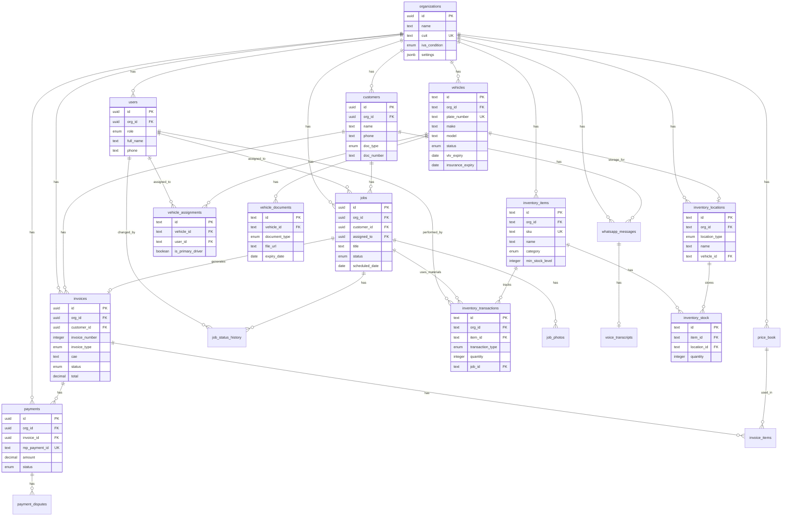

# CampoTech: Complete Database Schema
## ERD + SQL + Enums + Constraints + Indexes + Migrations

---

# TABLE OF CONTENTS

1. Database Overview
2. Multi-Tenancy Strategy
3. Entity Relationship Diagram (ERD)
4. Enum Definitions
5. Complete SQL Schema
6. Indexes Strategy
7. Row-Level Security (RLS) Policies
8. Normalization Decisions
9. Migration Order
10. Seed Data
11. Backup & Recovery

---

# 1. DATABASE OVERVIEW

## Technology Stack
- **Database:** PostgreSQL 15+ (via Supabase)
- **Extensions:** pgcrypto, uuid-ossp, pg_trgm
- **ORM:** Prisma (backend) / WatermelonDB (mobile)
- **Migrations:** Prisma Migrate + custom SQL

## Schema Statistics
| Metric | Count | Notes |
|--------|-------|-------|
| Tables (Implemented) | 47 | As of migration 054 |
| Tables (Planned) | 16 | Consumer marketplace, DLQ |
| Enums | 18 | Including Phase 9+ additions |
| Indexes | 80+ | Including partial indexes |
| Foreign Keys | 60+ | Cross-table relationships |
| RLS Policies | 25+ | Tenant isolation |

> **Note:** This schema includes both implemented tables (verified in migrations) and planned tables (marked with ⏳). See individual table sections for implementation status.

## Naming Conventions
- Tables: `snake_case`, plural (e.g., `customers`, `invoices`)
- Columns: `snake_case` (e.g., `created_at`, `invoice_number`)
- Primary Keys: `id` (UUID)
- Foreign Keys: `{table_singular}_id` (e.g., `customer_id`, `org_id`)
- Timestamps: `created_at`, `updated_at`, `deleted_at`
- Booleans: `is_` or `has_` prefix (e.g., `is_active`, `has_whatsapp`)

---

# 2. MULTI-TENANCY STRATEGY

## Approach: Shared Database, Shared Schema with Row-Level Security

```
┌─────────────────────────────────────────────────────────────┐
│                    SINGLE DATABASE                           │
├─────────────────────────────────────────────────────────────┤
│  ┌─────────────────────────────────────────────────────┐   │
│  │              SHARED TABLES                           │   │
│  │  organizations | users | customers | jobs | ...      │   │
│  └─────────────────────────────────────────────────────┘   │
│                           │                                  │
│                           ▼                                  │
│  ┌─────────────────────────────────────────────────────┐   │
│  │           ROW-LEVEL SECURITY (RLS)                   │   │
│  │  Every query filtered by org_id automatically        │   │
│  └─────────────────────────────────────────────────────┘   │
│                           │                                  │
│          ┌────────────────┼────────────────┐                │
│          ▼                ▼                ▼                │
│     [Org A Data]    [Org B Data]    [Org C Data]           │
└─────────────────────────────────────────────────────────────┘
```

## Tenant Isolation Rules
- Every data table has `org_id` column (NOT NULL)
- RLS policies enforce `org_id = auth.jwt()->>'org_id'`
- Cross-tenant queries impossible at database level
- System tables (no `org_id`): `audit_logs`, `system_settings`

## Tenant Context
```sql
-- Set tenant context for session
SELECT set_config('app.current_org_id', 'uuid-here', true);

-- Get current tenant
SELECT current_setting('app.current_org_id', true);
```

---

# 3. ENTITY RELATIONSHIP DIAGRAM (ERD)

## Full ERD (ASCII)

```
┌─────────────────────────────────────────────────────────────────────────────────────────┐
│                                    CAMPOTECH ERD                                         │
└─────────────────────────────────────────────────────────────────────────────────────────┘

                                    ┌──────────────────┐
                                    │  organizations   │
                                    ├──────────────────┤
                                    │ PK id            │
                                    │    name          │
                                    │    cuit (UNIQUE) │
                                    │    iva_condition │
                                    │    settings      │
                                    └────────┬─────────┘
                                             │
              ┌──────────────────────────────┼──────────────────────────────┐
              │                              │                              │
              ▼                              ▼                              ▼
    ┌──────────────────┐          ┌──────────────────┐          ┌──────────────────┐
    │      users       │          │    customers     │          │    price_book    │
    ├──────────────────┤          ├──────────────────┤          ├──────────────────┤
    │ PK id            │          │ PK id            │          │ PK id            │
    │ FK org_id ───────┼──────────│ FK org_id ───────┼──────────│ FK org_id        │
    │    role          │          │    name          │          │    name          │
    │    full_name     │          │    phone (UQ*)   │          │    category      │
    │    phone         │          │    doc_type      │          │    base_price    │
    │    email         │          │    doc_number    │          │    tax_rate      │
    └────────┬─────────┘          │    iva_condition │          └──────────────────┘
             │                    │    address       │
             │                    └────────┬─────────┘
             │                             │
             │    ┌────────────────────────┘
             │    │
             ▼    ▼
    ┌──────────────────┐
    │      jobs        │
    ├──────────────────┤
    │ PK id            │
    │ FK org_id        │◄─────────────────────────────────────────────────────────────┐
    │ FK customer_id ──┼──► customers.id                                              │
    │ FK assigned_to ──┼──► users.id                                                  │
    │ FK invoice_id ───┼──► invoices.id                                               │
    │    title         │                                                              │
    │    status        │                                                              │
    │    scheduled_date│                                                              │
    └────────┬─────────┘                                                              │
             │                                                                        │
             │         ┌──────────────────┐         ┌──────────────────┐             │
             │         │ job_status_history│         │  job_photos ⏳    │             │
             │         ├──────────────────┤         ├──────────────────┤             │
             │         │ PK id            │         │ PK id            │ (Uses TEXT[]│
             └────────►│ FK job_id        │         │ FK job_id ───────┼─in jobs.    │
                       │ FK changed_by ───┼──► users│    photo_url     │  photos     │
                       │    status        │         │    photo_type    │  instead)   │
                       └──────────────────┘         └──────────────────┘             │
                                                                                      │
    ┌──────────────────┐                                                              │
    │    invoices      │                                                              │
    ├──────────────────┤                                                              │
    │ PK id            │                                                              │
    │ FK org_id ───────┼──────────────────────────────────────────────────────────────┘
    │ FK customer_id ──┼──► customers.id
    │ FK job_id ───────┼──► jobs.id
    │    invoice_number│
    │    invoice_type  │
    │    punto_venta   │
    │    cae           │
    │    status        │
    │    total         │
    │    (UQ: org_id, punto_venta, invoice_number)
    └────────┬─────────┘
             │
             │         ┌──────────────────┐
             │         │ invoice_items ⏳  │
             │         ├──────────────────┤
             │         │ PK id            │
             └────────►│ FK invoice_id    │
                       │ FK price_book_id─┼──► price_book.id
                       │    description   │  (Uses JSONB in
                       │    quantity      │   invoices.line_items
                       │    unit_price    │   instead)
                       └──────────────────┘

    ┌──────────────────┐
    │    payments      │
    ├──────────────────┤
    │ PK id            │
    │ FK org_id        │
    │ FK invoice_id ───┼──► invoices.id
    │    mp_payment_id │ (UNIQUE)
    │    amount        │
    │    status        │
    │    installments  │
    └────────┬─────────┘
             │
             │         ┌──────────────────┐
             │         │payment_disputes⏳│
             │         ├──────────────────┤
             │         │ PK id            │
             └────────►│ FK payment_id    │
                       │    dispute_type  │  (Uses columns in
                       │    status        │   payments table
                       │    deadline      │   instead)
                       └──────────────────┘

    ┌──────────────────┐
    │whatsapp_messages │
    ├──────────────────┤
    │ PK id            │
    │ FK org_id        │
    │ FK customer_id ──┼──► customers.id
    │ FK job_id ───────┼──► jobs.id
    │    wa_message_id │ (UNIQUE)
    │    direction     │
    │    message_type  │
    │    status        │
    └────────┬─────────┘
             │
             │         ┌──────────────────┐
             │         │voice_transcripts⏳│
             │         ├──────────────────┤
             │         │ PK id            │
             └────────►│ FK message_id    │
                       │    transcription │  (Uses columns in
                       │    extraction    │   whatsapp_messages
                       │    confidence    │   instead)
                       └──────────────────┘

    ┌──────────────────┐         ┌──────────────────┐
    │   audit_logs     │         │ sync_operations  │  ✅
    ├──────────────────┤         ├──────────────────┤
    │ PK id            │         │ PK id            │
    │ FK org_id (NULL) │         │ FK org_id        │
    │ FK user_id       │         │    entity_type   │
    │    action        │         │    entity_id     │
    │    entity_type   │         │    action_type   │
    │    entity_id     │         │    status        │
    │    entry_hash    │         │    payload       │
    └──────────────────┘         └──────────────────┘

    ┌──────────────────┐         ┌──────────────────┐
    │    sessions      │  ✅      │    otp_codes     │  ✅
    ├──────────────────┤         ├──────────────────┤
    │ PK id            │         │ PK id            │
    │ FK user_id       │         │    phone         │
    │ FK org_id        │         │    code_hash     │
    │ refresh_token_h. │         │    verified      │
    │    is_active     │         │    expires_at    │
    └──────────────────┘         └──────────────────┘

    ┌──────────────────┐         ┌──────────────────┐
    │  failed_jobs ⏳   │         │idempotency_keys⏳│
    ├──────────────────┤         ├──────────────────┤
    │ PK id            │         │ PK id            │
    │    queue_name    │         │    key (UNIQUE)  │
    │    job_data      │         │    result        │
    │    error         │         │    expires_at    │
    │    attempts      │         └──────────────────┘
    └──────────────────┘
    (⏳ = Planned, not yet implemented)

Legend:
  PK = Primary Key
  FK = Foreign Key
  UQ = Unique Constraint
  UQ* = Unique within org (composite)
  ──► = Foreign Key Reference
```

## Mermaid ERD (for rendering tools)



---

# 4. ENUM DEFINITIONS

## SQL Enum Definitions

```sql
-- ============================================================================
-- ENUM DEFINITIONS
-- ============================================================================

-- Organization IVA Condition
CREATE TYPE iva_condition_enum AS ENUM (
    'responsable_inscripto',    -- Registered VAT taxpayer
    'monotributista',           -- Simplified tax regime
    'exento',                   -- VAT exempt
    'consumidor_final'          -- Final consumer (for customers only)
);

-- User Role
CREATE TYPE user_role_enum AS ENUM (
    'owner',        -- Full access, billing, danger zone
    'admin',        -- Operational access, no billing
    'dispatcher',   -- Jobs & customers, no finances
    'technician',   -- Own jobs only, mobile-focused
    'accountant'    -- Invoices & payments only
);

-- Document Type (Argentina)
CREATE TYPE doc_type_enum AS ENUM (
    'dni',      -- Documento Nacional de Identidad
    'cuit',     -- Clave Única de Identificación Tributaria
    'cuil',     -- Clave Única de Identificación Laboral
    'pasaporte' -- Passport (foreigners)
);

-- Job Status
CREATE TYPE job_status_enum AS ENUM (
    'pending',      -- Created, not scheduled
    'scheduled',    -- Assigned date/time
    'en_camino',    -- Technician traveling
    'working',      -- Technician on site
    'completed',    -- Work finished
    'cancelled'     -- Cancelled
);

-- Job Priority
CREATE TYPE job_priority_enum AS ENUM (
    'low',
    'normal',
    'high',
    'urgent'
);

-- Job Type
CREATE TYPE job_type_enum AS ENUM (
    'plomeria',
    'electricidad',
    'aire_acondicionado',
    'gas',
    'calefaccion',
    'general'
);

-- Job Source
CREATE TYPE job_source_enum AS ENUM (
    'manual',       -- Created manually in app
    'whatsapp',     -- Created from WhatsApp text
    'voice',        -- Created from voice message
    'recurring'     -- Auto-created from recurring job
);

-- Invoice Type (AFIP)
CREATE TYPE invoice_type_enum AS ENUM (
    'A',    -- Between registered IVA taxpayers
    'B',    -- To final consumers or exempt
    'C',    -- From monotributista
    'E'     -- Export (future)
);

-- Invoice Status
CREATE TYPE invoice_status_enum AS ENUM (
    'draft',        -- Not submitted to AFIP
    'pending_cae',  -- Submitted, awaiting CAE
    'issued',       -- CAE received
    'sent',         -- Sent to customer
    'paid',         -- Payment received
    'partial',      -- Partial payment received
    'overdue',      -- Past due date
    'cancelled',    -- Cancelled (nota de crédito issued)
    'refunded'      -- Refund processed
);

-- Payment Status
CREATE TYPE payment_status_enum AS ENUM (
    'pending',      -- Awaiting payment
    'processing',   -- Payment initiated
    'approved',     -- Payment successful
    'rejected',     -- Payment failed
    'cancelled',    -- Cancelled by user
    'refunded',     -- Full refund
    'partial_refund', -- Partial refund
    'in_dispute',   -- Chargeback initiated
    'chargedback'   -- Chargeback won by customer
);

-- Payment Method
CREATE TYPE payment_method_enum AS ENUM (
    'credit_card',
    'debit_card',
    'account_money',    -- MP wallet
    'cash',
    'bank_transfer',
    'check'
);

-- WhatsApp Message Direction
CREATE TYPE message_direction_enum AS ENUM (
    'inbound',
    'outbound'
);

-- WhatsApp Message Type
CREATE TYPE message_type_enum AS ENUM (
    'text',
    'voice',
    'image',
    'document',
    'template',
    'interactive'
);

-- WhatsApp Message Status
CREATE TYPE message_status_enum AS ENUM (
    'received',         -- Inbound message received
    'queued',           -- In outbound send queue
    'sent',             -- Sent to WhatsApp
    'delivered',        -- Delivered to device
    'read',             -- Read by recipient
    'failed',           -- Delivery failed
    'fallback_sms',     -- Sent via SMS instead
    'undeliverable'     -- Permanently failed
);

-- Voice Processing Status
CREATE TYPE voice_status_enum AS ENUM (
    'pending',          -- Awaiting processing
    'transcribing',     -- Whisper processing
    'extracting',       -- GPT extraction
    'completed',        -- Done
    'needs_review',     -- Low confidence
    'reviewed',         -- Human reviewed
    'failed'            -- Processing failed
);

-- Sync Status (Mobile)
CREATE TYPE sync_status_enum AS ENUM (
    'pending',
    'syncing',
    'synced',
    'conflict',
    'failed'
);

-- Audit Action
CREATE TYPE audit_action_enum AS ENUM (
    -- Auth
    'user_login',
    'user_logout',
    'user_created',
    'user_updated',
    'user_deactivated',
    'password_changed',
    'role_changed',
    -- Organization
    'org_created',
    'org_updated',
    'afip_cert_uploaded',
    'mp_connected',
    'whatsapp_connected',
    -- Customers
    'customer_created',
    'customer_updated',
    'customer_deleted',
    -- Jobs
    'job_created',
    'job_updated',
    'job_status_changed',
    'job_assigned',
    'job_completed',
    'job_cancelled',
    -- Invoices
    'invoice_created',
    'invoice_cae_requested',
    'invoice_cae_received',
    'invoice_cae_failed',
    'invoice_sent',
    'invoice_cancelled',
    -- Payments
    'payment_created',
    'payment_approved',
    'payment_rejected',
    'payment_refunded',
    'payment_disputed',
    -- WhatsApp
    'message_sent',
    'message_failed',
    'voice_processed',
    -- System
    'panic_mode_entered',
    'panic_mode_exited',
    'manual_override',
    'data_export',
    'data_delete'
);

-- Price Book Category
CREATE TYPE price_category_enum AS ENUM (
    'mano_de_obra',     -- Labor
    'materiales',       -- Materials
    'consumibles',      -- Consumables
    'viatico'           -- Travel/transport
);

-- Dispute Type
CREATE TYPE dispute_type_enum AS ENUM (
    'chargeback',
    'fraud_claim',
    'service_not_received',
    'duplicate_charge'
);

-- Dispute Status
CREATE TYPE dispute_status_enum AS ENUM (
    'pending_response',
    'evidence_submitted',
    'under_review',
    'won',
    'lost'
);

-- Photo Type
CREATE TYPE photo_type_enum AS ENUM (
    'before',
    'during',
    'after',
    'signature',
    'document'
);

-- ============================================================================
-- FLEET MANAGEMENT ENUMS (Phase 8)
-- ============================================================================

-- Vehicle Status
CREATE TYPE vehicle_status_enum AS ENUM (
    'active',           -- Vehicle in regular use
    'maintenance',      -- Under maintenance
    'inactive'          -- Out of service
);

-- Vehicle Fuel Type
CREATE TYPE fuel_type_enum AS ENUM (
    'gasoline',         -- Nafta
    'diesel',           -- Diesel/Gasoil
    'electric',         -- Eléctrico
    'gnc'               -- Gas Natural Comprimido
);

-- Vehicle Document Type
CREATE TYPE vehicle_document_type_enum AS ENUM (
    'insurance',        -- Seguro
    'vtv',              -- Verificación Técnica Vehicular (Buenos Aires)
    'registration',     -- Cédula de identificación
    'title',            -- Título de propiedad
    'green_card'        -- Tarjeta Verde (ownership card)
);

-- ============================================================================
-- INVENTORY MANAGEMENT ENUMS (Phase 9)
-- ============================================================================

-- Inventory Item Category
CREATE TYPE inventory_category_enum AS ENUM (
    'parts',            -- Repuestos
    'tools',            -- Herramientas
    'consumables',      -- Consumibles
    'equipment'         -- Equipamiento
);

-- Inventory Unit
CREATE TYPE inventory_unit_enum AS ENUM (
    'pieza',            -- Unit/piece
    'metro',            -- Meter
    'litro',            -- Liter
    'kg'                -- Kilogram
);

-- Inventory Location Type
CREATE TYPE location_type_enum AS ENUM (
    'hub',              -- Central warehouse/depot
    'vehicle'           -- Vehicle storage
);

-- Inventory Transaction Type
CREATE TYPE transaction_type_enum AS ENUM (
    'purchase',         -- New stock into hub
    'transfer',         -- Hub → Vehicle or Vehicle → Vehicle
    'usage',            -- Item used on a job (linked to job_id)
    'adjustment',       -- Inventory count correction
    'return'            -- Customer return or job cancellation
);
```

---

# 5. COMPLETE SQL SCHEMA

## Extensions and Setup

```sql
-- ============================================================================
-- EXTENSIONS
-- ============================================================================

CREATE EXTENSION IF NOT EXISTS "uuid-ossp";      -- UUID generation
CREATE EXTENSION IF NOT EXISTS "pgcrypto";       -- Encryption functions
CREATE EXTENSION IF NOT EXISTS "pg_trgm";        -- Trigram similarity (search)

-- ============================================================================
-- HELPER FUNCTIONS
-- ============================================================================

-- Auto-update updated_at timestamp
CREATE OR REPLACE FUNCTION update_updated_at_column()
RETURNS TRIGGER AS $$
BEGIN
    NEW.updated_at = NOW();
    RETURN NEW;
END;
$$ LANGUAGE plpgsql;

-- Get current org from JWT
CREATE OR REPLACE FUNCTION auth.org_id()
RETURNS UUID AS $$
BEGIN
    RETURN COALESCE(
        current_setting('request.jwt.claims', true)::json->>'org_id',
        current_setting('app.current_org_id', true)
    )::UUID;
END;
$$ LANGUAGE plpgsql STABLE;

-- Get current user from JWT
CREATE OR REPLACE FUNCTION auth.uid()
RETURNS UUID AS $$
BEGIN
    RETURN (current_setting('request.jwt.claims', true)::json->>'sub')::UUID;
END;
$$ LANGUAGE plpgsql STABLE;
```

## Organizations Table

```sql
-- ============================================================================
-- ORGANIZATIONS
-- ============================================================================

CREATE TABLE organizations (
    -- Primary Key
    id UUID PRIMARY KEY DEFAULT uuid_generate_v4(),
    
    -- Basic Info
    name TEXT NOT NULL,
    cuit TEXT NOT NULL,
    iva_condition iva_condition_enum NOT NULL DEFAULT 'monotributista',
    
    -- Contact
    email TEXT,
    phone TEXT,
    address TEXT,
    city TEXT DEFAULT 'Buenos Aires',
    province TEXT DEFAULT 'CABA',
    
    -- AFIP Configuration (encrypted JSON)
    afip_punto_venta INTEGER,
    afip_cert JSONB,                -- EncryptedData: {ciphertext, iv, authTag, keyId}
    afip_key JSONB,                 -- EncryptedData
    afip_cert_expiry DATE,
    afip_cert_subject TEXT,
    afip_homologated BOOLEAN NOT NULL DEFAULT false,
    afip_last_invoice_a INTEGER DEFAULT 0,
    afip_last_invoice_b INTEGER DEFAULT 0,
    afip_last_invoice_c INTEGER DEFAULT 0,
    
    -- Mercado Pago (encrypted JSON)
    mp_access_token JSONB,          -- EncryptedData
    mp_refresh_token JSONB,         -- EncryptedData
    mp_token_expires_at TIMESTAMPTZ,
    mp_user_id TEXT,
    mp_connected_at TIMESTAMPTZ,
    
    -- WhatsApp
    whatsapp_phone_id TEXT,
    whatsapp_business_id TEXT,
    whatsapp_access_token JSONB,    -- EncryptedData
    whatsapp_verified BOOLEAN NOT NULL DEFAULT false,
    whatsapp_connected_at TIMESTAMPTZ,
    
    -- Settings (JSON)
    settings JSONB NOT NULL DEFAULT '{
        "ui_mode": "simple",
        "auto_invoice_on_complete": true,
        "auto_send_whatsapp": true,
        "voice_auto_create_threshold": 0.7,
        "default_payment_method": "mercadopago",
        "default_due_days": 15,
        "timezone": "America/Argentina/Buenos_Aires"
    }'::jsonb,
    
    -- Subscription
    plan TEXT NOT NULL DEFAULT 'free',
    plan_expires_at TIMESTAMPTZ,
    
    -- Timestamps
    created_at TIMESTAMPTZ NOT NULL DEFAULT NOW(),
    updated_at TIMESTAMPTZ NOT NULL DEFAULT NOW(),
    deleted_at TIMESTAMPTZ,         -- Soft delete
    
    -- Constraints
    CONSTRAINT organizations_cuit_unique UNIQUE (cuit),
    CONSTRAINT organizations_cuit_format CHECK (cuit ~ '^\d{2}-\d{8}-\d$'),
    CONSTRAINT organizations_name_not_empty CHECK (length(trim(name)) > 0)
);

-- Indexes
CREATE INDEX idx_organizations_cuit ON organizations(cuit);
CREATE INDEX idx_organizations_deleted ON organizations(deleted_at) WHERE deleted_at IS NULL;

-- Trigger
CREATE TRIGGER organizations_updated_at
    BEFORE UPDATE ON organizations
    FOR EACH ROW EXECUTE FUNCTION update_updated_at_column();
```

## Users Table

```sql
-- ============================================================================
-- USERS
-- ============================================================================

CREATE TABLE users (
    -- Primary Key (matches Supabase auth.users)
    id UUID PRIMARY KEY REFERENCES auth.users(id) ON DELETE CASCADE,
    
    -- Organization (tenant)
    org_id UUID NOT NULL REFERENCES organizations(id) ON DELETE CASCADE,
    
    -- Profile
    role user_role_enum NOT NULL DEFAULT 'technician',
    full_name TEXT NOT NULL,
    phone TEXT,
    email TEXT,
    avatar_url TEXT,
    
    -- Status
    is_active BOOLEAN NOT NULL DEFAULT true,
    
    -- Push Notifications
    push_token TEXT,
    push_enabled BOOLEAN NOT NULL DEFAULT true,
    
    -- Mobile
    last_seen_at TIMESTAMPTZ,
    last_location JSONB,            -- {lat, lng, timestamp}
    
    -- Timestamps
    created_at TIMESTAMPTZ NOT NULL DEFAULT NOW(),
    updated_at TIMESTAMPTZ NOT NULL DEFAULT NOW(),
    
    -- Constraints
    CONSTRAINT users_full_name_not_empty CHECK (length(trim(full_name)) > 0),
    CONSTRAINT users_email_format CHECK (email IS NULL OR email ~* '^[A-Za-z0-9._%+-]+@[A-Za-z0-9.-]+\.[A-Za-z]{2,}$')
);

-- Indexes
CREATE INDEX idx_users_org ON users(org_id);
CREATE INDEX idx_users_org_role ON users(org_id, role);
CREATE INDEX idx_users_org_active ON users(org_id) WHERE is_active = true;
CREATE INDEX idx_users_email ON users(email) WHERE email IS NOT NULL;

-- Trigger
CREATE TRIGGER users_updated_at
    BEFORE UPDATE ON users
    FOR EACH ROW EXECUTE FUNCTION update_updated_at_column();
```

## Customers Table

```sql
-- ============================================================================
-- CUSTOMERS
-- ============================================================================

CREATE TABLE customers (
    -- Primary Key
    id UUID PRIMARY KEY DEFAULT uuid_generate_v4(),
    
    -- Organization (tenant)
    org_id UUID NOT NULL REFERENCES organizations(id) ON DELETE CASCADE,
    
    -- Identity
    name TEXT NOT NULL,
    phone TEXT NOT NULL,
    email TEXT,
    
    -- Argentina Documents
    doc_type doc_type_enum NOT NULL DEFAULT 'dni',
    doc_number TEXT,
    iva_condition iva_condition_enum NOT NULL DEFAULT 'consumidor_final',
    
    -- Address
    address TEXT,
    address_extra TEXT,             -- Piso, Depto
    neighborhood TEXT,              -- Barrio
    city TEXT DEFAULT 'Buenos Aires',
    province TEXT DEFAULT 'CABA',
    postal_code TEXT,
    lat DECIMAL(10, 8),
    lng DECIMAL(11, 8),
    
    -- WhatsApp
    whatsapp_thread_id TEXT,
    last_message_at TIMESTAMPTZ,
    has_whatsapp BOOLEAN NOT NULL DEFAULT true,
    
    -- Meta
    notes TEXT,
    tags TEXT[] DEFAULT '{}',
    source job_source_enum NOT NULL DEFAULT 'manual',
    
    -- Timestamps
    created_at TIMESTAMPTZ NOT NULL DEFAULT NOW(),
    updated_at TIMESTAMPTZ NOT NULL DEFAULT NOW(),
    deleted_at TIMESTAMPTZ,         -- Soft delete
    
    -- Constraints
    CONSTRAINT customers_org_phone_unique UNIQUE (org_id, phone),
    CONSTRAINT customers_name_not_empty CHECK (length(trim(name)) > 0),
    CONSTRAINT customers_phone_not_empty CHECK (length(trim(phone)) > 0),
    CONSTRAINT customers_cuit_format CHECK (
        doc_type != 'cuit' OR doc_number ~ '^\d{2}-?\d{8}-?\d$'
    )
);

-- Indexes
CREATE INDEX idx_customers_org ON customers(org_id);
CREATE INDEX idx_customers_org_phone ON customers(org_id, phone);
CREATE INDEX idx_customers_org_name ON customers(org_id, name);
CREATE INDEX idx_customers_org_doc ON customers(org_id, doc_type, doc_number) 
    WHERE doc_number IS NOT NULL;
CREATE INDEX idx_customers_org_deleted ON customers(org_id) WHERE deleted_at IS NULL;
CREATE INDEX idx_customers_search ON customers USING gin(name gin_trgm_ops);

-- Trigger
CREATE TRIGGER customers_updated_at
    BEFORE UPDATE ON customers
    FOR EACH ROW EXECUTE FUNCTION update_updated_at_column();
```

## Jobs Table

```sql
-- ============================================================================
-- JOBS
-- ============================================================================

CREATE TABLE jobs (
    -- Primary Key
    id UUID PRIMARY KEY DEFAULT uuid_generate_v4(),
    
    -- Organization (tenant)
    org_id UUID NOT NULL REFERENCES organizations(id) ON DELETE CASCADE,
    
    -- Relations
    customer_id UUID REFERENCES customers(id) ON DELETE SET NULL,
    assigned_to UUID REFERENCES users(id) ON DELETE SET NULL,
    invoice_id UUID REFERENCES invoices(id) ON DELETE SET NULL,
    
    -- Job Info
    title TEXT NOT NULL,
    description TEXT,
    job_type job_type_enum DEFAULT 'general',
    priority job_priority_enum NOT NULL DEFAULT 'normal',
    
    -- Status
    status job_status_enum NOT NULL DEFAULT 'pending',
    status_changed_at TIMESTAMPTZ NOT NULL DEFAULT NOW(),
    
    -- Scheduling
    scheduled_date DATE,
    scheduled_time_start TIME,
    scheduled_time_end TIME,
    estimated_duration INTEGER,     -- Minutes
    
    -- Actual Times
    actual_start TIMESTAMPTZ,
    actual_end TIMESTAMPTZ,
    
    -- Location
    address TEXT,
    address_extra TEXT,
    neighborhood TEXT,
    lat DECIMAL(10, 8),
    lng DECIMAL(11, 8),
    
    -- Completion
    notes TEXT,
    internal_notes TEXT,
    signature_url TEXT,
    completed_by UUID REFERENCES users(id),
    
    -- Source
    source job_source_enum NOT NULL DEFAULT 'manual',
    source_message_id UUID,         -- References whatsapp_messages if from voice/text
    
    -- Mobile Offline Support
    local_id TEXT,                  -- Client-generated ID
    sync_status sync_status_enum NOT NULL DEFAULT 'synced',
    
    -- Timestamps
    created_at TIMESTAMPTZ NOT NULL DEFAULT NOW(),
    updated_at TIMESTAMPTZ NOT NULL DEFAULT NOW(),
    deleted_at TIMESTAMPTZ,         -- Soft delete
    
    -- Constraints
    CONSTRAINT jobs_title_not_empty CHECK (length(trim(title)) > 0),
    CONSTRAINT jobs_scheduled_time_valid CHECK (
        scheduled_time_end IS NULL OR 
        scheduled_time_start IS NULL OR 
        scheduled_time_end > scheduled_time_start
    ),
    CONSTRAINT jobs_duration_positive CHECK (estimated_duration IS NULL OR estimated_duration > 0)
);

-- Indexes
CREATE INDEX idx_jobs_org ON jobs(org_id);
CREATE INDEX idx_jobs_org_status ON jobs(org_id, status);
CREATE INDEX idx_jobs_org_date ON jobs(org_id, scheduled_date);
CREATE INDEX idx_jobs_assigned_date ON jobs(assigned_to, scheduled_date) 
    WHERE assigned_to IS NOT NULL;
CREATE INDEX idx_jobs_customer ON jobs(customer_id) WHERE customer_id IS NOT NULL;
CREATE INDEX idx_jobs_org_deleted ON jobs(org_id) WHERE deleted_at IS NULL;
CREATE INDEX idx_jobs_sync ON jobs(sync_status) WHERE sync_status != 'synced';

-- Trigger
CREATE TRIGGER jobs_updated_at
    BEFORE UPDATE ON jobs
    FOR EACH ROW EXECUTE FUNCTION update_updated_at_column();
```

## Job Status History Table

```sql
-- ============================================================================
-- JOB STATUS HISTORY
-- ============================================================================

CREATE TABLE job_status_history (
    -- Primary Key
    id UUID PRIMARY KEY DEFAULT uuid_generate_v4(),
    
    -- Relations
    job_id UUID NOT NULL REFERENCES jobs(id) ON DELETE CASCADE,
    changed_by UUID REFERENCES users(id) ON DELETE SET NULL,
    
    -- Status Change
    from_status job_status_enum,
    to_status job_status_enum NOT NULL,
    notes TEXT,
    
    -- Location (for mobile tracking)
    lat DECIMAL(10, 8),
    lng DECIMAL(11, 8),
    
    -- Timestamps
    created_at TIMESTAMPTZ NOT NULL DEFAULT NOW()
);

-- Indexes
CREATE INDEX idx_job_status_history_job ON job_status_history(job_id);
CREATE INDEX idx_job_status_history_job_time ON job_status_history(job_id, created_at DESC);
```

## Job Photos Table

> **⏳ NOT IMPLEMENTED** - Photos stored as TEXT[] array in `jobs.photos` column instead of normalized table.
> **Alternative:** Use `jobs.photos` TEXT[] array column for photo URLs.

```sql
-- ============================================================================
-- JOB PHOTOS (PLANNED - Currently using TEXT[] array in jobs table)
-- ============================================================================

CREATE TABLE job_photos (
    -- Primary Key
    id UUID PRIMARY KEY DEFAULT uuid_generate_v4(),
    
    -- Relations
    job_id UUID NOT NULL REFERENCES jobs(id) ON DELETE CASCADE,
    uploaded_by UUID REFERENCES users(id) ON DELETE SET NULL,
    
    -- Photo
    photo_url TEXT NOT NULL,
    thumbnail_url TEXT,
    photo_type photo_type_enum NOT NULL DEFAULT 'after',
    
    -- Metadata
    file_size INTEGER,              -- Bytes
    width INTEGER,
    height INTEGER,
    
    -- Mobile Sync
    local_id TEXT,
    sync_status sync_status_enum NOT NULL DEFAULT 'synced',
    
    -- Timestamps
    taken_at TIMESTAMPTZ,
    created_at TIMESTAMPTZ NOT NULL DEFAULT NOW()
);

-- Indexes
CREATE INDEX idx_job_photos_job ON job_photos(job_id);
CREATE INDEX idx_job_photos_sync ON job_photos(sync_status) WHERE sync_status != 'synced';
```

## Price Book Table

```sql
-- ============================================================================
-- PRICE BOOK
-- ============================================================================

CREATE TABLE price_book (
    -- Primary Key
    id UUID PRIMARY KEY DEFAULT uuid_generate_v4(),
    
    -- Organization (tenant)
    org_id UUID NOT NULL REFERENCES organizations(id) ON DELETE CASCADE,
    
    -- Item Info
    name TEXT NOT NULL,
    description TEXT,
    category price_category_enum NOT NULL DEFAULT 'mano_de_obra',
    service_type job_type_enum,
    sku TEXT,
    
    -- Pricing
    base_price DECIMAL(12, 2) NOT NULL,
    cost DECIMAL(12, 2),            -- For margin calculation
    tax_rate DECIMAL(5, 2) NOT NULL DEFAULT 21.00,
    includes_tax BOOLEAN NOT NULL DEFAULT false,
    
    -- Regional Pricing
    region_prices JSONB DEFAULT '{}'::jsonb,  -- {"CABA": 15000, "GBA": 12000}
    
    -- Complexity Multipliers
    complexity_multipliers JSONB DEFAULT '{"simple": 0.8, "normal": 1.0, "complex": 1.5}'::jsonb,
    
    -- AFIP Codes
    afip_product_code TEXT,
    afip_unit_code TEXT DEFAULT '7', -- Unidad
    
    -- Status
    is_active BOOLEAN NOT NULL DEFAULT true,
    sort_order INTEGER NOT NULL DEFAULT 0,
    
    -- Timestamps
    created_at TIMESTAMPTZ NOT NULL DEFAULT NOW(),
    updated_at TIMESTAMPTZ NOT NULL DEFAULT NOW(),
    
    -- Constraints
    CONSTRAINT price_book_name_not_empty CHECK (length(trim(name)) > 0),
    CONSTRAINT price_book_price_positive CHECK (base_price >= 0),
    CONSTRAINT price_book_tax_rate_valid CHECK (tax_rate >= 0 AND tax_rate <= 100)
);

-- Indexes
CREATE INDEX idx_price_book_org ON price_book(org_id);
CREATE INDEX idx_price_book_org_active ON price_book(org_id) WHERE is_active = true;
CREATE INDEX idx_price_book_org_category ON price_book(org_id, category);

-- Trigger
CREATE TRIGGER price_book_updated_at
    BEFORE UPDATE ON price_book
    FOR EACH ROW EXECUTE FUNCTION update_updated_at_column();
```

## AFIP Sequences Table

```sql
-- ============================================================================
-- AFIP SEQUENCES
-- Manages sequential invoice numbering per organization/punto_venta/tipo
-- CRITICAL: Used for AFIP-compliant invoice numbers (no gaps, never reused)
-- ============================================================================

CREATE TABLE afip_sequences (
    -- Primary Key
    id UUID PRIMARY KEY DEFAULT uuid_generate_v4(),

    -- Organization (tenant)
    org_id UUID NOT NULL REFERENCES organizations(id) ON DELETE CASCADE,

    -- AFIP Parameters
    punto_venta INTEGER NOT NULL,           -- Point of sale (1-99999)
    cbte_tipo TEXT NOT NULL,                -- Invoice type: 'A', 'B', 'C', 'E'

    -- Sequence Counter
    last_number INTEGER NOT NULL DEFAULT 0, -- Last used invoice number

    -- Metadata
    created_at TIMESTAMPTZ NOT NULL DEFAULT NOW(),
    updated_at TIMESTAMPTZ NOT NULL DEFAULT NOW(),

    -- Constraints
    CONSTRAINT afip_sequences_org_pv_tipo_unique UNIQUE (org_id, punto_venta, cbte_tipo),
    CONSTRAINT afip_sequences_punto_venta_range CHECK (punto_venta > 0 AND punto_venta <= 99999),
    CONSTRAINT afip_sequences_cbte_tipo_valid CHECK (cbte_tipo IN ('A', 'B', 'C', 'E')),
    CONSTRAINT afip_sequences_last_number_positive CHECK (last_number >= 0)
);

-- Indexes
CREATE INDEX idx_afip_sequences_org ON afip_sequences(org_id);
CREATE UNIQUE INDEX idx_afip_sequences_lookup ON afip_sequences(org_id, punto_venta, cbte_tipo);

-- Trigger
CREATE TRIGGER afip_sequences_updated_at
    BEFORE UPDATE ON afip_sequences
    FOR EACH ROW EXECUTE FUNCTION update_updated_at_column();

-- Comment
COMMENT ON TABLE afip_sequences IS
    'Manages AFIP invoice number sequences. Each org/punto_venta/tipo combination gets its own sequence.
     Numbers must be sequential with no gaps per AFIP regulations.';
```

## Invoices Table

```sql
-- ============================================================================
-- INVOICES
-- ============================================================================

CREATE TABLE invoices (
    -- Primary Key
    id UUID PRIMARY KEY DEFAULT uuid_generate_v4(),
    
    -- Organization (tenant)
    org_id UUID NOT NULL REFERENCES organizations(id) ON DELETE CASCADE,
    
    -- Relations
    customer_id UUID NOT NULL REFERENCES customers(id) ON DELETE RESTRICT,
    job_id UUID REFERENCES jobs(id) ON DELETE SET NULL,
    
    -- AFIP Identification
    invoice_number INTEGER,
    invoice_type invoice_type_enum NOT NULL,
    punto_venta INTEGER NOT NULL,
    
    -- AFIP Authorization
    cae TEXT,
    cae_expiry DATE,
    qr_data TEXT,
    
    -- Amounts
    subtotal DECIMAL(12, 2) NOT NULL,
    tax_amount DECIMAL(12, 2) NOT NULL,
    total DECIMAL(12, 2) NOT NULL,
    currency TEXT NOT NULL DEFAULT 'ARS',
    
    -- Status
    status invoice_status_enum NOT NULL DEFAULT 'draft',
    
    -- AFIP Retry
    afip_error TEXT,
    afip_error_code TEXT,
    afip_attempts INTEGER NOT NULL DEFAULT 0,
    last_afip_attempt TIMESTAMPTZ,
    
    -- PDF
    pdf_url TEXT,
    pdf_hash TEXT,                  -- SHA-256 for immutability verification
    
    -- Dates
    issue_date DATE,
    due_date DATE,
    
    -- Idempotency
    idempotency_key TEXT,
    
    -- Timestamps
    created_at TIMESTAMPTZ NOT NULL DEFAULT NOW(),
    updated_at TIMESTAMPTZ NOT NULL DEFAULT NOW(),
    paid_at TIMESTAMPTZ,
    cancelled_at TIMESTAMPTZ,
    
    -- Constraints
    CONSTRAINT invoices_org_pv_number_unique UNIQUE (org_id, punto_venta, invoice_number),
    CONSTRAINT invoices_idempotency_unique UNIQUE (idempotency_key),
    CONSTRAINT invoices_amounts_positive CHECK (subtotal >= 0 AND tax_amount >= 0 AND total >= 0),
    CONSTRAINT invoices_total_correct CHECK (total = subtotal + tax_amount),
    CONSTRAINT invoices_cae_with_number CHECK (
        cae IS NULL OR invoice_number IS NOT NULL
    )
);

-- Indexes
CREATE INDEX idx_invoices_org ON invoices(org_id);
CREATE INDEX idx_invoices_org_status ON invoices(org_id, status);
CREATE INDEX idx_invoices_org_date ON invoices(org_id, issue_date DESC);
CREATE INDEX idx_invoices_customer ON invoices(customer_id);
CREATE INDEX idx_invoices_job ON invoices(job_id) WHERE job_id IS NOT NULL;
CREATE INDEX idx_invoices_pending_cae ON invoices(org_id) 
    WHERE status = 'pending_cae';
CREATE INDEX idx_invoices_overdue ON invoices(org_id, due_date) 
    WHERE status IN ('issued', 'sent') AND due_date < CURRENT_DATE;

-- Trigger
CREATE TRIGGER invoices_updated_at
    BEFORE UPDATE ON invoices
    FOR EACH ROW EXECUTE FUNCTION update_updated_at_column();
```

## Invoice Items Table

> **⏳ NOT IMPLEMENTED** - Line items stored as JSONB array in `invoices.line_items` column instead of normalized table.
> **Alternative:** Use `invoices.line_items` JSONB column for invoice line items.

```sql
-- ============================================================================
-- INVOICE ITEMS (PLANNED - Currently using JSONB in invoices table)
-- ============================================================================

CREATE TABLE invoice_items (
    -- Primary Key
    id UUID PRIMARY KEY DEFAULT uuid_generate_v4(),
    
    -- Relations
    invoice_id UUID NOT NULL REFERENCES invoices(id) ON DELETE CASCADE,
    price_book_id UUID REFERENCES price_book(id) ON DELETE SET NULL,
    
    -- Item Info
    description TEXT NOT NULL,
    quantity DECIMAL(10, 3) NOT NULL DEFAULT 1,
    unit TEXT NOT NULL DEFAULT 'unidad',
    
    -- Pricing
    unit_price DECIMAL(12, 2) NOT NULL,
    tax_rate DECIMAL(5, 2) NOT NULL DEFAULT 21.00,
    subtotal DECIMAL(12, 2) NOT NULL,
    tax_amount DECIMAL(12, 2) NOT NULL,
    total DECIMAL(12, 2) NOT NULL,
    
    -- AFIP
    afip_product_code TEXT,
    afip_unit_code TEXT DEFAULT '7',
    
    -- Sort
    sort_order INTEGER NOT NULL DEFAULT 0,
    
    -- Timestamps
    created_at TIMESTAMPTZ NOT NULL DEFAULT NOW(),
    
    -- Constraints
    CONSTRAINT invoice_items_quantity_positive CHECK (quantity > 0),
    CONSTRAINT invoice_items_price_positive CHECK (unit_price >= 0),
    CONSTRAINT invoice_items_total_correct CHECK (total = subtotal + tax_amount)
);

-- Indexes
CREATE INDEX idx_invoice_items_invoice ON invoice_items(invoice_id);
```

## Payments Table

```sql
-- ============================================================================
-- PAYMENTS
-- ============================================================================

CREATE TABLE payments (
    -- Primary Key
    id UUID PRIMARY KEY DEFAULT uuid_generate_v4(),
    
    -- Organization (tenant)
    org_id UUID NOT NULL REFERENCES organizations(id) ON DELETE CASCADE,
    
    -- Relations
    invoice_id UUID NOT NULL REFERENCES invoices(id) ON DELETE RESTRICT,
    
    -- Mercado Pago
    mp_payment_id TEXT,
    mp_preference_id TEXT,
    mp_external_reference TEXT,
    
    -- Amounts
    amount DECIMAL(12, 2) NOT NULL,
    refunded_amount DECIMAL(12, 2) NOT NULL DEFAULT 0,
    currency TEXT NOT NULL DEFAULT 'ARS',
    
    -- Installments (Cuotas)
    installments INTEGER NOT NULL DEFAULT 1,
    installment_amount DECIMAL(12, 2),
    finance_charge DECIMAL(12, 2),  -- Interest amount
    tea DECIMAL(6, 2),              -- Tasa Efectiva Anual
    cft DECIMAL(6, 2),              -- Costo Financiero Total
    
    -- Status
    status payment_status_enum NOT NULL DEFAULT 'pending',
    status_detail TEXT,
    
    -- Payment Method
    payment_method payment_method_enum,
    payment_type TEXT,              -- MP payment type
    card_last_four TEXT,
    card_brand TEXT,
    
    -- Payer
    payer_email TEXT,
    payer_identification TEXT,
    
    -- Idempotency
    webhook_idempotency_key TEXT,
    
    -- Timestamps
    created_at TIMESTAMPTZ NOT NULL DEFAULT NOW(),
    updated_at TIMESTAMPTZ NOT NULL DEFAULT NOW(),
    approved_at TIMESTAMPTZ,
    refunded_at TIMESTAMPTZ,
    
    -- Constraints
    CONSTRAINT payments_mp_payment_unique UNIQUE (mp_payment_id),
    CONSTRAINT payments_webhook_idempotency_unique UNIQUE (webhook_idempotency_key),
    CONSTRAINT payments_amount_positive CHECK (amount > 0),
    CONSTRAINT payments_refund_valid CHECK (refunded_amount >= 0 AND refunded_amount <= amount),
    CONSTRAINT payments_installments_positive CHECK (installments > 0)
);

-- Indexes
CREATE INDEX idx_payments_org ON payments(org_id);
CREATE INDEX idx_payments_org_status ON payments(org_id, status);
CREATE INDEX idx_payments_invoice ON payments(invoice_id);
CREATE INDEX idx_payments_mp_payment ON payments(mp_payment_id) WHERE mp_payment_id IS NOT NULL;
CREATE INDEX idx_payments_pending ON payments(org_id) WHERE status = 'pending';

-- Trigger
CREATE TRIGGER payments_updated_at
    BEFORE UPDATE ON payments
    FOR EACH ROW EXECUTE FUNCTION update_updated_at_column();
```

## Payment Disputes Table

> **⏳ NOT IMPLEMENTED** - Dispute fields are stored directly in `payments` table instead of separate table.
> **Alternative:** Dispute handling uses `dispute_id`, `dispute_status`, `dispute_deadline` columns in `payments` table.

```sql
-- ============================================================================
-- PAYMENT DISPUTES (PLANNED - Currently using columns in payments table)
-- ============================================================================

CREATE TABLE payment_disputes (
    -- Primary Key
    id UUID PRIMARY KEY DEFAULT uuid_generate_v4(),
    
    -- Relations
    payment_id UUID NOT NULL REFERENCES payments(id) ON DELETE CASCADE,
    
    -- Dispute Info
    mp_dispute_id TEXT,
    dispute_type dispute_type_enum NOT NULL,
    reason TEXT,
    
    -- Status
    status dispute_status_enum NOT NULL DEFAULT 'pending_response',
    
    -- Deadline
    response_deadline TIMESTAMPTZ,
    
    -- Evidence
    evidence_submitted_at TIMESTAMPTZ,
    evidence_urls TEXT[],
    evidence_notes TEXT,
    
    -- Resolution
    resolved_at TIMESTAMPTZ,
    resolution_notes TEXT,
    
    -- Amounts
    disputed_amount DECIMAL(12, 2) NOT NULL,
    recovered_amount DECIMAL(12, 2),
    
    -- Timestamps
    created_at TIMESTAMPTZ NOT NULL DEFAULT NOW(),
    updated_at TIMESTAMPTZ NOT NULL DEFAULT NOW()
);

-- Indexes
CREATE INDEX idx_payment_disputes_payment ON payment_disputes(payment_id);
CREATE INDEX idx_payment_disputes_deadline ON payment_disputes(response_deadline) 
    WHERE status = 'pending_response';

-- Trigger
CREATE TRIGGER payment_disputes_updated_at
    BEFORE UPDATE ON payment_disputes
    FOR EACH ROW EXECUTE FUNCTION update_updated_at_column();
```

## WhatsApp Messages Table

```sql
-- ============================================================================
-- WHATSAPP MESSAGES
-- ============================================================================

CREATE TABLE whatsapp_messages (
    -- Primary Key
    id UUID PRIMARY KEY DEFAULT uuid_generate_v4(),
    
    -- Organization (tenant)
    org_id UUID NOT NULL REFERENCES organizations(id) ON DELETE CASCADE,
    
    -- Relations
    customer_id UUID REFERENCES customers(id) ON DELETE SET NULL,
    job_id UUID REFERENCES jobs(id) ON DELETE SET NULL,
    
    -- WhatsApp IDs
    wa_message_id TEXT,
    wa_conversation_id TEXT,
    
    -- Direction
    direction message_direction_enum NOT NULL,
    
    -- Content
    message_type message_type_enum NOT NULL,
    content TEXT,
    media_url TEXT,
    media_mime_type TEXT,
    media_size INTEGER,             -- Bytes
    
    -- Template (outbound)
    template_name TEXT,
    template_params JSONB,
    
    -- Voice (inbound)
    voice_duration INTEGER,         -- Seconds
    
    -- Status
    status message_status_enum NOT NULL DEFAULT 'queued',
    error_code TEXT,
    error_message TEXT,
    
    -- Retry
    retry_count INTEGER NOT NULL DEFAULT 0,
    next_retry_at TIMESTAMPTZ,
    
    -- Idempotency
    idempotency_key TEXT,
    
    -- WhatsApp Timestamps
    wa_timestamp TIMESTAMPTZ,
    
    -- Timestamps
    created_at TIMESTAMPTZ NOT NULL DEFAULT NOW(),
    updated_at TIMESTAMPTZ NOT NULL DEFAULT NOW(),
    delivered_at TIMESTAMPTZ,
    read_at TIMESTAMPTZ,
    
    -- Constraints
    CONSTRAINT whatsapp_messages_wa_id_unique UNIQUE (wa_message_id),
    CONSTRAINT whatsapp_messages_idempotency_unique UNIQUE (idempotency_key)
);

-- Indexes
CREATE INDEX idx_whatsapp_messages_org ON whatsapp_messages(org_id);
CREATE INDEX idx_whatsapp_messages_customer ON whatsapp_messages(customer_id) 
    WHERE customer_id IS NOT NULL;
CREATE INDEX idx_whatsapp_messages_org_customer_time ON whatsapp_messages(org_id, customer_id, created_at DESC);
CREATE INDEX idx_whatsapp_messages_job ON whatsapp_messages(job_id) WHERE job_id IS NOT NULL;
CREATE INDEX idx_whatsapp_messages_wa_id ON whatsapp_messages(wa_message_id) 
    WHERE wa_message_id IS NOT NULL;
CREATE INDEX idx_whatsapp_messages_pending ON whatsapp_messages(org_id) 
    WHERE status IN ('queued', 'sent');
CREATE INDEX idx_whatsapp_messages_retry ON whatsapp_messages(next_retry_at) 
    WHERE status = 'failed' AND retry_count < 3;

-- Trigger
CREATE TRIGGER whatsapp_messages_updated_at
    BEFORE UPDATE ON whatsapp_messages
    FOR EACH ROW EXECUTE FUNCTION update_updated_at_column();
```

## Voice Transcripts Table

> **⏳ NOT IMPLEMENTED** - Voice transcript fields merged into `whatsapp_messages` table.
> **Alternative:** Use `whatsapp_messages.voice_transcription`, `whatsapp_messages.voice_extraction_data`, `whatsapp_messages.voice_confidence`, `whatsapp_messages.voice_processing_status` columns.

```sql
-- ============================================================================
-- VOICE TRANSCRIPTS (PLANNED - Currently using columns in whatsapp_messages)
-- ============================================================================

CREATE TABLE voice_transcripts (
    -- Primary Key
    id UUID PRIMARY KEY DEFAULT uuid_generate_v4(),
    
    -- Relations
    message_id UUID NOT NULL REFERENCES whatsapp_messages(id) ON DELETE CASCADE,
    reviewed_by UUID REFERENCES users(id) ON DELETE SET NULL,
    
    -- Audio Info
    audio_url TEXT NOT NULL,
    audio_duration INTEGER,         -- Seconds
    audio_quality TEXT,             -- 'clean', 'noisy', 'poor'
    
    -- Transcription
    transcription TEXT,
    transcription_model TEXT,       -- e.g., 'whisper-1'
    transcription_confidence DECIMAL(3, 2),
    
    -- Extraction
    extraction_data JSONB,          -- Structured extraction result
    extraction_model TEXT,          -- e.g., 'gpt-4o'
    overall_confidence DECIMAL(3, 2),
    
    -- Human Review
    human_transcription TEXT,
    human_extraction JSONB,
    reviewed_at TIMESTAMPTZ,
    
    -- Status
    status voice_status_enum NOT NULL DEFAULT 'pending',
    error_message TEXT,
    
    -- Processing
    processing_started_at TIMESTAMPTZ,
    processing_completed_at TIMESTAMPTZ,
    processing_duration_ms INTEGER,
    
    -- Created Job
    created_job_id UUID REFERENCES jobs(id) ON DELETE SET NULL,
    auto_created BOOLEAN NOT NULL DEFAULT false,
    
    -- Timestamps
    created_at TIMESTAMPTZ NOT NULL DEFAULT NOW(),
    updated_at TIMESTAMPTZ NOT NULL DEFAULT NOW()
);

-- Indexes
CREATE INDEX idx_voice_transcripts_message ON voice_transcripts(message_id);
CREATE INDEX idx_voice_transcripts_status ON voice_transcripts(status);
CREATE INDEX idx_voice_transcripts_review ON voice_transcripts(status) 
    WHERE status = 'needs_review';

-- Trigger
CREATE TRIGGER voice_transcripts_updated_at
    BEFORE UPDATE ON voice_transcripts
    FOR EACH ROW EXECUTE FUNCTION update_updated_at_column();
```

## Audit Logs Table

```sql
-- ============================================================================
-- AUDIT LOGS
-- ============================================================================

CREATE TABLE audit_logs (
    -- Primary Key
    id UUID PRIMARY KEY DEFAULT uuid_generate_v4(),
    
    -- Context (org_id can be NULL for system events)
    org_id UUID REFERENCES organizations(id) ON DELETE SET NULL,
    user_id UUID REFERENCES users(id) ON DELETE SET NULL,
    
    -- Event
    action audit_action_enum NOT NULL,
    entity_type TEXT NOT NULL,
    entity_id UUID,
    
    -- Data
    old_data JSONB,
    new_data JSONB,
    metadata JSONB,                 -- IP, user agent, etc.
    
    -- Integrity Chain
    previous_hash TEXT,
    entry_hash TEXT NOT NULL,
    
    -- Timestamps
    created_at TIMESTAMPTZ NOT NULL DEFAULT NOW(),
    
    -- Note: No updated_at - audit logs are immutable
    
    -- Constraints (entry_hash computed from content + previous_hash)
    CONSTRAINT audit_logs_hash_not_empty CHECK (length(entry_hash) = 64)
);

-- Indexes
CREATE INDEX idx_audit_logs_org ON audit_logs(org_id) WHERE org_id IS NOT NULL;
CREATE INDEX idx_audit_logs_entity ON audit_logs(entity_type, entity_id);
CREATE INDEX idx_audit_logs_user ON audit_logs(user_id) WHERE user_id IS NOT NULL;
CREATE INDEX idx_audit_logs_action ON audit_logs(action);
CREATE INDEX idx_audit_logs_time ON audit_logs(created_at DESC);
CREATE INDEX idx_audit_logs_org_time ON audit_logs(org_id, created_at DESC);
```

## Sessions Table (User Auth)

> **✅ Implemented** - Migration: `013_create_sessions.sql`
> **Note:** This table tracks user auth sessions (distinct from `customer_sessions` and `tracking_sessions`).

```sql
-- ============================================================================
-- SESSIONS (User Authentication)
-- ============================================================================

CREATE TABLE sessions (
    id UUID PRIMARY KEY DEFAULT gen_random_uuid(),
    user_id UUID NOT NULL REFERENCES users(id) ON DELETE CASCADE,
    org_id UUID NOT NULL REFERENCES organizations(id) ON DELETE CASCADE,

    -- Session metadata
    device_info JSONB,
    ip_address INET,
    user_agent TEXT,

    -- Tokens
    refresh_token_hash TEXT UNIQUE NOT NULL,  -- SHA-256 hash of refresh token

    -- Status
    is_active BOOLEAN DEFAULT true,
    revoked_at TIMESTAMPTZ,
    revoke_reason TEXT,

    -- Timestamps
    last_used_at TIMESTAMPTZ DEFAULT NOW(),
    expires_at TIMESTAMPTZ NOT NULL,
    created_at TIMESTAMPTZ DEFAULT NOW()
);

-- Indexes
CREATE INDEX idx_sessions_user ON sessions(user_id);
CREATE INDEX idx_sessions_refresh ON sessions(refresh_token_hash);
CREATE INDEX idx_sessions_expires ON sessions(expires_at) WHERE is_active = true;

-- Cleanup function for expired sessions
CREATE OR REPLACE FUNCTION cleanup_expired_sessions()
RETURNS void AS $$
BEGIN
    UPDATE sessions
    SET is_active = false, revoke_reason = 'expired'
    WHERE is_active = true AND expires_at < NOW();
END;
$$ LANGUAGE plpgsql;
```

## OTP Codes Table (User Phone Verification)

> **✅ Implemented** - Migration: `013_create_sessions.sql`
> **Note:** For user/employee phone verification (distinct from `customer_otp_codes`).

```sql
-- ============================================================================
-- OTP CODES (User Phone Verification)
-- ============================================================================

CREATE TABLE otp_codes (
    id UUID PRIMARY KEY DEFAULT gen_random_uuid(),
    phone TEXT NOT NULL,

    -- OTP data
    code_hash TEXT NOT NULL,
    attempts INTEGER DEFAULT 0,

    -- Status
    verified BOOLEAN DEFAULT false,
    verified_at TIMESTAMPTZ,

    -- Timestamps
    expires_at TIMESTAMPTZ NOT NULL,
    created_at TIMESTAMPTZ DEFAULT NOW()
);

-- Indexes
CREATE INDEX idx_otp_phone ON otp_codes(phone, created_at DESC);
CREATE INDEX idx_otp_expires ON otp_codes(expires_at);
```

## Sync Operations Table (Mobile Offline)

> **✅ Implemented** - Migration: `014_create_sync_operations.sql`
> **Note:** Previously documented as `sync_queue`, renamed to `sync_operations` in implementation.

```sql
-- ============================================================================
-- SYNC OPERATIONS (Mobile Offline Support)
-- ============================================================================

CREATE TABLE sync_operations (
    -- Primary Key
    id UUID PRIMARY KEY DEFAULT gen_random_uuid(),

    -- Organization (tenant)
    org_id UUID NOT NULL REFERENCES organizations(id) ON DELETE CASCADE,

    -- User who created the change
    user_id UUID NOT NULL REFERENCES users(id) ON DELETE CASCADE,

    -- Operation details
    action_type TEXT NOT NULL,      -- 'job_update', 'job_complete', 'photo_upload', 'signature_upload'
    entity_type TEXT NOT NULL,
    entity_id UUID,
    local_id TEXT,                  -- Client-generated ID for offline entities

    -- Payload
    payload JSONB NOT NULL,

    -- Status
    status sync_status DEFAULT 'pending',
    error_message TEXT,
    retry_count INTEGER DEFAULT 0,

    -- Conflict resolution
    conflict_data JSONB,
    resolved_at TIMESTAMPTZ,
    resolved_by UUID REFERENCES users(id),

    -- Timestamps
    client_created_at TIMESTAMPTZ NOT NULL,  -- Timestamp from mobile device
    server_received_at TIMESTAMPTZ DEFAULT NOW(),
    processed_at TIMESTAMPTZ
);

-- Indexes
CREATE INDEX idx_sync_org ON sync_operations(org_id);
CREATE INDEX idx_sync_user ON sync_operations(user_id);
CREATE INDEX idx_sync_status ON sync_operations(org_id, status);
CREATE INDEX idx_sync_entity ON sync_operations(entity_type, entity_id);
CREATE INDEX idx_sync_pending ON sync_operations(org_id, user_id, status)
    WHERE status IN ('pending', 'syncing', 'conflict');

-- Row Level Security
ALTER TABLE sync_operations ENABLE ROW LEVEL SECURITY;

CREATE POLICY sync_user_isolation ON sync_operations
    FOR ALL
    USING (
        org_id = current_setting('app.current_org_id', true)::uuid
        AND (
            user_id = current_setting('app.current_user_id', true)::uuid
            OR current_setting('app.current_user_role', true) IN ('owner', 'admin')
        )
    );
```

## Capability Overrides Table

```sql
-- ============================================================================
-- CAPABILITY OVERRIDES
-- Persists capability toggle states beyond environment variables
-- Supports per-org and global overrides with optional expiration
-- ============================================================================

CREATE TABLE capability_overrides (
    -- Primary Key
    id UUID PRIMARY KEY DEFAULT uuid_generate_v4(),

    -- Organization (NULL = global override affecting all orgs)
    org_id UUID REFERENCES organizations(id) ON DELETE CASCADE,

    -- Capability Path
    capability_path TEXT NOT NULL,          -- e.g., 'external.afip', 'domain.payments'

    -- Override State
    enabled BOOLEAN NOT NULL,               -- true = force enabled, false = force disabled

    -- Audit Info
    reason TEXT,                            -- Why this override was applied
    disabled_by UUID REFERENCES users(id) ON DELETE SET NULL,

    -- Expiration (optional auto-re-enable)
    expires_at TIMESTAMPTZ,                 -- NULL = permanent override

    -- Timestamps
    created_at TIMESTAMPTZ NOT NULL DEFAULT NOW(),
    updated_at TIMESTAMPTZ NOT NULL DEFAULT NOW(),

    -- Constraints
    CONSTRAINT capability_overrides_org_path_unique UNIQUE (org_id, capability_path),
    CONSTRAINT capability_overrides_path_format CHECK (
        capability_path ~ '^(external|domain|services|ui)\.[a-z_]+$'
    )
);

-- Indexes
CREATE INDEX idx_capability_overrides_org ON capability_overrides(org_id)
    WHERE org_id IS NOT NULL;
CREATE INDEX idx_capability_overrides_global ON capability_overrides(capability_path)
    WHERE org_id IS NULL;
CREATE INDEX idx_capability_overrides_active ON capability_overrides(expires_at)
    WHERE expires_at IS NOT NULL AND expires_at > NOW();

-- Trigger
CREATE TRIGGER capability_overrides_updated_at
    BEFORE UPDATE ON capability_overrides
    FOR EACH ROW EXECUTE FUNCTION update_updated_at_column();

-- Comments
COMMENT ON TABLE capability_overrides IS
    'Persists capability toggle states. org_id=NULL means global override.
     Used by admin dashboard to disable features without code deploys.';
COMMENT ON COLUMN capability_overrides.capability_path IS
    'Dot-notation path matching Capabilities object: external.afip, domain.payments, etc.';
COMMENT ON COLUMN capability_overrides.expires_at IS
    'Optional expiration for temporary overrides. NULL = permanent until manually changed.';
```

## Failed Jobs Table (DLQ)

> **⏳ NOT IMPLEMENTED** - Dead Letter Queue table not created in migrations.
> **Note:** DLQ functionality handled by BullMQ's built-in failed job handling.

```sql
-- ============================================================================
-- FAILED JOBS (PLANNED - Dead Letter Queue)
-- ============================================================================

CREATE TABLE failed_jobs (
    -- Primary Key
    id UUID PRIMARY KEY DEFAULT uuid_generate_v4(),
    
    -- Queue Info
    queue_name TEXT NOT NULL,
    job_id TEXT NOT NULL,           -- Original queue job ID
    
    -- Job Data
    job_data JSONB NOT NULL,
    
    -- Error
    error_message TEXT NOT NULL,
    error_stack TEXT,
    error_code TEXT,
    
    -- Attempts
    attempts INTEGER NOT NULL DEFAULT 1,
    max_attempts INTEGER NOT NULL,
    
    -- Context
    org_id UUID REFERENCES organizations(id) ON DELETE SET NULL,
    
    -- Status
    status TEXT NOT NULL DEFAULT 'pending', -- 'pending', 'retried', 'discarded', 'resolved'
    resolved_by UUID REFERENCES users(id),
    resolved_at TIMESTAMPTZ,
    resolution_notes TEXT,
    
    -- Timestamps
    failed_at TIMESTAMPTZ NOT NULL DEFAULT NOW(),
    created_at TIMESTAMPTZ NOT NULL DEFAULT NOW()
);

-- Indexes
CREATE INDEX idx_failed_jobs_queue ON failed_jobs(queue_name);
CREATE INDEX idx_failed_jobs_org ON failed_jobs(org_id) WHERE org_id IS NOT NULL;
CREATE INDEX idx_failed_jobs_pending ON failed_jobs(failed_at) WHERE status = 'pending';
```

## Idempotency Keys Table

> **⏳ NOT IMPLEMENTED** - No dedicated idempotency table in migrations.
> **Alternative:** Idempotency handled via Redis-based IdempotencyService and individual table idempotency columns.

```sql
-- ============================================================================
-- IDEMPOTENCY KEYS (PLANNED - Currently using Redis-based service)
-- ============================================================================

CREATE TABLE idempotency_keys (
    -- Primary Key
    id UUID PRIMARY KEY DEFAULT uuid_generate_v4(),
    
    -- Key
    key TEXT NOT NULL,
    
    -- Result
    result JSONB,
    status TEXT NOT NULL DEFAULT 'processing', -- 'processing', 'completed', 'failed'
    
    -- Context
    org_id UUID REFERENCES organizations(id) ON DELETE CASCADE,
    
    -- Expiration
    expires_at TIMESTAMPTZ NOT NULL,
    
    -- Timestamps
    created_at TIMESTAMPTZ NOT NULL DEFAULT NOW(),
    completed_at TIMESTAMPTZ,
    
    -- Constraints
    CONSTRAINT idempotency_keys_key_unique UNIQUE (key)
);

-- Indexes
CREATE INDEX idx_idempotency_keys_key ON idempotency_keys(key);
CREATE INDEX idx_idempotency_keys_expires ON idempotency_keys(expires_at);

-- Auto-cleanup expired keys
CREATE OR REPLACE FUNCTION cleanup_expired_idempotency_keys()
RETURNS void AS $$
BEGIN
    DELETE FROM idempotency_keys WHERE expires_at < NOW();
END;
$$ LANGUAGE plpgsql;
```

---

# 6. INDEXES STRATEGY

## Index Categories

### Primary Access Patterns
```sql
-- Tenant isolation (most critical)
CREATE INDEX idx_{table}_org ON {table}(org_id);

-- Status filtering (common queries)
CREATE INDEX idx_{table}_org_status ON {table}(org_id, status);

-- Date-based queries
CREATE INDEX idx_{table}_org_date ON {table}(org_id, {date_column} DESC);
```

### Foreign Key Indexes
```sql
-- Always index FK columns for join performance
CREATE INDEX idx_jobs_customer ON jobs(customer_id);
CREATE INDEX idx_jobs_assigned ON jobs(assigned_to);
CREATE INDEX idx_invoices_customer ON invoices(customer_id);
CREATE INDEX idx_payments_invoice ON payments(invoice_id);
```

### Partial Indexes (Filtered)
```sql
-- Only index relevant rows
CREATE INDEX idx_jobs_pending ON jobs(org_id) 
    WHERE status IN ('pending', 'scheduled');

CREATE INDEX idx_invoices_unpaid ON invoices(org_id, due_date) 
    WHERE status IN ('issued', 'sent', 'overdue');

CREATE INDEX idx_sync_pending ON sync_queue(created_at) 
    WHERE status = 'pending';
```

### Full-Text Search
```sql
-- Trigram index for fuzzy search
CREATE INDEX idx_customers_search ON customers USING gin(name gin_trgm_ops);

-- Combined search index
CREATE INDEX idx_customers_phone_search ON customers USING gin(phone gin_trgm_ops);
```

### Composite Indexes
```sql
-- Multi-column for common query patterns
CREATE INDEX idx_jobs_assigned_date ON jobs(assigned_to, scheduled_date);
CREATE INDEX idx_messages_customer_time ON whatsapp_messages(org_id, customer_id, created_at DESC);
```

## Index Summary by Table

| Table | Index Count | Types |
|-------|-------------|-------|
| organizations | 2 | B-tree, partial |
| users | 4 | B-tree, partial |
| customers | 6 | B-tree, GIN (trigram), partial |
| jobs | 7 | B-tree, partial |
| invoices | 7 | B-tree, partial |
| payments | 5 | B-tree, partial |
| whatsapp_messages | 7 | B-tree, partial |
| audit_logs | 5 | B-tree |

---

# 7. ROW-LEVEL SECURITY (RLS) POLICIES

## Enable RLS

```sql
-- Enable RLS on all tenant tables
ALTER TABLE organizations ENABLE ROW LEVEL SECURITY;
ALTER TABLE users ENABLE ROW LEVEL SECURITY;
ALTER TABLE customers ENABLE ROW LEVEL SECURITY;
ALTER TABLE jobs ENABLE ROW LEVEL SECURITY;
ALTER TABLE job_status_history ENABLE ROW LEVEL SECURITY;
ALTER TABLE job_photos ENABLE ROW LEVEL SECURITY;
ALTER TABLE price_book ENABLE ROW LEVEL SECURITY;
ALTER TABLE invoices ENABLE ROW LEVEL SECURITY;
ALTER TABLE invoice_items ENABLE ROW LEVEL SECURITY;
ALTER TABLE payments ENABLE ROW LEVEL SECURITY;
ALTER TABLE payment_disputes ENABLE ROW LEVEL SECURITY;
ALTER TABLE whatsapp_messages ENABLE ROW LEVEL SECURITY;
ALTER TABLE voice_transcripts ENABLE ROW LEVEL SECURITY;
ALTER TABLE sync_queue ENABLE ROW LEVEL SECURITY;
```

## Organization Policies

```sql
-- Users can only see their own organization
CREATE POLICY org_isolation ON organizations
    FOR ALL
    USING (id = auth.org_id());
```

## User Policies

```sql
-- Users can see all users in their org
CREATE POLICY users_org_isolation ON users
    FOR SELECT
    USING (org_id = auth.org_id());

-- Only owners can modify users
CREATE POLICY users_owner_modify ON users
    FOR ALL
    USING (
        org_id = auth.org_id() AND
        EXISTS (
            SELECT 1 FROM users u 
            WHERE u.id = auth.uid() AND u.role = 'owner'
        )
    );
```

## Job Policies

```sql
-- All org users can see jobs
CREATE POLICY jobs_org_select ON jobs
    FOR SELECT
    USING (org_id = auth.org_id());

-- Technicians can only see their assigned jobs
CREATE POLICY jobs_technician_select ON jobs
    FOR SELECT
    USING (
        org_id = auth.org_id() AND
        (
            -- Non-technicians see all
            EXISTS (
                SELECT 1 FROM users u 
                WHERE u.id = auth.uid() AND u.role != 'technician'
            )
            OR
            -- Technicians see only assigned
            assigned_to = auth.uid()
        )
    );

-- Technicians can only update their own jobs
CREATE POLICY jobs_technician_update ON jobs
    FOR UPDATE
    USING (
        org_id = auth.org_id() AND
        (
            EXISTS (
                SELECT 1 FROM users u 
                WHERE u.id = auth.uid() AND u.role IN ('owner', 'admin', 'dispatcher')
            )
            OR
            assigned_to = auth.uid()
        )
    );
```

## Invoice Policies

```sql
-- Only owner, admin, accountant can see invoices
CREATE POLICY invoices_role_select ON invoices
    FOR SELECT
    USING (
        org_id = auth.org_id() AND
        EXISTS (
            SELECT 1 FROM users u 
            WHERE u.id = auth.uid() 
            AND u.role IN ('owner', 'admin', 'accountant')
        )
    );

-- Only owner, admin, accountant can create/update invoices
CREATE POLICY invoices_role_modify ON invoices
    FOR ALL
    USING (
        org_id = auth.org_id() AND
        EXISTS (
            SELECT 1 FROM users u 
            WHERE u.id = auth.uid() 
            AND u.role IN ('owner', 'admin', 'accountant')
        )
    );
```

## Service Account Bypass

```sql
-- Service account bypasses RLS (for background jobs)
CREATE POLICY service_account_bypass ON jobs
    FOR ALL
    USING (
        current_setting('app.service_account', true) = 'true'
    );
```

---

# 8. NORMALIZATION DECISIONS

## Normalization Level: 3NF with Practical Denormalization

### Normalized (3NF)
- **Organizations → Users:** Separate tables, FK relationship
- **Customers → Jobs:** Separate tables, FK relationship
- **Invoices → Invoice Items:** Separate tables, FK relationship
- **Jobs → Photos:** Separate tables (avoid array column)

### Denormalized (Performance)
```sql
-- Denormalized: Customer address duplicated in Jobs
-- Reason: Historical accuracy (customer may move)
jobs.address, jobs.lat, jobs.lng

-- Denormalized: Invoice totals stored
-- Reason: Performance, immutability after AFIP submission
invoices.subtotal, invoices.tax_amount, invoices.total

-- Denormalized: Settings as JSONB
-- Reason: Flexible schema, infrequent changes
organizations.settings
```

### JSONB Usage
| Table | Column | Reason |
|-------|--------|--------|
| organizations | settings | Flexible configuration |
| organizations | afip_cert | Encrypted blob |
| price_book | region_prices | Variable regions |
| voice_transcripts | extraction_data | Complex nested structure |
| audit_logs | old_data, new_data | Arbitrary entity snapshots |

### Array Usage
| Table | Column | Reason |
|-------|--------|--------|
| customers | tags | Simple list, searchable |
| payment_disputes | evidence_urls | Simple URL list |

---

# 8.0. PHASE 8: FLEET MANAGEMENT

## Vehicles Table

```sql
-- ============================================================================
-- VEHICLES (Phase 8)
-- ============================================================================

CREATE TABLE vehicles (
    -- Primary Key
    id TEXT PRIMARY KEY DEFAULT gen_random_uuid()::text,

    -- Organization (tenant)
    organization_id TEXT NOT NULL REFERENCES organizations(id) ON DELETE CASCADE,

    -- Vehicle Identification
    plate_number TEXT NOT NULL,
    make TEXT NOT NULL,                     -- Brand (Ford, Fiat, etc.)
    model TEXT NOT NULL,                    -- Model name
    year INTEGER,                           -- Year of manufacture
    vin TEXT,                               -- Vehicle Identification Number
    color TEXT,

    -- Status
    status vehicle_status_enum NOT NULL DEFAULT 'active',
    current_mileage INTEGER,                -- Current odometer reading

    -- Fuel
    fuel_type fuel_type_enum NOT NULL DEFAULT 'gasoline',

    -- Insurance & Compliance (Buenos Aires)
    insurance_company TEXT,
    insurance_policy_number TEXT,
    insurance_expiry DATE,
    vtv_expiry DATE,                        -- Verificación Técnica Vehicular
    registration_expiry DATE,

    -- Notes
    notes TEXT,

    -- Timestamps
    created_at TIMESTAMPTZ NOT NULL DEFAULT NOW(),
    updated_at TIMESTAMPTZ NOT NULL DEFAULT NOW(),

    -- Constraints
    CONSTRAINT vehicles_org_plate_unique UNIQUE (organization_id, plate_number),
    CONSTRAINT vehicles_year_valid CHECK (year IS NULL OR (year >= 1900 AND year <= EXTRACT(YEAR FROM CURRENT_DATE) + 1))
);

-- Indexes
CREATE INDEX idx_vehicles_org ON vehicles(organization_id);
CREATE INDEX idx_vehicles_org_status ON vehicles(organization_id, status);
CREATE INDEX idx_vehicles_insurance_expiry ON vehicles(insurance_expiry) WHERE insurance_expiry IS NOT NULL;
CREATE INDEX idx_vehicles_vtv_expiry ON vehicles(vtv_expiry) WHERE vtv_expiry IS NOT NULL;

-- Trigger
CREATE TRIGGER vehicles_updated_at
    BEFORE UPDATE ON vehicles
    FOR EACH ROW EXECUTE FUNCTION update_updated_at_column();
```

## Vehicle Documents Table

```sql
-- ============================================================================
-- VEHICLE DOCUMENTS (Phase 8)
-- ============================================================================

CREATE TABLE vehicle_documents (
    -- Primary Key
    id TEXT PRIMARY KEY DEFAULT gen_random_uuid()::text,

    -- Relations
    vehicle_id TEXT NOT NULL REFERENCES vehicles(id) ON DELETE CASCADE,

    -- Document Info
    document_type vehicle_document_type_enum NOT NULL,
    file_url TEXT NOT NULL,
    file_name TEXT NOT NULL,

    -- Expiry Tracking
    expiry_date DATE,

    -- Upload Info
    uploaded_at TIMESTAMPTZ NOT NULL DEFAULT NOW(),
    uploaded_by TEXT REFERENCES users(id) ON DELETE SET NULL
);

-- Indexes
CREATE INDEX idx_vehicle_documents_vehicle ON vehicle_documents(vehicle_id);
CREATE INDEX idx_vehicle_documents_type ON vehicle_documents(vehicle_id, document_type);
CREATE INDEX idx_vehicle_documents_expiry ON vehicle_documents(expiry_date) WHERE expiry_date IS NOT NULL;
```

## Vehicle Assignments Table

```sql
-- ============================================================================
-- VEHICLE ASSIGNMENTS (Phase 8)
-- ============================================================================

CREATE TABLE vehicle_assignments (
    -- Primary Key
    id TEXT PRIMARY KEY DEFAULT gen_random_uuid()::text,

    -- Relations
    vehicle_id TEXT NOT NULL REFERENCES vehicles(id) ON DELETE CASCADE,
    user_id TEXT NOT NULL REFERENCES users(id) ON DELETE CASCADE,

    -- Assignment Period
    assigned_from TIMESTAMPTZ NOT NULL DEFAULT NOW(),
    assigned_until TIMESTAMPTZ,             -- NULL = permanent assignment

    -- Driver Status
    is_primary_driver BOOLEAN NOT NULL DEFAULT false,

    -- Timestamps
    created_at TIMESTAMPTZ NOT NULL DEFAULT NOW(),

    -- Constraints: Only one primary driver per vehicle
    CONSTRAINT vehicle_primary_driver_unique UNIQUE (vehicle_id, is_primary_driver)
        WHERE is_primary_driver = true
);

-- Indexes
CREATE INDEX idx_vehicle_assignments_vehicle ON vehicle_assignments(vehicle_id);
CREATE INDEX idx_vehicle_assignments_user ON vehicle_assignments(user_id);
CREATE INDEX idx_vehicle_assignments_active ON vehicle_assignments(vehicle_id, assigned_from, assigned_until);
```

---

# 8.0.1. PHASE 9: INVENTORY MANAGEMENT

## Inventory Items Table

```sql
-- ============================================================================
-- INVENTORY ITEMS (Phase 9)
-- ============================================================================

CREATE TABLE inventory_items (
    -- Primary Key
    id TEXT PRIMARY KEY DEFAULT gen_random_uuid()::text,

    -- Organization (tenant)
    organization_id TEXT NOT NULL REFERENCES organizations(id) ON DELETE CASCADE,

    -- Item Identification
    sku TEXT NOT NULL,                      -- Stock Keeping Unit
    name TEXT NOT NULL,
    description TEXT,

    -- Classification
    category inventory_category_enum NOT NULL DEFAULT 'parts',
    unit inventory_unit_enum NOT NULL DEFAULT 'pieza',

    -- Stock Control
    min_stock_level INTEGER DEFAULT 0,      -- Alert threshold

    -- Pricing
    cost_price DECIMAL(12, 2),              -- Purchase cost
    sale_price DECIMAL(12, 2),              -- Sale price to customer

    -- Status
    is_active BOOLEAN NOT NULL DEFAULT true,

    -- Timestamps
    created_at TIMESTAMPTZ NOT NULL DEFAULT NOW(),
    updated_at TIMESTAMPTZ NOT NULL DEFAULT NOW(),

    -- Constraints
    CONSTRAINT inventory_items_org_sku_unique UNIQUE (organization_id, sku),
    CONSTRAINT inventory_items_name_not_empty CHECK (length(trim(name)) > 0)
);

-- Indexes
CREATE INDEX idx_inventory_items_org ON inventory_items(organization_id);
CREATE INDEX idx_inventory_items_org_category ON inventory_items(organization_id, category);
CREATE INDEX idx_inventory_items_org_active ON inventory_items(organization_id) WHERE is_active = true;
CREATE INDEX idx_inventory_items_search ON inventory_items USING gin(name gin_trgm_ops);

-- Trigger
CREATE TRIGGER inventory_items_updated_at
    BEFORE UPDATE ON inventory_items
    FOR EACH ROW EXECUTE FUNCTION update_updated_at_column();
```

## Inventory Locations Table

```sql
-- ============================================================================
-- INVENTORY LOCATIONS (Phase 9)
-- ============================================================================

CREATE TABLE inventory_locations (
    -- Primary Key
    id TEXT PRIMARY KEY DEFAULT gen_random_uuid()::text,

    -- Organization (tenant)
    organization_id TEXT NOT NULL REFERENCES organizations(id) ON DELETE CASCADE,

    -- Location Info
    location_type location_type_enum NOT NULL,
    name TEXT NOT NULL,                     -- e.g., "Depósito Central", "Camioneta Ford #1"

    -- Vehicle Link (for vehicle locations)
    vehicle_id TEXT REFERENCES vehicles(id) ON DELETE SET NULL,

    -- Hub Address (for hub locations)
    address TEXT,

    -- Status
    is_active BOOLEAN NOT NULL DEFAULT true,

    -- Timestamps
    created_at TIMESTAMPTZ NOT NULL DEFAULT NOW(),
    updated_at TIMESTAMPTZ NOT NULL DEFAULT NOW(),

    -- Constraints
    CONSTRAINT inventory_locations_vehicle_or_hub CHECK (
        (location_type = 'vehicle' AND vehicle_id IS NOT NULL) OR
        (location_type = 'hub' AND vehicle_id IS NULL)
    )
);

-- Indexes
CREATE INDEX idx_inventory_locations_org ON inventory_locations(organization_id);
CREATE INDEX idx_inventory_locations_vehicle ON inventory_locations(vehicle_id) WHERE vehicle_id IS NOT NULL;
CREATE INDEX idx_inventory_locations_type ON inventory_locations(organization_id, location_type);

-- Trigger
CREATE TRIGGER inventory_locations_updated_at
    BEFORE UPDATE ON inventory_locations
    FOR EACH ROW EXECUTE FUNCTION update_updated_at_column();
```

## Inventory Stock Table

```sql
-- ============================================================================
-- INVENTORY STOCK (Phase 9)
-- ============================================================================

CREATE TABLE inventory_stock (
    -- Primary Key
    id TEXT PRIMARY KEY DEFAULT gen_random_uuid()::text,

    -- Relations
    item_id TEXT NOT NULL REFERENCES inventory_items(id) ON DELETE CASCADE,
    location_id TEXT NOT NULL REFERENCES inventory_locations(id) ON DELETE CASCADE,

    -- Stock Level
    quantity INTEGER NOT NULL DEFAULT 0,

    -- Audit
    last_counted_at TIMESTAMPTZ,

    -- Timestamps
    updated_at TIMESTAMPTZ NOT NULL DEFAULT NOW(),

    -- Constraints
    CONSTRAINT inventory_stock_item_location_unique UNIQUE (item_id, location_id),
    CONSTRAINT inventory_stock_quantity_positive CHECK (quantity >= 0)
);

-- Indexes
CREATE INDEX idx_inventory_stock_item ON inventory_stock(item_id);
CREATE INDEX idx_inventory_stock_location ON inventory_stock(location_id);
CREATE INDEX idx_inventory_stock_low ON inventory_stock(quantity)
    WHERE quantity < 10;  -- For low stock alerts

-- Trigger
CREATE TRIGGER inventory_stock_updated_at
    BEFORE UPDATE ON inventory_stock
    FOR EACH ROW EXECUTE FUNCTION update_updated_at_column();
```

## Inventory Transactions Table

```sql
-- ============================================================================
-- INVENTORY TRANSACTIONS (Phase 9)
-- ============================================================================

CREATE TABLE inventory_transactions (
    -- Primary Key
    id TEXT PRIMARY KEY DEFAULT gen_random_uuid()::text,

    -- Organization (tenant)
    organization_id TEXT NOT NULL REFERENCES organizations(id) ON DELETE CASCADE,

    -- Item
    item_id TEXT NOT NULL REFERENCES inventory_items(id) ON DELETE RESTRICT,

    -- Locations
    from_location_id TEXT REFERENCES inventory_locations(id) ON DELETE SET NULL,
    to_location_id TEXT REFERENCES inventory_locations(id) ON DELETE SET NULL,

    -- Transaction Details
    transaction_type transaction_type_enum NOT NULL,
    quantity INTEGER NOT NULL,              -- Positive or negative
    unit_cost DECIMAL(12, 2),               -- Cost per unit at time of transaction

    -- Job Link (for usage transactions)
    job_id TEXT REFERENCES jobs(id) ON DELETE SET NULL,

    -- Notes
    notes TEXT,

    -- Performed By
    performed_by TEXT REFERENCES users(id) ON DELETE SET NULL,
    performed_at TIMESTAMPTZ NOT NULL DEFAULT NOW(),

    -- Constraints
    CONSTRAINT inventory_transactions_from_or_to CHECK (
        from_location_id IS NOT NULL OR to_location_id IS NOT NULL
    ),
    CONSTRAINT inventory_transactions_usage_has_job CHECK (
        transaction_type != 'usage' OR job_id IS NOT NULL
    )
);

-- Indexes
CREATE INDEX idx_inventory_transactions_org ON inventory_transactions(organization_id);
CREATE INDEX idx_inventory_transactions_item ON inventory_transactions(item_id);
CREATE INDEX idx_inventory_transactions_from ON inventory_transactions(from_location_id) WHERE from_location_id IS NOT NULL;
CREATE INDEX idx_inventory_transactions_to ON inventory_transactions(to_location_id) WHERE to_location_id IS NOT NULL;
CREATE INDEX idx_inventory_transactions_job ON inventory_transactions(job_id) WHERE job_id IS NOT NULL;
CREATE INDEX idx_inventory_transactions_date ON inventory_transactions(performed_at DESC);
CREATE INDEX idx_inventory_transactions_type ON inventory_transactions(organization_id, transaction_type);
```

---

# 8.1. PHASE 9.5-9.9: NOTIFICATIONS, VERIFICATION, TRACKING

## Notification Preferences Table

```sql
-- ============================================================================
-- NOTIFICATION PREFERENCES (Phase 9.6)
-- ============================================================================

-- Notification event types
CREATE TYPE notification_event_type AS ENUM (
    'job_assigned', 'job_updated', 'job_reminder', 'job_completed',
    'job_cancelled', 'invoice_created', 'invoice_sent', 'payment_received',
    'payment_failed', 'team_member_added', 'team_member_removed',
    'sync_conflict', 'system_alert', 'employee_welcome', 'schedule_change', 'custom'
);

CREATE TYPE notification_channel AS ENUM ('web', 'push', 'sms', 'email', 'whatsapp');

CREATE TABLE notification_preferences (
    id UUID PRIMARY KEY DEFAULT gen_random_uuid(),
    user_id UUID NOT NULL REFERENCES users(id) ON DELETE CASCADE,
    organization_id UUID NOT NULL REFERENCES organizations(id),

    -- Channel preferences (WhatsApp-first for Argentina)
    web_enabled BOOLEAN DEFAULT true,
    push_enabled BOOLEAN DEFAULT true,
    sms_enabled BOOLEAN DEFAULT false,
    email_enabled BOOLEAN DEFAULT false,
    whatsapp_enabled BOOLEAN DEFAULT true,

    -- Event preferences (JSONB)
    event_preferences JSONB DEFAULT '{...}'::jsonb,

    -- Reminder timing (minutes before)
    reminder_intervals JSONB DEFAULT '[1440, 60, 30]',

    -- Quiet hours
    quiet_hours_enabled BOOLEAN DEFAULT false,
    quiet_hours_start TIME DEFAULT '22:00',
    quiet_hours_end TIME DEFAULT '08:00',
    quiet_hours_timezone TEXT DEFAULT 'America/Argentina/Buenos_Aires',

    created_at TIMESTAMPTZ DEFAULT NOW(),
    updated_at TIMESTAMPTZ DEFAULT NOW(),

    UNIQUE(user_id)
);

CREATE INDEX idx_notification_preferences_user ON notification_preferences(user_id);
CREATE INDEX idx_notification_preferences_org ON notification_preferences(organization_id);
```

## Notification Logs Table

```sql
CREATE TABLE notification_logs (
    id UUID PRIMARY KEY DEFAULT gen_random_uuid(),
    organization_id UUID NOT NULL REFERENCES organizations(id),
    user_id UUID REFERENCES users(id),

    event_type notification_event_type NOT NULL,
    channel notification_channel NOT NULL,

    title TEXT,
    body TEXT,
    data JSONB DEFAULT '{}',

    status TEXT DEFAULT 'pending',    -- pending, sent, delivered, failed, read
    sent_at TIMESTAMPTZ,
    delivered_at TIMESTAMPTZ,
    read_at TIMESTAMPTZ,
    error_message TEXT,

    entity_type TEXT,
    entity_id UUID,

    created_at TIMESTAMPTZ DEFAULT NOW()
);

CREATE INDEX idx_notification_logs_user ON notification_logs(user_id, created_at);
CREATE INDEX idx_notification_logs_status ON notification_logs(status, created_at);
```

## Scheduled Reminders Table

```sql
CREATE TABLE scheduled_reminders (
    id UUID PRIMARY KEY DEFAULT gen_random_uuid(),
    organization_id UUID NOT NULL REFERENCES organizations(id),
    job_id UUID NOT NULL REFERENCES jobs(id) ON DELETE CASCADE,
    user_id UUID NOT NULL REFERENCES users(id),

    reminder_type TEXT NOT NULL,      -- '24h', '1h', '30min'
    scheduled_for TIMESTAMPTZ NOT NULL,

    status TEXT DEFAULT 'pending',    -- pending, sent, cancelled
    sent_at TIMESTAMPTZ,

    created_at TIMESTAMPTZ DEFAULT NOW()
);

CREATE INDEX idx_scheduled_reminders_due ON scheduled_reminders(scheduled_for) WHERE status = 'pending';
CREATE INDEX idx_scheduled_reminders_job ON scheduled_reminders(job_id);
```

## Employee Verification Tables (Phase 9.5)

```sql
CREATE TABLE employee_verification_tokens (
    id UUID PRIMARY KEY DEFAULT gen_random_uuid(),
    user_id UUID NOT NULL REFERENCES users(id) ON DELETE CASCADE,
    organization_id UUID NOT NULL REFERENCES organizations(id),

    code TEXT NOT NULL,
    is_used BOOLEAN DEFAULT false,
    attempts INTEGER DEFAULT 0,
    max_attempts INTEGER DEFAULT 3,
    expires_at TIMESTAMPTZ NOT NULL,
    last_attempt_at TIMESTAMPTZ,
    cooldown_until TIMESTAMPTZ,

    created_at TIMESTAMPTZ DEFAULT NOW()
);

CREATE TABLE onboarding_progress (
    id UUID PRIMARY KEY DEFAULT gen_random_uuid(),
    user_id UUID NOT NULL REFERENCES users(id) ON DELETE CASCADE,
    organization_id UUID NOT NULL REFERENCES organizations(id),

    phone_verified BOOLEAN DEFAULT false,
    phone_verified_at TIMESTAMPTZ,
    terms_accepted BOOLEAN DEFAULT false,
    terms_accepted_at TIMESTAMPTZ,
    profile_completed BOOLEAN DEFAULT false,
    profile_completed_at TIMESTAMPTZ,
    tutorial_completed BOOLEAN DEFAULT false,
    tutorial_completed_at TIMESTAMPTZ,
    tutorial_skipped BOOLEAN DEFAULT false,
    first_login_at TIMESTAMPTZ,
    completed BOOLEAN DEFAULT false,
    completed_at TIMESTAMPTZ,

    created_at TIMESTAMPTZ DEFAULT NOW(),
    updated_at TIMESTAMPTZ DEFAULT NOW(),

    UNIQUE(user_id)
);

-- Additional columns added to users table:
-- is_verified, verified_at, whatsapp_number, preferred_channel,
-- onboarding_completed, onboarding_step, terms_accepted_at
```

## Message Aggregation Tables (Phase 9.8)

```sql
CREATE TABLE conversation_contexts (
    id UUID PRIMARY KEY DEFAULT gen_random_uuid(),
    organization_id UUID NOT NULL REFERENCES organizations(id),
    customer_phone TEXT NOT NULL,

    message_history JSONB DEFAULT '[]',
    customer_id UUID REFERENCES customers(id),
    customer_name TEXT,
    active_job_id UUID REFERENCES jobs(id),
    previous_requests TEXT[],

    last_message_at TIMESTAMPTZ DEFAULT NOW(),
    created_at TIMESTAMPTZ DEFAULT NOW(),
    updated_at TIMESTAMPTZ DEFAULT NOW(),
    expires_at TIMESTAMPTZ DEFAULT NOW() + INTERVAL '24 hours',

    UNIQUE(organization_id, customer_phone)
);

CREATE TABLE message_buffer_stats (
    id UUID PRIMARY KEY DEFAULT gen_random_uuid(),
    organization_id UUID NOT NULL REFERENCES organizations(id),

    total_buffers_created INTEGER DEFAULT 0,
    total_messages_aggregated INTEGER DEFAULT 0,
    total_immediate_triggers INTEGER DEFAULT 0,
    total_timeout_triggers INTEGER DEFAULT 0,
    avg_buffer_size DECIMAL(5, 2) DEFAULT 0,
    avg_aggregation_time_ms INTEGER DEFAULT 0,
    date DATE NOT NULL DEFAULT CURRENT_DATE,

    created_at TIMESTAMPTZ DEFAULT NOW(),
    updated_at TIMESTAMPTZ DEFAULT NOW(),

    UNIQUE(organization_id, date)
);
```

## Tracking Tables (Phase 9.9)

```sql
CREATE TABLE tracking_sessions (
    id UUID PRIMARY KEY DEFAULT gen_random_uuid(),
    job_id UUID NOT NULL REFERENCES jobs(id) UNIQUE,
    technician_id UUID NOT NULL REFERENCES users(id),
    organization_id UUID NOT NULL REFERENCES organizations(id),

    -- Current position (updated every 30 seconds)
    current_lat DECIMAL(10, 8),
    current_lng DECIMAL(11, 8),
    current_speed DECIMAL(5, 2),
    current_heading DECIMAL(5, 2),
    movement_mode TEXT DEFAULT 'driving',

    -- ETA information
    eta_minutes INTEGER,
    eta_updated_at TIMESTAMPTZ,
    route_polyline TEXT,
    traffic_aware BOOLEAN DEFAULT false,

    -- Destination
    destination_lat DECIMAL(10, 8),
    destination_lng DECIMAL(11, 8),
    destination_address TEXT,

    -- Session state
    status TEXT DEFAULT 'active',
    started_at TIMESTAMPTZ DEFAULT NOW(),
    arrived_at TIMESTAMPTZ,
    completed_at TIMESTAMPTZ,

    position_update_count INTEGER DEFAULT 0,
    last_position_at TIMESTAMPTZ,

    created_at TIMESTAMPTZ DEFAULT NOW(),
    updated_at TIMESTAMPTZ DEFAULT NOW()
);

CREATE TABLE tracking_location_history (
    id UUID PRIMARY KEY DEFAULT gen_random_uuid(),
    session_id UUID NOT NULL REFERENCES tracking_sessions(id) ON DELETE CASCADE,

    lat DECIMAL(10, 8) NOT NULL,
    lng DECIMAL(11, 8) NOT NULL,
    speed DECIMAL(5, 2),
    heading DECIMAL(5, 2),
    accuracy DECIMAL(5, 2),
    movement_mode TEXT,

    recorded_at TIMESTAMPTZ DEFAULT NOW()
);

CREATE TABLE tracking_tokens (
    id UUID PRIMARY KEY DEFAULT gen_random_uuid(),
    token TEXT UNIQUE NOT NULL,
    job_id UUID NOT NULL REFERENCES jobs(id),
    session_id UUID REFERENCES tracking_sessions(id),

    created_at TIMESTAMPTZ DEFAULT NOW(),
    expires_at TIMESTAMPTZ NOT NULL,
    access_count INTEGER DEFAULT 0,
    last_accessed_at TIMESTAMPTZ,
    allowed_ip TEXT
);

CREATE TABLE tracking_usage (
    id UUID PRIMARY KEY DEFAULT gen_random_uuid(),
    organization_id UUID NOT NULL REFERENCES organizations(id),

    sessions_count INTEGER DEFAULT 0,
    map_loads_count INTEGER DEFAULT 0,
    directions_requests_count INTEGER DEFAULT 0,
    estimated_cost_usd DECIMAL(10, 2) DEFAULT 0,

    period_start DATE NOT NULL,
    period_end DATE NOT NULL,

    created_at TIMESTAMPTZ DEFAULT NOW(),
    updated_at TIMESTAMPTZ DEFAULT NOW(),

    UNIQUE(organization_id, period_start)
);
```

## Technician Locations Table (Phase 13.4)

> **✅ Implemented** - Migration: `021_create_tracking_tables.sql`
> **Note:** Current/last known technician locations for real-time tracking.

```sql
CREATE TABLE technician_locations (
    user_id UUID PRIMARY KEY REFERENCES users(id) ON DELETE CASCADE,
    latitude DECIMAL(10, 8) NOT NULL,
    longitude DECIMAL(11, 8) NOT NULL,
    accuracy DECIMAL(6, 2),           -- GPS accuracy in meters
    heading DECIMAL(5, 2),            -- Direction in degrees (0-360)
    speed DECIMAL(6, 2),              -- Speed in km/h
    updated_at TIMESTAMPTZ NOT NULL DEFAULT NOW()
);

-- Index for finding recent locations
CREATE INDEX idx_technician_locations_updated ON technician_locations(updated_at DESC);
```

## Technician Location History Table (Phase 13.4)

> **✅ Implemented** - Migration: `021_create_tracking_tables.sql`
> **Note:** Historical location data for route analysis and auditing.

```sql
CREATE TABLE technician_location_history (
    id UUID PRIMARY KEY DEFAULT gen_random_uuid(),
    user_id UUID NOT NULL REFERENCES users(id) ON DELETE CASCADE,
    job_id UUID REFERENCES jobs(id) ON DELETE SET NULL,
    latitude DECIMAL(10, 8) NOT NULL,
    longitude DECIMAL(11, 8) NOT NULL,
    accuracy DECIMAL(6, 2),
    heading DECIMAL(5, 2),
    speed DECIMAL(6, 2),
    recorded_at TIMESTAMPTZ NOT NULL DEFAULT NOW()
);

CREATE INDEX idx_tech_location_history_job ON technician_location_history(job_id, recorded_at);
```

## ETA Cache Table (Phase 13.4)

> **✅ Implemented** - Migration: `021_create_tracking_tables.sql`
> **Note:** Caches ETA calculations to reduce external API calls.

```sql
CREATE TABLE eta_cache (
    id UUID PRIMARY KEY DEFAULT gen_random_uuid(),
    origin_lat DECIMAL(10, 8) NOT NULL,
    origin_lng DECIMAL(11, 8) NOT NULL,
    dest_lat DECIMAL(10, 8) NOT NULL,
    dest_lng DECIMAL(11, 8) NOT NULL,
    duration_minutes INTEGER NOT NULL,
    distance_meters INTEGER NOT NULL,
    source VARCHAR(20) NOT NULL,      -- 'google', 'osrm', 'manual'
    calculated_at TIMESTAMPTZ NOT NULL DEFAULT NOW(),
    expires_at TIMESTAMPTZ NOT NULL
);

-- Composite index for cache lookups (rounded coordinates)
CREATE INDEX idx_eta_cache_coords ON eta_cache(
    ROUND(origin_lat::numeric, 4),
    ROUND(origin_lng::numeric, 4),
    ROUND(dest_lat::numeric, 4),
    ROUND(dest_lng::numeric, 4)
) WHERE expires_at > NOW();
```

## Tracking Notifications Table (Phase 13.4)

> **✅ Implemented** - Migration: `021_create_tracking_tables.sql`
> **Note:** Tracks notifications sent to customers about technician arrival.

```sql
CREATE TABLE tracking_notifications (
    id UUID PRIMARY KEY DEFAULT gen_random_uuid(),
    job_id UUID NOT NULL REFERENCES jobs(id) ON DELETE CASCADE,
    customer_id UUID NOT NULL REFERENCES customers(id) ON DELETE CASCADE,
    notification_type VARCHAR(50) NOT NULL,  -- 'en_route', 'arriving_soon', 'arrived'
    title VARCHAR(255) NOT NULL,
    message TEXT NOT NULL,
    sent_via TEXT[] DEFAULT '{}',            -- ['whatsapp', 'sms', 'push']
    sent_at TIMESTAMPTZ,
    read_at TIMESTAMPTZ,
    created_at TIMESTAMPTZ NOT NULL DEFAULT NOW()
);

CREATE INDEX idx_tracking_notifications_customer ON tracking_notifications(customer_id, created_at DESC)
    WHERE read_at IS NULL;
CREATE INDEX idx_tracking_notifications_job ON tracking_notifications(job_id, created_at DESC);
```

---

# 8.2. PHASE 13: CUSTOMER PORTAL

## Customer Portal Authentication Tables

```sql
-- ============================================================================
-- CUSTOMER PORTAL AUTH (Phase 13.1)
-- ============================================================================

CREATE TABLE customer_magic_links (
    id UUID PRIMARY KEY,
    org_id UUID NOT NULL REFERENCES organizations(id) ON DELETE CASCADE,
    customer_id UUID REFERENCES customers(id) ON DELETE SET NULL,
    email VARCHAR(255) NOT NULL,
    token_hash VARCHAR(64) NOT NULL UNIQUE,
    used BOOLEAN DEFAULT FALSE,
    used_at TIMESTAMPTZ,
    expires_at TIMESTAMPTZ NOT NULL,
    metadata JSONB,
    created_at TIMESTAMPTZ DEFAULT NOW()
);

CREATE TABLE customer_otp_codes (
    id UUID PRIMARY KEY,
    org_id UUID NOT NULL REFERENCES organizations(id) ON DELETE CASCADE,
    customer_id UUID REFERENCES customers(id) ON DELETE SET NULL,
    phone VARCHAR(20) NOT NULL,
    code_hash TEXT NOT NULL,           -- Scrypt hash
    attempts INTEGER DEFAULT 0,
    verified BOOLEAN DEFAULT FALSE,
    verified_at TIMESTAMPTZ,
    expires_at TIMESTAMPTZ NOT NULL,
    created_at TIMESTAMPTZ DEFAULT NOW()
);

CREATE TABLE customer_sessions (
    id UUID PRIMARY KEY,
    customer_id UUID NOT NULL REFERENCES customers(id) ON DELETE CASCADE,
    org_id UUID NOT NULL REFERENCES organizations(id) ON DELETE CASCADE,
    device_info JSONB,
    ip_address VARCHAR(45),
    user_agent TEXT,
    refresh_token_hash VARCHAR(64) NOT NULL UNIQUE,
    is_active BOOLEAN DEFAULT TRUE,
    last_used_at TIMESTAMPTZ DEFAULT NOW(),
    expires_at TIMESTAMPTZ NOT NULL,
    revoked_at TIMESTAMPTZ,
    revocation_reason VARCHAR(50),
    created_at TIMESTAMPTZ DEFAULT NOW()
);

CREATE TABLE customer_impersonation_sessions (
    id UUID PRIMARY KEY,
    support_user_id UUID NOT NULL REFERENCES users(id) ON DELETE CASCADE,
    customer_id UUID NOT NULL REFERENCES customers(id) ON DELETE CASCADE,
    org_id UUID NOT NULL REFERENCES organizations(id) ON DELETE CASCADE,
    reason TEXT NOT NULL,
    started_at TIMESTAMPTZ NOT NULL,
    expires_at TIMESTAMPTZ NOT NULL,
    ended_at TIMESTAMPTZ,
    actions_performed JSONB DEFAULT '[]',
    created_at TIMESTAMPTZ DEFAULT NOW()
);
```

## Customer Portal Backend Tables

```sql
-- ============================================================================
-- CUSTOMER PORTAL (Phase 13.2)
-- ============================================================================

CREATE TYPE booking_status AS ENUM (
    'pending', 'confirmed', 'deposit_required', 'cancelled', 'completed', 'expired'
);

CREATE TYPE ticket_status AS ENUM (
    'open', 'in_progress', 'waiting_customer', 'resolved', 'closed'
);

CREATE TYPE ticket_priority AS ENUM ('low', 'medium', 'high', 'urgent');

CREATE TYPE ticket_category AS ENUM (
    'general', 'billing', 'service', 'complaint', 'feedback', 'other'
);

CREATE TABLE customer_bookings (
    id UUID PRIMARY KEY,
    customer_id UUID NOT NULL REFERENCES customers(id) ON DELETE CASCADE,
    org_id UUID NOT NULL REFERENCES organizations(id) ON DELETE CASCADE,
    job_id UUID REFERENCES jobs(id) ON DELETE SET NULL,

    service_type_id UUID,
    service_type_name VARCHAR(255) NOT NULL,
    requested_date_time TIMESTAMPTZ NOT NULL,
    confirmed_date_time TIMESTAMPTZ,

    address TEXT NOT NULL,
    city VARCHAR(100),
    province VARCHAR(100),
    postal_code VARCHAR(20),
    latitude DECIMAL(10, 8),
    longitude DECIMAL(11, 8),

    description TEXT,
    notes TEXT,
    status booking_status DEFAULT 'pending',

    estimated_price DECIMAL(12, 2),
    deposit_amount DECIMAL(12, 2) DEFAULT 0,
    deposit_paid BOOLEAN DEFAULT FALSE,

    cancellation_reason TEXT,
    cancelled_at TIMESTAMPTZ,
    confirmed_at TIMESTAMPTZ,
    reminder_sent BOOLEAN DEFAULT FALSE,

    created_at TIMESTAMPTZ DEFAULT NOW(),
    updated_at TIMESTAMPTZ DEFAULT NOW()
);

CREATE TABLE support_tickets (
    id UUID PRIMARY KEY,
    customer_id UUID NOT NULL REFERENCES customers(id) ON DELETE CASCADE,
    org_id UUID NOT NULL REFERENCES organizations(id) ON DELETE CASCADE,

    ticket_number VARCHAR(20) NOT NULL UNIQUE,
    subject VARCHAR(255) NOT NULL,
    category ticket_category NOT NULL,
    priority ticket_priority DEFAULT 'medium',
    status ticket_status DEFAULT 'open',

    related_job_id UUID REFERENCES jobs(id) ON DELETE SET NULL,
    related_invoice_id UUID REFERENCES invoices(id) ON DELETE SET NULL,
    assigned_to_id UUID REFERENCES users(id) ON DELETE SET NULL,

    resolved_at TIMESTAMPTZ,
    closed_at TIMESTAMPTZ,

    created_at TIMESTAMPTZ DEFAULT NOW(),
    updated_at TIMESTAMPTZ DEFAULT NOW()
);

CREATE TABLE ticket_messages (
    id UUID PRIMARY KEY,
    ticket_id UUID NOT NULL REFERENCES support_tickets(id) ON DELETE CASCADE,
    author_type VARCHAR(20) NOT NULL CHECK (author_type IN ('customer', 'staff')),
    author_id UUID NOT NULL,
    author_name VARCHAR(255) NOT NULL,
    content TEXT NOT NULL,
    attachments JSONB DEFAULT '[]',
    created_at TIMESTAMPTZ DEFAULT NOW()
);

CREATE TABLE job_feedback (
    id UUID PRIMARY KEY,
    job_id UUID NOT NULL UNIQUE REFERENCES jobs(id) ON DELETE CASCADE,
    customer_id UUID NOT NULL REFERENCES customers(id) ON DELETE CASCADE,
    org_id UUID NOT NULL REFERENCES organizations(id) ON DELETE CASCADE,
    technician_id UUID REFERENCES users(id) ON DELETE SET NULL,

    rating INTEGER NOT NULL CHECK (rating >= 1 AND rating <= 5),
    comment TEXT,
    service_quality INTEGER CHECK (service_quality >= 1 AND service_quality <= 5),
    punctuality INTEGER CHECK (punctuality >= 1 AND punctuality <= 5),
    professionalism INTEGER CHECK (professionalism >= 1 AND professionalism <= 5),
    value_for_money INTEGER CHECK (value_for_money >= 1 AND value_for_money <= 5),

    would_recommend BOOLEAN DEFAULT TRUE,
    is_public BOOLEAN DEFAULT TRUE,

    created_at TIMESTAMPTZ DEFAULT NOW()
);

CREATE TABLE customer_payment_methods (
    id UUID PRIMARY KEY,
    customer_id UUID NOT NULL REFERENCES customers(id) ON DELETE CASCADE,
    org_id UUID NOT NULL REFERENCES organizations(id) ON DELETE CASCADE,

    type VARCHAR(20) NOT NULL CHECK (type IN ('card', 'bank_account')),
    provider VARCHAR(50) NOT NULL,
    external_token TEXT,
    last_four_digits VARCHAR(4),
    brand VARCHAR(50),
    expiration_month INTEGER,
    expiration_year INTEGER,
    holder_name VARCHAR(255),
    is_default BOOLEAN DEFAULT FALSE,

    created_at TIMESTAMPTZ DEFAULT NOW()
);

CREATE TABLE booking_rules (
    id UUID PRIMARY KEY,
    org_id UUID NOT NULL UNIQUE REFERENCES organizations(id) ON DELETE CASCADE,

    allowed_service_types TEXT[] DEFAULT '{}',
    min_lead_time_hours INTEGER DEFAULT 24,
    max_advance_booking_days INTEGER DEFAULT 30,
    business_hours JSONB DEFAULT '{}',
    blocked_dates TEXT[] DEFAULT '{}',
    allowed_zones TEXT[] DEFAULT '{}',
    max_bookings_per_slot INTEGER DEFAULT 3,
    slot_duration_minutes INTEGER DEFAULT 120,
    buffer_minutes INTEGER DEFAULT 30,

    require_phone_verification BOOLEAN DEFAULT FALSE,
    require_email_verification BOOLEAN DEFAULT FALSE,
    max_pending_bookings INTEGER DEFAULT 3,
    require_deposit BOOLEAN DEFAULT FALSE,
    deposit_percentage INTEGER DEFAULT 0,
    allowed_payment_methods TEXT[] DEFAULT ARRAY['mercadopago', 'cash', 'transfer'],

    created_at TIMESTAMPTZ DEFAULT NOW(),
    updated_at TIMESTAMPTZ DEFAULT NOW()
);
```

## White-Label Tables (Phase 13.6)

```sql
CREATE TABLE whitelabel_branding (
    org_id UUID PRIMARY KEY REFERENCES organizations(id) ON DELETE CASCADE,

    logo_url TEXT,
    logo_small_url TEXT,
    favicon_url TEXT,

    primary_color VARCHAR(20) DEFAULT '#0066CC',
    primary_color_light VARCHAR(20),
    primary_color_dark VARCHAR(20),
    secondary_color VARCHAR(20),
    accent_color VARCHAR(20),
    text_color VARCHAR(20),
    text_color_light VARCHAR(20),
    background_color VARCHAR(20),

    font_family VARCHAR(255),
    heading_font_family VARCHAR(255),

    tagline VARCHAR(255),
    welcome_message TEXT,
    footer_text TEXT,

    support_email VARCHAR(255),
    support_phone VARCHAR(50),
    support_whatsapp VARCHAR(50),

    social_links JSONB DEFAULT '{}',
    privacy_policy_url TEXT,
    terms_of_service_url TEXT,

    created_at TIMESTAMPTZ DEFAULT NOW(),
    updated_at TIMESTAMPTZ DEFAULT NOW()
);

CREATE TABLE whitelabel_domains (
    org_id UUID PRIMARY KEY REFERENCES organizations(id) ON DELETE CASCADE,
    custom_domain VARCHAR(255) NOT NULL UNIQUE,
    subdomain VARCHAR(100),
    ssl_enabled BOOLEAN DEFAULT TRUE,
    ssl_certificate_id VARCHAR(255),
    verification_status VARCHAR(20) DEFAULT 'pending',
    verification_token VARCHAR(64),
    verified_at TIMESTAMPTZ,
    created_at TIMESTAMPTZ DEFAULT NOW()
);

CREATE TABLE whitelabel_portal_config (
    org_id UUID PRIMARY KEY REFERENCES organizations(id) ON DELETE CASCADE,

    feature_booking BOOLEAN DEFAULT TRUE,
    feature_job_tracking BOOLEAN DEFAULT TRUE,
    feature_invoices BOOLEAN DEFAULT TRUE,
    feature_payments BOOLEAN DEFAULT TRUE,
    feature_support BOOLEAN DEFAULT TRUE,
    feature_feedback BOOLEAN DEFAULT TRUE,
    feature_profile BOOLEAN DEFAULT TRUE,

    auth_magic_link BOOLEAN DEFAULT TRUE,
    auth_phone_otp BOOLEAN DEFAULT TRUE,
    auth_whatsapp BOOLEAN DEFAULT FALSE,

    show_pricing BOOLEAN DEFAULT TRUE,
    show_technician_info BOOLEAN DEFAULT TRUE,
    show_estimated_time BOOLEAN DEFAULT TRUE,

    default_language VARCHAR(10) DEFAULT 'es',
    available_languages TEXT[] DEFAULT ARRAY['es'],
    currency VARCHAR(3) DEFAULT 'ARS',
    timezone VARCHAR(50) DEFAULT 'America/Argentina/Buenos_Aires',
    date_format VARCHAR(20) DEFAULT 'dd/MM/yyyy',

    created_at TIMESTAMPTZ DEFAULT NOW(),
    updated_at TIMESTAMPTZ DEFAULT NOW()
);

CREATE TABLE whitelabel_themes (
    org_id UUID PRIMARY KEY REFERENCES organizations(id) ON DELETE CASCADE,

    css_variables JSONB DEFAULT '{}',
    button_style VARCHAR(20) DEFAULT 'rounded',
    card_style VARCHAR(20) DEFAULT 'bordered',
    input_style VARCHAR(20) DEFAULT 'outlined',
    border_radius VARCHAR(20) DEFAULT 'medium',
    spacing VARCHAR(20) DEFAULT 'normal',
    dark_mode_enabled BOOLEAN DEFAULT FALSE,
    dark_mode_default BOOLEAN DEFAULT FALSE,

    created_at TIMESTAMPTZ DEFAULT NOW(),
    updated_at TIMESTAMPTZ DEFAULT NOW()
);

CREATE TABLE whitelabel_email_templates (
    id UUID PRIMARY KEY DEFAULT gen_random_uuid(),
    org_id UUID NOT NULL REFERENCES organizations(id) ON DELETE CASCADE,
    template_type VARCHAR(50) NOT NULL,
    subject VARCHAR(255) NOT NULL,
    html_template TEXT NOT NULL,
    text_template TEXT,
    enabled BOOLEAN DEFAULT TRUE,
    created_at TIMESTAMPTZ DEFAULT NOW(),
    updated_at TIMESTAMPTZ DEFAULT NOW(),
    UNIQUE(org_id, template_type)
);

CREATE TABLE whitelabel_custom_pages (
    id UUID PRIMARY KEY DEFAULT gen_random_uuid(),
    org_id UUID NOT NULL REFERENCES organizations(id) ON DELETE CASCADE,
    slug VARCHAR(100) NOT NULL,
    title VARCHAR(255) NOT NULL,
    content TEXT NOT NULL,
    is_published BOOLEAN DEFAULT FALSE,
    created_at TIMESTAMPTZ DEFAULT NOW(),
    updated_at TIMESTAMPTZ DEFAULT NOW(),
    UNIQUE(org_id, slug)
);
```

---

# 8.3. PHASE 15: CONSUMER MARKETPLACE

## Consumer Marketplace Enums

```sql
-- ============================================================================
-- CONSUMER MARKETPLACE ENUMS (Phase 15)
-- ============================================================================

CREATE TYPE consumer_contact_preference AS ENUM ('whatsapp', 'phone', 'app', 'email');
CREATE TYPE service_urgency AS ENUM ('emergency', 'today', 'this_week', 'flexible');
CREATE TYPE service_request_status AS ENUM (
    'open', 'quotes_received', 'accepted', 'in_progress', 'completed', 'cancelled', 'expired'
);
CREATE TYPE quote_status AS ENUM (
    'pending', 'sent', 'viewed', 'accepted', 'rejected', 'expired', 'withdrawn'
);
CREATE TYPE review_status AS ENUM ('pending', 'published', 'flagged', 'removed');
CREATE TYPE review_verification AS ENUM ('verified', 'unverified', 'pending');
CREATE TYPE business_badge AS ENUM (
    'verified', 'top_rated', 'fast_responder', 'new', 'licensed',
    'insured', 'background_checked', 'premium'
);
CREATE TYPE service_category AS ENUM (
    'plumbing', 'electrical', 'hvac', 'gas', 'locksmith', 'painting',
    'construction', 'cleaning', 'gardening', 'pest_control', 'appliance_repair',
    'carpentry', 'roofing', 'flooring', 'windows_doors', 'security', 'moving', 'general'
);
CREATE TYPE budget_range AS ENUM (
    'under_5000', '5000_15000', '15000_50000', '50000_100000', 'over_100000', 'not_specified'
);
```

## Consumer Profiles Table

```sql
CREATE TABLE consumer_profiles (
    id UUID PRIMARY KEY DEFAULT gen_random_uuid(),

    -- Authentication (phone-only, no email required)
    phone TEXT NOT NULL UNIQUE,
    phone_verified BOOLEAN DEFAULT false,
    email TEXT,
    email_verified BOOLEAN DEFAULT false,

    -- Profile information
    first_name TEXT NOT NULL,
    last_name TEXT,
    profile_photo_url TEXT,
    bio TEXT,

    -- Default location
    default_address TEXT,
    default_address_extra TEXT,
    default_lat DECIMAL(10, 8),
    default_lng DECIMAL(11, 8),
    neighborhood TEXT,
    city TEXT DEFAULT 'Buenos Aires',
    province TEXT DEFAULT 'CABA',
    postal_code TEXT,
    saved_addresses JSONB DEFAULT '[]',

    -- Preferences
    preferred_contact consumer_contact_preference DEFAULT 'whatsapp',
    language TEXT DEFAULT 'es-AR',
    push_notifications_enabled BOOLEAN DEFAULT true,
    email_notifications_enabled BOOLEAN DEFAULT false,
    sms_notifications_enabled BOOLEAN DEFAULT true,

    -- Privacy
    profile_visibility TEXT DEFAULT 'service_providers',
    show_last_name BOOLEAN DEFAULT false,

    -- Stats (denormalized)
    total_requests INTEGER DEFAULT 0,
    total_jobs_completed INTEGER DEFAULT 0,
    total_reviews_given INTEGER DEFAULT 0,
    average_rating_given DECIMAL(2,1),

    -- Referral
    referral_code TEXT UNIQUE,
    referred_by UUID REFERENCES consumer_profiles(id),
    referral_count INTEGER DEFAULT 0,

    -- Status
    is_active BOOLEAN DEFAULT true,
    is_suspended BOOLEAN DEFAULT false,
    suspension_reason TEXT,

    -- Push tokens
    fcm_tokens JSONB DEFAULT '[]',

    -- Last known location
    last_known_lat DECIMAL(10, 8),
    last_known_lng DECIMAL(11, 8),
    last_location_update TIMESTAMPTZ,

    created_at TIMESTAMPTZ DEFAULT NOW(),
    updated_at TIMESTAMPTZ DEFAULT NOW(),
    last_active_at TIMESTAMPTZ DEFAULT NOW(),
    deleted_at TIMESTAMPTZ
);

CREATE INDEX idx_consumer_profiles_phone ON consumer_profiles(phone);
CREATE INDEX idx_consumer_profiles_location ON consumer_profiles(city, neighborhood);
CREATE INDEX idx_consumer_profiles_active ON consumer_profiles(is_active, last_active_at) WHERE is_active = true;
CREATE INDEX idx_consumer_profiles_referral ON consumer_profiles(referral_code) WHERE referral_code IS NOT NULL;
```

## Business Public Profiles Table

> **⏳ NOT IMPLEMENTED** - Migration not found. Referenced by `consumer_reviews` which will fail.
> **Critical:** This table must be created before `consumer_reviews` migration can run.

```sql
-- NOT IMPLEMENTED - PLANNED FOR CONSUMER MARKETPLACE
CREATE TABLE business_public_profiles (
    id UUID PRIMARY KEY DEFAULT gen_random_uuid(),
    org_id UUID NOT NULL UNIQUE REFERENCES organizations(id) ON DELETE CASCADE,

    -- Public profile info
    display_name TEXT NOT NULL,
    slug TEXT UNIQUE,
    logo_url TEXT,
    cover_photo_url TEXT,
    description TEXT,
    short_description TEXT,

    -- Gallery
    gallery_photos JSONB DEFAULT '[]',
    work_showcase JSONB DEFAULT '[]',

    -- Services offered
    categories service_category[] DEFAULT '{}',
    services JSONB DEFAULT '[]',
    service_areas JSONB DEFAULT '[]',
    max_travel_distance_km INTEGER DEFAULT 20,

    -- Quote settings
    accepts_quotes BOOLEAN DEFAULT true,
    auto_respond_quotes BOOLEAN DEFAULT false,
    response_template TEXT,

    -- Working hours
    working_hours JSONB DEFAULT '{}',
    accepts_emergency BOOLEAN DEFAULT false,
    emergency_surcharge_percentage INTEGER,

    -- Availability
    accepting_new_clients BOOLEAN DEFAULT true,
    max_active_quotes INTEGER DEFAULT 10,
    quote_response_time_hours INTEGER DEFAULT 24,

    -- Verification
    cuit_verified BOOLEAN DEFAULT false,
    license_verified BOOLEAN DEFAULT false,
    license_number TEXT,
    license_expiry DATE,
    insurance_verified BOOLEAN DEFAULT false,
    insurance_provider TEXT,
    insurance_expiry DATE,
    background_check_verified BOOLEAN DEFAULT false,
    background_check_date DATE,

    -- Badges
    badges business_badge[] DEFAULT '{}',

    -- Rating summary (denormalized)
    overall_rating DECIMAL(2,1) DEFAULT 0,
    rating_count INTEGER DEFAULT 0,
    punctuality_rating DECIMAL(2,1),
    quality_rating DECIMAL(2,1),
    price_rating DECIMAL(2,1),
    communication_rating DECIMAL(2,1),

    -- Stats (denormalized)
    total_jobs_completed INTEGER DEFAULT 0,
    total_quotes_sent INTEGER DEFAULT 0,
    quote_acceptance_rate DECIMAL(3,2),
    avg_response_time_hours DECIMAL(4,1),
    years_on_platform DECIMAL(3,1) DEFAULT 0,
    profile_completeness INTEGER DEFAULT 0,

    -- Visibility
    is_visible BOOLEAN DEFAULT true,
    is_featured BOOLEAN DEFAULT false,
    is_suspended BOOLEAN DEFAULT false,
    suspension_reason TEXT,

    -- SEO
    meta_title TEXT,
    meta_description TEXT,

    created_at TIMESTAMPTZ DEFAULT NOW(),
    updated_at TIMESTAMPTZ DEFAULT NOW(),
    last_active_at TIMESTAMPTZ DEFAULT NOW()
);

CREATE INDEX idx_business_public_profiles_slug ON business_public_profiles(slug) WHERE slug IS NOT NULL;
CREATE INDEX idx_business_public_profiles_visible ON business_public_profiles(is_visible, overall_rating DESC)
    WHERE is_visible = true AND is_suspended = false;
CREATE INDEX idx_business_public_profiles_categories ON business_public_profiles USING GIN(categories);
```

## Service Requests Table

```sql
CREATE TABLE consumer_service_requests (
    id UUID PRIMARY KEY DEFAULT gen_random_uuid(),
    consumer_id UUID NOT NULL REFERENCES consumer_profiles(id) ON DELETE CASCADE,

    request_number TEXT NOT NULL UNIQUE,

    -- What they need
    category service_category NOT NULL,
    service_type TEXT,
    title TEXT NOT NULL,
    description TEXT NOT NULL,

    -- Media
    photo_urls TEXT[] DEFAULT '{}',
    voice_note_url TEXT,
    video_url TEXT,

    -- Location
    address TEXT NOT NULL,
    address_extra TEXT,
    lat DECIMAL(10, 8),
    lng DECIMAL(11, 8),
    neighborhood TEXT,
    city TEXT DEFAULT 'Buenos Aires',
    province TEXT DEFAULT 'CABA',
    postal_code TEXT,

    -- Timing
    urgency service_urgency DEFAULT 'flexible',
    preferred_date DATE,
    preferred_time_slot TEXT,
    flexible_dates BOOLEAN DEFAULT true,
    available_dates JSONB DEFAULT '[]',

    -- Budget
    budget_range budget_range DEFAULT 'not_specified',
    budget_min DECIMAL(12, 2),
    budget_max DECIMAL(12, 2),
    budget_notes TEXT,

    -- Status
    status service_request_status DEFAULT 'open',
    status_changed_at TIMESTAMPTZ DEFAULT NOW(),

    -- Matching
    matched_business_ids UUID[] DEFAULT '{}',
    max_quotes INTEGER DEFAULT 5,
    quotes_received INTEGER DEFAULT 0,
    quotes_viewed INTEGER DEFAULT 0,

    -- Accepted quote
    accepted_quote_id UUID,
    accepted_at TIMESTAMPTZ,

    -- Cancellation
    cancelled_at TIMESTAMPTZ,
    cancellation_reason TEXT,
    cancelled_by TEXT,

    -- Job linkage
    job_id UUID REFERENCES jobs(id) ON DELETE SET NULL,

    -- Search
    search_vector TSVECTOR,

    created_at TIMESTAMPTZ DEFAULT NOW(),
    updated_at TIMESTAMPTZ DEFAULT NOW(),
    expires_at TIMESTAMPTZ DEFAULT NOW() + INTERVAL '7 days',
    deleted_at TIMESTAMPTZ
);

CREATE INDEX idx_service_requests_consumer ON consumer_service_requests(consumer_id, status);
CREATE INDEX idx_service_requests_status ON consumer_service_requests(status, created_at)
    WHERE status IN ('open', 'quotes_received');
CREATE INDEX idx_service_requests_category ON consumer_service_requests(category, status, created_at);
CREATE INDEX idx_service_requests_search ON consumer_service_requests USING GIN(search_vector);
```

## Business Quotes Table

> **⏳ NOT IMPLEMENTED** - Migration not found. Depends on `business_public_profiles` which is also not implemented.

```sql
-- NOT IMPLEMENTED - PLANNED FOR CONSUMER MARKETPLACE
CREATE TABLE business_quotes (
    id UUID PRIMARY KEY DEFAULT gen_random_uuid(),
    service_request_id UUID NOT NULL REFERENCES consumer_service_requests(id) ON DELETE CASCADE,
    business_profile_id UUID NOT NULL REFERENCES business_public_profiles(id) ON DELETE CASCADE,
    org_id UUID NOT NULL REFERENCES organizations(id) ON DELETE CASCADE,

    quote_number TEXT NOT NULL UNIQUE,

    -- Pricing
    price_type TEXT DEFAULT 'fixed',
    price_amount DECIMAL(12, 2),
    price_min DECIMAL(12, 2),
    price_max DECIMAL(12, 2),
    hourly_rate DECIMAL(12, 2),
    estimated_hours DECIMAL(4, 1),
    currency TEXT DEFAULT 'ARS',

    -- Price breakdown
    labor_cost DECIMAL(12, 2),
    materials_cost DECIMAL(12, 2),
    travel_cost DECIMAL(12, 2),
    other_costs JSONB DEFAULT '[]',

    -- Details
    description TEXT,
    includes TEXT[],
    excludes TEXT[],
    terms TEXT,
    warranty_info TEXT,

    -- Timeline
    estimated_duration_hours DECIMAL(4, 1),
    available_date DATE,
    available_time_slot TEXT,
    can_start_immediately BOOLEAN DEFAULT false,

    -- Status
    status quote_status DEFAULT 'pending',
    status_changed_at TIMESTAMPTZ DEFAULT NOW(),

    -- Tracking
    sent_at TIMESTAMPTZ DEFAULT NOW(),
    viewed_at TIMESTAMPTZ,
    view_count INTEGER DEFAULT 0,
    accepted_at TIMESTAMPTZ,
    rejected_at TIMESTAMPTZ,
    rejection_reason TEXT,
    expires_at TIMESTAMPTZ DEFAULT NOW() + INTERVAL '48 hours',
    extended_at TIMESTAMPTZ,
    withdrawn_at TIMESTAMPTZ,
    withdrawal_reason TEXT,

    -- Job linkage
    job_id UUID REFERENCES jobs(id) ON DELETE SET NULL,
    job_created_at TIMESTAMPTZ,

    created_at TIMESTAMPTZ DEFAULT NOW(),
    updated_at TIMESTAMPTZ DEFAULT NOW()
);

CREATE INDEX idx_business_quotes_request ON business_quotes(service_request_id, status);
CREATE INDEX idx_business_quotes_business ON business_quotes(business_profile_id, status);
CREATE INDEX idx_business_quotes_pending ON business_quotes(status, expires_at)
    WHERE status IN ('pending', 'sent', 'viewed');
```

## Consumer Reviews Table

> **⚠️ MIGRATION HAS ISSUES** - Migration `052_create_consumer_reviews.sql` references `business_public_profiles(id)` which doesn't exist.
> **Critical:** Migration will fail until `business_public_profiles` table is created.

```sql
-- WARNING: Has FK to non-existent business_public_profiles table
CREATE TABLE consumer_reviews (
    id UUID PRIMARY KEY DEFAULT gen_random_uuid(),
    consumer_id UUID NOT NULL REFERENCES consumer_profiles(id) ON DELETE CASCADE,
    business_profile_id UUID NOT NULL REFERENCES business_public_profiles(id) ON DELETE CASCADE,
    org_id UUID NOT NULL REFERENCES organizations(id) ON DELETE CASCADE,

    job_id UUID REFERENCES jobs(id) ON DELETE SET NULL,
    quote_id UUID REFERENCES business_quotes(id) ON DELETE SET NULL,
    service_request_id UUID REFERENCES consumer_service_requests(id) ON DELETE SET NULL,

    -- Ratings (1-5)
    overall_rating INTEGER NOT NULL CHECK (overall_rating BETWEEN 1 AND 5),
    punctuality_rating INTEGER CHECK (punctuality_rating BETWEEN 1 AND 5),
    quality_rating INTEGER CHECK (quality_rating BETWEEN 1 AND 5),
    price_rating INTEGER CHECK (price_rating BETWEEN 1 AND 5),
    communication_rating INTEGER CHECK (communication_rating BETWEEN 1 AND 5),

    -- Content
    title TEXT,
    review_text TEXT,
    pros TEXT,
    cons TEXT,
    photo_urls TEXT[] DEFAULT '{}',

    -- Service details
    service_category service_category,
    service_description TEXT,
    approximate_price DECIMAL(12, 2),

    -- Verification
    verification_status review_verification DEFAULT 'unverified',
    verified_at TIMESTAMPTZ,
    verification_method TEXT,

    -- Recommendations
    would_recommend BOOLEAN DEFAULT true,
    would_use_again BOOLEAN DEFAULT true,

    -- Business response
    business_response TEXT,
    business_response_at TIMESTAMPTZ,
    business_responder_id UUID,

    -- Moderation
    status review_status DEFAULT 'pending',
    flagged_reason TEXT,
    flagged_at TIMESTAMPTZ,
    flagged_by_type TEXT,
    flagged_by_id UUID,
    moderation_notes TEXT,
    moderated_by_id UUID,
    moderated_at TIMESTAMPTZ,

    -- Trust scoring
    trust_score DECIMAL(3, 2) DEFAULT 0.5,
    is_featured BOOLEAN DEFAULT false,

    -- Helpfulness
    helpful_count INTEGER DEFAULT 0,
    not_helpful_count INTEGER DEFAULT 0,

    -- Editing
    is_edited BOOLEAN DEFAULT false,
    edit_history JSONB DEFAULT '[]',
    last_edited_at TIMESTAMPTZ,

    created_at TIMESTAMPTZ DEFAULT NOW(),
    updated_at TIMESTAMPTZ DEFAULT NOW(),

    UNIQUE(consumer_id, job_id),
    UNIQUE(consumer_id, service_request_id)
);

CREATE INDEX idx_consumer_reviews_business ON consumer_reviews(business_profile_id, status, created_at);
CREATE INDEX idx_consumer_reviews_published ON consumer_reviews(business_profile_id, overall_rating, created_at)
    WHERE status = 'published';
CREATE INDEX idx_consumer_reviews_verified ON consumer_reviews(business_profile_id, verification_status, overall_rating)
    WHERE status = 'published' AND verification_status = 'verified';
```

## Review Fraud Detection Tables

```sql
CREATE TABLE review_moderation_queue (
    id UUID PRIMARY KEY DEFAULT gen_random_uuid(),
    review_id UUID NOT NULL UNIQUE REFERENCES consumer_reviews(id) ON DELETE CASCADE,

    priority INTEGER DEFAULT 0,
    queue_reason TEXT NOT NULL,
    fraud_score DECIMAL(3, 2),
    fraud_signals JSONB DEFAULT '[]',

    assigned_to_id UUID,
    assigned_at TIMESTAMPTZ,

    is_processed BOOLEAN DEFAULT false,
    processed_at TIMESTAMPTZ,
    decision TEXT,
    decision_reason TEXT,

    queued_at TIMESTAMPTZ DEFAULT NOW()
);

CREATE TABLE review_fraud_signals (
    id UUID PRIMARY KEY DEFAULT gen_random_uuid(),
    review_id UUID NOT NULL REFERENCES consumer_reviews(id) ON DELETE CASCADE,

    signal_type TEXT NOT NULL,
    signal_score DECIMAL(3, 2) NOT NULL,
    signal_details JSONB,

    detected_by TEXT,
    detected_at TIMESTAMPTZ DEFAULT NOW()
);

CREATE TABLE business_rating_summaries (
    id UUID PRIMARY KEY DEFAULT gen_random_uuid(),
    business_profile_id UUID NOT NULL UNIQUE REFERENCES business_public_profiles(id) ON DELETE CASCADE,

    total_reviews INTEGER DEFAULT 0,
    verified_reviews INTEGER DEFAULT 0,

    overall_rating DECIMAL(2, 1) DEFAULT 0,
    punctuality_rating DECIMAL(2, 1),
    quality_rating DECIMAL(2, 1),
    price_rating DECIMAL(2, 1),
    communication_rating DECIMAL(2, 1),

    rating_1_count INTEGER DEFAULT 0,
    rating_2_count INTEGER DEFAULT 0,
    rating_3_count INTEGER DEFAULT 0,
    rating_4_count INTEGER DEFAULT 0,
    rating_5_count INTEGER DEFAULT 0,

    recent_rating_avg DECIMAL(2, 1),
    recent_rating_count INTEGER DEFAULT 0,
    rating_trend TEXT,

    recommend_percentage DECIMAL(5, 2),
    would_use_again_percentage DECIMAL(5, 2),
    ratings_by_category JSONB DEFAULT '{}',

    response_rate DECIMAL(5, 2),
    avg_response_time_hours DECIMAL(6, 2),

    last_calculated_at TIMESTAMPTZ DEFAULT NOW()
);
```

## Consumer Supporting Tables

```sql
-- Consumer sessions
CREATE TABLE consumer_sessions (
    id UUID PRIMARY KEY DEFAULT gen_random_uuid(),
    consumer_id UUID NOT NULL REFERENCES consumer_profiles(id) ON DELETE CASCADE,
    refresh_token_hash TEXT NOT NULL,
    device_type TEXT,
    device_id TEXT,
    device_name TEXT,
    app_version TEXT,
    ip_address TEXT,
    is_active BOOLEAN DEFAULT true,
    last_used_at TIMESTAMPTZ DEFAULT NOW(),
    expires_at TIMESTAMPTZ NOT NULL,
    created_at TIMESTAMPTZ DEFAULT NOW()
);

-- Consumer OTP codes
CREATE TABLE consumer_otp_codes (
    id UUID PRIMARY KEY DEFAULT gen_random_uuid(),
    phone TEXT NOT NULL,
    code TEXT NOT NULL,
    attempts INTEGER DEFAULT 0,
    max_attempts INTEGER DEFAULT 3,
    is_used BOOLEAN DEFAULT false,
    created_at TIMESTAMPTZ DEFAULT NOW(),
    expires_at TIMESTAMPTZ NOT NULL
);

-- Quote messages
CREATE TABLE quote_messages (
    id UUID PRIMARY KEY DEFAULT gen_random_uuid(),
    quote_id UUID NOT NULL REFERENCES business_quotes(id) ON DELETE CASCADE,
    sender_type TEXT NOT NULL CHECK (sender_type IN ('consumer', 'business')),
    sender_id UUID NOT NULL,
    sender_name TEXT NOT NULL,
    message TEXT NOT NULL,
    attachments JSONB DEFAULT '[]',
    is_read BOOLEAN DEFAULT false,
    read_at TIMESTAMPTZ,
    created_at TIMESTAMPTZ DEFAULT NOW()
);

-- Consumer favorites
CREATE TABLE consumer_favorite_businesses (
    id UUID PRIMARY KEY DEFAULT gen_random_uuid(),
    consumer_id UUID NOT NULL REFERENCES consumer_profiles(id) ON DELETE CASCADE,
    business_profile_id UUID NOT NULL REFERENCES business_public_profiles(id) ON DELETE CASCADE,
    personal_notes TEXT,
    created_at TIMESTAMPTZ DEFAULT NOW(),
    UNIQUE(consumer_id, business_profile_id)
);

-- Saved searches
CREATE TABLE consumer_saved_searches (
    id UUID PRIMARY KEY DEFAULT gen_random_uuid(),
    consumer_id UUID NOT NULL REFERENCES consumer_profiles(id) ON DELETE CASCADE,
    name TEXT NOT NULL,
    category service_category,
    location_lat DECIMAL(10, 8),
    location_lng DECIMAL(11, 8),
    location_name TEXT,
    radius_km INTEGER DEFAULT 10,
    filters JSONB DEFAULT '{}',
    alert_enabled BOOLEAN DEFAULT false,
    alert_frequency TEXT DEFAULT 'daily',
    last_alert_at TIMESTAMPTZ,
    created_at TIMESTAMPTZ DEFAULT NOW(),
    updated_at TIMESTAMPTZ DEFAULT NOW()
);

-- Profile views
CREATE TABLE business_profile_views (
    id UUID PRIMARY KEY DEFAULT gen_random_uuid(),
    business_profile_id UUID NOT NULL REFERENCES business_public_profiles(id) ON DELETE CASCADE,
    consumer_id UUID REFERENCES consumer_profiles(id) ON DELETE SET NULL,
    source TEXT,
    search_query TEXT,
    category service_category,
    device_type TEXT,
    view_lat DECIMAL(10, 8),
    view_lng DECIMAL(11, 8),
    session_id TEXT,
    viewed_at TIMESTAMPTZ DEFAULT NOW()
);

-- Referral system (consumer schema)
CREATE TABLE referral_codes (
    id UUID PRIMARY KEY DEFAULT gen_random_uuid(),
    code VARCHAR(10) UNIQUE NOT NULL,
    consumer_id UUID NOT NULL REFERENCES consumer_profiles(id) ON DELETE CASCADE,
    usage_count INTEGER DEFAULT 0,
    total_rewards DECIMAL(10, 2) DEFAULT 0,
    created_at TIMESTAMPTZ DEFAULT NOW()
);

CREATE TABLE referral_uses (
    id UUID PRIMARY KEY DEFAULT gen_random_uuid(),
    referrer_id UUID NOT NULL REFERENCES consumer_profiles(id) ON DELETE CASCADE,
    referee_id UUID NOT NULL REFERENCES consumer_profiles(id) ON DELETE CASCADE,
    referral_code VARCHAR(10) NOT NULL,
    status VARCHAR(20) DEFAULT 'pending',
    used_at TIMESTAMPTZ DEFAULT NOW(),
    completed_at TIMESTAMPTZ,
    UNIQUE(referee_id)
);

CREATE TABLE referral_rewards (
    id UUID PRIMARY KEY DEFAULT gen_random_uuid(),
    consumer_id UUID NOT NULL REFERENCES consumer_profiles(id) ON DELETE CASCADE,
    type VARCHAR(20) NOT NULL,
    amount DECIMAL(10, 2) NOT NULL,
    status VARCHAR(20) DEFAULT 'pending',
    reason VARCHAR(255),
    earned_at TIMESTAMPTZ,
    paid_at TIMESTAMPTZ,
    created_at TIMESTAMPTZ DEFAULT NOW()
);
```

---

# 9. MIGRATION ORDER

## Migration Sequence

```
Migration Order (respect foreign key dependencies):

Phase 1: Foundation
  001_extensions.sql           -- Enable extensions
  002_helper_functions.sql     -- Create helper functions
  003_enums.sql                -- Create all enums

Phase 2: Core Tables (no FK dependencies)
  010_organizations.sql        -- Organizations table
  
Phase 3: User Tables
  020_users.sql                -- Users (depends on organizations)

Phase 4: Customer Tables
  030_customers.sql            -- Customers (depends on organizations)

Phase 5: Catalog Tables
  040_price_book.sql           -- Price book (depends on organizations)

Phase 6: Transaction Tables
  050_jobs.sql                 -- Jobs (depends on organizations, customers, users)
  051_job_status_history.sql   -- Job history (depends on jobs, users)
  052_job_photos.sql           -- Job photos (depends on jobs, users)
  
  060_invoices.sql             -- Invoices (depends on organizations, customers, jobs)
  061_invoice_items.sql        -- Invoice items (depends on invoices, price_book)
  
  070_payments.sql             -- Payments (depends on organizations, invoices)
  071_payment_disputes.sql     -- Disputes (depends on payments)

Phase 7: Communication Tables
  080_whatsapp_messages.sql    -- Messages (depends on organizations, customers, jobs)
  081_voice_transcripts.sql    -- Voice (depends on messages, users, jobs)

Phase 8: System Tables
  090_audit_logs.sql           -- Audit logs
  091_sync_queue.sql           -- Mobile sync
  092_failed_jobs.sql          -- DLQ
  093_idempotency_keys.sql     -- Idempotency

Phase 9: Indexes
  100_indexes.sql              -- All indexes

Phase 8: Fleet Management
  055_vehicles.sql                    -- Vehicles table (depends on organizations)
  056_vehicle_documents.sql           -- Vehicle documents (depends on vehicles, users)
  057_vehicle_assignments.sql         -- Vehicle assignments (depends on vehicles, users)

Phase 9: Inventory Management
  058_inventory_items.sql             -- Inventory items (depends on organizations)
  059_inventory_locations.sql         -- Storage locations (depends on organizations, vehicles)
  060_inventory_stock.sql             -- Stock levels (depends on items, locations)
  061_inventory_transactions.sql      -- Stock movements (depends on items, locations, jobs, users)

Phase 9.5-9.9: Extended Features
  015_notification_preferences.sql    -- Notification system
  016_employee_verification.sql       -- Employee onboarding
  017_message_aggregation.sql         -- WhatsApp message buffers
  018_tracking.sql                    -- GPS tracking sessions

Phase 13: Customer Portal
  019_customer_portal_auth.sql        -- Magic links, OTP, sessions
  020_customer_portal_tables.sql      -- Bookings, support tickets, feedback
  021_tracking_tables.sql             -- Extended tracking
  022_whitelabel_tables.sql           -- White-label configuration

Phase 15: Consumer Marketplace
  050_consumer_profiles.sql           -- Consumer profiles & business public profiles
  051_service_requests.sql            -- Service requests & quotes
  052_consumer_reviews.sql            -- Reviews & fraud detection
  053_mode_switch_leads.sql           -- B2B/B2C mode switching
  054_referral_system.sql             -- Referral codes & rewards

Phase 10: RLS Policies
  110_rls_policies.sql         -- All RLS policies

Phase 11: Triggers
  120_triggers.sql             -- All triggers
```

## Rollback Strategy

```sql
-- Each migration has a corresponding down migration
-- Example: 050_jobs.sql → 050_jobs_down.sql

-- Down migration for jobs
DROP TABLE IF EXISTS job_photos CASCADE;
DROP TABLE IF EXISTS job_status_history CASCADE;
DROP TABLE IF EXISTS jobs CASCADE;
```

## Migration Commands

```bash
# Run migrations
npx prisma migrate deploy

# Create new migration
npx prisma migrate dev --name add_feature

# Reset database (development only)
npx prisma migrate reset

# Check migration status
npx prisma migrate status
```

---

# 10. SEED DATA

## Development Seed

```sql
-- ============================================================================
-- SEED DATA (Development/Testing)
-- ============================================================================

-- Test Organization
INSERT INTO organizations (id, name, cuit, iva_condition) VALUES
('11111111-1111-1111-1111-111111111111', 'Plomería González', '20-12345678-9', 'monotributista');

-- Test Users
INSERT INTO users (id, org_id, role, full_name, phone, email) VALUES
('22222222-2222-2222-2222-222222222222', '11111111-1111-1111-1111-111111111111', 'owner', 'Juan González', '+5491112345678', 'juan@test.com'),
('33333333-3333-3333-3333-333333333333', '11111111-1111-1111-1111-111111111111', 'technician', 'Pedro Técnico', '+5491187654321', 'pedro@test.com');

-- Test Customers
INSERT INTO customers (id, org_id, name, phone, doc_type, doc_number, address, neighborhood) VALUES
('44444444-4444-4444-4444-444444444444', '11111111-1111-1111-1111-111111111111', 'María López', '+5491155555555', 'dni', '30123456', 'Av. Corrientes 1234', 'Palermo'),
('55555555-5555-5555-5555-555555555555', '11111111-1111-1111-1111-111111111111', 'Carlos Empresa SRL', '+5491166666666', 'cuit', '30-71234567-8', 'Av. Libertador 5678', 'Belgrano');

-- Test Price Book
INSERT INTO price_book (id, org_id, name, category, base_price, tax_rate) VALUES
('66666666-6666-6666-6666-666666666666', '11111111-1111-1111-1111-111111111111', 'Visita técnica', 'mano_de_obra', 5000.00, 21.00),
('77777777-7777-7777-7777-777777777777', '11111111-1111-1111-1111-111111111111', 'Destape de cañería', 'mano_de_obra', 8000.00, 21.00),
('88888888-8888-8888-8888-888888888888', '11111111-1111-1111-1111-111111111111', 'Canilla standard', 'materiales', 3500.00, 21.00);

-- Test Job
INSERT INTO jobs (id, org_id, customer_id, assigned_to, title, description, job_type, status, scheduled_date, address, neighborhood) VALUES
('99999999-9999-9999-9999-999999999999', '11111111-1111-1111-1111-111111111111', '44444444-4444-4444-4444-444444444444', '33333333-3333-3333-3333-333333333333', 'Pérdida en baño', 'Canilla que gotea en el baño principal', 'plomeria', 'scheduled', CURRENT_DATE + 1, 'Av. Corrientes 1234', 'Palermo');
```

---

# 11. BACKUP & RECOVERY

## Backup Strategy

```
Backup Schedule:
├── Real-time: WAL streaming to secondary region
├── Hourly: Incremental backup
├── Daily: Full backup (retained 30 days)
├── Weekly: Full backup (retained 12 weeks)
└── Monthly: Full backup to cold storage (retained 10 years)

Storage:
├── Hot: Primary Supabase region
├── Warm: S3 Standard (30 days)
└── Cold: S3 Glacier Deep Archive (10 years for AFIP compliance)
```

## Point-in-Time Recovery

```sql
-- Supabase supports PITR
-- Recovery point: Any point in last 7 days (Pro plan)

-- To restore:
-- 1. Go to Supabase Dashboard > Database > Backups
-- 2. Select point in time
-- 3. Restore to new project or overwrite
```

## Disaster Recovery

```
RPO (Recovery Point Objective): < 1 hour
RTO (Recovery Time Objective): < 4 hours

Procedure:
1. Detect failure (automated monitoring)
2. Spin up new database from latest backup
3. Apply WAL logs to minimize data loss
4. Update connection strings
5. Verify data integrity
6. Resume operations
```

---

# DOCUMENT METADATA

```
Version: 2.1
Created: December 2025
Last Updated: 2025-12-12
Tables: 72+ (including Phase 8, 9, 9.5-9.9, 13, and 15)
Enums: 31+
Indexes: 140+
RLS Policies: 50+
Migration Count: ~61

Database: PostgreSQL 15+
Platform: Supabase
ORM: Prisma

Compliant With:
- AFIP 10-year retention requirement
- Argentine data protection laws
- Multi-tenant isolation standards
- Consumer marketplace privacy requirements
- Buenos Aires VTV compliance tracking
```

## Changelog

### v2.1 (2025-12-12)
- **ADDED:** Fleet Management tables (vehicles, vehicle_documents, vehicle_assignments)
- **ADDED:** Inventory Management tables (inventory_items, inventory_locations, inventory_stock, inventory_transactions)
- **ADDED:** Fleet Management enums (vehicle_status_enum, fuel_type_enum, vehicle_document_type_enum)
- **ADDED:** Inventory Management enums (inventory_category_enum, inventory_unit_enum, location_type_enum, transaction_type_enum)
- **UPDATED:** ERD with new Fleet and Inventory relationships
- **UPDATED:** Migration order with Phase 8 (Fleet) and Phase 9 (Inventory) tables
- **ADDED:** Buenos Aires VTV compliance tracking to compliant standards

---

*This document is the authoritative database schema reference for CampoTech.*
*All database changes must be reflected here.*
