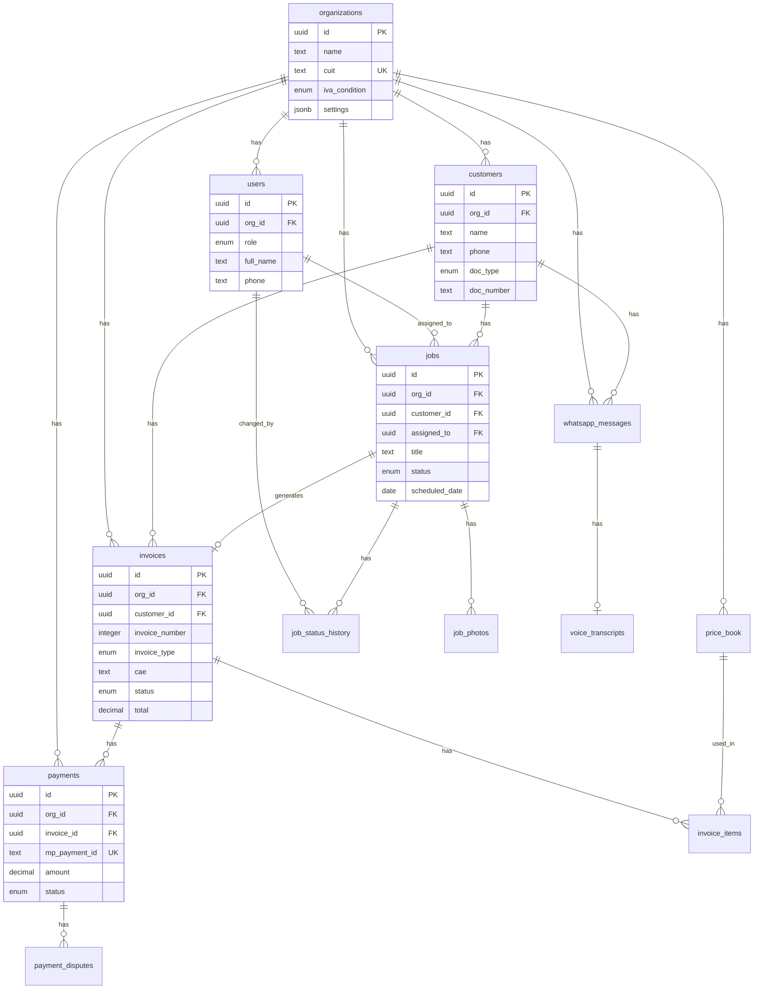

# CampoTech: Complete Database Schema
## ERD + SQL + Enums + Constraints + Indexes + Migrations

---

# TABLE OF CONTENTS

1. Database Overview
2. Multi-Tenancy Strategy
3. Entity Relationship Diagram (ERD)
4. Enum Definitions
5. Complete SQL Schema
6. Indexes Strategy
7. Row-Level Security (RLS) Policies
8. Normalization Decisions
9. Migration Order
10. Seed Data
11. Backup & Recovery

---

# 1. DATABASE OVERVIEW

## Technology Stack
- **Database:** PostgreSQL 15+ (via Supabase)
- **Extensions:** pgcrypto, uuid-ossp, pg_trgm
- **ORM:** Prisma (backend) / WatermelonDB (mobile)
- **Migrations:** Prisma Migrate + custom SQL

## Schema Statistics
| Metric | Count |
|--------|-------|
| Tables | 18 |
| Enums | 12 |
| Indexes | 45+ |
| Foreign Keys | 25+ |
| RLS Policies | 20+ |

## Naming Conventions
- Tables: `snake_case`, plural (e.g., `customers`, `invoices`)
- Columns: `snake_case` (e.g., `created_at`, `invoice_number`)
- Primary Keys: `id` (UUID)
- Foreign Keys: `{table_singular}_id` (e.g., `customer_id`, `org_id`)
- Timestamps: `created_at`, `updated_at`, `deleted_at`
- Booleans: `is_` or `has_` prefix (e.g., `is_active`, `has_whatsapp`)

---

# 2. MULTI-TENANCY STRATEGY

## Approach: Shared Database, Shared Schema with Row-Level Security

```
┌─────────────────────────────────────────────────────────────┐
│                    SINGLE DATABASE                           │
├─────────────────────────────────────────────────────────────┤
│  ┌─────────────────────────────────────────────────────┐   │
│  │              SHARED TABLES                           │   │
│  │  organizations | users | customers | jobs | ...      │   │
│  └─────────────────────────────────────────────────────┘   │
│                           │                                  │
│                           ▼                                  │
│  ┌─────────────────────────────────────────────────────┐   │
│  │           ROW-LEVEL SECURITY (RLS)                   │   │
│  │  Every query filtered by org_id automatically        │   │
│  └─────────────────────────────────────────────────────┘   │
│                           │                                  │
│          ┌────────────────┼────────────────┐                │
│          ▼                ▼                ▼                │
│     [Org A Data]    [Org B Data]    [Org C Data]           │
└─────────────────────────────────────────────────────────────┘
```

## Tenant Isolation Rules
- Every data table has `org_id` column (NOT NULL)
- RLS policies enforce `org_id = auth.jwt()->>'org_id'`
- Cross-tenant queries impossible at database level
- System tables (no `org_id`): `audit_logs`, `system_settings`

## Tenant Context
```sql
-- Set tenant context for session
SELECT set_config('app.current_org_id', 'uuid-here', true);

-- Get current tenant
SELECT current_setting('app.current_org_id', true);
```

---

# 3. ENTITY RELATIONSHIP DIAGRAM (ERD)

## Full ERD (ASCII)

```
┌─────────────────────────────────────────────────────────────────────────────────────────┐
│                                    CAMPOTECH ERD                                         │
└─────────────────────────────────────────────────────────────────────────────────────────┘

                                    ┌──────────────────┐
                                    │  organizations   │
                                    ├──────────────────┤
                                    │ PK id            │
                                    │    name          │
                                    │    cuit (UNIQUE) │
                                    │    iva_condition │
                                    │    settings      │
                                    └────────┬─────────┘
                                             │
              ┌──────────────────────────────┼──────────────────────────────┐
              │                              │                              │
              ▼                              ▼                              ▼
    ┌──────────────────┐          ┌──────────────────┐          ┌──────────────────┐
    │      users       │          │    customers     │          │    price_book    │
    ├──────────────────┤          ├──────────────────┤          ├──────────────────┤
    │ PK id            │          │ PK id            │          │ PK id            │
    │ FK org_id ───────┼──────────│ FK org_id ───────┼──────────│ FK org_id        │
    │    role          │          │    name          │          │    name          │
    │    full_name     │          │    phone (UQ*)   │          │    category      │
    │    phone         │          │    doc_type      │          │    base_price    │
    │    email         │          │    doc_number    │          │    tax_rate      │
    └────────┬─────────┘          │    iva_condition │          └──────────────────┘
             │                    │    address       │
             │                    └────────┬─────────┘
             │                             │
             │    ┌────────────────────────┘
             │    │
             ▼    ▼
    ┌──────────────────┐
    │      jobs        │
    ├──────────────────┤
    │ PK id            │
    │ FK org_id        │◄─────────────────────────────────────────────────────────────┐
    │ FK customer_id ──┼──► customers.id                                              │
    │ FK assigned_to ──┼──► users.id                                                  │
    │ FK invoice_id ───┼──► invoices.id                                               │
    │    title         │                                                              │
    │    status        │                                                              │
    │    scheduled_date│                                                              │
    └────────┬─────────┘                                                              │
             │                                                                        │
             │         ┌──────────────────┐         ┌──────────────────┐             │
             │         │ job_status_history│         │    job_photos    │             │
             │         ├──────────────────┤         ├──────────────────┤             │
             │         │ PK id            │         │ PK id            │             │
             └────────►│ FK job_id        │         │ FK job_id ───────┼─────────────┤
                       │ FK changed_by ───┼──► users│    photo_url     │             │
                       │    status        │         │    photo_type    │             │
                       └──────────────────┘         └──────────────────┘             │
                                                                                      │
    ┌──────────────────┐                                                              │
    │    invoices      │                                                              │
    ├──────────────────┤                                                              │
    │ PK id            │                                                              │
    │ FK org_id ───────┼──────────────────────────────────────────────────────────────┘
    │ FK customer_id ──┼──► customers.id
    │ FK job_id ───────┼──► jobs.id
    │    invoice_number│
    │    invoice_type  │
    │    punto_venta   │
    │    cae           │
    │    status        │
    │    total         │
    │    (UQ: org_id, punto_venta, invoice_number)
    └────────┬─────────┘
             │
             │         ┌──────────────────┐
             │         │  invoice_items   │
             │         ├──────────────────┤
             │         │ PK id            │
             └────────►│ FK invoice_id    │
                       │ FK price_book_id─┼──► price_book.id
                       │    description   │
                       │    quantity      │
                       │    unit_price    │
                       └──────────────────┘

    ┌──────────────────┐
    │    payments      │
    ├──────────────────┤
    │ PK id            │
    │ FK org_id        │
    │ FK invoice_id ───┼──► invoices.id
    │    mp_payment_id │ (UNIQUE)
    │    amount        │
    │    status        │
    │    installments  │
    └────────┬─────────┘
             │
             │         ┌──────────────────┐
             │         │ payment_disputes │
             │         ├──────────────────┤
             │         │ PK id            │
             └────────►│ FK payment_id    │
                       │    dispute_type  │
                       │    status        │
                       │    deadline      │
                       └──────────────────┘

    ┌──────────────────┐
    │whatsapp_messages │
    ├──────────────────┤
    │ PK id            │
    │ FK org_id        │
    │ FK customer_id ──┼──► customers.id
    │ FK job_id ───────┼──► jobs.id
    │    wa_message_id │ (UNIQUE)
    │    direction     │
    │    message_type  │
    │    status        │
    └────────┬─────────┘
             │
             │         ┌──────────────────┐
             │         │voice_transcripts │
             │         ├──────────────────┤
             │         │ PK id            │
             └────────►│ FK message_id    │
                       │    transcription │
                       │    extraction    │
                       │    confidence    │
                       └──────────────────┘

    ┌──────────────────┐         ┌──────────────────┐
    │   audit_logs     │         │   sync_queue     │
    ├──────────────────┤         ├──────────────────┤
    │ PK id            │         │ PK id            │
    │ FK org_id (NULL) │         │ FK org_id        │
    │ FK user_id       │         │    entity_type   │
    │    action        │         │    entity_id     │
    │    entity_type   │         │    action_type   │
    │    entity_id     │         │    status        │
    │    entry_hash    │         │    payload       │
    └──────────────────┘         └──────────────────┘

    ┌──────────────────┐         ┌──────────────────┐
    │  failed_jobs     │         │ idempotency_keys │
    ├──────────────────┤         ├──────────────────┤
    │ PK id            │         │ PK id            │
    │    queue_name    │         │    key (UNIQUE)  │
    │    job_data      │         │    result        │
    │    error         │         │    expires_at    │
    │    attempts      │         └──────────────────┘
    └──────────────────┘

Legend:
  PK = Primary Key
  FK = Foreign Key
  UQ = Unique Constraint
  UQ* = Unique within org (composite)
  ──► = Foreign Key Reference
```

## Mermaid ERD (for rendering tools)



---

# 4. ENUM DEFINITIONS

## SQL Enum Definitions

```sql
-- ============================================================================
-- ENUM DEFINITIONS
-- ============================================================================

-- Organization IVA Condition
CREATE TYPE iva_condition_enum AS ENUM (
    'responsable_inscripto',    -- Registered VAT taxpayer
    'monotributista',           -- Simplified tax regime
    'exento',                   -- VAT exempt
    'consumidor_final'          -- Final consumer (for customers only)
);

-- User Role
CREATE TYPE user_role_enum AS ENUM (
    'owner',        -- Full access, billing, danger zone
    'admin',        -- Operational access, no billing
    'dispatcher',   -- Jobs & customers, no finances
    'technician',   -- Own jobs only, mobile-focused
    'accountant'    -- Invoices & payments only
);

-- Document Type (Argentina)
CREATE TYPE doc_type_enum AS ENUM (
    'dni',      -- Documento Nacional de Identidad
    'cuit',     -- Clave Única de Identificación Tributaria
    'cuil',     -- Clave Única de Identificación Laboral
    'pasaporte' -- Passport (foreigners)
);

-- Job Status
CREATE TYPE job_status_enum AS ENUM (
    'pending',      -- Created, not scheduled
    'scheduled',    -- Assigned date/time
    'en_camino',    -- Technician traveling
    'working',      -- Technician on site
    'completed',    -- Work finished
    'cancelled'     -- Cancelled
);

-- Job Priority
CREATE TYPE job_priority_enum AS ENUM (
    'low',
    'normal',
    'high',
    'urgent'
);

-- Job Type
CREATE TYPE job_type_enum AS ENUM (
    'plomeria',
    'electricidad',
    'aire_acondicionado',
    'gas',
    'calefaccion',
    'general'
);

-- Job Source
CREATE TYPE job_source_enum AS ENUM (
    'manual',       -- Created manually in app
    'whatsapp',     -- Created from WhatsApp text
    'voice',        -- Created from voice message
    'recurring'     -- Auto-created from recurring job
);

-- Invoice Type (AFIP)
CREATE TYPE invoice_type_enum AS ENUM (
    'A',    -- Between registered IVA taxpayers
    'B',    -- To final consumers or exempt
    'C',    -- From monotributista
    'E'     -- Export (future)
);

-- Invoice Status
CREATE TYPE invoice_status_enum AS ENUM (
    'draft',        -- Not submitted to AFIP
    'pending_cae',  -- Submitted, awaiting CAE
    'issued',       -- CAE received
    'sent',         -- Sent to customer
    'paid',         -- Payment received
    'overdue',      -- Past due date
    'cancelled',    -- Cancelled (nota de crédito issued)
    'refunded'      -- Refund processed
);

-- Payment Status
CREATE TYPE payment_status_enum AS ENUM (
    'pending',      -- Awaiting payment
    'processing',   -- Payment initiated
    'approved',     -- Payment successful
    'rejected',     -- Payment failed
    'cancelled',    -- Cancelled by user
    'refunded',     -- Full refund
    'partial_refund', -- Partial refund
    'in_dispute',   -- Chargeback initiated
    'chargedback'   -- Chargeback won by customer
);

-- Payment Method
CREATE TYPE payment_method_enum AS ENUM (
    'credit_card',
    'debit_card',
    'account_money',    -- MP wallet
    'cash',
    'bank_transfer',
    'check'
);

-- WhatsApp Message Direction
CREATE TYPE message_direction_enum AS ENUM (
    'inbound',
    'outbound'
);

-- WhatsApp Message Type
CREATE TYPE message_type_enum AS ENUM (
    'text',
    'voice',
    'image',
    'document',
    'template',
    'interactive'
);

-- WhatsApp Message Status
CREATE TYPE message_status_enum AS ENUM (
    'queued',           -- In send queue
    'sent',             -- Sent to WhatsApp
    'delivered',        -- Delivered to device
    'read',             -- Read by recipient
    'failed',           -- Delivery failed
    'fallback_sms',     -- Sent via SMS instead
    'undeliverable'     -- Permanently failed
);

-- Voice Processing Status
CREATE TYPE voice_status_enum AS ENUM (
    'pending',          -- Awaiting processing
    'transcribing',     -- Whisper processing
    'extracting',       -- GPT extraction
    'completed',        -- Done
    'needs_review',     -- Low confidence
    'reviewed',         -- Human reviewed
    'failed'            -- Processing failed
);

-- Sync Status (Mobile)
CREATE TYPE sync_status_enum AS ENUM (
    'pending',
    'syncing',
    'synced',
    'conflict',
    'failed'
);

-- Audit Action
CREATE TYPE audit_action_enum AS ENUM (
    -- Auth
    'user_login',
    'user_logout',
    'user_created',
    'user_updated',
    'user_deactivated',
    'password_changed',
    'role_changed',
    -- Organization
    'org_created',
    'org_updated',
    'afip_cert_uploaded',
    'mp_connected',
    'whatsapp_connected',
    -- Customers
    'customer_created',
    'customer_updated',
    'customer_deleted',
    -- Jobs
    'job_created',
    'job_updated',
    'job_status_changed',
    'job_assigned',
    'job_completed',
    'job_cancelled',
    -- Invoices
    'invoice_created',
    'invoice_cae_requested',
    'invoice_cae_received',
    'invoice_cae_failed',
    'invoice_sent',
    'invoice_cancelled',
    -- Payments
    'payment_created',
    'payment_approved',
    'payment_rejected',
    'payment_refunded',
    'payment_disputed',
    -- WhatsApp
    'message_sent',
    'message_failed',
    'voice_processed',
    -- System
    'panic_mode_entered',
    'panic_mode_exited',
    'manual_override',
    'data_export',
    'data_delete'
);

-- Price Book Category
CREATE TYPE price_category_enum AS ENUM (
    'mano_de_obra',     -- Labor
    'materiales',       -- Materials
    'consumibles',      -- Consumables
    'viatico'           -- Travel/transport
);

-- Dispute Type
CREATE TYPE dispute_type_enum AS ENUM (
    'chargeback',
    'fraud_claim',
    'service_not_received',
    'duplicate_charge'
);

-- Dispute Status
CREATE TYPE dispute_status_enum AS ENUM (
    'pending_response',
    'evidence_submitted',
    'under_review',
    'won',
    'lost'
);

-- Photo Type
CREATE TYPE photo_type_enum AS ENUM (
    'before',
    'during',
    'after',
    'signature',
    'document'
);
```

---

# 5. COMPLETE SQL SCHEMA

## Extensions and Setup

```sql
-- ============================================================================
-- EXTENSIONS
-- ============================================================================

CREATE EXTENSION IF NOT EXISTS "uuid-ossp";      -- UUID generation
CREATE EXTENSION IF NOT EXISTS "pgcrypto";       -- Encryption functions
CREATE EXTENSION IF NOT EXISTS "pg_trgm";        -- Trigram similarity (search)

-- ============================================================================
-- HELPER FUNCTIONS
-- ============================================================================

-- Auto-update updated_at timestamp
CREATE OR REPLACE FUNCTION update_updated_at_column()
RETURNS TRIGGER AS $$
BEGIN
    NEW.updated_at = NOW();
    RETURN NEW;
END;
$$ LANGUAGE plpgsql;

-- Get current org from JWT
CREATE OR REPLACE FUNCTION auth.org_id()
RETURNS UUID AS $$
BEGIN
    RETURN COALESCE(
        current_setting('request.jwt.claims', true)::json->>'org_id',
        current_setting('app.current_org_id', true)
    )::UUID;
END;
$$ LANGUAGE plpgsql STABLE;

-- Get current user from JWT
CREATE OR REPLACE FUNCTION auth.uid()
RETURNS UUID AS $$
BEGIN
    RETURN (current_setting('request.jwt.claims', true)::json->>'sub')::UUID;
END;
$$ LANGUAGE plpgsql STABLE;
```

## Organizations Table

```sql
-- ============================================================================
-- ORGANIZATIONS
-- ============================================================================

CREATE TABLE organizations (
    -- Primary Key
    id UUID PRIMARY KEY DEFAULT uuid_generate_v4(),
    
    -- Basic Info
    name TEXT NOT NULL,
    cuit TEXT NOT NULL,
    iva_condition iva_condition_enum NOT NULL DEFAULT 'monotributista',
    
    -- Contact
    email TEXT,
    phone TEXT,
    address TEXT,
    city TEXT DEFAULT 'Buenos Aires',
    province TEXT DEFAULT 'CABA',
    
    -- AFIP Configuration (encrypted JSON)
    afip_punto_venta INTEGER,
    afip_cert JSONB,                -- EncryptedData: {ciphertext, iv, authTag, keyId}
    afip_key JSONB,                 -- EncryptedData
    afip_cert_expiry DATE,
    afip_cert_subject TEXT,
    afip_homologated BOOLEAN NOT NULL DEFAULT false,
    afip_last_invoice_a INTEGER DEFAULT 0,
    afip_last_invoice_b INTEGER DEFAULT 0,
    afip_last_invoice_c INTEGER DEFAULT 0,
    
    -- Mercado Pago (encrypted JSON)
    mp_access_token JSONB,          -- EncryptedData
    mp_refresh_token JSONB,         -- EncryptedData
    mp_token_expires_at TIMESTAMPTZ,
    mp_user_id TEXT,
    mp_connected_at TIMESTAMPTZ,
    
    -- WhatsApp
    whatsapp_phone_id TEXT,
    whatsapp_business_id TEXT,
    whatsapp_access_token JSONB,    -- EncryptedData
    whatsapp_verified BOOLEAN NOT NULL DEFAULT false,
    whatsapp_connected_at TIMESTAMPTZ,
    
    -- Settings (JSON)
    settings JSONB NOT NULL DEFAULT '{
        "ui_mode": "simple",
        "auto_invoice_on_complete": true,
        "auto_send_whatsapp": true,
        "voice_auto_create_threshold": 0.7,
        "default_payment_method": "mercadopago",
        "default_due_days": 15,
        "timezone": "America/Argentina/Buenos_Aires"
    }'::jsonb,
    
    -- Subscription
    plan TEXT NOT NULL DEFAULT 'free',
    plan_expires_at TIMESTAMPTZ,
    
    -- Timestamps
    created_at TIMESTAMPTZ NOT NULL DEFAULT NOW(),
    updated_at TIMESTAMPTZ NOT NULL DEFAULT NOW(),
    deleted_at TIMESTAMPTZ,         -- Soft delete
    
    -- Constraints
    CONSTRAINT organizations_cuit_unique UNIQUE (cuit),
    CONSTRAINT organizations_cuit_format CHECK (cuit ~ '^\d{2}-\d{8}-\d$'),
    CONSTRAINT organizations_name_not_empty CHECK (length(trim(name)) > 0)
);

-- Indexes
CREATE INDEX idx_organizations_cuit ON organizations(cuit);
CREATE INDEX idx_organizations_deleted ON organizations(deleted_at) WHERE deleted_at IS NULL;

-- Trigger
CREATE TRIGGER organizations_updated_at
    BEFORE UPDATE ON organizations
    FOR EACH ROW EXECUTE FUNCTION update_updated_at_column();
```

## Users Table

```sql
-- ============================================================================
-- USERS
-- ============================================================================

CREATE TABLE users (
    -- Primary Key (matches Supabase auth.users)
    id UUID PRIMARY KEY REFERENCES auth.users(id) ON DELETE CASCADE,
    
    -- Organization (tenant)
    org_id UUID NOT NULL REFERENCES organizations(id) ON DELETE CASCADE,
    
    -- Profile
    role user_role_enum NOT NULL DEFAULT 'technician',
    full_name TEXT NOT NULL,
    phone TEXT,
    email TEXT,
    avatar_url TEXT,
    
    -- Status
    is_active BOOLEAN NOT NULL DEFAULT true,
    
    -- Push Notifications
    push_token TEXT,
    push_enabled BOOLEAN NOT NULL DEFAULT true,
    
    -- Mobile
    last_seen_at TIMESTAMPTZ,
    last_location JSONB,            -- {lat, lng, timestamp}
    
    -- Timestamps
    created_at TIMESTAMPTZ NOT NULL DEFAULT NOW(),
    updated_at TIMESTAMPTZ NOT NULL DEFAULT NOW(),
    
    -- Constraints
    CONSTRAINT users_full_name_not_empty CHECK (length(trim(full_name)) > 0),
    CONSTRAINT users_email_format CHECK (email IS NULL OR email ~* '^[A-Za-z0-9._%+-]+@[A-Za-z0-9.-]+\.[A-Za-z]{2,}$')
);

-- Indexes
CREATE INDEX idx_users_org ON users(org_id);
CREATE INDEX idx_users_org_role ON users(org_id, role);
CREATE INDEX idx_users_org_active ON users(org_id) WHERE is_active = true;
CREATE INDEX idx_users_email ON users(email) WHERE email IS NOT NULL;

-- Trigger
CREATE TRIGGER users_updated_at
    BEFORE UPDATE ON users
    FOR EACH ROW EXECUTE FUNCTION update_updated_at_column();
```

## Customers Table

```sql
-- ============================================================================
-- CUSTOMERS
-- ============================================================================

CREATE TABLE customers (
    -- Primary Key
    id UUID PRIMARY KEY DEFAULT uuid_generate_v4(),
    
    -- Organization (tenant)
    org_id UUID NOT NULL REFERENCES organizations(id) ON DELETE CASCADE,
    
    -- Identity
    name TEXT NOT NULL,
    phone TEXT NOT NULL,
    email TEXT,
    
    -- Argentina Documents
    doc_type doc_type_enum NOT NULL DEFAULT 'dni',
    doc_number TEXT,
    iva_condition iva_condition_enum NOT NULL DEFAULT 'consumidor_final',
    
    -- Address
    address TEXT,
    address_extra TEXT,             -- Piso, Depto
    neighborhood TEXT,              -- Barrio
    city TEXT DEFAULT 'Buenos Aires',
    province TEXT DEFAULT 'CABA',
    postal_code TEXT,
    lat DECIMAL(10, 8),
    lng DECIMAL(11, 8),
    
    -- WhatsApp
    whatsapp_thread_id TEXT,
    last_message_at TIMESTAMPTZ,
    has_whatsapp BOOLEAN NOT NULL DEFAULT true,
    
    -- Meta
    notes TEXT,
    tags TEXT[] DEFAULT '{}',
    source job_source_enum NOT NULL DEFAULT 'manual',
    
    -- Timestamps
    created_at TIMESTAMPTZ NOT NULL DEFAULT NOW(),
    updated_at TIMESTAMPTZ NOT NULL DEFAULT NOW(),
    deleted_at TIMESTAMPTZ,         -- Soft delete
    
    -- Constraints
    CONSTRAINT customers_org_phone_unique UNIQUE (org_id, phone),
    CONSTRAINT customers_name_not_empty CHECK (length(trim(name)) > 0),
    CONSTRAINT customers_phone_not_empty CHECK (length(trim(phone)) > 0),
    CONSTRAINT customers_cuit_format CHECK (
        doc_type != 'cuit' OR doc_number ~ '^\d{2}-?\d{8}-?\d$'
    )
);

-- Indexes
CREATE INDEX idx_customers_org ON customers(org_id);
CREATE INDEX idx_customers_org_phone ON customers(org_id, phone);
CREATE INDEX idx_customers_org_name ON customers(org_id, name);
CREATE INDEX idx_customers_org_doc ON customers(org_id, doc_type, doc_number) 
    WHERE doc_number IS NOT NULL;
CREATE INDEX idx_customers_org_deleted ON customers(org_id) WHERE deleted_at IS NULL;
CREATE INDEX idx_customers_search ON customers USING gin(name gin_trgm_ops);

-- Trigger
CREATE TRIGGER customers_updated_at
    BEFORE UPDATE ON customers
    FOR EACH ROW EXECUTE FUNCTION update_updated_at_column();
```

## Jobs Table

```sql
-- ============================================================================
-- JOBS
-- ============================================================================

CREATE TABLE jobs (
    -- Primary Key
    id UUID PRIMARY KEY DEFAULT uuid_generate_v4(),
    
    -- Organization (tenant)
    org_id UUID NOT NULL REFERENCES organizations(id) ON DELETE CASCADE,
    
    -- Relations
    customer_id UUID REFERENCES customers(id) ON DELETE SET NULL,
    assigned_to UUID REFERENCES users(id) ON DELETE SET NULL,
    invoice_id UUID REFERENCES invoices(id) ON DELETE SET NULL,
    
    -- Job Info
    title TEXT NOT NULL,
    description TEXT,
    job_type job_type_enum DEFAULT 'general',
    priority job_priority_enum NOT NULL DEFAULT 'normal',
    
    -- Status
    status job_status_enum NOT NULL DEFAULT 'pending',
    status_changed_at TIMESTAMPTZ NOT NULL DEFAULT NOW(),
    
    -- Scheduling
    scheduled_date DATE,
    scheduled_time_start TIME,
    scheduled_time_end TIME,
    estimated_duration INTEGER,     -- Minutes
    
    -- Actual Times
    actual_start TIMESTAMPTZ,
    actual_end TIMESTAMPTZ,
    
    -- Location
    address TEXT,
    address_extra TEXT,
    neighborhood TEXT,
    lat DECIMAL(10, 8),
    lng DECIMAL(11, 8),
    
    -- Completion
    notes TEXT,
    internal_notes TEXT,
    signature_url TEXT,
    completed_by UUID REFERENCES users(id),
    
    -- Source
    source job_source_enum NOT NULL DEFAULT 'manual',
    source_message_id UUID,         -- References whatsapp_messages if from voice/text
    
    -- Mobile Offline Support
    local_id TEXT,                  -- Client-generated ID
    sync_status sync_status_enum NOT NULL DEFAULT 'synced',
    
    -- Timestamps
    created_at TIMESTAMPTZ NOT NULL DEFAULT NOW(),
    updated_at TIMESTAMPTZ NOT NULL DEFAULT NOW(),
    deleted_at TIMESTAMPTZ,         -- Soft delete
    
    -- Constraints
    CONSTRAINT jobs_title_not_empty CHECK (length(trim(title)) > 0),
    CONSTRAINT jobs_scheduled_time_valid CHECK (
        scheduled_time_end IS NULL OR 
        scheduled_time_start IS NULL OR 
        scheduled_time_end > scheduled_time_start
    ),
    CONSTRAINT jobs_duration_positive CHECK (estimated_duration IS NULL OR estimated_duration > 0)
);

-- Indexes
CREATE INDEX idx_jobs_org ON jobs(org_id);
CREATE INDEX idx_jobs_org_status ON jobs(org_id, status);
CREATE INDEX idx_jobs_org_date ON jobs(org_id, scheduled_date);
CREATE INDEX idx_jobs_assigned_date ON jobs(assigned_to, scheduled_date) 
    WHERE assigned_to IS NOT NULL;
CREATE INDEX idx_jobs_customer ON jobs(customer_id) WHERE customer_id IS NOT NULL;
CREATE INDEX idx_jobs_org_deleted ON jobs(org_id) WHERE deleted_at IS NULL;
CREATE INDEX idx_jobs_sync ON jobs(sync_status) WHERE sync_status != 'synced';

-- Trigger
CREATE TRIGGER jobs_updated_at
    BEFORE UPDATE ON jobs
    FOR EACH ROW EXECUTE FUNCTION update_updated_at_column();
```

## Job Status History Table

```sql
-- ============================================================================
-- JOB STATUS HISTORY
-- ============================================================================

CREATE TABLE job_status_history (
    -- Primary Key
    id UUID PRIMARY KEY DEFAULT uuid_generate_v4(),
    
    -- Relations
    job_id UUID NOT NULL REFERENCES jobs(id) ON DELETE CASCADE,
    changed_by UUID REFERENCES users(id) ON DELETE SET NULL,
    
    -- Status Change
    from_status job_status_enum,
    to_status job_status_enum NOT NULL,
    notes TEXT,
    
    -- Location (for mobile tracking)
    lat DECIMAL(10, 8),
    lng DECIMAL(11, 8),
    
    -- Timestamps
    created_at TIMESTAMPTZ NOT NULL DEFAULT NOW()
);

-- Indexes
CREATE INDEX idx_job_status_history_job ON job_status_history(job_id);
CREATE INDEX idx_job_status_history_job_time ON job_status_history(job_id, created_at DESC);
```

## Job Photos Table

```sql
-- ============================================================================
-- JOB PHOTOS
-- ============================================================================

CREATE TABLE job_photos (
    -- Primary Key
    id UUID PRIMARY KEY DEFAULT uuid_generate_v4(),
    
    -- Relations
    job_id UUID NOT NULL REFERENCES jobs(id) ON DELETE CASCADE,
    uploaded_by UUID REFERENCES users(id) ON DELETE SET NULL,
    
    -- Photo
    photo_url TEXT NOT NULL,
    thumbnail_url TEXT,
    photo_type photo_type_enum NOT NULL DEFAULT 'after',
    
    -- Metadata
    file_size INTEGER,              -- Bytes
    width INTEGER,
    height INTEGER,
    
    -- Mobile Sync
    local_id TEXT,
    sync_status sync_status_enum NOT NULL DEFAULT 'synced',
    
    -- Timestamps
    taken_at TIMESTAMPTZ,
    created_at TIMESTAMPTZ NOT NULL DEFAULT NOW()
);

-- Indexes
CREATE INDEX idx_job_photos_job ON job_photos(job_id);
CREATE INDEX idx_job_photos_sync ON job_photos(sync_status) WHERE sync_status != 'synced';
```

## Price Book Table

```sql
-- ============================================================================
-- PRICE BOOK
-- ============================================================================

CREATE TABLE price_book (
    -- Primary Key
    id UUID PRIMARY KEY DEFAULT uuid_generate_v4(),
    
    -- Organization (tenant)
    org_id UUID NOT NULL REFERENCES organizations(id) ON DELETE CASCADE,
    
    -- Item Info
    name TEXT NOT NULL,
    description TEXT,
    category price_category_enum NOT NULL DEFAULT 'mano_de_obra',
    service_type job_type_enum,
    sku TEXT,
    
    -- Pricing
    base_price DECIMAL(12, 2) NOT NULL,
    cost DECIMAL(12, 2),            -- For margin calculation
    tax_rate DECIMAL(5, 2) NOT NULL DEFAULT 21.00,
    includes_tax BOOLEAN NOT NULL DEFAULT false,
    
    -- Regional Pricing
    region_prices JSONB DEFAULT '{}'::jsonb,  -- {"CABA": 15000, "GBA": 12000}
    
    -- Complexity Multipliers
    complexity_multipliers JSONB DEFAULT '{"simple": 0.8, "normal": 1.0, "complex": 1.5}'::jsonb,
    
    -- AFIP Codes
    afip_product_code TEXT,
    afip_unit_code TEXT DEFAULT '7', -- Unidad
    
    -- Status
    is_active BOOLEAN NOT NULL DEFAULT true,
    sort_order INTEGER NOT NULL DEFAULT 0,
    
    -- Timestamps
    created_at TIMESTAMPTZ NOT NULL DEFAULT NOW(),
    updated_at TIMESTAMPTZ NOT NULL DEFAULT NOW(),
    
    -- Constraints
    CONSTRAINT price_book_name_not_empty CHECK (length(trim(name)) > 0),
    CONSTRAINT price_book_price_positive CHECK (base_price >= 0),
    CONSTRAINT price_book_tax_rate_valid CHECK (tax_rate >= 0 AND tax_rate <= 100)
);

-- Indexes
CREATE INDEX idx_price_book_org ON price_book(org_id);
CREATE INDEX idx_price_book_org_active ON price_book(org_id) WHERE is_active = true;
CREATE INDEX idx_price_book_org_category ON price_book(org_id, category);

-- Trigger
CREATE TRIGGER price_book_updated_at
    BEFORE UPDATE ON price_book
    FOR EACH ROW EXECUTE FUNCTION update_updated_at_column();
```

## Invoices Table

```sql
-- ============================================================================
-- INVOICES
-- ============================================================================

CREATE TABLE invoices (
    -- Primary Key
    id UUID PRIMARY KEY DEFAULT uuid_generate_v4(),
    
    -- Organization (tenant)
    org_id UUID NOT NULL REFERENCES organizations(id) ON DELETE CASCADE,
    
    -- Relations
    customer_id UUID NOT NULL REFERENCES customers(id) ON DELETE RESTRICT,
    job_id UUID REFERENCES jobs(id) ON DELETE SET NULL,
    
    -- AFIP Identification
    invoice_number INTEGER,
    invoice_type invoice_type_enum NOT NULL,
    punto_venta INTEGER NOT NULL,
    
    -- AFIP Authorization
    cae TEXT,
    cae_expiry DATE,
    qr_data TEXT,
    
    -- Amounts
    subtotal DECIMAL(12, 2) NOT NULL,
    tax_amount DECIMAL(12, 2) NOT NULL,
    total DECIMAL(12, 2) NOT NULL,
    currency TEXT NOT NULL DEFAULT 'ARS',
    
    -- Status
    status invoice_status_enum NOT NULL DEFAULT 'draft',
    
    -- AFIP Retry
    afip_error TEXT,
    afip_error_code TEXT,
    afip_attempts INTEGER NOT NULL DEFAULT 0,
    last_afip_attempt TIMESTAMPTZ,
    
    -- PDF
    pdf_url TEXT,
    pdf_hash TEXT,                  -- SHA-256 for immutability verification
    
    -- Dates
    issue_date DATE,
    due_date DATE,
    
    -- Idempotency
    idempotency_key TEXT,
    
    -- Timestamps
    created_at TIMESTAMPTZ NOT NULL DEFAULT NOW(),
    updated_at TIMESTAMPTZ NOT NULL DEFAULT NOW(),
    paid_at TIMESTAMPTZ,
    cancelled_at TIMESTAMPTZ,
    
    -- Constraints
    CONSTRAINT invoices_org_pv_number_unique UNIQUE (org_id, punto_venta, invoice_number),
    CONSTRAINT invoices_idempotency_unique UNIQUE (idempotency_key),
    CONSTRAINT invoices_amounts_positive CHECK (subtotal >= 0 AND tax_amount >= 0 AND total >= 0),
    CONSTRAINT invoices_total_correct CHECK (total = subtotal + tax_amount),
    CONSTRAINT invoices_cae_with_number CHECK (
        cae IS NULL OR invoice_number IS NOT NULL
    )
);

-- Indexes
CREATE INDEX idx_invoices_org ON invoices(org_id);
CREATE INDEX idx_invoices_org_status ON invoices(org_id, status);
CREATE INDEX idx_invoices_org_date ON invoices(org_id, issue_date DESC);
CREATE INDEX idx_invoices_customer ON invoices(customer_id);
CREATE INDEX idx_invoices_job ON invoices(job_id) WHERE job_id IS NOT NULL;
CREATE INDEX idx_invoices_pending_cae ON invoices(org_id) 
    WHERE status = 'pending_cae';
CREATE INDEX idx_invoices_overdue ON invoices(org_id, due_date) 
    WHERE status IN ('issued', 'sent') AND due_date < CURRENT_DATE;

-- Trigger
CREATE TRIGGER invoices_updated_at
    BEFORE UPDATE ON invoices
    FOR EACH ROW EXECUTE FUNCTION update_updated_at_column();
```

## Invoice Items Table

```sql
-- ============================================================================
-- INVOICE ITEMS
-- ============================================================================

CREATE TABLE invoice_items (
    -- Primary Key
    id UUID PRIMARY KEY DEFAULT uuid_generate_v4(),
    
    -- Relations
    invoice_id UUID NOT NULL REFERENCES invoices(id) ON DELETE CASCADE,
    price_book_id UUID REFERENCES price_book(id) ON DELETE SET NULL,
    
    -- Item Info
    description TEXT NOT NULL,
    quantity DECIMAL(10, 3) NOT NULL DEFAULT 1,
    unit TEXT NOT NULL DEFAULT 'unidad',
    
    -- Pricing
    unit_price DECIMAL(12, 2) NOT NULL,
    tax_rate DECIMAL(5, 2) NOT NULL DEFAULT 21.00,
    subtotal DECIMAL(12, 2) NOT NULL,
    tax_amount DECIMAL(12, 2) NOT NULL,
    total DECIMAL(12, 2) NOT NULL,
    
    -- AFIP
    afip_product_code TEXT,
    afip_unit_code TEXT DEFAULT '7',
    
    -- Sort
    sort_order INTEGER NOT NULL DEFAULT 0,
    
    -- Timestamps
    created_at TIMESTAMPTZ NOT NULL DEFAULT NOW(),
    
    -- Constraints
    CONSTRAINT invoice_items_quantity_positive CHECK (quantity > 0),
    CONSTRAINT invoice_items_price_positive CHECK (unit_price >= 0),
    CONSTRAINT invoice_items_total_correct CHECK (total = subtotal + tax_amount)
);

-- Indexes
CREATE INDEX idx_invoice_items_invoice ON invoice_items(invoice_id);
```

## Payments Table

```sql
-- ============================================================================
-- PAYMENTS
-- ============================================================================

CREATE TABLE payments (
    -- Primary Key
    id UUID PRIMARY KEY DEFAULT uuid_generate_v4(),
    
    -- Organization (tenant)
    org_id UUID NOT NULL REFERENCES organizations(id) ON DELETE CASCADE,
    
    -- Relations
    invoice_id UUID NOT NULL REFERENCES invoices(id) ON DELETE RESTRICT,
    
    -- Mercado Pago
    mp_payment_id TEXT,
    mp_preference_id TEXT,
    mp_external_reference TEXT,
    
    -- Amounts
    amount DECIMAL(12, 2) NOT NULL,
    refunded_amount DECIMAL(12, 2) NOT NULL DEFAULT 0,
    currency TEXT NOT NULL DEFAULT 'ARS',
    
    -- Installments (Cuotas)
    installments INTEGER NOT NULL DEFAULT 1,
    installment_amount DECIMAL(12, 2),
    finance_charge DECIMAL(12, 2),  -- Interest amount
    tea DECIMAL(6, 2),              -- Tasa Efectiva Anual
    cft DECIMAL(6, 2),              -- Costo Financiero Total
    
    -- Status
    status payment_status_enum NOT NULL DEFAULT 'pending',
    status_detail TEXT,
    
    -- Payment Method
    payment_method payment_method_enum,
    payment_type TEXT,              -- MP payment type
    card_last_four TEXT,
    card_brand TEXT,
    
    -- Payer
    payer_email TEXT,
    payer_identification TEXT,
    
    -- Idempotency
    webhook_idempotency_key TEXT,
    
    -- Timestamps
    created_at TIMESTAMPTZ NOT NULL DEFAULT NOW(),
    updated_at TIMESTAMPTZ NOT NULL DEFAULT NOW(),
    approved_at TIMESTAMPTZ,
    refunded_at TIMESTAMPTZ,
    
    -- Constraints
    CONSTRAINT payments_mp_payment_unique UNIQUE (mp_payment_id),
    CONSTRAINT payments_webhook_idempotency_unique UNIQUE (webhook_idempotency_key),
    CONSTRAINT payments_amount_positive CHECK (amount > 0),
    CONSTRAINT payments_refund_valid CHECK (refunded_amount >= 0 AND refunded_amount <= amount),
    CONSTRAINT payments_installments_positive CHECK (installments > 0)
);

-- Indexes
CREATE INDEX idx_payments_org ON payments(org_id);
CREATE INDEX idx_payments_org_status ON payments(org_id, status);
CREATE INDEX idx_payments_invoice ON payments(invoice_id);
CREATE INDEX idx_payments_mp_payment ON payments(mp_payment_id) WHERE mp_payment_id IS NOT NULL;
CREATE INDEX idx_payments_pending ON payments(org_id) WHERE status = 'pending';

-- Trigger
CREATE TRIGGER payments_updated_at
    BEFORE UPDATE ON payments
    FOR EACH ROW EXECUTE FUNCTION update_updated_at_column();
```

## Payment Disputes Table

```sql
-- ============================================================================
-- PAYMENT DISPUTES
-- ============================================================================

CREATE TABLE payment_disputes (
    -- Primary Key
    id UUID PRIMARY KEY DEFAULT uuid_generate_v4(),
    
    -- Relations
    payment_id UUID NOT NULL REFERENCES payments(id) ON DELETE CASCADE,
    
    -- Dispute Info
    mp_dispute_id TEXT,
    dispute_type dispute_type_enum NOT NULL,
    reason TEXT,
    
    -- Status
    status dispute_status_enum NOT NULL DEFAULT 'pending_response',
    
    -- Deadline
    response_deadline TIMESTAMPTZ,
    
    -- Evidence
    evidence_submitted_at TIMESTAMPTZ,
    evidence_urls TEXT[],
    evidence_notes TEXT,
    
    -- Resolution
    resolved_at TIMESTAMPTZ,
    resolution_notes TEXT,
    
    -- Amounts
    disputed_amount DECIMAL(12, 2) NOT NULL,
    recovered_amount DECIMAL(12, 2),
    
    -- Timestamps
    created_at TIMESTAMPTZ NOT NULL DEFAULT NOW(),
    updated_at TIMESTAMPTZ NOT NULL DEFAULT NOW()
);

-- Indexes
CREATE INDEX idx_payment_disputes_payment ON payment_disputes(payment_id);
CREATE INDEX idx_payment_disputes_deadline ON payment_disputes(response_deadline) 
    WHERE status = 'pending_response';

-- Trigger
CREATE TRIGGER payment_disputes_updated_at
    BEFORE UPDATE ON payment_disputes
    FOR EACH ROW EXECUTE FUNCTION update_updated_at_column();
```

## WhatsApp Messages Table

```sql
-- ============================================================================
-- WHATSAPP MESSAGES
-- ============================================================================

CREATE TABLE whatsapp_messages (
    -- Primary Key
    id UUID PRIMARY KEY DEFAULT uuid_generate_v4(),
    
    -- Organization (tenant)
    org_id UUID NOT NULL REFERENCES organizations(id) ON DELETE CASCADE,
    
    -- Relations
    customer_id UUID REFERENCES customers(id) ON DELETE SET NULL,
    job_id UUID REFERENCES jobs(id) ON DELETE SET NULL,
    
    -- WhatsApp IDs
    wa_message_id TEXT,
    wa_conversation_id TEXT,
    
    -- Direction
    direction message_direction_enum NOT NULL,
    
    -- Content
    message_type message_type_enum NOT NULL,
    content TEXT,
    media_url TEXT,
    media_mime_type TEXT,
    media_size INTEGER,             -- Bytes
    
    -- Template (outbound)
    template_name TEXT,
    template_params JSONB,
    
    -- Voice (inbound)
    voice_duration INTEGER,         -- Seconds
    
    -- Status
    status message_status_enum NOT NULL DEFAULT 'queued',
    error_code TEXT,
    error_message TEXT,
    
    -- Retry
    retry_count INTEGER NOT NULL DEFAULT 0,
    next_retry_at TIMESTAMPTZ,
    
    -- Idempotency
    idempotency_key TEXT,
    
    -- WhatsApp Timestamps
    wa_timestamp TIMESTAMPTZ,
    
    -- Timestamps
    created_at TIMESTAMPTZ NOT NULL DEFAULT NOW(),
    updated_at TIMESTAMPTZ NOT NULL DEFAULT NOW(),
    delivered_at TIMESTAMPTZ,
    read_at TIMESTAMPTZ,
    
    -- Constraints
    CONSTRAINT whatsapp_messages_wa_id_unique UNIQUE (wa_message_id),
    CONSTRAINT whatsapp_messages_idempotency_unique UNIQUE (idempotency_key)
);

-- Indexes
CREATE INDEX idx_whatsapp_messages_org ON whatsapp_messages(org_id);
CREATE INDEX idx_whatsapp_messages_customer ON whatsapp_messages(customer_id) 
    WHERE customer_id IS NOT NULL;
CREATE INDEX idx_whatsapp_messages_org_customer_time ON whatsapp_messages(org_id, customer_id, created_at DESC);
CREATE INDEX idx_whatsapp_messages_job ON whatsapp_messages(job_id) WHERE job_id IS NOT NULL;
CREATE INDEX idx_whatsapp_messages_wa_id ON whatsapp_messages(wa_message_id) 
    WHERE wa_message_id IS NOT NULL;
CREATE INDEX idx_whatsapp_messages_pending ON whatsapp_messages(org_id) 
    WHERE status IN ('queued', 'sent');
CREATE INDEX idx_whatsapp_messages_retry ON whatsapp_messages(next_retry_at) 
    WHERE status = 'failed' AND retry_count < 3;

-- Trigger
CREATE TRIGGER whatsapp_messages_updated_at
    BEFORE UPDATE ON whatsapp_messages
    FOR EACH ROW EXECUTE FUNCTION update_updated_at_column();
```

## Voice Transcripts Table

```sql
-- ============================================================================
-- VOICE TRANSCRIPTS
-- ============================================================================

CREATE TABLE voice_transcripts (
    -- Primary Key
    id UUID PRIMARY KEY DEFAULT uuid_generate_v4(),
    
    -- Relations
    message_id UUID NOT NULL REFERENCES whatsapp_messages(id) ON DELETE CASCADE,
    reviewed_by UUID REFERENCES users(id) ON DELETE SET NULL,
    
    -- Audio Info
    audio_url TEXT NOT NULL,
    audio_duration INTEGER,         -- Seconds
    audio_quality TEXT,             -- 'clean', 'noisy', 'poor'
    
    -- Transcription
    transcription TEXT,
    transcription_model TEXT,       -- e.g., 'whisper-1'
    transcription_confidence DECIMAL(3, 2),
    
    -- Extraction
    extraction_data JSONB,          -- Structured extraction result
    extraction_model TEXT,          -- e.g., 'gpt-4o'
    overall_confidence DECIMAL(3, 2),
    
    -- Human Review
    human_transcription TEXT,
    human_extraction JSONB,
    reviewed_at TIMESTAMPTZ,
    
    -- Status
    status voice_status_enum NOT NULL DEFAULT 'pending',
    error_message TEXT,
    
    -- Processing
    processing_started_at TIMESTAMPTZ,
    processing_completed_at TIMESTAMPTZ,
    processing_duration_ms INTEGER,
    
    -- Created Job
    created_job_id UUID REFERENCES jobs(id) ON DELETE SET NULL,
    auto_created BOOLEAN NOT NULL DEFAULT false,
    
    -- Timestamps
    created_at TIMESTAMPTZ NOT NULL DEFAULT NOW(),
    updated_at TIMESTAMPTZ NOT NULL DEFAULT NOW()
);

-- Indexes
CREATE INDEX idx_voice_transcripts_message ON voice_transcripts(message_id);
CREATE INDEX idx_voice_transcripts_status ON voice_transcripts(status);
CREATE INDEX idx_voice_transcripts_review ON voice_transcripts(status) 
    WHERE status = 'needs_review';

-- Trigger
CREATE TRIGGER voice_transcripts_updated_at
    BEFORE UPDATE ON voice_transcripts
    FOR EACH ROW EXECUTE FUNCTION update_updated_at_column();
```

## Audit Logs Table

```sql
-- ============================================================================
-- AUDIT LOGS
-- ============================================================================

CREATE TABLE audit_logs (
    -- Primary Key
    id UUID PRIMARY KEY DEFAULT uuid_generate_v4(),
    
    -- Context (org_id can be NULL for system events)
    org_id UUID REFERENCES organizations(id) ON DELETE SET NULL,
    user_id UUID REFERENCES users(id) ON DELETE SET NULL,
    
    -- Event
    action audit_action_enum NOT NULL,
    entity_type TEXT NOT NULL,
    entity_id UUID,
    
    -- Data
    old_data JSONB,
    new_data JSONB,
    metadata JSONB,                 -- IP, user agent, etc.
    
    -- Integrity Chain
    previous_hash TEXT,
    entry_hash TEXT NOT NULL,
    
    -- Timestamps
    created_at TIMESTAMPTZ NOT NULL DEFAULT NOW(),
    
    -- Note: No updated_at - audit logs are immutable
    
    -- Constraints (entry_hash computed from content + previous_hash)
    CONSTRAINT audit_logs_hash_not_empty CHECK (length(entry_hash) = 64)
);

-- Indexes
CREATE INDEX idx_audit_logs_org ON audit_logs(org_id) WHERE org_id IS NOT NULL;
CREATE INDEX idx_audit_logs_entity ON audit_logs(entity_type, entity_id);
CREATE INDEX idx_audit_logs_user ON audit_logs(user_id) WHERE user_id IS NOT NULL;
CREATE INDEX idx_audit_logs_action ON audit_logs(action);
CREATE INDEX idx_audit_logs_time ON audit_logs(created_at DESC);
CREATE INDEX idx_audit_logs_org_time ON audit_logs(org_id, created_at DESC);
```

## Sync Queue Table (Mobile Offline)

```sql
-- ============================================================================
-- SYNC QUEUE (Mobile Offline Support)
-- ============================================================================

CREATE TABLE sync_queue (
    -- Primary Key
    id UUID PRIMARY KEY DEFAULT uuid_generate_v4(),
    
    -- Organization (tenant)
    org_id UUID NOT NULL REFERENCES organizations(id) ON DELETE CASCADE,
    
    -- User who created the change
    user_id UUID NOT NULL REFERENCES users(id) ON DELETE CASCADE,
    
    -- Entity
    entity_type TEXT NOT NULL,      -- 'job', 'photo', 'signature'
    entity_id UUID NOT NULL,
    local_id TEXT,                  -- Client-generated ID
    
    -- Action
    action_type TEXT NOT NULL,      -- 'create', 'update', 'delete'
    payload JSONB NOT NULL,
    
    -- Status
    status sync_status_enum NOT NULL DEFAULT 'pending',
    error_message TEXT,
    retry_count INTEGER NOT NULL DEFAULT 0,
    
    -- Timestamps
    created_at TIMESTAMPTZ NOT NULL DEFAULT NOW(),
    processed_at TIMESTAMPTZ,
    
    -- Constraints
    CONSTRAINT sync_queue_retry_limit CHECK (retry_count <= 5)
);

-- Indexes
CREATE INDEX idx_sync_queue_org_status ON sync_queue(org_id, status);
CREATE INDEX idx_sync_queue_user_status ON sync_queue(user_id, status);
CREATE INDEX idx_sync_queue_pending ON sync_queue(created_at) 
    WHERE status = 'pending';
```

## Failed Jobs Table (DLQ)

```sql
-- ============================================================================
-- FAILED JOBS (Dead Letter Queue)
-- ============================================================================

CREATE TABLE failed_jobs (
    -- Primary Key
    id UUID PRIMARY KEY DEFAULT uuid_generate_v4(),
    
    -- Queue Info
    queue_name TEXT NOT NULL,
    job_id TEXT NOT NULL,           -- Original queue job ID
    
    -- Job Data
    job_data JSONB NOT NULL,
    
    -- Error
    error_message TEXT NOT NULL,
    error_stack TEXT,
    error_code TEXT,
    
    -- Attempts
    attempts INTEGER NOT NULL DEFAULT 1,
    max_attempts INTEGER NOT NULL,
    
    -- Context
    org_id UUID REFERENCES organizations(id) ON DELETE SET NULL,
    
    -- Status
    status TEXT NOT NULL DEFAULT 'pending', -- 'pending', 'retried', 'discarded', 'resolved'
    resolved_by UUID REFERENCES users(id),
    resolved_at TIMESTAMPTZ,
    resolution_notes TEXT,
    
    -- Timestamps
    failed_at TIMESTAMPTZ NOT NULL DEFAULT NOW(),
    created_at TIMESTAMPTZ NOT NULL DEFAULT NOW()
);

-- Indexes
CREATE INDEX idx_failed_jobs_queue ON failed_jobs(queue_name);
CREATE INDEX idx_failed_jobs_org ON failed_jobs(org_id) WHERE org_id IS NOT NULL;
CREATE INDEX idx_failed_jobs_pending ON failed_jobs(failed_at) WHERE status = 'pending';
```

## Idempotency Keys Table

```sql
-- ============================================================================
-- IDEMPOTENCY KEYS
-- ============================================================================

CREATE TABLE idempotency_keys (
    -- Primary Key
    id UUID PRIMARY KEY DEFAULT uuid_generate_v4(),
    
    -- Key
    key TEXT NOT NULL,
    
    -- Result
    result JSONB,
    status TEXT NOT NULL DEFAULT 'processing', -- 'processing', 'completed', 'failed'
    
    -- Context
    org_id UUID REFERENCES organizations(id) ON DELETE CASCADE,
    
    -- Expiration
    expires_at TIMESTAMPTZ NOT NULL,
    
    -- Timestamps
    created_at TIMESTAMPTZ NOT NULL DEFAULT NOW(),
    completed_at TIMESTAMPTZ,
    
    -- Constraints
    CONSTRAINT idempotency_keys_key_unique UNIQUE (key)
);

-- Indexes
CREATE INDEX idx_idempotency_keys_key ON idempotency_keys(key);
CREATE INDEX idx_idempotency_keys_expires ON idempotency_keys(expires_at);

-- Auto-cleanup expired keys
CREATE OR REPLACE FUNCTION cleanup_expired_idempotency_keys()
RETURNS void AS $$
BEGIN
    DELETE FROM idempotency_keys WHERE expires_at < NOW();
END;
$$ LANGUAGE plpgsql;
```

---

# 6. INDEXES STRATEGY

## Index Categories

### Primary Access Patterns
```sql
-- Tenant isolation (most critical)
CREATE INDEX idx_{table}_org ON {table}(org_id);

-- Status filtering (common queries)
CREATE INDEX idx_{table}_org_status ON {table}(org_id, status);

-- Date-based queries
CREATE INDEX idx_{table}_org_date ON {table}(org_id, {date_column} DESC);
```

### Foreign Key Indexes
```sql
-- Always index FK columns for join performance
CREATE INDEX idx_jobs_customer ON jobs(customer_id);
CREATE INDEX idx_jobs_assigned ON jobs(assigned_to);
CREATE INDEX idx_invoices_customer ON invoices(customer_id);
CREATE INDEX idx_payments_invoice ON payments(invoice_id);
```

### Partial Indexes (Filtered)
```sql
-- Only index relevant rows
CREATE INDEX idx_jobs_pending ON jobs(org_id) 
    WHERE status IN ('pending', 'scheduled');

CREATE INDEX idx_invoices_unpaid ON invoices(org_id, due_date) 
    WHERE status IN ('issued', 'sent', 'overdue');

CREATE INDEX idx_sync_pending ON sync_queue(created_at) 
    WHERE status = 'pending';
```

### Full-Text Search
```sql
-- Trigram index for fuzzy search
CREATE INDEX idx_customers_search ON customers USING gin(name gin_trgm_ops);

-- Combined search index
CREATE INDEX idx_customers_phone_search ON customers USING gin(phone gin_trgm_ops);
```

### Composite Indexes
```sql
-- Multi-column for common query patterns
CREATE INDEX idx_jobs_assigned_date ON jobs(assigned_to, scheduled_date);
CREATE INDEX idx_messages_customer_time ON whatsapp_messages(org_id, customer_id, created_at DESC);
```

## Index Summary by Table

| Table | Index Count | Types |
|-------|-------------|-------|
| organizations | 2 | B-tree, partial |
| users | 4 | B-tree, partial |
| customers | 6 | B-tree, GIN (trigram), partial |
| jobs | 7 | B-tree, partial |
| invoices | 7 | B-tree, partial |
| payments | 5 | B-tree, partial |
| whatsapp_messages | 7 | B-tree, partial |
| audit_logs | 5 | B-tree |

---

# 7. ROW-LEVEL SECURITY (RLS) POLICIES

## Enable RLS

```sql
-- Enable RLS on all tenant tables
ALTER TABLE organizations ENABLE ROW LEVEL SECURITY;
ALTER TABLE users ENABLE ROW LEVEL SECURITY;
ALTER TABLE customers ENABLE ROW LEVEL SECURITY;
ALTER TABLE jobs ENABLE ROW LEVEL SECURITY;
ALTER TABLE job_status_history ENABLE ROW LEVEL SECURITY;
ALTER TABLE job_photos ENABLE ROW LEVEL SECURITY;
ALTER TABLE price_book ENABLE ROW LEVEL SECURITY;
ALTER TABLE invoices ENABLE ROW LEVEL SECURITY;
ALTER TABLE invoice_items ENABLE ROW LEVEL SECURITY;
ALTER TABLE payments ENABLE ROW LEVEL SECURITY;
ALTER TABLE payment_disputes ENABLE ROW LEVEL SECURITY;
ALTER TABLE whatsapp_messages ENABLE ROW LEVEL SECURITY;
ALTER TABLE voice_transcripts ENABLE ROW LEVEL SECURITY;
ALTER TABLE sync_queue ENABLE ROW LEVEL SECURITY;
```

## Organization Policies

```sql
-- Users can only see their own organization
CREATE POLICY org_isolation ON organizations
    FOR ALL
    USING (id = auth.org_id());
```

## User Policies

```sql
-- Users can see all users in their org
CREATE POLICY users_org_isolation ON users
    FOR SELECT
    USING (org_id = auth.org_id());

-- Only owners can modify users
CREATE POLICY users_owner_modify ON users
    FOR ALL
    USING (
        org_id = auth.org_id() AND
        EXISTS (
            SELECT 1 FROM users u 
            WHERE u.id = auth.uid() AND u.role = 'owner'
        )
    );
```

## Job Policies

```sql
-- All org users can see jobs
CREATE POLICY jobs_org_select ON jobs
    FOR SELECT
    USING (org_id = auth.org_id());

-- Technicians can only see their assigned jobs
CREATE POLICY jobs_technician_select ON jobs
    FOR SELECT
    USING (
        org_id = auth.org_id() AND
        (
            -- Non-technicians see all
            EXISTS (
                SELECT 1 FROM users u 
                WHERE u.id = auth.uid() AND u.role != 'technician'
            )
            OR
            -- Technicians see only assigned
            assigned_to = auth.uid()
        )
    );

-- Technicians can only update their own jobs
CREATE POLICY jobs_technician_update ON jobs
    FOR UPDATE
    USING (
        org_id = auth.org_id() AND
        (
            EXISTS (
                SELECT 1 FROM users u 
                WHERE u.id = auth.uid() AND u.role IN ('owner', 'admin', 'dispatcher')
            )
            OR
            assigned_to = auth.uid()
        )
    );
```

## Invoice Policies

```sql
-- Only owner, admin, accountant can see invoices
CREATE POLICY invoices_role_select ON invoices
    FOR SELECT
    USING (
        org_id = auth.org_id() AND
        EXISTS (
            SELECT 1 FROM users u 
            WHERE u.id = auth.uid() 
            AND u.role IN ('owner', 'admin', 'accountant')
        )
    );

-- Only owner, admin, accountant can create/update invoices
CREATE POLICY invoices_role_modify ON invoices
    FOR ALL
    USING (
        org_id = auth.org_id() AND
        EXISTS (
            SELECT 1 FROM users u 
            WHERE u.id = auth.uid() 
            AND u.role IN ('owner', 'admin', 'accountant')
        )
    );
```

## Service Account Bypass

```sql
-- Service account bypasses RLS (for background jobs)
CREATE POLICY service_account_bypass ON jobs
    FOR ALL
    USING (
        current_setting('app.service_account', true) = 'true'
    );
```

---

# 8. NORMALIZATION DECISIONS

## Normalization Level: 3NF with Practical Denormalization

### Normalized (3NF)
- **Organizations → Users:** Separate tables, FK relationship
- **Customers → Jobs:** Separate tables, FK relationship
- **Invoices → Invoice Items:** Separate tables, FK relationship
- **Jobs → Photos:** Separate tables (avoid array column)

### Denormalized (Performance)
```sql
-- Denormalized: Customer address duplicated in Jobs
-- Reason: Historical accuracy (customer may move)
jobs.address, jobs.lat, jobs.lng

-- Denormalized: Invoice totals stored
-- Reason: Performance, immutability after AFIP submission
invoices.subtotal, invoices.tax_amount, invoices.total

-- Denormalized: Settings as JSONB
-- Reason: Flexible schema, infrequent changes
organizations.settings
```

### JSONB Usage
| Table | Column | Reason |
|-------|--------|--------|
| organizations | settings | Flexible configuration |
| organizations | afip_cert | Encrypted blob |
| price_book | region_prices | Variable regions |
| voice_transcripts | extraction_data | Complex nested structure |
| audit_logs | old_data, new_data | Arbitrary entity snapshots |

### Array Usage
| Table | Column | Reason |
|-------|--------|--------|
| customers | tags | Simple list, searchable |
| payment_disputes | evidence_urls | Simple URL list |

---

# 9. MIGRATION ORDER

## Migration Sequence

```
Migration Order (respect foreign key dependencies):

Phase 1: Foundation
  001_extensions.sql           -- Enable extensions
  002_helper_functions.sql     -- Create helper functions
  003_enums.sql                -- Create all enums

Phase 2: Core Tables (no FK dependencies)
  010_organizations.sql        -- Organizations table
  
Phase 3: User Tables
  020_users.sql                -- Users (depends on organizations)

Phase 4: Customer Tables
  030_customers.sql            -- Customers (depends on organizations)

Phase 5: Catalog Tables
  040_price_book.sql           -- Price book (depends on organizations)

Phase 6: Transaction Tables
  050_jobs.sql                 -- Jobs (depends on organizations, customers, users)
  051_job_status_history.sql   -- Job history (depends on jobs, users)
  052_job_photos.sql           -- Job photos (depends on jobs, users)
  
  060_invoices.sql             -- Invoices (depends on organizations, customers, jobs)
  061_invoice_items.sql        -- Invoice items (depends on invoices, price_book)
  
  070_payments.sql             -- Payments (depends on organizations, invoices)
  071_payment_disputes.sql     -- Disputes (depends on payments)

Phase 7: Communication Tables
  080_whatsapp_messages.sql    -- Messages (depends on organizations, customers, jobs)
  081_voice_transcripts.sql    -- Voice (depends on messages, users, jobs)

Phase 8: System Tables
  090_audit_logs.sql           -- Audit logs
  091_sync_queue.sql           -- Mobile sync
  092_failed_jobs.sql          -- DLQ
  093_idempotency_keys.sql     -- Idempotency

Phase 9: Indexes
  100_indexes.sql              -- All indexes

Phase 10: RLS Policies
  110_rls_policies.sql         -- All RLS policies

Phase 11: Triggers
  120_triggers.sql             -- All triggers
```

## Rollback Strategy

```sql
-- Each migration has a corresponding down migration
-- Example: 050_jobs.sql → 050_jobs_down.sql

-- Down migration for jobs
DROP TABLE IF EXISTS job_photos CASCADE;
DROP TABLE IF EXISTS job_status_history CASCADE;
DROP TABLE IF EXISTS jobs CASCADE;
```

## Migration Commands

```bash
# Run migrations
npx prisma migrate deploy

# Create new migration
npx prisma migrate dev --name add_feature

# Reset database (development only)
npx prisma migrate reset

# Check migration status
npx prisma migrate status
```

---

# 10. SEED DATA

## Development Seed

```sql
-- ============================================================================
-- SEED DATA (Development/Testing)
-- ============================================================================

-- Test Organization
INSERT INTO organizations (id, name, cuit, iva_condition) VALUES
('11111111-1111-1111-1111-111111111111', 'Plomería González', '20-12345678-9', 'monotributista');

-- Test Users
INSERT INTO users (id, org_id, role, full_name, phone, email) VALUES
('22222222-2222-2222-2222-222222222222', '11111111-1111-1111-1111-111111111111', 'owner', 'Juan González', '+5491112345678', 'juan@test.com'),
('33333333-3333-3333-3333-333333333333', '11111111-1111-1111-1111-111111111111', 'technician', 'Pedro Técnico', '+5491187654321', 'pedro@test.com');

-- Test Customers
INSERT INTO customers (id, org_id, name, phone, doc_type, doc_number, address, neighborhood) VALUES
('44444444-4444-4444-4444-444444444444', '11111111-1111-1111-1111-111111111111', 'María López', '+5491155555555', 'dni', '30123456', 'Av. Corrientes 1234', 'Palermo'),
('55555555-5555-5555-5555-555555555555', '11111111-1111-1111-1111-111111111111', 'Carlos Empresa SRL', '+5491166666666', 'cuit', '30-71234567-8', 'Av. Libertador 5678', 'Belgrano');

-- Test Price Book
INSERT INTO price_book (id, org_id, name, category, base_price, tax_rate) VALUES
('66666666-6666-6666-6666-666666666666', '11111111-1111-1111-1111-111111111111', 'Visita técnica', 'mano_de_obra', 5000.00, 21.00),
('77777777-7777-7777-7777-777777777777', '11111111-1111-1111-1111-111111111111', 'Destape de cañería', 'mano_de_obra', 8000.00, 21.00),
('88888888-8888-8888-8888-888888888888', '11111111-1111-1111-1111-111111111111', 'Canilla standard', 'materiales', 3500.00, 21.00);

-- Test Job
INSERT INTO jobs (id, org_id, customer_id, assigned_to, title, description, job_type, status, scheduled_date, address, neighborhood) VALUES
('99999999-9999-9999-9999-999999999999', '11111111-1111-1111-1111-111111111111', '44444444-4444-4444-4444-444444444444', '33333333-3333-3333-3333-333333333333', 'Pérdida en baño', 'Canilla que gotea en el baño principal', 'plomeria', 'scheduled', CURRENT_DATE + 1, 'Av. Corrientes 1234', 'Palermo');
```

---

# 11. BACKUP & RECOVERY

## Backup Strategy

```
Backup Schedule:
├── Real-time: WAL streaming to secondary region
├── Hourly: Incremental backup
├── Daily: Full backup (retained 30 days)
├── Weekly: Full backup (retained 12 weeks)
└── Monthly: Full backup to cold storage (retained 10 years)

Storage:
├── Hot: Primary Supabase region
├── Warm: S3 Standard (30 days)
└── Cold: S3 Glacier Deep Archive (10 years for AFIP compliance)
```

## Point-in-Time Recovery

```sql
-- Supabase supports PITR
-- Recovery point: Any point in last 7 days (Pro plan)

-- To restore:
-- 1. Go to Supabase Dashboard > Database > Backups
-- 2. Select point in time
-- 3. Restore to new project or overwrite
```

## Disaster Recovery

```
RPO (Recovery Point Objective): < 1 hour
RTO (Recovery Time Objective): < 4 hours

Procedure:
1. Detect failure (automated monitoring)
2. Spin up new database from latest backup
3. Apply WAL logs to minimize data loss
4. Update connection strings
5. Verify data integrity
6. Resume operations
```

---

# DOCUMENT METADATA

```
Version: 1.0
Created: December 2025
Tables: 18
Enums: 12
Indexes: 45+
RLS Policies: 20+
Migration Count: ~25

Database: PostgreSQL 15+
Platform: Supabase
ORM: Prisma

Compliant With:
- AFIP 10-year retention requirement
- Argentine data protection laws
- Multi-tenant isolation standards
```

---

*This document is the authoritative database schema reference for CampoTech.*
*All database changes must be reflected here.*
