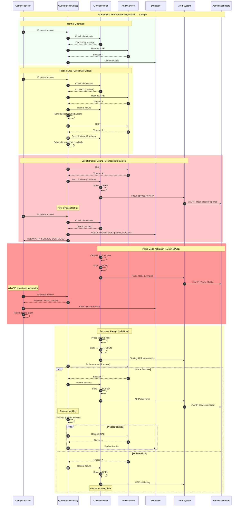
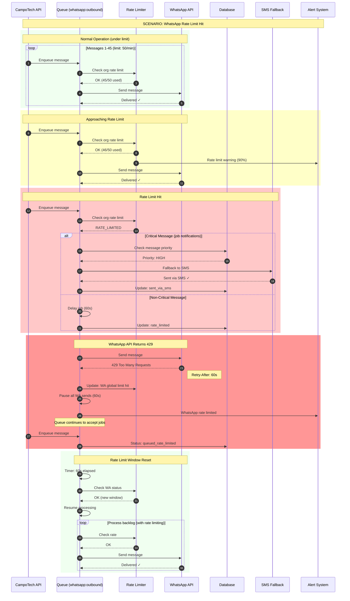
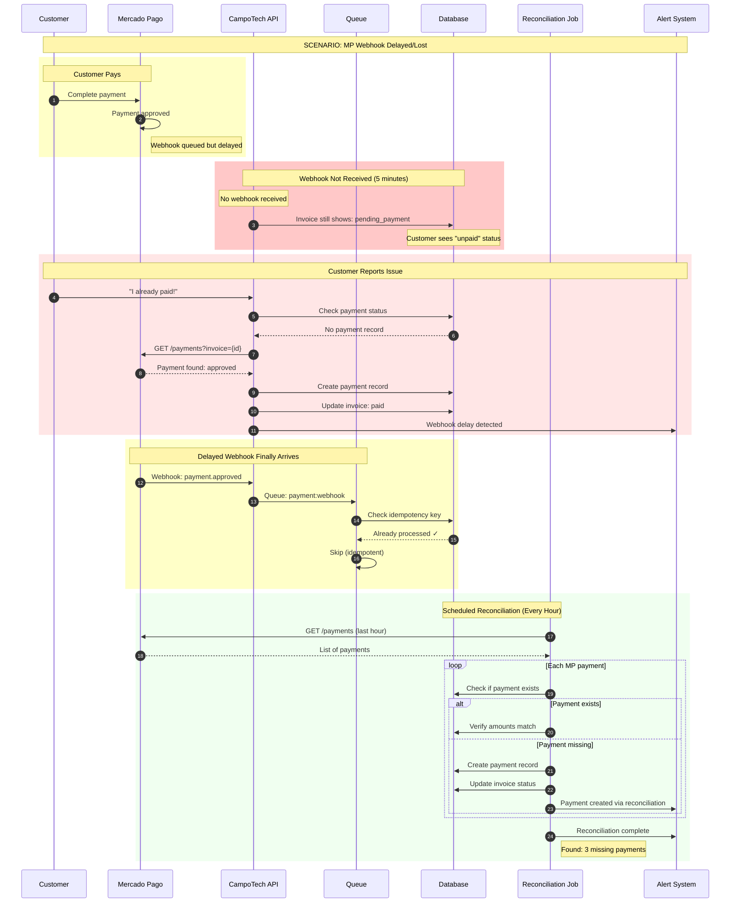
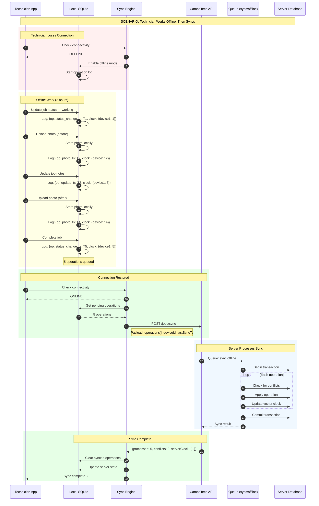
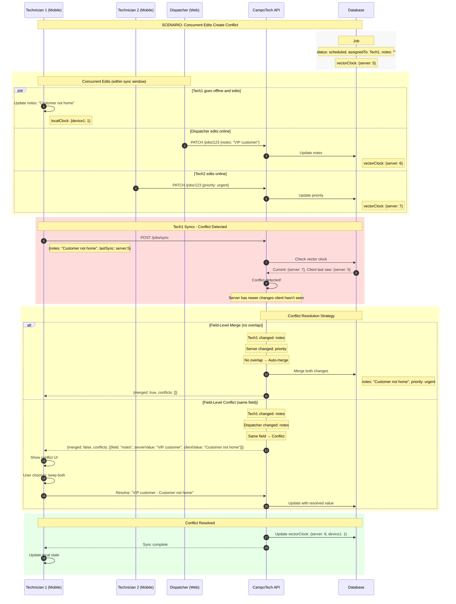
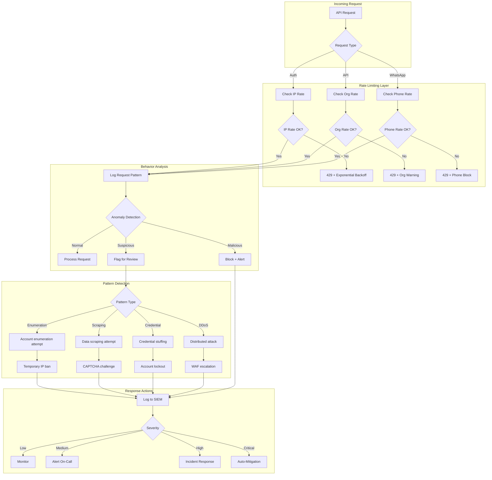
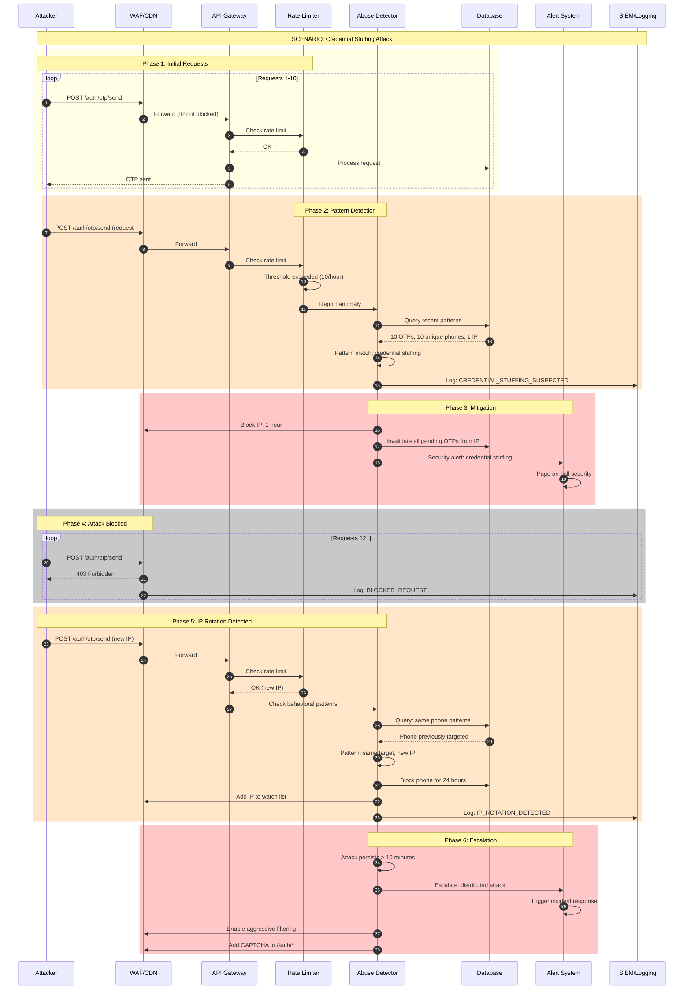
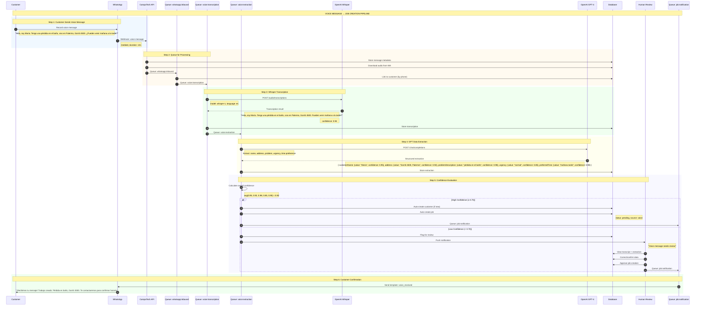
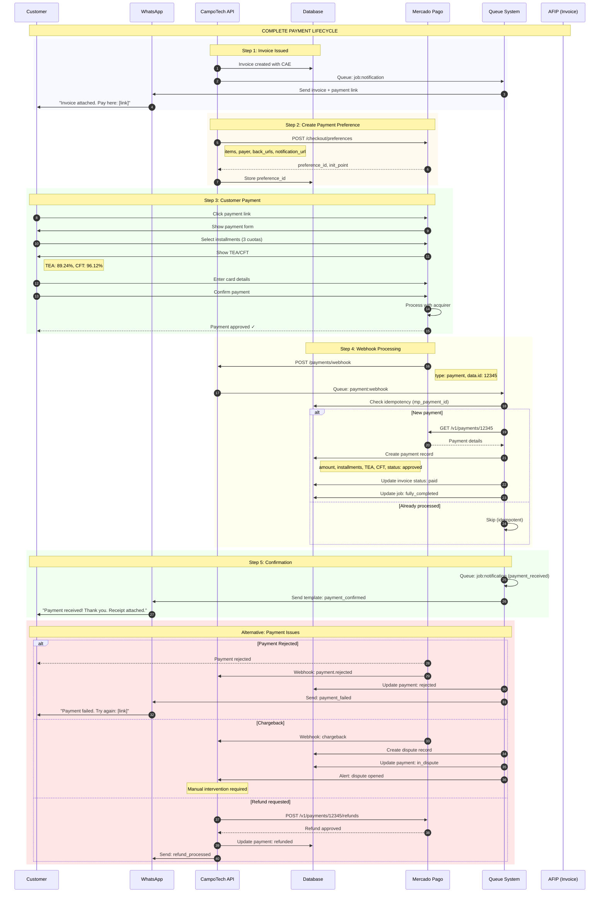

# CampoTech Master End-to-End Flow Diagrams

> Complete sequence diagrams and decision flows connecting all system modules.

---

## Table of Contents

1. [Flow A: Complete Customer Journey](#flow-a-complete-customer-journey)
2. [Flow B: External Failure Cascade](#flow-b-external-failure-cascade)
3. [Flow C: Offline Technician Sync](#flow-c-offline-technician-sync)
4. [Flow D: Abuse Detection](#flow-d-abuse-detection)
5. [Flow E: Voice AI Pipeline](#flow-e-voice-ai-pipeline)
6. [Flow F: Payment Lifecycle](#flow-f-payment-lifecycle)

---

## Flow A: Complete Customer Journey

### A.1 High-Level Overview

```
┌─────────────────────────────────────────────────────────────────────────────┐
│                        COMPLETE CUSTOMER JOURNEY                            │
├─────────────────────────────────────────────────────────────────────────────┤
│                                                                             │
│  ┌──────────┐    ┌──────────┐    ┌──────────┐    ┌──────────┐             │
│  │ INTAKE   │───▶│ SCHEDULE │───▶│ EXECUTE  │───▶│ INVOICE  │             │
│  │          │    │          │    │          │    │          │             │
│  │ WhatsApp │    │ Dispatch │    │ Technician│   │ AFIP CAE │             │
│  │ Voice    │    │ Calendar │    │ Mobile   │    │ PDF Gen  │             │
│  │ Manual   │    │ Assign   │    │ Photos   │    │          │             │
│  └──────────┘    └──────────┘    └──────────┘    └──────────┘             │
│       │                                               │                    │
│       │              ┌──────────┐    ┌──────────┐    │                    │
│       │              │ PAYMENT  │◀───│ NOTIFY   │◀───┘                    │
│       │              │          │    │          │                         │
│       │              │ MP Link  │    │ WhatsApp │                         │
│       │              │ Webhook  │    │ Invoice  │                         │
│       │              │ Reconcile│    │ Payment  │                         │
│       │              └──────────┘    └──────────┘                         │
│       │                   │                                               │
│       │                   ▼                                               │
│       │              ┌──────────┐                                         │
│       └─────────────▶│ COMPLETE │                                         │
│                      │          │                                         │
│                      │ Analytics│                                         │
│                      │ History  │                                         │
│                      └──────────┘                                         │
│                                                                             │
└─────────────────────────────────────────────────────────────────────────────┘
```

### A.2 Detailed Sequence Diagram

```mermaid
sequenceDiagram
    autonumber
    
    participant C as Customer
    participant WA as WhatsApp API
    participant API as CampoTech API
    participant Q as Queue System
    participant AI as Voice AI
    participant DB as Database
    participant Tech as Technician App
    participant AFIP as AFIP Service
    participant MP as Mercado Pago
    
    %% === INTAKE PHASE ===
    rect rgb(240, 248, 255)
        Note over C,DB: PHASE 1: INTAKE (Customer Contact)
        
        alt Text Message
            C->>WA: Send WhatsApp text
            WA->>API: Webhook: incoming message
            API->>Q: Queue: whatsapp:inbound
            Q->>API: Process message
            API->>DB: Create/update customer
            API->>DB: Log message
        else Voice Message
            C->>WA: Send WhatsApp voice
            WA->>API: Webhook: voice message
            API->>Q: Queue: voice:transcription
            Q->>AI: Whisper transcription
            AI-->>Q: Transcription result
            Q->>Q: Queue: voice:extraction
            Q->>AI: GPT extraction
            AI-->>Q: Structured data
            
            alt High Confidence (≥70%)
                Q->>DB: Auto-create job
                Q->>Q: Queue: job:notification
            else Low Confidence (<70%)
                Q->>DB: Queue for human review
                API->>Tech: Push notification: review needed
            end
        else Manual Entry
            Tech->>API: POST /jobs
            API->>DB: Create job
        end
    end
    
    %% === SCHEDULING PHASE ===
    rect rgb(255, 250, 240)
        Note over API,Tech: PHASE 2: SCHEDULING
        
        API->>DB: Job created (status: pending)
        
        alt Auto-Assignment Enabled
            API->>DB: Query available technicians
            API->>DB: Check calendar conflicts
            API->>DB: Assign technician
        else Manual Assignment
            API->>Tech: Push: new job available
            Tech->>API: PATCH /jobs/{id}/assign
            API->>DB: Assign technician
        end
        
        API->>DB: Update status: scheduled
        API->>Q: Queue: job:notification (scheduled)
        Q->>WA: Send template: job_scheduled
        WA->>C: "Your appointment is confirmed for..."
    end
    
    %% === REMINDER PHASE ===
    rect rgb(248, 248, 255)
        Note over Q,C: PHASE 2.5: REMINDERS
        
        Q->>Q: Scheduler: 24h before
        Q->>WA: Send template: reminder_24h
        WA->>C: "Reminder: appointment tomorrow..."
        
        Q->>Q: Scheduler: 1h before
        Q->>WA: Send template: reminder_1h
        WA->>C: "Reminder: technician arriving in 1 hour..."
    end
    
    %% === EXECUTION PHASE ===
    rect rgb(240, 255, 240)
        Note over Tech,C: PHASE 3: EXECUTION
        
        Tech->>API: PATCH /jobs/{id}/status (en_camino)
        API->>DB: Update status, log location
        API->>Q: Queue: job:notification (en_camino)
        Q->>WA: Send template: technician_en_route
        WA->>C: "Juan is on the way. ETA: 15 min"
        
        Tech->>API: PATCH /jobs/{id}/status (working)
        API->>DB: Update status, record start time
        
        Tech->>API: POST /jobs/{id}/photos (before)
        API->>DB: Store photo metadata
        
        Note over Tech: Technician performs work
        
        Tech->>API: POST /jobs/{id}/photos (after)
        API->>DB: Store photo metadata
        
        Tech->>API: POST /jobs/{id}/complete
        Note right of Tech: Includes: photos, signature, line items
        API->>DB: Update status: completed
        API->>DB: Record end time, duration
    end
    
    %% === INVOICING PHASE ===
    rect rgb(255, 255, 240)
        Note over API,AFIP: PHASE 4: INVOICING
        
        API->>DB: Create invoice (draft)
        API->>DB: Calculate totals, taxes
        API->>Q: Queue: afip:invoice
        
        Q->>AFIP: Request CAE
        
        alt AFIP Success
            AFIP-->>Q: CAE + expiry date
            Q->>DB: Update invoice with CAE
            Q->>Q: Queue: invoice:pdf
            Q->>DB: Generate & store PDF
            Q->>DB: Update status: issued
        else AFIP Failure (Retryable)
            AFIP-->>Q: Error (timeout/rate limit)
            Q->>Q: Retry with backoff
            Note right of Q: Backoff: 30s, 2m, 5m, 15m, 30m
        else AFIP Failure (Permanent)
            AFIP-->>Q: Rejection error
            Q->>DB: Update status: failed
            Q->>API: Alert: manual intervention needed
        end
    end
    
    %% === NOTIFICATION PHASE ===
    rect rgb(255, 245, 238)
        Note over Q,C: PHASE 5: CUSTOMER NOTIFICATION
        
        Q->>Q: Queue: job:notification (completed)
        Q->>WA: Send template: job_completed
        WA->>C: "Work completed! Invoice attached."
        
        Q->>WA: Send PDF attachment
        WA->>C: [Invoice PDF]
        
        Q->>WA: Send payment link
        WA->>C: "Pay here: [MP Link]"
    end
    
    %% === PAYMENT PHASE ===
    rect rgb(245, 255, 250)
        Note over C,MP: PHASE 6: PAYMENT
        
        C->>MP: Click payment link
        MP->>C: Show payment options
        Note right of C: Select: card, installments
        C->>MP: Confirm payment
        
        MP->>API: Webhook: payment.approved
        API->>Q: Queue: payment:webhook
        Q->>DB: Verify signature
        Q->>DB: Update payment status
        Q->>DB: Update invoice status: paid
        
        Q->>Q: Queue: job:notification (payment_received)
        Q->>WA: Send template: payment_confirmed
        WA->>C: "Payment received! Thank you."
    end
    
    %% === COMPLETION PHASE ===
    rect rgb(248, 248, 248)
        Note over API,DB: PHASE 7: COMPLETION
        
        API->>DB: Update job: fully_completed
        API->>DB: Calculate customer lifetime value
        API->>Q: Queue: analytics
        Q->>DB: Store analytics event
    end
```



### A.3 State Transitions

```
┌─────────────────────────────────────────────────────────────────────────────┐
│                           JOB STATE MACHINE                                 │
├─────────────────────────────────────────────────────────────────────────────┤
│                                                                             │
│                              ┌───────────┐                                  │
│                              │  PENDING  │                                  │
│                              └─────┬─────┘                                  │
│                                    │                                        │
│                    ┌───────────────┼───────────────┐                       │
│                    │               │               │                        │
│                    ▼               │               ▼                        │
│             ┌───────────┐         │        ┌───────────┐                   │
│             │ SCHEDULED │         │        │ CANCELLED │                   │
│             └─────┬─────┘         │        └───────────┘                   │
│                   │               │               ▲                         │
│                   ▼               │               │                         │
│             ┌───────────┐         │               │                         │
│             │ EN_CAMINO │─────────┼───────────────┘                        │
│             └─────┬─────┘         │                                         │
│                   │               │                                         │
│                   ▼               │                                         │
│             ┌───────────┐         │                                         │
│             │  WORKING  │─────────┼─────────────────────────────────┐      │
│             └─────┬─────┘         │                                 │      │
│                   │               │                                 │      │
│                   ▼               │                                 ▼      │
│             ┌───────────┐         │                          ┌───────────┐ │
│             │ COMPLETED │◀────────┘                          │ CANCELLED │ │
│             └───────────┘                                    └───────────┘ │
│                                                                             │
├─────────────────────────────────────────────────────────────────────────────┤
│  Valid Transitions:                                                         │
│  • pending → scheduled, cancelled                                           │
│  • scheduled → en_camino, cancelled                                         │
│  • en_camino → working, cancelled                                           │
│  • working → completed, cancelled                                           │
│  • completed → (terminal)                                                   │
│  • cancelled → (terminal)                                                   │
└─────────────────────────────────────────────────────────────────────────────┘
```

```
┌─────────────────────────────────────────────────────────────────────────────┐
│                         INVOICE STATE MACHINE                               │
├─────────────────────────────────────────────────────────────────────────────┤
│                                                                             │
│        ┌─────────┐                                                          │
│        │  DRAFT  │                                                          │
│        └────┬────┘                                                          │
│             │                                                               │
│             ▼                                                               │
│      ┌─────────────┐         ┌─────────┐                                   │
│      │ PENDING_CAE │────────▶│ FAILED  │                                   │
│      └──────┬──────┘         └────┬────┘                                   │
│             │                     │                                         │
│             ▼                     │ (retry)                                 │
│        ┌─────────┐                │                                         │
│        │ ISSUED  │◀───────────────┘                                        │
│        └────┬────┘                                                          │
│             │                                                               │
│             ▼                                                               │
│        ┌─────────┐                                                          │
│        │  SENT   │                                                          │
│        └────┬────┘                                                          │
│             │                                                               │
│     ┌───────┴───────┐                                                       │
│     ▼               ▼                                                       │
│ ┌─────────┐   ┌─────────┐                                                  │
│ │  PAID   │   │ OVERDUE │                                                  │
│ └─────────┘   └────┬────┘                                                  │
│                    │                                                        │
│                    ▼                                                        │
│               ┌─────────┐                                                   │
│               │  PAID   │                                                   │
│               └─────────┘                                                   │
│                                                                             │
└─────────────────────────────────────────────────────────────────────────────┘
```

---

## Flow B: External Failure Cascade

### B.1 AFIP Service Failure



### B.2 WhatsApp Rate Limit Cascade



### B.3 Mercado Pago Webhook Delay



### B.4 Combined Failure Scenario

```
┌─────────────────────────────────────────────────────────────────────────────┐
│                    COMBINED FAILURE RESPONSE MATRIX                         │
├─────────────────────────────────────────────────────────────────────────────┤
│                                                                             │
│  Failure Combination          │ System Response                             │
│  ─────────────────────────────┼─────────────────────────────────────────── │
│                               │                                             │
│  AFIP Down                    │ • Queue invoices as drafts                 │
│  (single failure)             │ • Generate provisional PDFs                │
│                               │ • Process backlog when recovered           │
│                               │                                             │
│  ─────────────────────────────┼─────────────────────────────────────────── │
│                               │                                             │
│  WhatsApp Down                │ • Fall back to SMS for critical messages   │
│  (single failure)             │ • Queue non-critical messages              │
│                               │ • Email fallback for invoices              │
│                               │                                             │
│  ─────────────────────────────┼─────────────────────────────────────────── │
│                               │                                             │
│  MP Down                      │ • Accept cash payments                     │
│  (single failure)             │ • Generate manual payment links            │
│                               │ • Reconcile when recovered                 │
│                               │                                             │
│  ─────────────────────────────┼─────────────────────────────────────────── │
│                               │                                             │
│  AFIP + WhatsApp Down         │ • Queue invoices                           │
│  (double failure)             │ • SMS for job notifications only           │
│                               │ • Hold invoice sends until WA recovered    │
│                               │                                             │
│  ─────────────────────────────┼─────────────────────────────────────────── │
│                               │                                             │
│  AFIP + MP Down               │ • Accept cash only                         │
│  (double failure)             │ • Manual invoicing workflow                │
│                               │ • Priority recovery: MP first              │
│                               │                                             │
│  ─────────────────────────────┼─────────────────────────────────────────── │
│                               │                                             │
│  All External Services Down   │ • PANIC MODE activated                     │
│  (triple failure)             │ • Core operations only (scheduling)        │
│                               │ • Manual everything                        │
│                               │ • Alert: immediate escalation              │
│                               │                                             │
└─────────────────────────────────────────────────────────────────────────────┘
```

---

## Flow C: Offline Technician Sync

### C.1 Offline Operation Flow



### C.2 Conflict Resolution Flow



### C.3 Conflict Resolution Decision Tree

```
┌─────────────────────────────────────────────────────────────────────────────┐
│                      CONFLICT RESOLUTION DECISION TREE                      │
├─────────────────────────────────────────────────────────────────────────────┤
│                                                                             │
│  Client submits operation with lastSyncClock                                │
│                    │                                                        │
│                    ▼                                                        │
│          ┌─────────────────┐                                               │
│          │ Compare clocks  │                                               │
│          └────────┬────────┘                                               │
│                   │                                                        │
│     ┌─────────────┼─────────────┐                                         │
│     ▼             ▼             ▼                                          │
│ ┌───────┐   ┌───────────┐   ┌───────┐                                     │
│ │Client │   │ Concurrent│   │Server │                                     │
│ │ ahead │   │  (equal)  │   │ ahead │                                     │
│ └───┬───┘   └─────┬─────┘   └───┬───┘                                     │
│     │             │             │                                          │
│     ▼             ▼             ▼                                          │
│ ┌───────┐   ┌───────────┐   ┌───────────┐                                 │
│ │ Apply │   │  Merge    │   │  Conflict │                                 │
│ │client │   │  clocks   │   │  detected │                                 │
│ └───────┘   └───────────┘   └─────┬─────┘                                 │
│                                   │                                        │
│                     ┌─────────────┼─────────────┐                          │
│                     ▼             ▼             ▼                          │
│              ┌───────────┐ ┌───────────┐ ┌───────────┐                    │
│              │ Different │ │   Same    │ │  Status   │                    │
│              │  fields   │ │  field    │ │  change   │                    │
│              └─────┬─────┘ └─────┬─────┘ └─────┬─────┘                    │
│                    │             │             │                           │
│                    ▼             ▼             ▼                           │
│              ┌───────────┐ ┌───────────┐ ┌───────────┐                    │
│              │Auto-merge │ │ Return to │ │  Server   │                    │
│              │ both      │ │  client   │ │   wins    │                    │
│              └───────────┘ └───────────┘ └───────────┘                    │
│                                  │                                         │
│                                  ▼                                         │
│                            ┌───────────┐                                   │
│                            │  Client   │                                   │
│                            │ resolves  │                                   │
│                            └─────┬─────┘                                   │
│                                  │                                         │
│                    ┌─────────────┼─────────────┐                          │
│                    ▼             ▼             ▼                          │
│              ┌───────────┐ ┌───────────┐ ┌───────────┐                    │
│              │   Keep    │ │   Keep    │ │   Keep    │                    │
│              │  client   │ │  server   │ │   both    │                    │
│              └───────────┘ └───────────┘ └───────────┘                    │
│                                                                             │
├─────────────────────────────────────────────────────────────────────────────┤
│  SPECIAL RULES:                                                             │
│  • Status changes: Server always wins (state machine integrity)             │
│  • Photos: Always accept (append-only, no conflict possible)               │
│  • Signatures: Client wins (captured on device)                            │
│  • Financial data: Server wins, require manual review                       │
│  • Timestamps: Use latest                                                   │
└─────────────────────────────────────────────────────────────────────────────┘
```

### C.4 Vector Clock Implementation

```
┌─────────────────────────────────────────────────────────────────────────────┐
│                         VECTOR CLOCK EXAMPLE                                │
├─────────────────────────────────────────────────────────────────────────────┤
│                                                                             │
│  Timeline:                                                                  │
│                                                                             │
│  Server    ──●────●────●────────●────●────────────●───▶                    │
│              1    2    3        4    5            6                         │
│              │         │        │                 │                         │
│              │         │        │                 │                         │
│  Device1  ──●─────────────●────●────●───────────●───▶                      │
│              1              1    2    3           4                         │
│              │              │    │    │           │                         │
│              └──(sync)──────┘    │    │           │                         │
│                              (offline) └──(sync)──┘                        │
│                                                                             │
│  Clock states:                                                              │
│                                                                             │
│  T1: Server creates job                                                     │
│      Server clock: {s: 1}                                                   │
│                                                                             │
│  T2: Device1 syncs, gets job                                               │
│      Device1 clock: {s: 1, d1: 0}                                          │
│                                                                             │
│  T3: Server updates job                                                     │
│      Server clock: {s: 2}                                                   │
│                                                                             │
│  T4: Device1 goes offline, makes change                                     │
│      Device1 clock: {s: 1, d1: 1}  (doesn't know about s:2)                │
│                                                                             │
│  T5: Device1 makes another change                                           │
│      Device1 clock: {s: 1, d1: 2}                                          │
│                                                                             │
│  T6: Device1 syncs                                                          │
│      Client sends: changes with clock {s: 1, d1: 2}                        │
│      Server has: {s: 2}                                                     │
│      CONFLICT: Client's s:1 < Server's s:2                                 │
│      → Server made changes client hasn't seen                               │
│                                                                             │
│  Resolution:                                                                │
│      Merge changes, new clock: {s: 3, d1: 2}                               │
│                                                                             │
└─────────────────────────────────────────────────────────────────────────────┘
```

---

## Flow D: Abuse Detection

### D.1 Abuse Detection Decision Flow



### D.2 Abuse Detection Rules

```
┌─────────────────────────────────────────────────────────────────────────────┐
│                         ABUSE DETECTION RULES                               │
├─────────────────────────────────────────────────────────────────────────────┤
│                                                                             │
│  RULE 1: OTP Abuse                                                          │
│  ─────────────────────────────────────────────────────────────────────────  │
│  Trigger:    > 3 OTP requests for same phone in 1 hour                     │
│  Action:     Block phone for 24 hours                                       │
│  Alert:      If > 10 different phones from same IP                         │
│                                                                             │
│  RULE 2: Authentication Brute Force                                         │
│  ─────────────────────────────────────────────────────────────────────────  │
│  Trigger:    > 5 failed OTP verifications for same phone                   │
│  Action:     Lock phone for 1 hour, invalidate pending OTPs                │
│  Escalate:   If same pattern from multiple IPs → credential stuffing       │
│                                                                             │
│  RULE 3: API Rate Abuse                                                     │
│  ─────────────────────────────────────────────────────────────────────────  │
│  Trigger:    > 1000 requests/minute from single org                        │
│  Action:     Throttle to 10 req/min, alert admin                           │
│  Escalate:   If sustained > 10 minutes → temp org suspension               │
│                                                                             │
│  RULE 4: Data Enumeration                                                   │
│  ─────────────────────────────────────────────────────────────────────────  │
│  Trigger:    Sequential customer ID queries (> 50 in pattern)              │
│  Action:     Block IP, alert security team                                  │
│  Indicator:  GET /customers/{sequential-ids}                               │
│                                                                             │
│  RULE 5: WhatsApp Spam                                                      │
│  ─────────────────────────────────────────────────────────────────────────  │
│  Trigger:    > 100 unique recipients in 1 hour                             │
│  Action:     Suspend WhatsApp for org, require verification                │
│  Alert:      Potential spam campaign                                        │
│                                                                             │
│  RULE 6: Invoice Fraud                                                      │
│  ─────────────────────────────────────────────────────────────────────────  │
│  Trigger:    > 20 invoices to same CUIT in 24 hours                        │
│  Action:     Flag for review, hold AFIP submission                         │
│  Indicator:  Potential invoice splitting for tax evasion                   │
│                                                                             │
│  RULE 7: Payment Anomaly                                                    │
│  ─────────────────────────────────────────────────────────────────────────  │
│  Trigger:    Payment > 10x average for org                                 │
│  Action:     Hold payment, require manual approval                         │
│  Indicator:  Potential money laundering                                     │
│                                                                             │
│  RULE 8: Velocity Abuse                                                     │
│  ─────────────────────────────────────────────────────────────────────────  │
│  Trigger:    Job create → complete in < 5 minutes                          │
│  Action:     Flag job, hold invoice                                        │
│  Indicator:  Fake jobs for payment processing                               │
│                                                                             │
└─────────────────────────────────────────────────────────────────────────────┘
```

### D.3 Abuse Detection Sequence



### D.4 Abuse Scoring Model

```
┌─────────────────────────────────────────────────────────────────────────────┐
│                          ABUSE SCORING MODEL                                │
├─────────────────────────────────────────────────────────────────────────────┤
│                                                                             │
│  Each request is scored. Score > 70 triggers review. Score > 90 blocks.    │
│                                                                             │
│  FACTOR                              │ SCORE IMPACT                         │
│  ────────────────────────────────────┼──────────────────────────────────── │
│                                      │                                      │
│  IP Reputation                       │                                      │
│  • Known bad IP (threat intel)       │ +50                                  │
│  • VPN/Proxy detected                │ +15                                  │
│  • New IP (no history)               │ +10                                  │
│  • Good history                      │ -10                                  │
│                                      │                                      │
│  Request Pattern                     │                                      │
│  • Sequential ID access              │ +30                                  │
│  • Unusual time (3am local)          │ +10                                  │
│  • Missing common headers            │ +15                                  │
│  • Unusual User-Agent                │ +10                                  │
│                                      │                                      │
│  Rate Behavior                       │                                      │
│  • > 80% of rate limit               │ +20                                  │
│  • Exactly at rate limit             │ +30 (bot-like precision)            │
│  • Burst after quiet period          │ +15                                  │
│                                      │                                      │
│  Account Behavior                    │                                      │
│  • New account (< 24h)               │ +20                                  │
│  • Failed auth attempts > 3          │ +25                                  │
│  • Accessing other orgs' data        │ +50 (immediate block)               │
│                                      │                                      │
│  Org Behavior                        │                                      │
│  • Org created today                 │ +15                                  │
│  • No payment method                 │ +10                                  │
│  • Excessive API usage               │ +20                                  │
│                                      │                                      │
│  SCORE THRESHOLDS:                   │                                      │
│  • 0-30:   Normal (log only)         │                                      │
│  • 31-50:  Elevated (increase logging)│                                     │
│  • 51-70:  Suspicious (add CAPTCHA)  │                                      │
│  • 71-90:  High risk (throttle)      │                                      │
│  • 91+:    Block (immediate)         │                                      │
│                                                                             │
└─────────────────────────────────────────────────────────────────────────────┘
```

---

## Flow E: Voice AI Pipeline

### E.1 Complete Voice Processing Flow



### E.2 Voice Confidence Thresholds

```
┌─────────────────────────────────────────────────────────────────────────────┐
│                      VOICE CONFIDENCE THRESHOLDS                            │
├─────────────────────────────────────────────────────────────────────────────┤
│                                                                             │
│  TRANSCRIPTION CONFIDENCE (Whisper)                                         │
│  ────────────────────────────────────────────────────────────────────────   │
│  ≥ 0.90  │ High quality audio, clear speech                                │
│  ≥ 0.70  │ Acceptable quality, proceed with extraction                     │
│  ≥ 0.50  │ Poor quality, flag for human review                             │
│  < 0.50  │ Very poor, request customer to resend                           │
│                                                                             │
│  EXTRACTION CONFIDENCE (GPT)                                                │
│  ────────────────────────────────────────────────────────────────────────   │
│                                                                             │
│  Field               │ Required │ Min Confidence │ Action if Low           │
│  ────────────────────┼──────────┼────────────────┼────────────────────────  │
│  customerName        │ No       │ 0.60           │ Use phone lookup        │
│  phone               │ No       │ 0.80           │ Use sender phone        │
│  address             │ Yes      │ 0.70           │ Flag for review         │
│  neighborhood        │ No       │ 0.60           │ Geocode from address    │
│  problemDescription  │ Yes      │ 0.60           │ Flag for review         │
│  serviceType         │ No       │ 0.50           │ Default: "general"      │
│  urgency             │ No       │ 0.50           │ Default: "normal"       │
│  preferredDate       │ No       │ 0.70           │ Ask customer            │
│  preferredTime       │ No       │ 0.70           │ Ask customer            │
│                                                                             │
│  OVERALL CONFIDENCE CALCULATION                                             │
│  ────────────────────────────────────────────────────────────────────────   │
│                                                                             │
│  overall = (                                                                │
│    transcription_confidence * 0.3 +                                         │
│    address_confidence * 0.25 +                                              │
│    problem_confidence * 0.25 +                                              │
│    avg(other_fields) * 0.2                                                  │
│  )                                                                          │
│                                                                             │
│  DECISION THRESHOLDS                                                        │
│  ────────────────────────────────────────────────────────────────────────   │
│  ≥ 0.70  │ Auto-create job, send confirmation                              │
│  ≥ 0.50  │ Queue for human review, respond "we're reviewing"               │
│  < 0.50  │ Request customer to resend or call                              │
│                                                                             │
└─────────────────────────────────────────────────────────────────────────────┘
```

---

## Flow F: Payment Lifecycle

### F.1 Complete Payment Flow



### F.2 Payment State Machine

```
┌─────────────────────────────────────────────────────────────────────────────┐
│                         PAYMENT STATE MACHINE                               │
├─────────────────────────────────────────────────────────────────────────────┤
│                                                                             │
│                         ┌───────────┐                                       │
│                         │  PENDING  │                                       │
│                         └─────┬─────┘                                       │
│                               │                                             │
│               ┌───────────────┼───────────────┐                            │
│               ▼               ▼               ▼                             │
│        ┌───────────┐   ┌───────────┐   ┌───────────┐                       │
│        │PROCESSING │   │ REJECTED  │   │ CANCELLED │                       │
│        └─────┬─────┘   └───────────┘   └───────────┘                       │
│              │                                                              │
│              ▼                                                              │
│        ┌───────────┐                                                        │
│        │ APPROVED  │◄──────────────────────────────┐                       │
│        └─────┬─────┘                               │                        │
│              │                                     │                        │
│     ┌────────┼────────┬────────────┐              │                        │
│     ▼        ▼        ▼            ▼              │                        │
│ ┌────────┐ ┌────────┐ ┌──────────┐ ┌───────────┐ │                        │
│ │REFUNDED│ │PARTIAL │ │IN_DISPUTE│ │CHARGEDBACK│ │                        │
│ └────────┘ │_REFUND │ └────┬─────┘ └───────────┘ │                        │
│            └────────┘      │                      │                        │
│                            │                      │                        │
│                    ┌───────┴───────┐              │                        │
│                    ▼               ▼              │                        │
│              ┌───────────┐   ┌───────────┐       │                        │
│              │DISPUTE_WON│   │DISPUTE_   │───────┘                        │
│              │(→APPROVED)│   │LOST       │                                 │
│              └───────────┘   │(→CHARGED- │                                 │
│                              │ BACK)     │                                 │
│                              └───────────┘                                 │
│                                                                             │
├─────────────────────────────────────────────────────────────────────────────┤
│  Transitions:                                                               │
│  • pending → processing, rejected, cancelled                                │
│  • processing → approved, rejected                                          │
│  • approved → refunded, partial_refund, in_dispute, chargedback            │
│  • in_dispute → approved (won), chargedback (lost)                         │
│  • refunded, chargedback → (terminal)                                       │
└─────────────────────────────────────────────────────────────────────────────┘
```

---

## Summary

This document provides **6 complete end-to-end flow diagrams**:

| Flow | Description | Diagrams Included |
|------|-------------|-------------------|
| **A** | Complete Customer Journey | Sequence diagram, Job state machine, Invoice state machine |
| **B** | External Failure Cascade | AFIP failure, WhatsApp rate limits, MP webhook delays, Combined failures |
| **C** | Offline Technician Sync | Offline operation, Conflict resolution, Vector clock implementation |
| **D** | Abuse Detection | Decision flowchart, Detection rules, Attack sequence, Scoring model |
| **E** | Voice AI Pipeline | Complete processing flow, Confidence thresholds |
| **F** | Payment Lifecycle | Complete payment flow, Payment state machine |

All diagrams use:
- **Mermaid** sequence diagrams (render in any Mermaid-compatible viewer)
- **ASCII** diagrams (universal compatibility)
- **State machines** with valid transitions
- **Decision trees** with clear branching logic

These diagrams provide unambiguous visual specifications for AI implementation.
