# CampoTech Master End-to-End Flow Diagrams

> Complete sequence diagrams and decision flows connecting all system modules.

---

## ✅ Implementation Status (Audited 2025-12-10)

> **Status:** Documentation has been audited and aligned with codebase implementation.

### State Machine Implementation Status

| State Machine | Status | Notes |
|---------------|--------|-------|
| **Job** | ✅ Fully Aligned | All 6 states implemented in `state-machine.ts:158-191` |
| **Invoice** | ✅ Aligned | 7 states: draft, pending_cae, cae_failed, issued, sent, paid, voided |
| **Payment** | ✅ Fixed | 7 states aligned: pending, approved, rejected, cancelled, disputed, refunded, partial_refund |
| **Voice Processing** | ✅ Good | Better than documented (9 states vs 7 documented) |
| **Message** | ✅ Functional | States: queued, sent, delivered, read, failed (domain uses 'pending' as alias) |
| **Sync Status** | ✅ Functional | Different model (flag-based vs discrete states) |
| **Panic Mode** | ✅ Documented | 4 integration types, 5 panic reasons - see Flow B.5 |
| **Chargeback** | ✅ Documented | 8 states, 7 reason types - see Flow F.5 |

### Flow Implementation Status

| Flow | Status | Notes |
|------|--------|-------|
| **A: Customer Journey** | ⚠️ Distributed | Works but no single orchestrator |
| **B: Failure Cascade** | ✅ Implemented | Panic mode fully implemented, documented below |
| **C: Offline Sync** | ⚠️ Partial | Sync engine exists, conflict resolution incomplete |
| **D: Abuse Detection** | ✅ Implemented | Full FraudDetectionService with 14 signal types |
| **E: Voice AI Pipeline** | ✅ Implemented | Full processing chain working |
| **F: Payment Lifecycle** | ✅ Implemented | State machine aligned with domain types |

### Recently Documented State Machines

| State Machine | File | States | Section |
|---------------|------|--------|---------|
| Panic Mode | `/src/workers/whatsapp/panic-mode.service.ts` | 4 integrations, 5 reasons | Flow B.5 |
| Chargeback Status | `/src/integrations/mercadopago/chargeback/chargeback.handler.ts` | 8 states | Flow F.5 |
| Fraud Detection | `/src/modules/consumer/reviews/fraud-detection.service.ts` | 14 signal types | Flow D |

---

## Table of Contents

1. [Flow A: Complete Customer Journey](#flow-a-complete-customer-journey)
2. [Flow B: External Failure Cascade](#flow-b-external-failure-cascade)
3. [Flow C: Offline Technician Sync](#flow-c-offline-technician-sync)
4. [Flow D: Abuse Detection](#flow-d-abuse-detection)
5. [Flow E: Voice AI Pipeline](#flow-e-voice-ai-pipeline)
6. [Flow F: Payment Lifecycle](#flow-f-payment-lifecycle)

---

## Flow A: Complete Customer Journey

### A.1 High-Level Overview

```
┌─────────────────────────────────────────────────────────────────────────────┐
│                        COMPLETE CUSTOMER JOURNEY                            │
├─────────────────────────────────────────────────────────────────────────────┤
│                                                                             │
│  ┌──────────┐    ┌──────────┐    ┌──────────┐    ┌──────────┐             │
│  │ INTAKE   │───▶│ SCHEDULE │───▶│ EXECUTE  │───▶│ INVOICE  │             │
│  │          │    │          │    │          │    │          │             │
│  │ WhatsApp │    │ Dispatch │    │ Technician│   │ AFIP CAE │             │
│  │ Voice    │    │ Calendar │    │ Mobile   │    │ PDF Gen  │             │
│  │ Manual   │    │ Assign   │    │ Photos   │    │          │             │
│  └──────────┘    └──────────┘    └──────────┘    └──────────┘             │
│       │                                               │                    │
│       │              ┌──────────┐    ┌──────────┐    │                    │
│       │              │ PAYMENT  │◀───│ NOTIFY   │◀───┘                    │
│       │              │          │    │          │                         │
│       │              │ MP Link  │    │ WhatsApp │                         │
│       │              │ Webhook  │    │ Invoice  │                         │
│       │              │ Reconcile│    │ Payment  │                         │
│       │              └──────────┘    └──────────┘                         │
│       │                   │                                               │
│       │                   ▼                                               │
│       │              ┌──────────┐                                         │
│       └─────────────▶│ COMPLETE │                                         │
│                      │          │                                         │
│                      │ Analytics│                                         │
│                      │ History  │                                         │
│                      └──────────┘                                         │
│                                                                             │
└─────────────────────────────────────────────────────────────────────────────┘
```

### A.2 Detailed Sequence Diagram


### A.3 State Transitions

```
┌─────────────────────────────────────────────────────────────────────────────┐
│                           JOB STATE MACHINE                                 │
├─────────────────────────────────────────────────────────────────────────────┤
│                                                                             │
│                              ┌───────────┐                                  │
│                              │  PENDING  │                                  │
│                              └─────┬─────┘                                  │
│                                    │                                        │
│                    ┌───────────────┼───────────────┐                       │
│                    │               │               │                        │
│                    ▼               │               ▼                        │
│             ┌───────────┐         │        ┌───────────┐                   │
│             │ SCHEDULED │         │        │ CANCELLED │                   │
│             └─────┬─────┘         │        └───────────┘                   │
│                   │               │               ▲                         │
│                   ▼               │               │                         │
│             ┌───────────┐         │               │                         │
│             │ EN_CAMINO │─────────┼───────────────┘                        │
│             └─────┬─────┘         │                                         │
│                   │               │                                         │
│                   ▼               │                                         │
│             ┌───────────┐         │                                         │
│             │  WORKING  │─────────┼─────────────────────────────────┐      │
│             └─────┬─────┘         │                                 │      │
│                   │               │                                 │      │
│                   ▼               │                                 ▼      │
│             ┌───────────┐         │                          ┌───────────┐ │
│             │ COMPLETED │◀────────┘                          │ CANCELLED │ │
│             └───────────┘                                    └───────────┘ │
│                                                                             │
├─────────────────────────────────────────────────────────────────────────────┤
│  Valid Transitions:                                                         │
│  • pending → scheduled, cancelled                                           │
│  • scheduled → en_camino, cancelled                                         │
│  • en_camino → working, cancelled                                           │
│  • working → completed, cancelled                                           │
│  • completed → (terminal)                                                   │
│  • cancelled → (terminal)                                                   │
└─────────────────────────────────────────────────────────────────────────────┘
```

```
┌─────────────────────────────────────────────────────────────────────────────┐
│                    INVOICE STATE MACHINE (⚠️ PARTIAL)                       │
├─────────────────────────────────────────────────────────────────────────────┤
│                                                                             │
│        ┌─────────┐                                                          │
│        │  DRAFT  │ ✅                                                       │
│        └────┬────┘                                                          │
│             │                                                               │
│             ▼                                                               │
│      ┌─────────────┐         ┌───────────┐                                 │
│      │ PENDING_CAE │ ✅ ────▶│ CAE_FAILED│ ✅ (extra - not in original)    │
│      └──────┬──────┘         └─────┬─────┘                                 │
│             │                      │                                        │
│             ▼                      │ (retry)                                │
│        ┌─────────┐                 │                                        │
│        │ ISSUED  │ ✅ ◀────────────┘                                       │
│        └────┬────┘                                                          │
│             │                                                               │
│             ▼                                                               │
│        ┌─────────┐                                                          │
│        │  SENT   │ ✅                                                       │
│        └────┬────┘                                                          │
│             │                                                               │
│     ┌───────┴───────┬───────────┐                                          │
│     ▼               ▼           ▼                                          │
│ ┌─────────┐   ┌─────────┐ ┌─────────┐                                      │
│ │  PAID   │ ✅│ OVERDUE │ │ VOIDED  │ ✅ (extra - not in original)         │
│ └─────────┘   └────┬────┘ └─────────┘                                      │
│                    │  ⏳ NOT IMPLEMENTED                                    │
│                    ▼                                                        │
│               ┌─────────┐                                                   │
│               │  PAID   │                                                   │
│               └─────────┘                                                   │
│                                                                             │
│  ⏳ NOT IMPLEMENTED STATES:                                                 │
│  • partial - Partial payment received                                       │
│  • cancelled - Invoice cancelled before payment                             │
│  • refunded - Full refund after payment                                     │
│                                                                             │
└─────────────────────────────────────────────────────────────────────────────┘
```

---

## Flow B: External Failure Cascade

### B.1 AFIP Service Failure

```mermaid
sequenceDiagram
    autonumber
    
    participant API as CampoTech API
    participant Q as Queue (afip:invoice)
    participant CB as Circuit Breaker
    participant AFIP as AFIP Service
    participant DB as Database
    participant Alert as Alert System
    participant Admin as Admin Dashboard
    
    Note over API,Admin: SCENARIO: AFIP Service Degradation → Outage
    
    %% Normal operation
    rect rgb(240, 255, 240)
        Note over API,AFIP: Normal Operation
        API->>Q: Enqueue invoice #1
        Q->>CB: Check circuit state
        CB-->>Q: CLOSED (healthy)
        Q->>AFIP: Request CAE
        AFIP-->>Q: Success ✓
        Q->>DB: Update invoice
    end
    
    %% First failures
    rect rgb(255, 255, 200)
        Note over API,AFIP: First Failures (Circuit Still Closed)
        
        API->>Q: Enqueue invoice #2
        Q->>CB: Check circuit state
        CB-->>Q: CLOSED (1 failure)
        Q->>AFIP: Request CAE
        AFIP-->>Q: Timeout ✗
        Q->>CB: Record failure
        Q->>Q: Schedule retry (30s backoff)
        
        Q->>AFIP: Retry #1
        AFIP-->>Q: Timeout ✗
        Q->>CB: Record failure (2 failures)
        Q->>Q: Schedule retry (2min backoff)
    end
    
    %% Circuit opens
    rect rgb(255, 200, 200)
        Note over API,Alert: Circuit Breaker Opens (5 consecutive failures)
        
        Q->>AFIP: Retry #2
        AFIP-->>Q: Timeout ✗
        Q->>CB: Record failure (5 failures)
        CB->>CB: State → OPEN
        CB->>Alert: Circuit opened for AFIP
        Alert->>Admin: 🚨 AFIP circuit breaker opened
        
        Note over Q: New invoices fast-fail
        API->>Q: Enqueue invoice #3
        Q->>CB: Check circuit state
        CB-->>Q: OPEN (fail fast)
        Q->>DB: Update invoice status: queued_afip_down
        Q->>API: Return: AFIP_SERVICE_DEGRADED
    end
    
    %% Panic mode activation
    rect rgb(255, 150, 150)
        Note over CB,Admin: Panic Mode Activation (15 min OPEN)
        
        CB->>CB: OPEN for 15 minutes
        CB->>CB: State → PANIC
        CB->>Alert: Panic mode activated
        Alert->>Admin: 🔴 AFIP PANIC MODE
        
        Note over API: All AFIP operations suspended
        API->>Q: Enqueue invoice #4
        Q-->>API: Rejected: PANIC_MODE
        API->>DB: Store invoice as draft
        API->>API: Return 503 to client
    end
    
    %% Recovery attempt
    rect rgb(255, 255, 200)
        Note over CB,AFIP: Recovery Attempt (Half-Open)
        
        CB->>CB: Probe timer (5 min)
        CB->>CB: State → HALF_OPEN
        CB->>Alert: Testing AFIP connectivity
        
        Q->>AFIP: Probe request (1 invoice)
        
        alt Probe Success
            AFIP-->>Q: Success ✓
            Q->>CB: Record success
            CB->>CB: State → CLOSED
            CB->>Alert: AFIP recovered
            Alert->>Admin: ✅ AFIP service restored
            
            Note over Q: Process backlog
            Q->>Q: Resume queued invoices
            loop Process backlog
                Q->>AFIP: Request CAE
                AFIP-->>Q: Success
                Q->>DB: Update invoice
            end
        else Probe Failure
            AFIP-->>Q: Timeout ✗
            Q->>CB: Record failure
            CB->>CB: State → OPEN
            CB->>Alert: AFIP still failing
            Note over CB: Restart recovery timer
        end
    end
```

### B.2 WhatsApp Rate Limit Cascade


### B.3 Mercado Pago Webhook Delay


### B.4 Combined Failure Scenario

```
┌─────────────────────────────────────────────────────────────────────────────┐
│                    COMBINED FAILURE RESPONSE MATRIX                         │
├─────────────────────────────────────────────────────────────────────────────┤
│                                                                             │
│  Failure Combination          │ System Response                             │
│  ─────────────────────────────┼─────────────────────────────────────────── │
│                               │                                             │
│  AFIP Down                    │ • Queue invoices as drafts                 │
│  (single failure)             │ • Generate provisional PDFs                │
│                               │ • Process backlog when recovered           │
│                               │                                             │
│  ─────────────────────────────┼─────────────────────────────────────────── │
│                               │                                             │
│  WhatsApp Down                │ • Fall back to SMS for critical messages   │
│  (single failure)             │ • Queue non-critical messages              │
│                               │ • Email fallback for invoices              │
│                               │                                             │
│  ─────────────────────────────┼─────────────────────────────────────────── │
│                               │                                             │
│  MP Down                      │ • Accept cash payments                     │
│  (single failure)             │ • Generate manual payment links            │
│                               │ • Reconcile when recovered                 │
│                               │                                             │
│  ─────────────────────────────┼─────────────────────────────────────────── │
│                               │                                             │
│  AFIP + WhatsApp Down         │ • Queue invoices                           │
│  (double failure)             │ • SMS for job notifications only           │
│                               │ • Hold invoice sends until WA recovered    │
│                               │                                             │
│  ─────────────────────────────┼─────────────────────────────────────────── │
│                               │                                             │
│  AFIP + MP Down               │ • Accept cash only                         │
│  (double failure)             │ • Manual invoicing workflow                │
│                               │ • Priority recovery: MP first              │
│                               │                                             │
│  ─────────────────────────────┼─────────────────────────────────────────── │
│                               │                                             │
│  All External Services Down   │ • PANIC MODE activated                     │
│  (triple failure)             │ • Core operations only (scheduling)        │
│                               │ • Manual everything                        │
│                               │ • Alert: immediate escalation              │
│                               │                                             │
└─────────────────────────────────────────────────────────────────────────────┘
```

### B.5 Panic Mode State Machine (✅ IMPLEMENTED)

> **Implementation:** `/src/workers/whatsapp/panic-mode.service.ts`

```
┌─────────────────────────────────────────────────────────────────────────────┐
│                     PANIC MODE STATE MACHINE                                 │
├─────────────────────────────────────────────────────────────────────────────┤
│                                                                             │
│  INTEGRATION TYPES (4):                                                     │
│  ┌───────────┐  ┌───────────┐  ┌───────────┐  ┌───────────┐               │
│  │ whatsapp  │  │   afip    │  │mercadopago│  │    sms    │               │
│  └───────────┘  └───────────┘  └───────────┘  └───────────┘               │
│                                                                             │
│  PANIC REASONS (5):                                                         │
│  ┌──────────────────┐  ┌──────────────────┐  ┌──────────────────┐         │
│  │ high_failure_rate│  │   rate_limited   │  │   auth_failure   │         │
│  │ (>30% failure)   │  │ (429/503 codes)  │  │ (401/403 codes)  │         │
│  └──────────────────┘  └──────────────────┘  └──────────────────┘         │
│  ┌──────────────────┐  ┌──────────────────┐                               │
│  │    api_error     │  │     manual       │                               │
│  │ (critical errors)│  │ (admin trigger)  │                               │
│  └──────────────────┘  └──────────────────┘                               │
│                                                                             │
│  STATE FLOW:                                                                │
│                                                                             │
│       ┌──────────┐     failure detected      ┌────────────────┐            │
│       │  NORMAL  │─────────────────────────▶│ PANIC_ACTIVE   │            │
│       │ (active: │                           │ (active: true) │            │
│       │  false)  │                           │                │            │
│       └────┬─────┘                           └───────┬────────┘            │
│            ▲                                         │                      │
│            │         auto-resolve (timeout)          │                      │
│            │         OR manual resolve               │                      │
│            └─────────────────────────────────────────┘                      │
│                                                                             │
│  THRESHOLDS BY INTEGRATION:                                                 │
│  ┌──────────────┬─────────────┬──────────────┬─────────────────┐          │
│  │ Integration  │ Fail Rate   │ Min Sample   │ Auto-Resolve    │          │
│  ├──────────────┼─────────────┼──────────────┼─────────────────┤          │
│  │ whatsapp     │ 30%         │ 10 messages  │ 60 min          │          │
│  │ afip         │ 50%         │ 5 requests   │ 30 min          │          │
│  │ mercadopago  │ 30%         │ 5 requests   │ 30 min          │          │
│  │ sms          │ 40%         │ 10 messages  │ 60 min          │          │
│  └──────────────┴─────────────┴──────────────┴─────────────────┘          │
│                                                                             │
│  WHEN PANIC IS ACTIVE:                                                      │
│  • Queued operations for that integration are paused                        │
│  • Admin dashboard shows alert banner                                       │
│  • Notifications sent to organization admins                                │
│  • Auto-resolve timer starts counting down                                  │
│  • Manual override available via admin API                                  │
│                                                                             │
└─────────────────────────────────────────────────────────────────────────────┘
```

---

## Flow C: Offline Technician Sync

### C.1 Offline Operation Flow


### C.2 Conflict Resolution Flow

```mermaid
sequenceDiagram
    autonumber
    
    participant Tech1 as Technician 1 (Mobile)
    participant Tech2 as Technician 2 (Mobile)
    participant Disp as Dispatcher (Web)
    participant API as CampoTech API
    participant DB as Database
    
    Note over Tech1,DB: SCENARIO: Concurrent Edits Create Conflict
    
    %% Initial state
    rect rgb(248, 248, 248)
        Note over DB: Job #123 State
        Note over DB: status: scheduled, assignedTo: Tech1, notes: ""
        Note over DB: vectorClock: {server: 5}
    end
    
    %% Concurrent edits
    rect rgb(255, 255, 200)
        Note over Tech1,Disp: Concurrent Edits (within sync window)
        
        par Tech1 goes offline and edits
            Tech1->>Tech1: Update notes: "Customer not home"
            Note right of Tech1: localClock: {device1: 1}
        and Dispatcher edits online
            Disp->>API: PATCH /jobs/123 {notes: "VIP customer"}
            API->>DB: Update notes
            Note right of DB: vectorClock: {server: 6}
        and Tech2 edits online
            Tech2->>API: PATCH /jobs/123 {priority: urgent}
            API->>DB: Update priority
            Note right of DB: vectorClock: {server: 7}
        end
    end
    
    %% Tech1 comes online
    rect rgb(255, 220, 220)
        Note over Tech1,DB: Tech1 Syncs - Conflict Detected
        
        Tech1->>API: POST /jobs/sync
        Note right of Tech1: {notes: "Customer not home", lastSync: server:5}
        
        API->>DB: Check vector clock
        DB-->>API: Current: {server: 7}, Client last saw: {server: 5}
        
        API->>API: Conflict detected!
        Note over API: Server has newer changes client hasn't seen
    end
    
    %% Conflict resolution
    rect rgb(255, 255, 200)
        Note over API,DB: Conflict Resolution Strategy
        
        alt Field-Level Merge (no overlap)
            Note over API: Tech1 changed: notes
            Note over API: Server changed: priority
            Note over API: No overlap → Auto-merge
            
            API->>DB: Merge both changes
            Note right of DB: notes: "Customer not home", priority: urgent
            API-->>Tech1: {merged: true, conflicts: []}
            
        else Field-Level Conflict (same field)
            Note over API: Tech1 changed: notes
            Note over API: Dispatcher changed: notes
            Note over API: Same field → Conflict
            
            API-->>Tech1: {merged: false, conflicts: [{field: "notes", serverValue: "VIP customer", clientValue: "Customer not home"}]}
            
            Tech1->>Tech1: Show conflict UI
            Tech1->>Tech1: User chooses: keep both
            Tech1->>API: Resolve: "VIP customer - Customer not home"
            API->>DB: Update with resolved value
        end
    end
    
    %% Resolution complete
    rect rgb(230, 255, 230)
        Note over Tech1,DB: Conflict Resolved
        
        API->>DB: Update vectorClock: {server: 8, device1: 1}
        API-->>Tech1: Sync complete
        Tech1->>Tech1: Update local state
    end
```

### C.3 Conflict Resolution Decision Tree

```
┌─────────────────────────────────────────────────────────────────────────────┐
│                      CONFLICT RESOLUTION DECISION TREE                      │
├─────────────────────────────────────────────────────────────────────────────┤
│                                                                             │
│  Client submits operation with lastSyncClock                                │
│                    │                                                        │
│                    ▼                                                        │
│          ┌─────────────────┐                                               │
│          │ Compare clocks  │                                               │
│          └────────┬────────┘                                               │
│                   │                                                        │
│     ┌─────────────┼─────────────┐                                         │
│     ▼             ▼             ▼                                          │
│ ┌───────┐   ┌───────────┐   ┌───────┐                                     │
│ │Client │   │ Concurrent│   │Server │                                     │
│ │ ahead │   │  (equal)  │   │ ahead │                                     │
│ └───┬───┘   └─────┬─────┘   └───┬───┘                                     │
│     │             │             │                                          │
│     ▼             ▼             ▼                                          │
│ ┌───────┐   ┌───────────┐   ┌───────────┐                                 │
│ │ Apply │   │  Merge    │   │  Conflict │                                 │
│ │client │   │  clocks   │   │  detected │                                 │
│ └───────┘   └───────────┘   └─────┬─────┘                                 │
│                                   │                                        │
│                     ┌─────────────┼─────────────┐                          │
│                     ▼             ▼             ▼                          │
│              ┌───────────┐ ┌───────────┐ ┌───────────┐                    │
│              │ Different │ │   Same    │ │  Status   │                    │
│              │  fields   │ │  field    │ │  change   │                    │
│              └─────┬─────┘ └─────┬─────┘ └─────┬─────┘                    │
│                    │             │             │                           │
│                    ▼             ▼             ▼                           │
│              ┌───────────┐ ┌───────────┐ ┌───────────┐                    │
│              │Auto-merge │ │ Return to │ │  Server   │                    │
│              │ both      │ │  client   │ │   wins    │                    │
│              └───────────┘ └───────────┘ └───────────┘                    │
│                                  │                                         │
│                                  ▼                                         │
│                            ┌───────────┐                                   │
│                            │  Client   │                                   │
│                            │ resolves  │                                   │
│                            └─────┬─────┘                                   │
│                                  │                                         │
│                    ┌─────────────┼─────────────┐                          │
│                    ▼             ▼             ▼                          │
│              ┌───────────┐ ┌───────────┐ ┌───────────┐                    │
│              │   Keep    │ │   Keep    │ │   Keep    │                    │
│              │  client   │ │  server   │ │   both    │                    │
│              └───────────┘ └───────────┘ └───────────┘                    │
│                                                                             │
├─────────────────────────────────────────────────────────────────────────────┤
│  SPECIAL RULES:                                                             │
│  • Status changes: Server always wins (state machine integrity)             │
│  • Photos: Always accept (append-only, no conflict possible)               │
│  • Signatures: Client wins (captured on device)                            │
│  • Financial data: Server wins, require manual review                       │
│  • Timestamps: Use latest                                                   │
└─────────────────────────────────────────────────────────────────────────────┘
```

### C.4 Vector Clock Implementation

```
┌─────────────────────────────────────────────────────────────────────────────┐
│                         VECTOR CLOCK EXAMPLE                                │
├─────────────────────────────────────────────────────────────────────────────┤
│                                                                             │
│  Timeline:                                                                  │
│                                                                             │
│  Server    ──●────●────●────────●────●────────────●───▶                    │
│              1    2    3        4    5            6                         │
│              │         │        │                 │                         │
│              │         │        │                 │                         │
│  Device1  ──●─────────────●────●────●───────────●───▶                      │
│              1              1    2    3           4                         │
│              │              │    │    │           │                         │
│              └──(sync)──────┘    │    │           │                         │
│                              (offline) └──(sync)──┘                        │
│                                                                             │
│  Clock states:                                                              │
│                                                                             │
│  T1: Server creates job                                                     │
│      Server clock: {s: 1}                                                   │
│                                                                             │
│  T2: Device1 syncs, gets job                                               │
│      Device1 clock: {s: 1, d1: 0}                                          │
│                                                                             │
│  T3: Server updates job                                                     │
│      Server clock: {s: 2}                                                   │
│                                                                             │
│  T4: Device1 goes offline, makes change                                     │
│      Device1 clock: {s: 1, d1: 1}  (doesn't know about s:2)                │
│                                                                             │
│  T5: Device1 makes another change                                           │
│      Device1 clock: {s: 1, d1: 2}                                          │
│                                                                             │
│  T6: Device1 syncs                                                          │
│      Client sends: changes with clock {s: 1, d1: 2}                        │
│      Server has: {s: 2}                                                     │
│      CONFLICT: Client's s:1 < Server's s:2                                 │
│      → Server made changes client hasn't seen                               │
│                                                                             │
│  Resolution:                                                                │
│      Merge changes, new clock: {s: 3, d1: 2}                               │
│                                                                             │
└─────────────────────────────────────────────────────────────────────────────┘
```

---

## Flow D: Abuse Detection (✅ IMPLEMENTED)

> **✅ IMPLEMENTED:** Full fraud detection system in `/src/modules/consumer/reviews/fraud-detection.service.ts`
>
> **Implementation includes:**
> - 14 FraudSignalTypes with weighted scoring
> - Velocity checks, text similarity, device fingerprint, IP cluster analysis
> - Behavioral anomaly detection
> - Automated moderation queue with review workflows
> - Integration with review system for real-time fraud analysis

### D.1 Abuse Detection Decision Flow (✅ IMPLEMENTED)


### D.2 Abuse Detection Rules

```
┌─────────────────────────────────────────────────────────────────────────────┐
│                         ABUSE DETECTION RULES                               │
├─────────────────────────────────────────────────────────────────────────────┤
│                                                                             │
│  RULE 1: OTP Abuse                                                          │
│  ─────────────────────────────────────────────────────────────────────────  │
│  Trigger:    > 3 OTP requests for same phone in 1 hour                     │
│  Action:     Block phone for 24 hours                                       │
│  Alert:      If > 10 different phones from same IP                         │
│                                                                             │
│  RULE 2: Authentication Brute Force                                         │
│  ─────────────────────────────────────────────────────────────────────────  │
│  Trigger:    > 5 failed OTP verifications for same phone                   │
│  Action:     Lock phone for 1 hour, invalidate pending OTPs                │
│  Escalate:   If same pattern from multiple IPs → credential stuffing       │
│                                                                             │
│  RULE 3: API Rate Abuse                                                     │
│  ─────────────────────────────────────────────────────────────────────────  │
│  Trigger:    > 1000 requests/minute from single org                        │
│  Action:     Throttle to 10 req/min, alert admin                           │
│  Escalate:   If sustained > 10 minutes → temp org suspension               │
│                                                                             │
│  RULE 4: Data Enumeration                                                   │
│  ─────────────────────────────────────────────────────────────────────────  │
│  Trigger:    Sequential customer ID queries (> 50 in pattern)              │
│  Action:     Block IP, alert security team                                  │
│  Indicator:  GET /customers/{sequential-ids}                               │
│                                                                             │
│  RULE 5: WhatsApp Spam                                                      │
│  ─────────────────────────────────────────────────────────────────────────  │
│  Trigger:    > 100 unique recipients in 1 hour                             │
│  Action:     Suspend WhatsApp for org, require verification                │
│  Alert:      Potential spam campaign                                        │
│                                                                             │
│  RULE 6: Invoice Fraud                                                      │
│  ─────────────────────────────────────────────────────────────────────────  │
│  Trigger:    > 20 invoices to same CUIT in 24 hours                        │
│  Action:     Flag for review, hold AFIP submission                         │
│  Indicator:  Potential invoice splitting for tax evasion                   │
│                                                                             │
│  RULE 7: Payment Anomaly                                                    │
│  ─────────────────────────────────────────────────────────────────────────  │
│  Trigger:    Payment > 10x average for org                                 │
│  Action:     Hold payment, require manual approval                         │
│  Indicator:  Potential money laundering                                     │
│                                                                             │
│  RULE 8: Velocity Abuse                                                     │
│  ─────────────────────────────────────────────────────────────────────────  │
│  Trigger:    Job create → complete in < 5 minutes                          │
│  Action:     Flag job, hold invoice                                        │
│  Indicator:  Fake jobs for payment processing                               │
│                                                                             │
└─────────────────────────────────────────────────────────────────────────────┘
```

### D.3 Abuse Detection Sequence


### D.4 Abuse Scoring Model

```
┌─────────────────────────────────────────────────────────────────────────────┐
│                          ABUSE SCORING MODEL                                │
├─────────────────────────────────────────────────────────────────────────────┤
│                                                                             │
│  Each request is scored. Score > 70 triggers review. Score > 90 blocks.    │
│                                                                             │
│  FACTOR                              │ SCORE IMPACT                         │
│  ────────────────────────────────────┼──────────────────────────────────── │
│                                      │                                      │
│  IP Reputation                       │                                      │
│  • Known bad IP (threat intel)       │ +50                                  │
│  • VPN/Proxy detected                │ +15                                  │
│  • New IP (no history)               │ +10                                  │
│  • Good history                      │ -10                                  │
│                                      │                                      │
│  Request Pattern                     │                                      │
│  • Sequential ID access              │ +30                                  │
│  • Unusual time (3am local)          │ +10                                  │
│  • Missing common headers            │ +15                                  │
│  • Unusual User-Agent                │ +10                                  │
│                                      │                                      │
│  Rate Behavior                       │                                      │
│  • > 80% of rate limit               │ +20                                  │
│  • Exactly at rate limit             │ +30 (bot-like precision)            │
│  • Burst after quiet period          │ +15                                  │
│                                      │                                      │
│  Account Behavior                    │                                      │
│  • New account (< 24h)               │ +20                                  │
│  • Failed auth attempts > 3          │ +25                                  │
│  • Accessing other orgs' data        │ +50 (immediate block)               │
│                                      │                                      │
│  Org Behavior                        │                                      │
│  • Org created today                 │ +15                                  │
│  • No payment method                 │ +10                                  │
│  • Excessive API usage               │ +20                                  │
│                                      │                                      │
│  SCORE THRESHOLDS:                   │                                      │
│  • 0-30:   Normal (log only)         │                                      │
│  • 31-50:  Elevated (increase logging)│                                     │
│  • 51-70:  Suspicious (add CAPTCHA)  │                                     │
│  • 71-90:  High risk (throttle)      │                                     │
│  • 91+:    Block (immediate)         │                                     │
│                                                                             │
└─────────────────────────────────────────────────────────────────────────────┘
```

---

## Flow E: Voice AI Pipeline

### E.1 Complete Voice Processing Flow

```mermaid
sequenceDiagram
    autonumber
    
    participant C as Customer
    participant WA as WhatsApp
    participant API as CampoTech API
    participant Q1 as Queue: whatsapp:inbound
    participant Q2 as Queue: voice:transcription
    participant Q3 as Queue: voice:extraction
    participant Whisper as OpenAI Whisper
    participant GPT as OpenAI GPT-4
    participant DB as Database
    participant Review as Human Review
    participant Q4 as Queue: job:notification
    
    Note over C,Q4: VOICE MESSAGE → JOB CREATION PIPELINE
    
    %% Customer sends voice
    rect rgb(240, 248, 255)
        Note over C,WA: Step 1: Customer Sends Voice Message
        
        C->>WA: Record voice message
        Note right of C: "Hola, soy María. Tengo una pérdida en el baño, vivo en Palermo, Gorriti 4500. ¿Pueden venir mañana a la tarde?"
        WA->>API: Webhook: voice message
        Note right of WA: mediaId, duration: 12s
    end
    
    %% Initial processing
    rect rgb(255, 250, 240)
        Note over API,Q2: Step 2: Queue for Processing
        
        API->>DB: Store message metadata
        API->>DB: Download audio from WA
        API->>Q1: Queue: whatsapp:inbound
        Q1->>DB: Link to customer (by phone)
        Q1->>Q2: Queue: voice:transcription
    end
    
    %% Transcription
    rect rgb(240, 255, 240)
        Note over Q2,Whisper: Step 3: Whisper Transcription
        
        Q2->>Whisper: POST /audio/transcriptions
        Note right of Q2: model: whisper-1, language: es
        
        Whisper-->>Q2: Transcription result
        Note left of Whisper: "Hola, soy María. Tengo una pérdida en el baño, vivo en Palermo, Gorriti 4500. Pueden venir mañana a la tarde?"
        Note left of Whisper: confidence: 0.94
        
        Q2->>DB: Store transcription
        Q2->>Q3: Queue: voice:extraction
    end
    
    %% Extraction
    rect rgb(255, 255, 240)
        Note over Q3,GPT: Step 4: GPT Data Extraction
        
        Q3->>GPT: POST /chat/completions
        Note right of Q3: Extract: name, address, problem, urgency, time preference
        
        GPT-->>Q3: Structured extraction
        Note left of GPT: { customerName: {value: "María", confidence: 0.95}, address: {value: "Gorriti 4500, Palermo", confidence: 0.92}, problemDescription: {value: "pérdida en el baño", confidence: 0.98}, urgency: {value: "normal", confidence: 0.85}, preferredTime: {value: "mañana tarde", confidence: 0.90} }
        
        Q3->>DB: Store extraction
    end
    
    %% Confidence check
    rect rgb(248, 248, 255)
        Note over Q3,Review: Step 5: Confidence Evaluation
        
        Q3->>Q3: Calculate overall confidence
        Note right of Q3: avg(0.95, 0.92, 0.98, 0.85, 0.90) = 0.92
        
        alt High Confidence (≥ 0.70)
            Q3->>DB: Auto-create customer (if new)
            Q3->>DB: Auto-create job
            Note right of DB: status: pending, source: voice
            Q3->>Q4: Queue: job:notification
        else Low Confidence (< 0.70)
            Q3->>DB: Flag for review
            Q3->>Review: Push notification
            Note right of Review: "Voice message needs review"
            
            Review->>DB: View transcript + extraction
            Review->>DB: Correct/confirm data
            Review->>DB: Approve job creation
            Review->>Q4: Queue: job:notification
        end
    end
    
    %% Confirmation to customer
    rect rgb(240, 255, 240)
        Note over Q4,C: Step 6: Customer Confirmation
        
        Q4->>WA: Send template: voice_received
        WA->>C: "¡Recibimos tu mensaje! Trabajo creado: Pérdida en baño, Gorriti 4500. Te contactaremos para confirmar horario."
    end
```

### E.2 Voice Confidence Thresholds

```
┌─────────────────────────────────────────────────────────────────────────────┐
│                      VOICE CONFIDENCE THRESHOLDS                            │
├─────────────────────────────────────────────────────────────────────────────┤
│                                                                             │
│  TRANSCRIPTION CONFIDENCE (Whisper)                                         │
│  ────────────────────────────────────────────────────────────────────────   │
│  ≥ 0.90  │ High quality audio, clear speech                                │
│  ≥ 0.70  │ Acceptable quality, proceed with extraction                     │
│  ≥ 0.50  │ Poor quality, flag for human review                             │
│  < 0.50  │ Very poor, request customer to resend                           │
│                                                                             │
│  EXTRACTION CONFIDENCE (GPT)                                                │
│  ────────────────────────────────────────────────────────────────────────   │
│                                                                             │
│  Field               │ Required │ Min Confidence │ Action if Low           │
│  ────────────────────┼──────────┼────────────────┼────────────────────────  │
│  customerName        │ No       │ 0.60           │ Use phone lookup        │
│  phone               │ No       │ 0.80           │ Use sender phone        │
│  address             │ Yes      │ 0.70           │ Flag for review         │
│  neighborhood        │ No       │ 0.60           │ Geocode from address    │
│  problemDescription  │ Yes      │ 0.60           │ Flag for review         │
│  serviceType         │ No       │ 0.50           │ Default: "general"      │
│  urgency             │ No       │ 0.50           │ Default: "normal"       │
│  preferredDate       │ No       │ 0.70           │ Ask customer            │
│  preferredTime       │ No       │ 0.70           │ Ask customer            │
│                                                                             │
│  OVERALL CONFIDENCE CALCULATION                                             │
│  ────────────────────────────────────────────────────────────────────────   │
│                                                                             │
│  overall = (                                                                │
│    transcription_confidence * 0.3 +                                         │
│    address_confidence * 0.25 +                                              │
│    problem_confidence * 0.25 +                                              │
│    avg(other_fields) * 0.2                                                  │
│  )                                                                          │
│                                                                             │
│  DECISION THRESHOLDS                                                        │
│  ────────────────────────────────────────────────────────────────────────   │
│  ≥ 0.70  │ Auto-create job, send confirmation                              │
│  ≥ 0.50  │ Queue for human review, respond "we're reviewing"               │
│  < 0.50  │ Request customer to resend or call                              │
│                                                                             │
└─────────────────────────────────────────────────────────────────────────────┘
```

---

## Flow F: Payment Lifecycle

### F.1 Complete Payment Flow


### F.2 Payment State Machine (✅ ALIGNED)

> **✅ ALIGNED:** State machine and domain types are now in sync.
>
> ✅ **FIXED:** Domain types have been aligned with state machine (2025-12-10):
>
> | Layer | States (Now Aligned) |
> |-------|----------------------|
> | **State Machine** | pending, approved, rejected, cancelled, disputed, refunded, partial_refund |
> | **Domain Types** | pending, approved, rejected, cancelled, disputed, refunded, partial_refund |
>
> See implementation: `state-machine.ts:258-291` and `domain.types.ts:31-38`

```
┌─────────────────────────────────────────────────────────────────────────────┐
│              PAYMENT STATE MACHINE (✅ ALIGNED WITH DOMAIN TYPES)          │
├─────────────────────────────────────────────────────────────────────────────┤
│                                                                             │
│                         ┌───────────┐                                       │
│                         │  PENDING  │                                       │
│                         └─────┬─────┘                                       │
│                               │                                             │
│               ┌───────────────┼───────────────┐                            │
│               ▼               ▼               ▼                             │
│        ┌───────────┐   ┌───────────┐   ┌───────────┐                       │
│        │ APPROVED  │   │ REJECTED  │   │ CANCELLED │                       │
│        └─────┬─────┘   └───────────┘   └───────────┘                       │
│              │                                                              │
│     ┌────────┼────────┬────────────┐                                       │
│     ▼        ▼        ▼            │                                       │
│ ┌────────┐ ┌────────┐ ┌──────────┐ │                                       │
│ │REFUNDED│ │PARTIAL │ │ DISPUTED │◄┘                                       │
│ └────────┘ │_REFUND │ └────┬─────┘                                         │
│            └────────┘      │                                                │
│                    ┌───────┴───────┬───────────┐                           │
│                    ▼               ▼           ▼                            │
│              ┌───────────┐   ┌───────────┐ ┌────────┐                      │
│              │ APPROVED  │   │ REFUNDED  │ │PARTIAL │                      │
│              │(won)      │   │(lost)     │ │_REFUND │                      │
│              └───────────┘   └───────────┘ └────────┘                      │
│                                                                             │
├─────────────────────────────────────────────────────────────────────────────┤
│  States (7 total - aligned with domain types):                              │
│  • pending, approved, rejected, cancelled, disputed, refunded, partial_refund│
│                                                                             │
│  Transitions:                                                               │
│  • pending → approved, rejected, cancelled                                  │
│  • approved → refunded (with reason), partial_refund (with reason+amount)   │
│  • approved → disputed                                                      │
│  • disputed → approved (won), refunded (lost), partial_refund               │
│  • refunded, partial_refund, rejected, cancelled → (terminal)               │
│                                                                             │
│  Implementation: /src/shared/utils/state-machine.ts:258-291                 │
│  Domain Types: /src/shared/types/domain.types.ts:31-38                      │
└─────────────────────────────────────────────────────────────────────────────┘
```

### F.5 Chargeback State Machine (✅ IMPLEMENTED)

> **Implementation:** `/src/integrations/mercadopago/chargeback/chargeback.handler.ts`

```
┌─────────────────────────────────────────────────────────────────────────────┐
│                     CHARGEBACK STATE MACHINE                                 │
├─────────────────────────────────────────────────────────────────────────────┤
│                                                                             │
│  CHARGEBACK STATUS (8 states):                                              │
│                                                                             │
│       ┌──────────┐                                                          │
│       │  OPENED  │ ◄── Customer initiates dispute with bank                │
│       └────┬─────┘                                                          │
│            │                                                                │
│            ▼                                                                │
│       ┌──────────┐                                                          │
│       │  CLAIM   │ ◄── Formal claim registered                             │
│       └────┬─────┘                                                          │
│            │                                                                │
│            ▼                                                                │
│    ┌───────────────────┐                                                    │
│    │ EVIDENCE_PENDING  │ ◄── Merchant needs to submit evidence             │
│    └─────────┬─────────┘                                                    │
│              │ (merchant submits docs)                                      │
│              ▼                                                              │
│       ┌──────────────┐                                                      │
│       │ UNDER_REVIEW │ ◄── MercadoPago reviewing case                      │
│       └───────┬──────┘                                                      │
│               │                                                             │
│       ┌───────┴───────────────────┐                                        │
│       ▼                           ▼                                         │
│  ┌──────────┐              ┌─────────────┐                                 │
│  │ RESOLVED │              │  CANCELLED  │ ◄── Customer withdrew claim     │
│  └────┬─────┘              └─────────────┘                                 │
│       │                                                                     │
│   ┌───┴───────────┐                                                        │
│   ▼               ▼                                                         │
│ ┌─────────┐  ┌─────────────┐                                               │
│ │ COVERED │  │ NOT_COVERED │                                               │
│ │ (won)   │  │ (lost)      │                                               │
│ └─────────┘  └─────────────┘                                               │
│                                                                             │
├─────────────────────────────────────────────────────────────────────────────┤
│  CHARGEBACK REASONS (7 types):                                              │
│  ┌────────────────────────┬──────────────────────────────────────────────┐ │
│  │ fraud                  │ Unauthorized transaction / stolen card        │ │
│  │ product_not_received   │ Customer claims they never got the product   │ │
│  │ product_not_as_described│ Product differs from description            │ │
│  │ duplicate_charge       │ Customer charged twice for same transaction  │ │
│  │ credit_not_processed   │ Refund was promised but not received         │ │
│  │ unrecognized           │ Customer doesn't recognize the charge        │ │
│  │ other                  │ Any other dispute reason                     │ │
│  └────────────────────────┴──────────────────────────────────────────────┘ │
│                                                                             │
├─────────────────────────────────────────────────────────────────────────────┤
│  EVIDENCE TYPES (for merchant defense):                                     │
│  • document       - Signed contracts, terms of service                      │
│  • receipt        - Proof of payment/delivery                               │
│  • tracking       - Shipping tracking information                           │
│  • communication  - Email/chat correspondence with customer                 │
│  • other          - Any other supporting documentation                      │
│                                                                             │
├─────────────────────────────────────────────────────────────────────────────┤
│  ACTIONS ON CHARGEBACK:                                                     │
│  • Payment marked as disputed                                               │
│  • Invoice status updated                                                   │
│  • Admin notification sent                                                  │
│  • Event emitted to event bus                                               │
│  • Audit log entry created                                                  │
│                                                                             │
│  Implementation: /src/integrations/mercadopago/chargeback/chargeback.handler.ts │
└─────────────────────────────────────────────────────────────────────────────┘
```

---

## Summary

This document provides **6 complete end-to-end flow diagrams**:

| Flow | Description | Diagrams Included |
|------|-------------|-------------------|
| **A** | Complete Customer Journey | Sequence diagram, Job state machine, Invoice state machine |
| **B** | External Failure Cascade | AFIP failure, WhatsApp rate limits, MP webhook delays, Combined failures |
| **C** | Offline Technician Sync | Offline operation, Conflict resolution, Vector clock implementation |
| **D** | Abuse Detection | Decision flowchart, Detection rules, Attack sequence, Scoring model |
| **E** | Voice AI Pipeline | Complete processing flow, Confidence thresholds |
| **F** | Payment Lifecycle | Complete payment flow, Payment state machine |

All diagrams use:
- **Mermaid** sequence diagrams (render in any Mermaid-compatible viewer)
- **ASCII** diagrams (universal compatibility)
- **State machines** with valid transitions
- **Decision trees** with clear branching logic

These diagrams provide unambiguous visual specifications for AI implementation.

---

## Flow G: Consumer Marketplace Journey (Phase 15)

### G.1 High-Level Overview

```
┌─────────────────────────────────────────────────────────────────────────────┐
│                      CONSUMER MARKETPLACE JOURNEY                           │
├─────────────────────────────────────────────────────────────────────────────┤
│                                                                             │
│  ┌──────────┐    ┌──────────┐    ┌──────────┐    ┌──────────┐             │
│  │ DISCOVER │───▶│ REQUEST  │───▶│ QUOTES   │───▶│ SELECT   │             │
│  │          │    │          │    │          │    │          │             │
│  │ Search   │    │ Submit   │    │ Receive  │    │ Accept   │             │
│  │ Browse   │    │ Service  │    │ Compare  │    │ Quote    │             │
│  │ Profile  │    │ Request  │    │ Message  │    │          │             │
│  └──────────┘    └──────────┘    └──────────┘    └──────────┘             │
│       │                                               │                    │
│       │              ┌──────────┐    ┌──────────┐    │                    │
│       │              │ COMPLETE │◀───│ EXECUTE  │◀───┘                    │
│       │              │          │    │          │                         │
│       │              │ Review   │    │ Job      │                         │
│       │              │ Rating   │    │ Created  │                         │
│       │              │ Feedback │    │ Standard │                         │
│       │              └──────────┘    └──────────┘                         │
│                                                                             │
└─────────────────────────────────────────────────────────────────────────────┘
```

### G.2 Service Request Flow

```mermaid
sequenceDiagram
    autonumber

    participant Consumer as Consumer App
    participant API as CampoTech API
    participant DB as Database
    participant Match as Matching Engine
    participant Business as Business App
    participant Queue as Notification Queue

    %% === DISCOVERY PHASE ===
    rect rgb(240, 248, 255)
        Note over Consumer,DB: PHASE 1: DISCOVERY

        Consumer->>API: Search businesses (category, location)
        API->>DB: Query business_public_profiles
        API->>DB: Apply filters (rating, distance, badges)
        DB-->>API: Matching businesses
        API-->>Consumer: Search results with ratings

        Consumer->>API: GET /businesses/{slug}
        API->>DB: Get business profile + reviews
        API->>DB: Log profile_view
        DB-->>API: Full business profile
        API-->>Consumer: Business details + reviews
    end

    %% === SERVICE REQUEST PHASE ===
    rect rgb(255, 250, 240)
        Note over Consumer,Match: PHASE 2: SERVICE REQUEST

        Consumer->>API: POST /service-requests
        Note right of Consumer: category, description, photos, location, budget, urgency

        API->>DB: Create consumer_service_request
        API->>DB: Generate request_number (SR-YYYYMMDD-XXXX)

        API->>Match: Find matching businesses
        Match->>DB: Query businesses by:
        Note right of Match: - Category match<br/>- Service area (distance)<br/>- Availability<br/>- Accepting quotes
        Match->>DB: Rank by score
        Note right of Match: Rating weight: 40%<br/>Distance weight: 30%<br/>Response time: 20%<br/>Quote rate: 10%
        Match-->>API: Top N businesses

        API->>DB: Update matched_business_ids
        API->>DB: Log matching_log for analytics

        loop For each matched business
            API->>Queue: Queue notification (new_lead)
            Queue->>Business: Push notification
        end

        API-->>Consumer: Request created, businesses notified
    end

    %% === QUOTE PHASE ===
    rect rgb(240, 255, 240)
        Note over Business,Consumer: PHASE 3: QUOTING

        Business->>API: GET /leads (new service requests)
        API->>DB: Query requests matching business
        DB-->>API: Available leads
        API-->>Business: Lead list with details

        alt Business sends quote
            Business->>API: POST /quotes
            Note right of Business: price, description, availability, terms
            API->>DB: Create business_quote
            API->>DB: Generate quote_number (QT-YYYYMMDD-XXXX)
            API->>DB: Increment quotes_received on request

            API->>Queue: Queue notification (quote_received)
            Queue->>Consumer: Push + WhatsApp notification

        else Business declines
            Business->>API: POST /leads/{id}/decline
            Note right of Business: reason: too_far, not_available, out_of_scope
            API->>DB: Create business_quote_decline
        end
    end

    %% === SELECTION PHASE ===
    rect rgb(255, 255, 240)
        Note over Consumer,DB: PHASE 4: SELECTION

        Consumer->>API: GET /service-requests/{id}/quotes
        API->>DB: Query quotes with business info
        DB-->>API: All quotes
        API-->>Consumer: Quotes comparison view

        Consumer->>API: View quote details
        API->>DB: Update quote viewed_at, view_count

        opt Consumer messages business
            Consumer->>API: POST /quotes/{id}/messages
            API->>DB: Create quote_message
            API->>Queue: Queue notification (message)
            Queue->>Business: New message notification
        end

        Consumer->>API: POST /quotes/{id}/accept
        API->>DB: Update quote status: accepted
        API->>DB: Update request accepted_quote_id
        API->>DB: Update request status: accepted

        API->>Queue: Queue notification (quote_accepted)
        Queue->>Business: Quote accepted notification

        %% Reject other quotes
        API->>DB: Update other quotes status: rejected
    end

    %% === JOB CREATION PHASE ===
    rect rgb(248, 248, 255)
        Note over API,DB: PHASE 5: JOB CREATION

        API->>DB: Create job from quote
        Note right of API: Copy: customer info, location, description
        API->>DB: Link job_id to quote and request
        API->>DB: Update request status: in_progress

        Note over Business,Consumer: Standard job flow continues (Flow A)
    end

    %% === REVIEW PHASE ===
    rect rgb(255, 245, 238)
        Note over Consumer,DB: PHASE 6: REVIEW

        Consumer->>API: POST /reviews
        Note right of Consumer: ratings, review_text, photos, would_recommend

        API->>DB: Create consumer_review
        API->>DB: Auto-verify if job_id linked

        API->>DB: Add to review_moderation_queue
        API->>DB: Calculate trust_score

        alt High trust score (≥0.7)
            API->>DB: Update review status: published
            API->>DB: Recalculate business ratings
        else Low trust score (<0.7)
            Note over API: Awaits moderation
        end

        API->>Queue: Queue notification (review_received)
        Queue->>Business: New review notification
    end
```

### G.3 Review Fraud Detection Flow

```
┌─────────────────────────────────────────────────────────────────────────────┐
│                        REVIEW FRAUD DETECTION                               │
├─────────────────────────────────────────────────────────────────────────────┤
│                                                                             │
│  Review Submitted                                                           │
│       │                                                                     │
│       ▼                                                                     │
│  ┌─────────────┐                                                           │
│  │ Calculate   │                                                           │
│  │ Trust Score │                                                           │
│  └─────────────┘                                                           │
│       │                                                                     │
│       ▼                                                                     │
│  ┌─────────────────────────────────────────────────────────────────┐       │
│  │                    FRAUD DETECTION SIGNALS                       │       │
│  ├─────────────────────────────────────────────────────────────────┤       │
│  │  ┌─────────────┐  ┌─────────────┐  ┌─────────────┐             │       │
│  │  │  Velocity   │  │    Text     │  │   Rating    │             │       │
│  │  │   Check     │  │  Similarity │  │   Pattern   │             │       │
│  │  │             │  │             │  │             │             │       │
│  │  │ >3 reviews  │  │ >70% match  │  │ All 5s or   │             │       │
│  │  │ in 24h      │  │ w/ existing │  │ all 1s      │             │       │
│  │  └─────────────┘  └─────────────┘  └─────────────┘             │       │
│  │                                                                  │       │
│  │  ┌─────────────┐  ┌─────────────┐  ┌─────────────┐             │       │
│  │  │  IP/Device  │  │  Timing     │  │  Account    │             │       │
│  │  │  Cluster    │  │  Anomaly    │  │   Age       │             │       │
│  │  │             │  │             │  │             │             │       │
│  │  │ Same IP for │  │ Weekend/    │  │ New account │             │       │
│  │  │ diff users  │  │ late night  │  │ high volume │             │       │
│  │  └─────────────┘  └─────────────┘  └─────────────┘             │       │
│  └─────────────────────────────────────────────────────────────────┘       │
│       │                                                                     │
│       ▼                                                                     │
│  ┌─────────────┐                                                           │
│  │ Aggregate   │                                                           │
│  │ Fraud Score │                                                           │
│  │ (0.0 - 1.0) │                                                           │
│  └─────────────┘                                                           │
│       │                                                                     │
│       ├────────────────────┬───────────────────┐                           │
│       ▼                    ▼                   ▼                           │
│  ┌─────────┐         ┌─────────┐         ┌─────────┐                      │
│  │ < 0.3   │         │0.3-0.7  │         │  > 0.7  │                      │
│  │ Auto    │         │ Queue   │         │ Flag    │                      │
│  │ Approve │         │ Review  │         │ & Hold  │                      │
│  └─────────┘         └─────────┘         └─────────┘                      │
│                                                                             │
└─────────────────────────────────────────────────────────────────────────────┘
```

---


---

## Flow I: GPS Live Tracking (Phase 9.9)

### I.1 Tracking Session Lifecycle

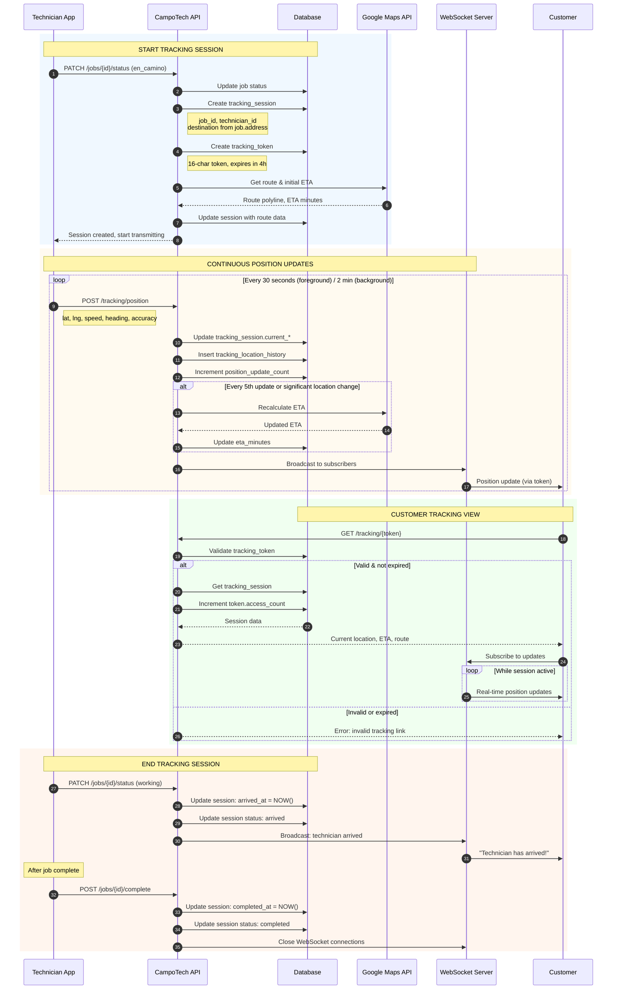

### I.2 Tracking Data Flow

```
┌─────────────────────────────────────────────────────────────────────────────┐
│                          GPS TRACKING DATA FLOW                             │
├─────────────────────────────────────────────────────────────────────────────┤
│                                                                             │
│  TECHNICIAN MOBILE                     SERVER                    CUSTOMER   │
│  ┌──────────────┐                  ┌──────────────┐         ┌──────────────┐│
│  │              │                  │              │         │              ││
│  │ GPS Provider │                  │  API Server  │         │   Browser    ││
│  │ (Expo)       │                  │              │         │   or App     ││
│  │              │                  │              │         │              ││
│  └──────┬───────┘                  └──────┬───────┘         └──────┬───────┘│
│         │                                 │                        │        │
│         │ Every 30s                       │                        │        │
│         │ (foreground)                    │                        │        │
│         │                                 │                        │        │
│         ▼                                 │                        │        │
│  ┌──────────────┐                        │                        │        │
│  │ Location     │                        │                        │        │
│  │ Buffer       │──POST /tracking/pos───▶│                        │        │
│  │ (batch 3)    │                        │                        │        │
│  └──────────────┘                        │                        │        │
│                                          ▼                        │        │
│                                  ┌──────────────┐                 │        │
│                                  │   Database   │                 │        │
│                                  │              │                 │        │
│                                  │ - Session    │                 │        │
│                                  │ - History    │                 │        │
│                                  │ - Token      │                 │        │
│                                  └──────────────┘                 │        │
│                                          │                        │        │
│                                          │ Every 5th              │        │
│                                          │ update                 │        │
│                                          ▼                        │        │
│                                  ┌──────────────┐                 │        │
│                                  │ Google Maps  │                 │        │
│                                  │ Directions   │                 │        │
│                                  │ API          │                 │        │
│                                  └──────────────┘                 │        │
│                                          │                        │        │
│                                          │ Updated ETA            │        │
│                                          ▼                        │        │
│                                  ┌──────────────┐                 │        │
│                                  │  WebSocket   │────broadcast───▶│        │
│                                  │   Server     │                 │        │
│                                  └──────────────┘                 │        │
│                                                                             │
│  BATTERY OPTIMIZATION:                                                     │
│  - Foreground: 30s intervals, high accuracy                                │
│  - Background: 2m intervals, balanced accuracy                             │
│  - Batch uploads: 3 positions per request                                  │
│  - Significant location change trigger                                     │
│                                                                             │
└─────────────────────────────────────────────────────────────────────────────┘
```

---

## Flow J: Notification Queue System (Phase 9.6)

### J.1 Unified Notification Flow

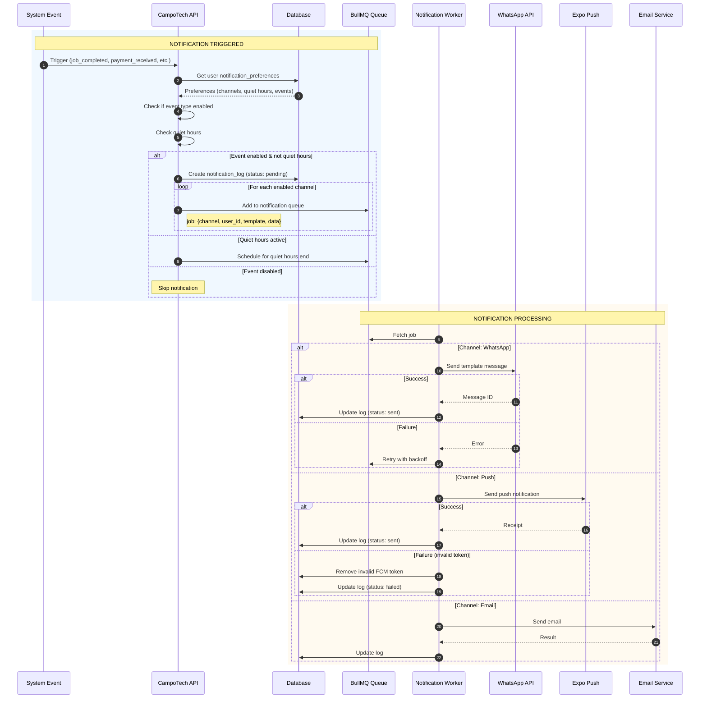

### J.2 Reminder Scheduling Flow

```
┌─────────────────────────────────────────────────────────────────────────────┐
│                        REMINDER SCHEDULING SYSTEM                           │
├─────────────────────────────────────────────────────────────────────────────┤
│                                                                             │
│  JOB SCHEDULED                                                              │
│       │                                                                     │
│       ▼                                                                     │
│  ┌─────────────────────────────────────────────────────────────────┐       │
│  │              SCHEDULED REMINDERS CREATED                         │       │
│  ├─────────────────────────────────────────────────────────────────┤       │
│  │                                                                  │       │
│  │   Job Date: 2025-01-15 10:00                                    │       │
│  │                                                                  │       │
│  │   ┌───────────┐    ┌───────────┐    ┌───────────┐              │       │
│  │   │ 24h       │    │ 1h        │    │ 30min     │              │       │
│  │   │ Reminder  │    │ Reminder  │    │ Reminder  │              │       │
│  │   │           │    │           │    │           │              │       │
│  │   │ 14th 10:00│    │ 15th 09:00│    │ 15th 09:30│              │       │
│  │   └───────────┘    └───────────┘    └───────────┘              │       │
│  │                                                                  │       │
│  └─────────────────────────────────────────────────────────────────┘       │
│                                                                             │
│  SCHEDULER CRON (Every minute)                                              │
│       │                                                                     │
│       ▼                                                                     │
│  ┌─────────────┐                                                           │
│  │ Query due   │                                                           │
│  │ reminders   │                                                           │
│  │ (pending)   │                                                           │
│  └─────────────┘                                                           │
│       │                                                                     │
│       ├─────────────────────────────────────────┐                          │
│       ▼                                         ▼                          │
│  ┌─────────────┐                         ┌─────────────┐                   │
│  │ Job still   │                         │ Job         │                   │
│  │ scheduled?  │───Yes──────────────────▶│ cancelled/  │                   │
│  │             │                         │ completed?  │───Yes──▶ Cancel   │
│  └─────────────┘                         └─────────────┘                   │
│       │ No (job cancelled)                                                 │
│       ▼                                                                     │
│  ┌─────────────┐                                                           │
│  │ Mark        │                                                           │
│  │ cancelled   │                                                           │
│  └─────────────┘                                                           │
│                                                                             │
│  SENDING REMINDER                                                          │
│       │                                                                     │
│       ▼                                                                     │
│  ┌─────────────┐                                                           │
│  │ Get user    │                                                           │
│  │ preferences │                                                           │
│  └─────────────┘                                                           │
│       │                                                                     │
│       ▼                                                                     │
│  ┌─────────────────────────────────────────────────────────────────┐       │
│  │                    SEND VIA CHANNELS                             │       │
│  │                                                                  │       │
│  │   WhatsApp ✓    Push ✓    SMS ✗    Email ✗                      │       │
│  │   (enabled)     (enabled)  (disabled) (disabled)                │       │
│  │                                                                  │       │
│  └─────────────────────────────────────────────────────────────────┘       │
│       │                                                                     │
│       ▼                                                                     │
│  ┌─────────────┐                                                           │
│  │ Mark        │                                                           │
│  │ sent        │                                                           │
│  └─────────────┘                                                           │
│                                                                             │
└─────────────────────────────────────────────────────────────────────────────┘
```

---

## Flow K: Business Mode Switch (Phase 15)

### K.1 B2B to Consumer Mode Transition

```
┌─────────────────────────────────────────────────────────────────────────────┐
│                       BUSINESS MODE SWITCH FLOW                             │
├─────────────────────────────────────────────────────────────────────────────┤
│                                                                             │
│  EXISTING B2B ORGANIZATION                                                  │
│       │                                                                     │
│       ▼                                                                     │
│  ┌─────────────┐                                                           │
│  │ Admin opts  │                                                           │
│  │ into        │                                                           │
│  │ marketplace │                                                           │
│  └─────────────┘                                                           │
│       │                                                                     │
│       ▼                                                                     │
│  ┌─────────────────────────────────────────────────────────────────┐       │
│  │                  PROFILE CREATION WIZARD                         │       │
│  ├─────────────────────────────────────────────────────────────────┤       │
│  │                                                                  │       │
│  │  Step 1: Basic Info                                             │       │
│  │  ├── Display name (from org.name)                               │       │
│  │  ├── Logo upload                                                │       │
│  │  └── Description                                                │       │
│  │                                                                  │       │
│  │  Step 2: Services                                               │       │
│  │  ├── Select categories (multi-select)                           │       │
│  │  ├── Service areas (map picker)                                 │       │
│  │  └── Working hours                                              │       │
│  │                                                                  │       │
│  │  Step 3: Verification                                           │       │
│  │  ├── CUIT verification (AFIP check)                             │       │
│  │  ├── License upload (optional)                                  │       │
│  │  └── Insurance upload (optional)                                │       │
│  │                                                                  │       │
│  │  Step 4: Quote Settings                                         │       │
│  │  ├── Max active quotes                                          │       │
│  │  ├── Response time commitment                                   │       │
│  │  └── Auto-respond template (optional)                           │       │
│  │                                                                  │       │
│  └─────────────────────────────────────────────────────────────────┘       │
│       │                                                                     │
│       ▼                                                                     │
│  ┌─────────────┐                                                           │
│  │ Create      │                                                           │
│  │ business_   │                                                           │
│  │ public_     │                                                           │
│  │ profile     │                                                           │
│  └─────────────┘                                                           │
│       │                                                                     │
│       ▼                                                                     │
│  ┌─────────────┐                                                           │
│  │ Profile     │◀─────────────────────────┐                               │
│  │ is_visible  │                          │                               │
│  │ = false     │                          │                               │
│  └─────────────┘                          │                               │
│       │                                   │                               │
│       ▼                                   │                               │
│  ┌─────────────────────────────────┐      │                               │
│  │ ADMIN REVIEW                    │      │                               │
│  │                                 │      │                               │
│  │ ┌─────────┐   ┌─────────┐      │      │                               │
│  │ │ Approve │   │ Reject  │      │      │                               │
│  │ │         │   │         │      │      │                               │
│  │ └────┬────┘   └────┬────┘      │      │                               │
│  │      │             │           │      │                               │
│  │      ▼             ▼           │      │                               │
│  │ is_visible    Request         ├──────┘                               │
│  │ = true       changes                                                  │
│  │                                                                       │
│  └─────────────────────────────────┘                                     │
│       │                                                                   │
│       ▼                                                                   │
│  ┌─────────────┐                                                         │
│  │ Business    │                                                         │
│  │ visible in  │                                                         │
│  │ marketplace │                                                         │
│  │ search      │                                                         │
│  └─────────────┘                                                         │
│                                                                          │
│  DUAL-MODE OPERATION:                                                    │
│  - Organization continues B2B operations                                 │
│  - Now also receives consumer leads                                      │
│  - Leads dashboard shows both sources                                    │
│  - Single calendar, unified scheduling                                   │
│                                                                          │
└──────────────────────────────────────────────────────────────────────────┘
```

---

## Flow L: Technician Location Update (Phases 1-6)

### L.1 Real-time Location Tracking

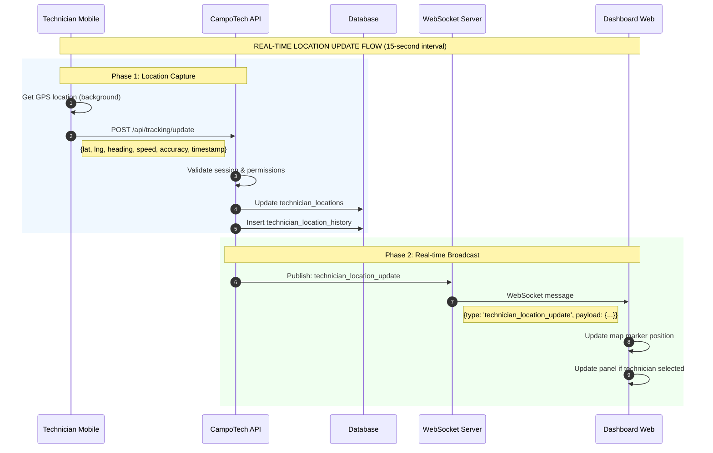

### L.2 Location Update Message Format

```typescript
// WebSocket message sent every 15 seconds
{
  type: 'technician_location_update',
  payload: {
    technicianId: string,
    lat: number,
    lng: number,
    heading: number,       // 0-360 degrees
    speed: number,         // km/h
    accuracy: number,      // meters
    timestamp: string,     // ISO 8601
    currentJobId?: string, // If en_camino or working
    status: 'available' | 'en_camino' | 'working' | 'offline'
  }
}
```

---

## Flow M: Find Nearest Technician (Phases 1-6)

### M.1 Nearest Technician Lookup

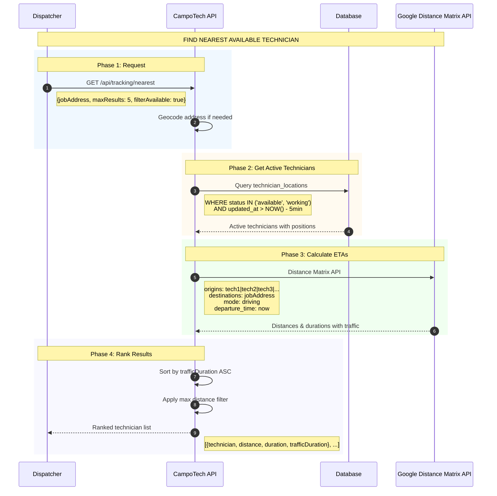

### M.2 Response Format

```typescript
// GET /api/tracking/nearest response
{
  results: [
    {
      technician: {
        id: string,
        name: string,
        avatar: string,
        currentStatus: 'available' | 'working',
        currentJob?: { id, title, customer }
      },
      currentLocation: {
        lat: number,
        lng: number,
        updatedAt: string
      },
      distance: {
        text: "15.3 km",
        value: 15300  // meters
      },
      duration: {
        text: "25 mins",
        value: 1500   // seconds
      },
      trafficDuration: {
        text: "32 mins",
        value: 1920   // seconds with traffic
      }
    }
  ]
}
```

---

## Flow N: Vehicle Document Upload (Phase 8)

### N.1 Document Upload Flow

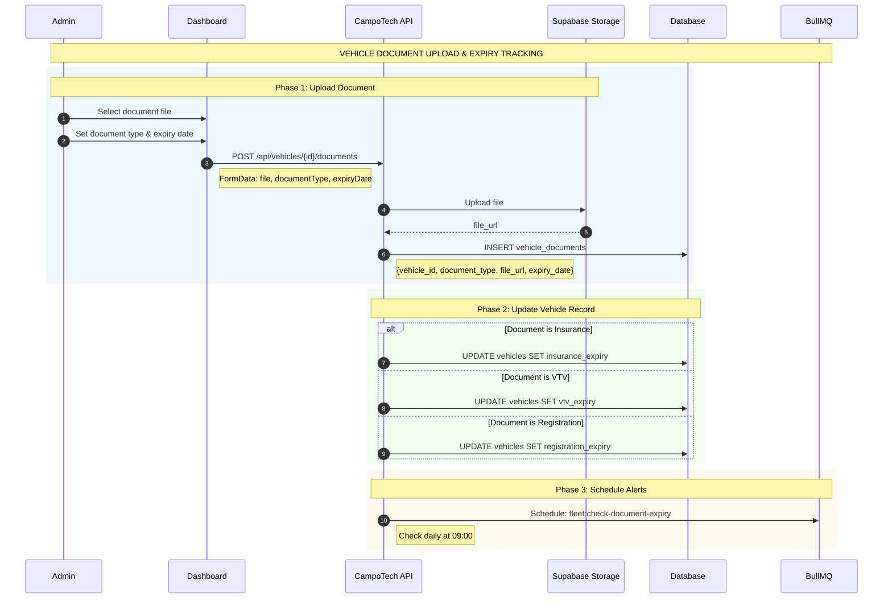

### N.2 Document Types (Buenos Aires Compliance)

```
Document Types:
├── insurance      - Seguro (mandatory)
├── vtv            - Verificación Técnica Vehicular (Buenos Aires annual inspection)
├── registration   - Cédula de identificación (vehicle registration card)
├── title          - Título de propiedad (ownership title)
└── green_card     - Tarjeta Verde (ownership card for transit outside city)

Alert Schedule:
├── 30 days before expiry: Warning notification
├── 15 days before expiry: Urgent reminder
├── 7 days before expiry:  Critical alert
└── Expired:               Compliance violation alert
```

---

## Flow O: Stock Transfer (Hub to Vehicle) (Phase 9)

### O.1 Transfer Flow

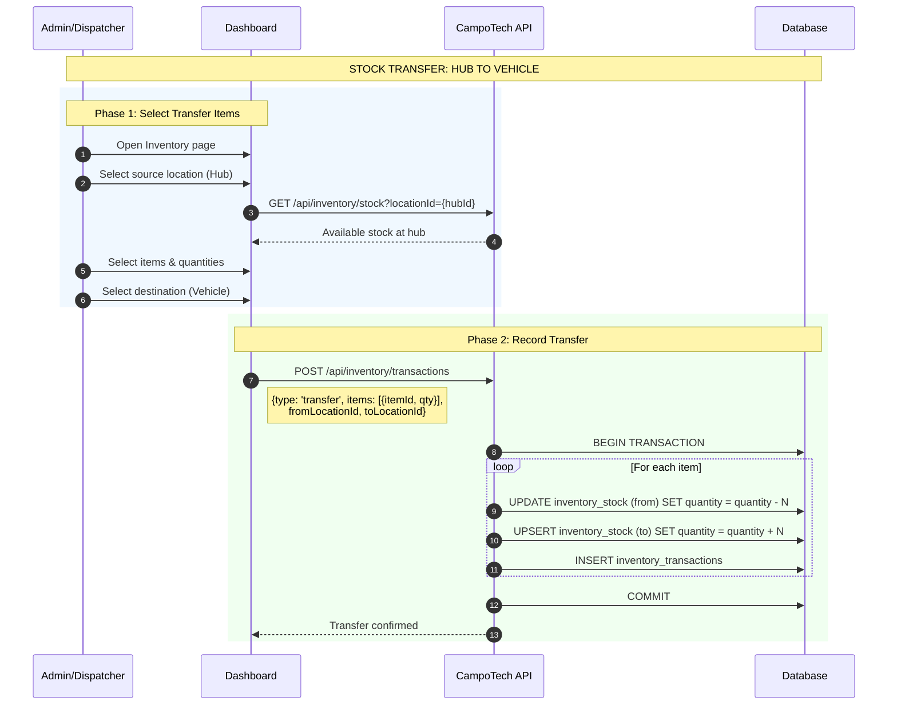

### O.2 Transaction Record

```sql
-- Example transfer transaction
INSERT INTO inventory_transactions (
    organization_id,
    item_id,
    from_location_id,      -- Hub location
    to_location_id,        -- Vehicle location
    transaction_type,      -- 'transfer'
    quantity,              -- Positive
    notes,
    performed_by,
    performed_at
) VALUES (...);
```

---

## Flow P: Job Inventory Usage (Phase 9)

### P.1 Record Materials Used on Job

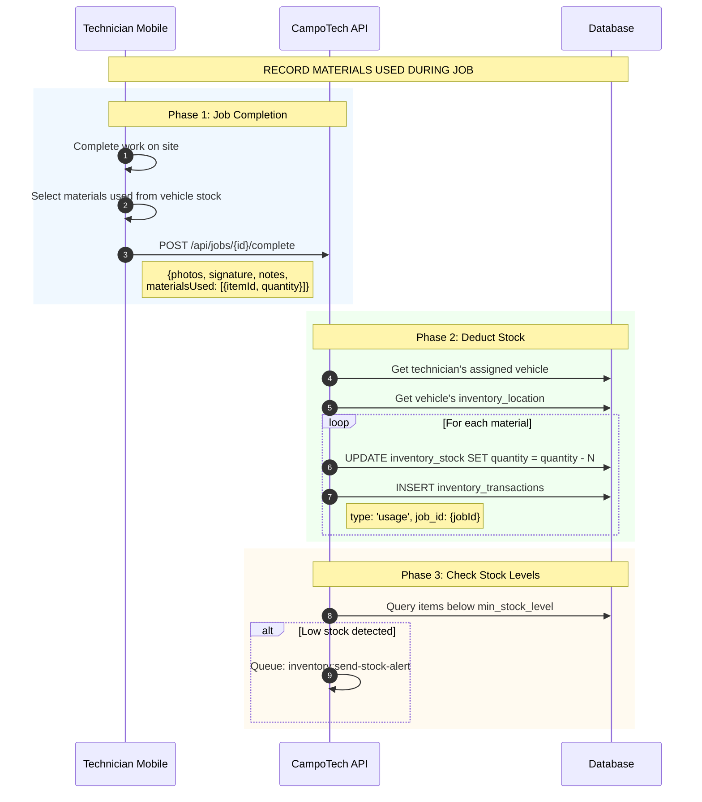

### P.2 Usage Transaction Example

```sql
-- Material used on job
INSERT INTO inventory_transactions (
    organization_id,
    item_id,
    from_location_id,      -- Vehicle's inventory location
    to_location_id,        -- NULL (consumed)
    transaction_type,      -- 'usage'
    quantity,              -- Negative (deduction)
    job_id,                -- Link to completed job
    notes,
    performed_by,          -- Technician user ID
    performed_at
) VALUES (...);
```

---

## Flow Q: Document Expiry Alert (Phase 8)

### Q.1 Daily Expiry Check

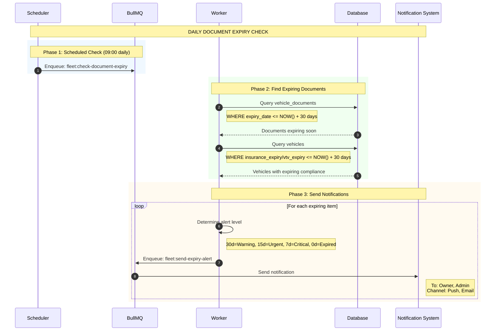

### Q.2 Alert Levels

```
Alert Configuration:
+------------------+------------+--------+----------------------+
|  Days to Expiry  |  Level     |  Icon  |  Notification Type   |
+------------------+------------+--------+----------------------+
|  30 days         |  Warning   |  Warn  |  Dashboard widget    |
|  15 days         |  Urgent    |  Warn  |  Push + Email        |
|  7 days          |  Critical  |  Crit  |  Push + Email + SMS  |
|  0 days (expired)|  Violation |  Crit  |  All channels        |
+------------------+------------+--------+----------------------+

Dashboard Alert Widget:
+-------------------------------------------------------------+
|  Fleet Compliance Status                                    |
+-------------------------------------------------------------+
|  [!] 2 documents expired                                    |
|  [!] 3 documents expiring within 30 days                    |
|  [OK] 8 vehicles fully compliant                            |
+-------------------------------------------------------------+
```

---

## Document Summary

This document now covers **17 major flows** across all phases:

| Flow | Description | Phase |
|------|-------------|-------|
| A | Complete Customer Journey | Core |
| B | External Failure Cascade | Core |
| C | Offline Technician Sync | Phase 9.3 |
| D | Abuse Detection | Phase 9.4 |
| E | Voice AI Pipeline | Phase 8 |
| F | Payment Lifecycle | Phase 7 |
| **G** | **Consumer Marketplace Journey** | **Phase 15** |
| **H** | **Customer Portal Journey** | **Phase 13** |
| **I** | **GPS Live Tracking** | **Phase 9.9** |
| **J** | **Notification Queue System** | **Phase 9.6** |
| **K** | **Business Mode Switch** | **Phase 15** |
| **L** | **Technician Location Update** | **Phase 1-6** |
| **M** | **Find Nearest Technician** | **Phase 1-6** |
| **N** | **Vehicle Document Upload** | **Phase 8** |
| **O** | **Stock Transfer (Hub to Vehicle)** | **Phase 9** |
| **P** | **Job Inventory Usage** | **Phase 9** |
| **Q** | **Document Expiry Alert** | **Phase 8** |

---

**Document Metadata**
```
Version: 2.3
Last Updated: 2025-12-12
Flows Documented: 17 + B.5 (Panic Mode) + F.5 (Chargeback)
Phases Covered: Core, 1-6, 7, 8, 9, 9.3, 9.4, 9.6, 9.9, 13, 15
Format: Mermaid sequence diagrams, ASCII flow charts
State Machines Fixed: Payment (aligned with domain types)
```

## Changelog

### v2.3 (2025-12-12)
- **ADDED:** Flow L - Technician Location Update (real-time WebSocket broadcast)
- **ADDED:** Flow M - Find Nearest Technician (Google Distance Matrix integration)
- **ADDED:** Flow N - Vehicle Document Upload (Buenos Aires compliance tracking)
- **ADDED:** Flow O - Stock Transfer Hub to Vehicle (inventory management)
- **ADDED:** Flow P - Job Inventory Usage (material consumption tracking)
- **ADDED:** Flow Q - Document Expiry Alert (daily cron-based alerts)
- **UPDATED:** Document Summary to include 17 flows

### v2.2 (2025-12-10)
- **FIXED:** Payment state machine type mismatch - aligned domain types with state machine
  - Updated `PaymentStatus` type: pending, approved, rejected, cancelled, disputed, refunded, partial_refund
  - Added partial_refund transitions to state machine
- **FIXED:** Marked Flow D (Abuse Detection) as ✅ IMPLEMENTED (fraud-detection.service.ts exists with 14 signal types)
- **ADDED:** B.5 Panic Mode State Machine documentation (4 integrations, 5 reasons)
- **ADDED:** F.5 Chargeback State Machine documentation (8 states, 7 reason types)
- **UPDATED:** Implementation status section to reflect actual codebase state
- **UPDATED:** All state machine status tables with accurate implementation markers

### v2.1 (2025-12-10)
- Added implementation status warning section at document start
- Added state machine implementation status table
- Added critical Payment state machine type mismatch warning
- Added flow implementation status table
- Added undocumented state machines table (Panic Mode, Chargeback)
- Updated Invoice state machine with missing/extra states markers
- Added ❌ NOT IMPLEMENTED warning to Flow D (Abuse Detection)
- Added ❌ CRITICAL TYPE MISMATCH warning to Payment state machine section

Addresses audit findings from ARCHITECTURE-AUDIT-REPORT.md section 5
