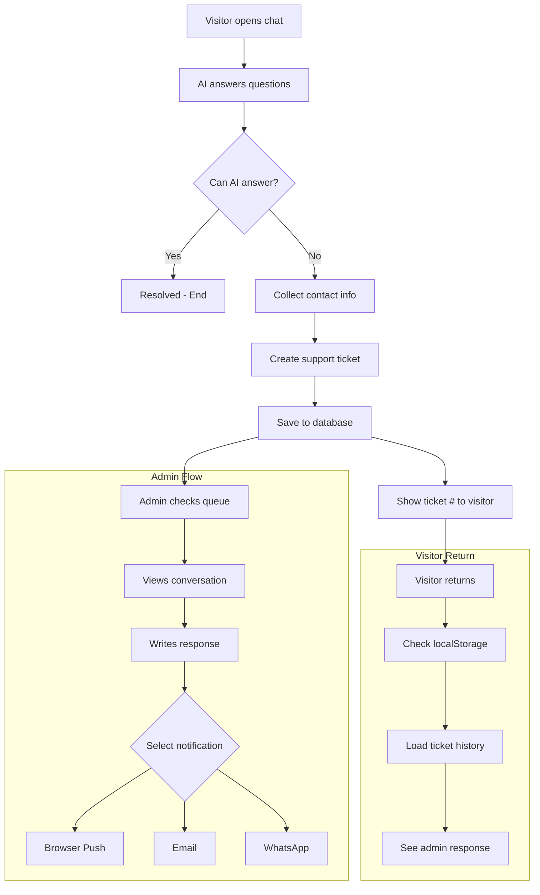

# Support Queue & Escalation System

## Overview

Implement a complete support escalation system that allows public visitors to chat with the AI, get escalated to human support when needed, and receive responses via multiple channels (browser notification, email, WhatsApp).



---

## Reply Flow by Channel

### 🤖 AI Behavior During Escalation

**Key Rule:** AI stays **ON** until admin sends the first response. Then it turns **OFF**.

```
WHILE WAITING FOR ADMIN:

Visitor: "I need custom API integration"
AI: "I'll escalate this to a human. Ticket #12345.
     ¿Hay algo más en lo que pueda ayudarte mientras esperás?"
     
Visitor: "What are the prices?"          ← Can still ask!
AI: "Here are our prices: 💰..."         ← AI still helps!

Visitor: "And WhatsApp?"
AI: "WhatsApp AI works like this..."     ← Still AI

[Later... Admin responds to the API question]
Admin: "Hi! About the API integration..."
     
→ AI now DISABLED for this conversation
→ All future messages go to admin queue
```

**Benefits:**
- ✅ Visitor can ask more questions while waiting
- ✅ AI answers what it can (reduces your workload!)
- ✅ Multiple questions can be escalated (all same ticket)
- ✅ Once admin responds → full human mode

---

### 🔔 Browser Push / Chat Bubble (After Admin Joins)

| Step | What Happens |
|------|--------------|
| 1. Admin responds | Response appears in visitor's chat bubble |
| 2. Visitor replies | Message goes to **your admin queue** (NOT AI) |
| 3. You get notified | Badge in admin sidebar: "🔴 1 new reply" |
| 4. You respond | Visitor sees in chat bubble |
| 5. Repeat | Back-and-forth until you close ticket |

### 📧 Email

| Step | What Happens |
|------|--------------|
| 1. Admin responds | Email sent with ticket # and "Responder" button |
| 2. Email includes | "Tu ticket #12345 - [Ver conversación]" link |
| 3. Visitor clicks link | Opens chat bubble with conversation |
| 4. Visitor replies | Goes to your admin queue |
| 5. You respond | Can send new email notification or they check chat |

### 💬 WhatsApp

| Step | What Happens |
|------|--------------|
| 1. Admin responds | WhatsApp message: "Re: Ticket #12345 - [your response]" |
| 2. Visitor replies | Message goes to **your existing WhatsApp inbox** |
| 3. Conversation continues | In WhatsApp (not the website) |
| 4. When resolved | You close ticket # in admin queue |

> [!TIP]
> For WhatsApp, the conversation naturally continues in WhatsApp. The ticket # helps you find the context in admin if needed.

---

## Admin Dashboard Features

### Search & Filter

```
┌─────────────────────────────────────────────────────────────────┐
│ Support Queue                                                    │
├─────────────────────────────────────────────────────────────────┤
│ 🔍 [Search by ticket #, name, email, phone...              ] 🔎 │
├─────────────────────────────────────────────────────────────────┤
│ Filters: [All ▼] [Open] [Pending] [New Reply 🔴] [Closed]       │
├─────────────────────────────────────────────────────────────────┤
│ # Ticket   │ Visitor      │ Contact         │ Status  │ Action  │
│ 12345      │ Juan Pérez   │ juan@email.com  │ 🔴 Reply│ [View]  │
│ 12344      │ María López  │ +5411234567     │ Pending │ [View]  │
│ 12343      │ Pedro García │ pedro@test.com  │ Closed  │ [View]  │
└─────────────────────────────────────────────────────────────────┘
```

### Notification for You (Admin)

When a visitor replies to your response:
- **In-dashboard notification:** Red badge in sidebar "Soporte (2)"
- **Optional:** Browser push notification for you (separate setting)
- **Ticket status changes:** From "Responded" → "New Reply"

---

## User Review Required

> [!IMPORTANT]
> **Notification Costs:**
> - Browser Push: **Free** (requires user permission)
> - Email: Using Resend.com free tier = **100/day free**, then ~$0.001/email
> - WhatsApp: Uses your existing WhatsApp credits

> [!WARNING]
> **2-Week Browser History:**
> Uses localStorage which persists until cleared. Works well but:
> - If user clears browser data → history lost
> - If user uses incognito → no persistence
> - We'll implement cleanup of sessions older than 14 days

---

## Proposed Changes

### Database Schema

#### [NEW] [schema.prisma](file:///d:/projects/CampoTech/apps/web/prisma/schema.prisma)

```prisma
// Support conversation for public visitors (anonymous)
model PublicSupportConversation {
  id             String   @id @default(cuid())
  sessionId      String   @unique @map("session_id")  // Browser session ID
  
  // Contact info (collected before escalation)
  visitorName    String?  @map("visitor_name")
  visitorEmail   String?  @map("visitor_email")
  visitorPhone   String?  @map("visitor_phone")
  
  // Ticket info
  ticketNumber   String   @unique @map("ticket_number")  // #12345
  status         SupportStatus @default(open)
  category       String?
  
  // Control flags
  aiDisabled     Boolean  @default(false) @map("ai_disabled")  // True = human only mode
  escalatedAt    DateTime? @map("escalated_at")  // When AI escalated
  
  // Push notification
  pushSubscription String? @map("push_subscription") @db.Text  // Web push subscription JSON
  
  // Timestamps
  createdAt      DateTime @default(now()) @map("created_at")
  updatedAt      DateTime @updatedAt @map("updated_at")
  lastActivityAt DateTime @default(now()) @map("last_activity_at")
  closedAt       DateTime? @map("closed_at")
  
  // Relations
  messages       PublicSupportMessage[]
  
  @@index([sessionId])
  @@index([status])
  @@index([ticketNumber])
  @@map("public_support_conversations")
}

model PublicSupportMessage {
  id             String   @id @default(cuid())
  conversationId String   @map("conversation_id")
  
  role           String   // "user" | "assistant" | "admin"
  content        String   @db.Text
  metadata       Json?    // Additional context
  
  // For admin responses
  respondedBy    String?  @map("responded_by")  // Admin user ID
  
  // Notification tracking
  notifiedVia    String[] @map("notified_via")  // ["email", "push", "whatsapp"]
  notifiedAt     DateTime? @map("notified_at")
  
  // Read tracking
  readByAdmin    Boolean  @default(false) @map("read_by_admin")
  readByVisitor  Boolean  @default(false) @map("read_by_visitor")
  
  createdAt      DateTime @default(now()) @map("created_at")
  
  conversation   PublicSupportConversation @relation(fields: [conversationId], references: [id], onDelete: Cascade)
  
  @@index([conversationId])
  @@map("public_support_messages")
}

enum SupportStatus {
  open              // AI handling, not escalated
  pending_response  // Escalated, waiting for admin
  responded         // Admin replied, waiting for visitor
  new_reply         // Visitor replied to admin (needs attention!)
  closed
}
```

---

### Admin UI

#### [NEW] [page.tsx](file:///d:/projects/CampoTech/apps/web/app/dashboard/admin/support-queue/page.tsx)

Admin Support Queue page with:

| Feature | Description |
|---------|-------------|
| **Ticket List** | Table with all open/pending tickets |
| **Filters** | By status: Open, Pending, Responded, Closed |
| **Search** | By ticket #, name, email, phone |
| **Conversation View** | Full chat history in a panel |
| **Response Form** | Text area + notification checkboxes |
| **Close Button** | Mark ticket as resolved |
| **Stats** | Open tickets count, avg response time |

**Response Form UI:**
```
┌─────────────────────────────────────────────────────┐
│ Responder a #12345 - Juan Pérez                     │
├─────────────────────────────────────────────────────┤
│ [                                                 ] │
│ [           Tu respuesta aquí...                  ] │
│ [                                                 ] │
├─────────────────────────────────────────────────────┤
│ Notificar via:                                      │
│ ☑ Notificación del navegador (si permitida)        │
│ ☑ Email (juan@empresa.com)                          │
│ ☐ WhatsApp (+5411234567) - [usa 1 crédito]         │
├─────────────────────────────────────────────────────┤
│ [Enviar respuesta]          [Cerrar sin responder] │
└─────────────────────────────────────────────────────┘
```

---

### API Routes

#### [NEW] [route.ts](file:///d:/projects/CampoTech/apps/web/app/api/support/conversations/route.ts)

- `GET /api/support/conversations` - List tickets (admin)
- `POST /api/support/conversations` - Create new conversation

#### [NEW] [route.ts](file:///d:/projects/CampoTech/apps/web/app/api/support/conversations/[id]/respond/route.ts)

- `POST /api/support/conversations/[id]/respond` - Admin responds to ticket
  - Body: `{ message, notifyVia: ["push", "email", "whatsapp"] }`

#### [NEW] [route.ts](file:///d:/projects/CampoTech/apps/web/app/api/support/conversations/[id]/close/route.ts)

- `POST /api/support/conversations/[id]/close` - Close ticket

#### [MODIFY] [route.ts](file:///d:/projects/CampoTech/apps/web/app/api/support/public-chat/route.ts)

- Update to save conversations to database
- Generate ticket numbers
- Return ticket ID for localStorage

---

### Frontend Chat Updates

#### [MODIFY] [PublicAIChatBubble.tsx](file:///d:/projects/CampoTech/apps/web/components/support/PublicAIChatBubble.tsx)

| Feature | Description |
|---------|-------------|
| **Session persistence** | Save session ID to localStorage |
| **History loading** | Load previous conversation on open |
| **Ticket display** | Show ticket # after escalation |
| **2-week cleanup** | Clear sessions older than 14 days |
| **Unread indicator** | Show badge if admin responded |
| **Push permission** | Request permission when escalating |

**LocalStorage structure:**
```javascript
{
  "campotech_support_session": "session_abc123",
  "campotech_support_created": "2026-01-10T09:00:00Z",
  "campotech_support_ticket": "12345"
}
```

---

### Notification Services

#### [NEW] [notification-service.ts](file:///d:/projects/CampoTech/apps/web/lib/services/notification-service.ts)

```typescript
interface SendNotificationOptions {
  ticketId: string;
  message: string;
  channels: ('push' | 'email' | 'whatsapp')[];
  recipient: {
    email?: string;
    phone?: string;
    pushSubscription?: string;
  };
}

export async function sendSupportNotification(options: SendNotificationOptions) {
  const results = {
    push: false,
    email: false,
    whatsapp: false,
  };
  
  // Browser Push (web-push library)
  if (options.channels.includes('push') && options.recipient.pushSubscription) {
    // Send via web-push
  }
  
  // Email (Resend or existing email service)
  if (options.channels.includes('email') && options.recipient.email) {
    // Send via email service
  }
  
  // WhatsApp (existing WhatsApp integration)
  if (options.channels.includes('whatsapp') && options.recipient.phone) {
    // Send via WhatsApp, uses credits
  }
  
  return results;
}
```

---

## File Summary

| File | Action | Description |
|------|--------|-------------|
| `prisma/schema.prisma` | MODIFY | Add 2 new models + enum |
| `app/dashboard/admin/support-queue/page.tsx` | NEW | Admin queue UI |
| `app/api/support/conversations/route.ts` | NEW | CRUD for conversations |
| `app/api/support/conversations/[id]/respond/route.ts` | NEW | Admin response |
| `app/api/support/conversations/[id]/close/route.ts` | NEW | Close ticket |
| `app/api/support/public-chat/route.ts` | MODIFY | Save to DB |
| `components/support/PublicAIChatBubble.tsx` | MODIFY | History + session |
| `lib/services/notification-service.ts` | NEW | Multi-channel notifications |

---

## Verification Plan

### Automated Tests
- Unit tests for notification service
- API route tests for conversation CRUD

### Manual Verification
1. Open chat as visitor → Ask question → Get AI answer
2. Ask escalation question → Provide contact info → Get ticket #
3. Close browser → Reopen → See conversation history
4. In admin: View ticket → Respond with email notification checked
5. Verify email received
6. Visitor returns → Sees admin response in chat
7. Admin closes ticket → Status updates

---

## Implementation Order

| Phase | Tasks | Effort |
|-------|-------|--------|
| 1 | Database models + migration | ~30 min |
| 2 | API routes for conversations | ~1 hour |
| 3 | Update PublicAIChatBubble with localStorage | ~1 hour |
| 4 | Admin Support Queue page | ~2 hours |
| 5 | Notification service (push, email) | ~1 hour |
| 6 | WhatsApp notification integration | ~30 min |
| 7 | Testing & polish | ~1 hour |

**Total estimated: ~7 hours**
