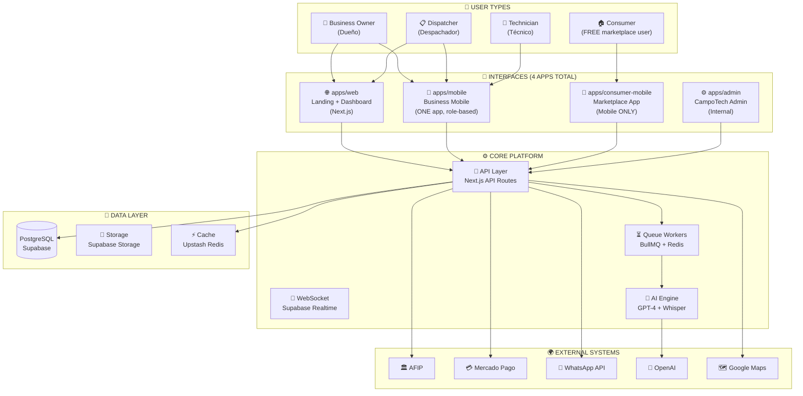
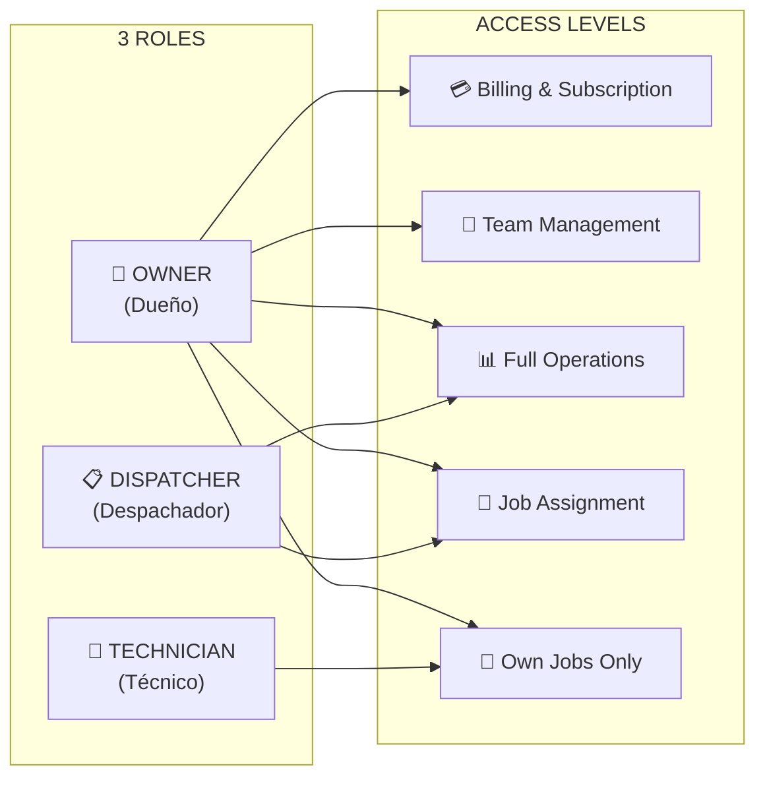
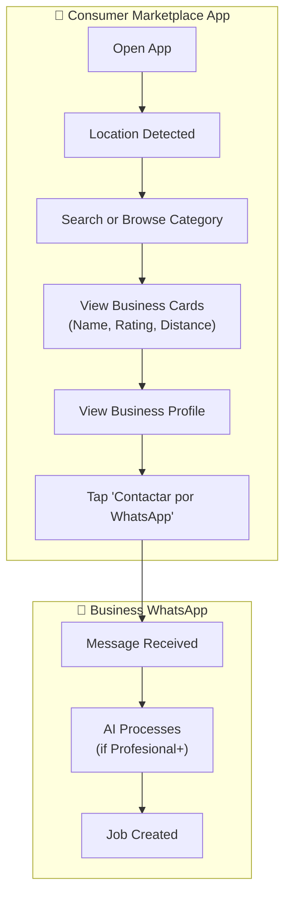
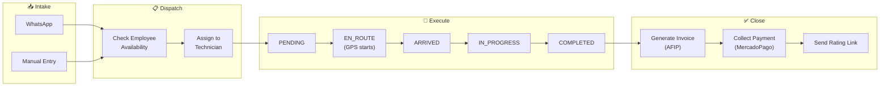
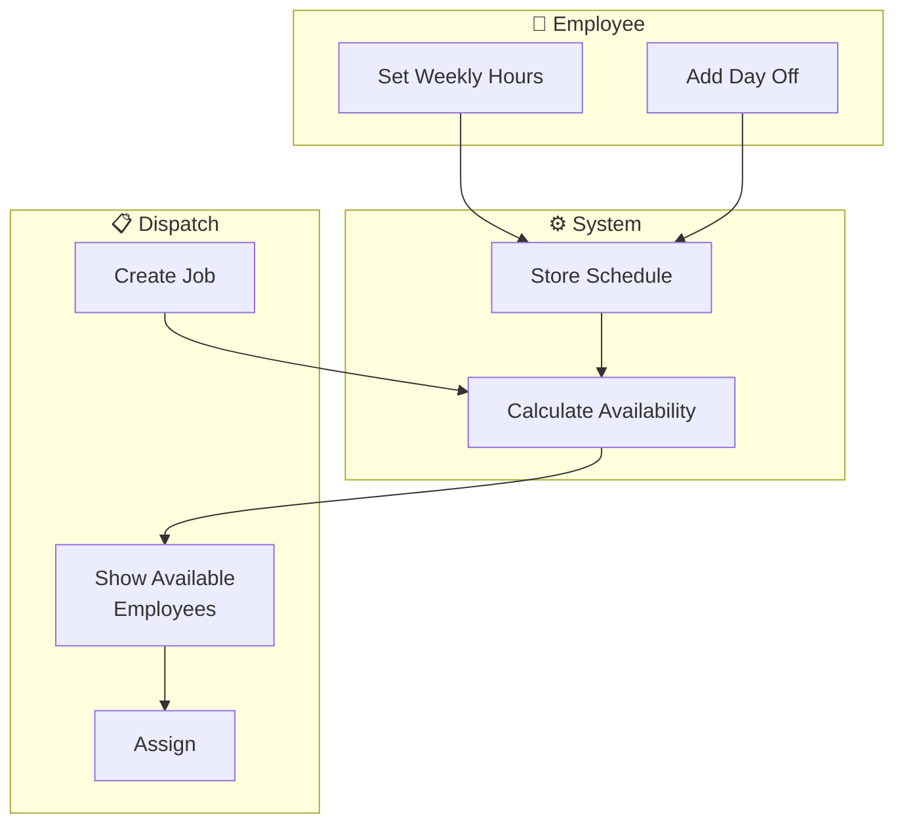
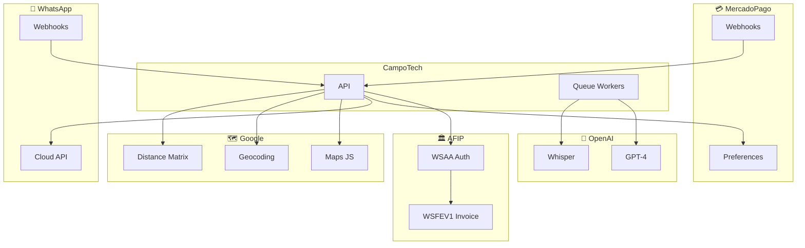
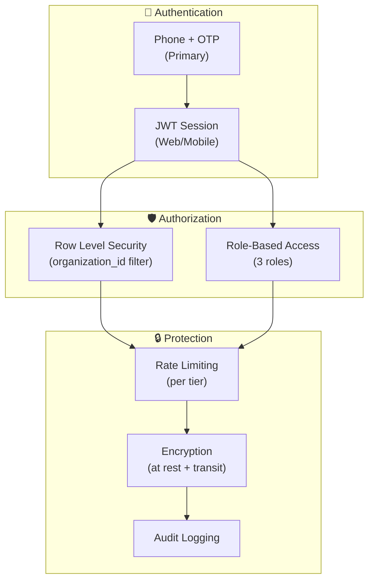

# CampoTech Complete System Architecture

## Version 2.0 - Corrected

**Important Corrections from Previous Version:**
- ONE mobile app (role-based), not two separate apps
- ONE web app (landing + dashboard combined), no separate consumer web
- Consumer marketplace is MOBILE ONLY
- Marketplace presence is MANDATORY for all businesses
- 3 roles only: Owner, Despachador, Técnico
- Employee scheduling system added

---

## 1. High-Level System Overview



---

## 2. The 4 Applications (Corrected)

### 2.1 apps/web (Next.js)

**Purpose:** Landing page AND business dashboard in ONE app

```
apps/web/
├── app/
│   ├── page.tsx                    # Landing page with pricing (/)
│   ├── (auth)/
│   │   ├── login/page.tsx          # Business login
│   │   ├── signup/page.tsx         # Business registration
│   │   └── forgot-password/page.tsx
│   │
│   ├── dashboard/                  # Business dashboard (/dashboard)
│   │   ├── page.tsx                # Overview
│   │   ├── jobs/                   # Job management
│   │   ├── customers/              # CRM
│   │   ├── employees/              # Team management (3 roles)
│   │   ├── schedule/               # Employee scheduling (NEW)
│   │   ├── invoices/               # AFIP invoicing
│   │   ├── inventory/              # Stock management
│   │   ├── fleet/                  # Vehicle management
│   │   ├── whatsapp/               # WhatsApp inbox
│   │   ├── analytics/              # Reports + Market Position
│   │   ├── calendar/               # Scheduling view
│   │   └── settings/               # Organization settings
│   │
│   ├── track/[token]/page.tsx      # Customer job tracking
│   ├── rate/[token]/page.tsx       # Customer rating (NEW)
│   │
│   ├── legal/
│   │   ├── privacidad/page.tsx     # Privacy policy
│   │   ├── terminos/page.tsx       # Terms of service
│   │   └── arrepentimiento/page.tsx # Cancellation (Ley 24.240)
│   │
│   └── api/                        # API routes
│       ├── v1/                     # Versioned API
│       ├── webhooks/               # External webhooks
│       └── cron/                   # Scheduled tasks
```

---

### 2.2 apps/mobile (React Native/Expo)

**Purpose:** ONE app for Owner, Despachador, AND Técnico (role-based access)

```
apps/mobile/
├── app/
│   ├── _layout.tsx                 # Auth check + role routing
│   │
│   ├── (auth)/
│   │   ├── login.tsx               # Phone + OTP
│   │   └── invite/[token].tsx      # Employee invite acceptance
│   │
│   ├── (app)/
│   │   ├── _layout.tsx             # Tab navigation (role-filtered)
│   │   │
│   │   ├── today.tsx               # Today's jobs (ALL ROLES)
│   │   ├── job/[id].tsx            # Job detail (ALL ROLES)
│   │   ├── profile.tsx             # User profile (ALL ROLES)
│   │   ├── schedule.tsx            # My schedule (ALL ROLES)
│   │   │
│   │   ├── jobs/                   # Job management (Owner, Despachador)
│   │   │   ├── index.tsx           # Jobs list
│   │   │   └── create.tsx          # Create job
│   │   │
│   │   ├── customers/              # CRM (Owner, Despachador)
│   │   │   └── index.tsx
│   │   │
│   │   ├── map.tsx                 # Live tracking (Owner, Despachador)
│   │   │
│   │   ├── inventory.tsx           # Stock view (ALL - usage for Técnico)
│   │   │
│   │   ├── team/                   # Team management (Owner ONLY)
│   │   │   ├── index.tsx
│   │   │   └── invite.tsx
│   │   │
│   │   ├── analytics.tsx           # Reports (Owner ONLY)
│   │   │
│   │   └── settings.tsx            # Settings (role-filtered)
│   │
│   └── components/
│       ├── VoiceReport.tsx         # Voice-to-text reporting
│       ├── SignatureCapture.tsx    # Customer signature
│       └── PhotoCapture.tsx        # Job photos
```

**Role-Based Tab Visibility:**

| Tab | Owner | Despachador | Técnico |
|-----|-------|-------------|---------|
| Today | ✅ | ✅ | ✅ |
| Jobs | ✅ | ✅ | ❌ |
| Map | ✅ | ✅ | ❌ |
| Team | ✅ | ❌ | ❌ |
| Profile | ✅ | ✅ | ✅ |

---

### 2.3 apps/consumer-mobile (React Native/Expo)

**Purpose:** Consumer marketplace - MOBILE ONLY (no web version)

```
apps/consumer-mobile/
├── app/
│   ├── _layout.tsx
│   ├── index.tsx                   # Home / Discovery
│   ├── search.tsx                  # Search results
│   ├── category/[slug].tsx         # Category listings
│   ├── provider/[id].tsx           # Business public profile
│   │
│   ├── (auth)/                     # Optional auth
│   │   ├── login.tsx               # Phone + OTP
│   │   └── profile.tsx
│   │
│   ├── (booking)/
│   │   ├── request/[providerId].tsx # Request quote
│   │   └── history.tsx              # Booking history
│   │
│   └── rate/[token].tsx            # Rate service
```

**Key Points:**
- NO consumer web app exists
- All businesses appear in marketplace (mandatory)
- Account is OPTIONAL for consumers
- Main action: "Contactar por WhatsApp"

---

### 2.4 apps/admin (Next.js)

**Purpose:** CampoTech internal admin dashboard

```
apps/admin/
├── app/
│   ├── (auth)/login/page.tsx       # Admin-only auth
│   │
│   └── dashboard/
│       ├── page.tsx                # Overview metrics
│       ├── businesses/             # All businesses
│       ├── payments/               # Revenue & billing
│       ├── ai/                     # WhatsApp AI monitor
│       ├── map/                    # Activity map (all techs)
│       ├── support/                # Support tickets
│       └── settings/               # Platform settings
```

---

## 3. User Roles (Corrected to 3)



**Role Permissions Matrix:**

| Feature | Owner | Despachador | Técnico |
|---------|-------|-------------|---------|
| View all jobs | ✅ | ✅ | ❌ |
| View assigned jobs | ✅ | ✅ | ✅ |
| Create jobs | ✅ | ✅ | ❌ |
| Assign jobs | ✅ | ✅ | ❌ |
| Update job status | ✅ | ✅ | ✅ (own) |
| View customers | ✅ | ✅ | ❌ |
| Create customers | ✅ | ✅ | ❌ |
| View team | ✅ | ✅ | ❌ |
| Invite team | ✅ | ❌ | ❌ |
| View billing | ✅ | ❌ | ❌ |
| Change subscription | ✅ | ❌ | ❌ |
| View analytics | ✅ | ✅ | ❌ |
| WhatsApp inbox | ✅ | ✅ | ❌ |
| Inventory (view) | ✅ | ✅ | ✅ |
| Inventory (adjust) | ✅ | ✅ | ❌ |
| Log material usage | ✅ | ✅ | ✅ |
| Set own schedule | ✅ | ✅ | ✅ |
| View team schedules | ✅ | ✅ | ❌ |

---

## 4. Data Entity Relationships (Updated)

```mermaid
erDiagram
    %% Core Business
    ORGANIZATIONS ||--o{ USERS : "has"
    ORGANIZATIONS ||--o{ CUSTOMERS : "serves"
    ORGANIZATIONS ||--o{ JOBS : "creates"
    ORGANIZATIONS ||--o{ INVOICES : "issues"
    ORGANIZATIONS ||--|| BUSINESS_PUBLIC_PROFILES : "has"

    %% Users with 3 roles
    USERS {
        string id PK
        string organization_id FK
        string phone
        enum role "owner|dispatcher|technician"
    }

    %% Employee Scheduling (NEW)
    USERS ||--o{ EMPLOYEE_SCHEDULES : "sets"
    USERS ||--o{ SCHEDULE_EXCEPTIONS : "has"
    
    EMPLOYEE_SCHEDULES {
        string id PK
        string user_id FK
        int day_of_week "0-6"
        string start_time "HH:MM"
        string end_time "HH:MM"
        boolean is_available
    }

    SCHEDULE_EXCEPTIONS {
        string id PK
        string user_id FK
        date date
        boolean is_available
        string reason
    }

    %% Ratings (NEW)
    JOBS ||--o| RATINGS : "rated_via"
    ORGANIZATIONS ||--o{ RATINGS : "receives"
    
    RATINGS {
        string id PK
        string job_id FK
        string organization_id FK
        int rating "1-5"
        string comment
        string token UK
    }

    %% Marketplace (Mandatory)
    BUSINESS_PUBLIC_PROFILES {
        string id PK
        string organization_id FK UK
        string display_name
        float average_rating
        int total_reviews
        boolean is_active "always true"
    }

    %% Jobs
    JOBS ||--o{ JOB_MATERIALS : "uses"
    JOBS ||--o{ JOB_PHOTOS : "has"
    USERS ||--o{ JOBS : "assigned_to"
    CUSTOMERS ||--o{ JOBS : "requests"

    %% Fleet & Inventory
    ORGANIZATIONS ||--o{ VEHICLES : "owns"
    ORGANIZATIONS ||--o{ INVENTORY_ITEMS : "stocks"
    VEHICLES ||--o{ INVENTORY_STOCK : "carries"

    %% Financial
    JOBS ||--|| INVOICES : "generates"
    INVOICES ||--o{ PAYMENTS : "receives"

    %% Communication
    ORGANIZATIONS ||--o{ WHATSAPP_CONVERSATIONS : "has"
```

---

## 5. Subscription Tiers (Corrected Pricing)

```
┌─────────────────────────────────────────────────────────────────────────────┐
│                         CAMPOTECH PRICING (CORRECTED)                       │
├─────────────────────────────────────────────────────────────────────────────┤
│                                                                             │
│   INICIAL              PROFESIONAL           EMPRESA                        │
│   $25/mes              $55/mes               $120/mes                       │
│   ─────────────        ─────────────         ─────────────                  │
│                                                                             │
│   ✓ 1 usuario          ✓ 5 usuarios          ✓ Usuarios ilimitados         │
│   ✓ 50 trabajos/mes    ✓ 200 trabajos/mes    ✓ Trabajos ilimitados         │
│   ✓ App técnico        ✓ App técnico         ✓ App técnico                  │
│   ✓ Facturación AFIP   ✓ Facturación AFIP    ✓ Facturación AFIP            │
│   ✓ Inventario básico  ✓ Inventario completo ✓ Inventario completo         │
│   ✓ WhatsApp manual    ✓ WhatsApp + AI       ✓ WhatsApp + AI               │
│                          (100 conv/mes)        (ilimitado)                  │
│   ✗ Reportes voz       ✓ Reportes voz        ✓ Reportes voz                │
│   ✗ Analytics          ✓ Analytics básico    ✓ Analytics avanzado          │
│   ✓ Marketplace        ✓ Marketplace         ✓ Marketplace destacado       │
│     (MANDATORY)          (MANDATORY)           (MANDATORY)                  │
│                                                                             │
└─────────────────────────────────────────────────────────────────────────────┘
```

**Key Change:** Marketplace is MANDATORY for all tiers. All businesses are automatically listed in the consumer app.

---

## 6. User Flows

### 6.1 Consumer Discovery Flow



### 6.2 Job Lifecycle Flow



### 6.3 Employee Scheduling Flow



---

## 7. API Structure

```
/api/v1/
├── auth/
│   ├── login/              # Phone + OTP login
│   ├── verify/             # Verify OTP
│   └── logout/
│
├── jobs/
│   ├── GET /               # List jobs
│   ├── POST /              # Create job
│   ├── GET /:id            # Get job
│   ├── PATCH /:id          # Update job
│   ├── POST /:id/assign    # Assign job
│   └── POST /:id/complete  # Complete job
│
├── customers/
│   ├── GET /
│   ├── POST /
│   └── GET /:id
│
├── employees/
│   ├── GET /
│   ├── POST /invite
│   ├── GET /availability   # Check who's available (NEW)
│   └── GET /:id/schedule   # Get employee schedule (NEW)
│
├── schedule/               # Employee scheduling (NEW)
│   ├── GET /               # Get my schedule
│   ├── PUT /               # Update my schedule
│   ├── POST /exception     # Add day off
│   └── DELETE /exception/:id
│
├── invoices/
│   ├── GET /
│   ├── POST /
│   └── POST /:id/afip      # Submit to AFIP
│
├── ratings/                # Rating system (NEW)
│   ├── POST /              # Submit rating
│   └── GET /:token         # Get rating form data
│
├── marketplace/            # Consumer marketplace
│   ├── GET /search         # Search businesses
│   ├── GET /categories     # Get categories
│   └── GET /provider/:id   # Get public profile
│
├── tracking/
│   ├── POST /location      # Update tech location
│   └── GET /:token         # Get tracking data
│
└── webhooks/
    ├── mercadopago/
    ├── whatsapp/
    └── afip/
```

---

## 8. External Systems Integration



---

## 9. Database Tables Summary

| Category | Tables |
|----------|--------|
| **Core** | organizations, users, customers, jobs |
| **Scheduling** | employee_schedules, schedule_exceptions |
| **Financial** | invoices, payments, afip_sequences |
| **Fleet** | vehicles, vehicle_documents |
| **Inventory** | inventory_items, inventory_stock, inventory_transactions |
| **Communication** | whatsapp_conversations, whatsapp_messages, notification_logs |
| **Marketplace** | business_public_profiles, ratings |
| **Tracking** | technician_locations, tracking_sessions |
| **System** | audit_logs, feature_flags |

---

## 10. Deployment Architecture

```
┌─────────────────────────────────────────────────────────────────┐
│                     PRODUCTION ARCHITECTURE                     │
├─────────────────────────────────────────────────────────────────┤
│                                                                 │
│  VERCEL                        SUPABASE                         │
│  ├── apps/web                  ├── PostgreSQL                   │
│  ├── apps/admin                ├── Auth                         │
│  └── API Routes                ├── Storage                      │
│                                └── Realtime                     │
│                                                                 │
│  EXPO (EAS)                    UPSTASH                          │
│  ├── apps/mobile               └── Redis (cache + queue)        │
│  └── apps/consumer-mobile                                       │
│                                                                 │
│  EXTERNAL                                                       │
│  ├── MercadoPago (payments)                                     │
│  ├── AFIP (invoicing)                                           │
│  ├── WhatsApp Business API                                      │
│  ├── OpenAI (GPT + Whisper)                                     │
│  └── Google Maps                                                │
│                                                                 │
└─────────────────────────────────────────────────────────────────┘
```

---

## 11. Domains

| Application | URL |
|-------------|-----|
| Web (Landing + Dashboard) | campotech.com, app.campotech.com |
| Admin | admin.campotech.com |
| API | campotech.com/api (same domain) |
| Mobile App | App Store / Play Store |
| Consumer App | App Store / Play Store |

---

## 12. Security Architecture



---

## Summary

| Component | Count |
|-----------|-------|
| Applications | 4 (web, mobile, consumer-mobile, admin) |
| User Types | 4 (Owner, Despachador, Técnico, Consumer) |
| Business Roles | 3 (Owner, Despachador, Técnico) |
| Database Tables | ~25 |
| External APIs | 5 (AFIP, MercadoPago, WhatsApp, OpenAI, Google) |
| Subscription Tiers | 3 + Free ($25, $55, $120) |

---

*Document Version: 2.0*
*Corrected to match CampoTech Vision*
*Key changes: 1 mobile app, no consumer web, mandatory marketplace, 3 roles, employee scheduling*
