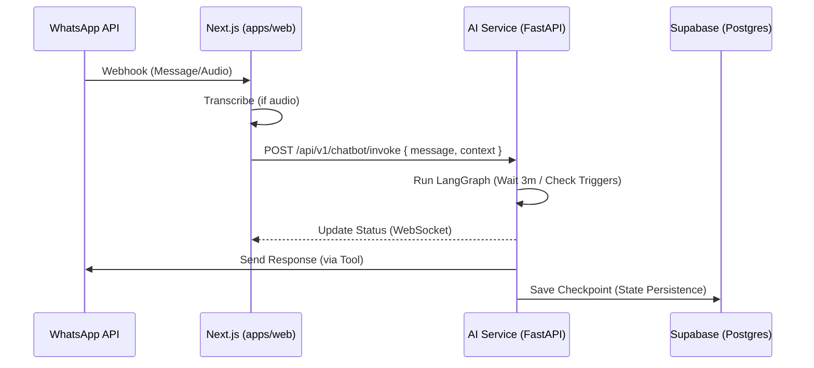

# Strategic Plan: Transition to Pure LangGraph Architecture (Python/FastAPI)

**Goal**: Transform CampoTech into a **"Workflow-First"** environment using the **FastAPI LangGraph Production Template**. This shift introduces a dedicated AI Service in Python to handle the complex stateful logic of the FSM marketplace.

## 1. Executive Summary & Architecture Shift

We are moving the AI "Brain" from a Node.js utility to a dedicated **Python Service**.
**Key Shift**: 
- **Backend Service**: Located in `apps/ai-service`.
- **Engine**: Python 3.13+ with `langgraph` for cyclical, stateful agents.
- **Observability**: Langfuse + LangSmith for production monitoring.
- **Communication**: Next.js (apps/web) acts as the Gateway. It routes WhatsApp webhooks to the AI Service via secured REST endpoints.

## 2. Template Directory Mapping (The "AI Service" Structure)

Based on the `fastapi-langgraph-agent-production-ready-template`, here is how CampoTech logic maps to the Python structure:

| Repository File | CampoTech Implementation |
| :--- | :--- |
| `app/api/v1/chatbot.py` | Main endpoint for `apps/web` to send WhatsApp messages + voice transcripts. |
| `app/core/langgraph/graph.py` | Implementation of the **Receptionist**, **Dispatcher**, and **Option A** (Voice Report) graphs. |
| `app/core/langgraph/tools.py` | Python tools for: `query_calendar`, `get_price_range`, `trigger_whatsapp_message`, `update_crm_data`. |
| `app/core/prompts/system.md` | The "Argentine Tonality" base prompt and business context instructions. |
| `app/schemas/graph.py` | Pydantic models for `ReceptionistState`, `TechnicianReportState`, and extracted entities. |
| `app/services/llm.py` | Centralized LLM management with fallback (GPT-4o for logic, 4o-mini for summaries). |
| `evals/evaluator.py` | Evaluation suite to test the "Feedback Loop" accuracy for price estimates. |

## 3. Core Graph Logic Details

### The "Receptionist" Graph
1.  **Guardrail Node**: Scans `transferKeywords` (e.g., "abogado", "humano"). If found, interrupts the graph and returns an `escalation_required` state.
2.  **Negotiation Loop**: If the customer objects to a time slot, the graph iterates with a "slot_exclusion" constraint.

### The "Technician Report" (Option A)
1.  **Confirmation Node**: After extraction, sends a WhatsApp message: *"Anoté [X] y [Y]. ¿Es correcto?"*. 
2.  **Wait State**: The graph pauses using LangGraph's `interrupt`. It only resumes when the tech replies with "Sí" or provides the missing info.

## 4. Service-to-Service Integration

## 5. Implementation Roadmap (Template-Based)

### Phase 1: Infrastructure (The "AI Service" Setup)
*   Integrate the template into `apps/ai-service`.
*   Configure `PostgresSaver` with pgvector for memory and state.
*   Setup **Langfuse** for trace visualization.

### Phase 2: Logic Porting
*   Convert the existing `whatsapp-ai-responder.ts` logic into Python Nodes.
*   Implement the "Argentine tonality" prompt in `system.md`.

### Phase 3: Copilot UI
*   Connect the Dashboard Side Panel to the AI Service streaming output.

## 6. Reliability Foundations (The "No-Faulty-Code" Stack)

To ensure the AI Service is robust and maintainable, the following standards are integrated into the architecture:

*   **Pydantic (Data Contracts)**: Every input from the user and output from the LLM is validated against a strict schema. This prevents "messy" AI data from ever touching the database.
*   **DSPy (Programmatic Prompts)**: Instead of manual prompt tweaking, we use DSPy to "compile" logic. This makes our prompts deterministic and ensures they remain high-quality even if we swap LLM models (e.g., GPT-4o to Llama 3).
*   **Arize Phoenix (Self-Hosted Trace)**: Provides a "Black Box Recorder" for every agentic loop. We can locally visualize every reasoning step to debug exactly where a "faulty" decision was made.
*   **Ruff & MyPy (Static Integrity)**: Enforces Python type-safety and catches syntax/logic errors during development, mirroring the TypeScript experience in the Next.js app.

## 7. Manual Necessary Work (User Action Items)

1.  **Observability Setup**: Setup **LangSmith** (Cloud) and **Arize Phoenix** (Local) for tracing.
2.  **Prompt Compilation**: Initialize the DSPy signatures for the Receptionist and Dispatcher graphs.
3.  **Secrets Storage**: Add `OPENAI_API_KEY`, `LANGCHAIN_*`, and `DATABASE_URL` to `.env.development`.
4.  **Python Environment**: Install Python 3.13 and the `uv` package manager.

## 8. File Impact Analysis (Updated for 2-Service Model)
